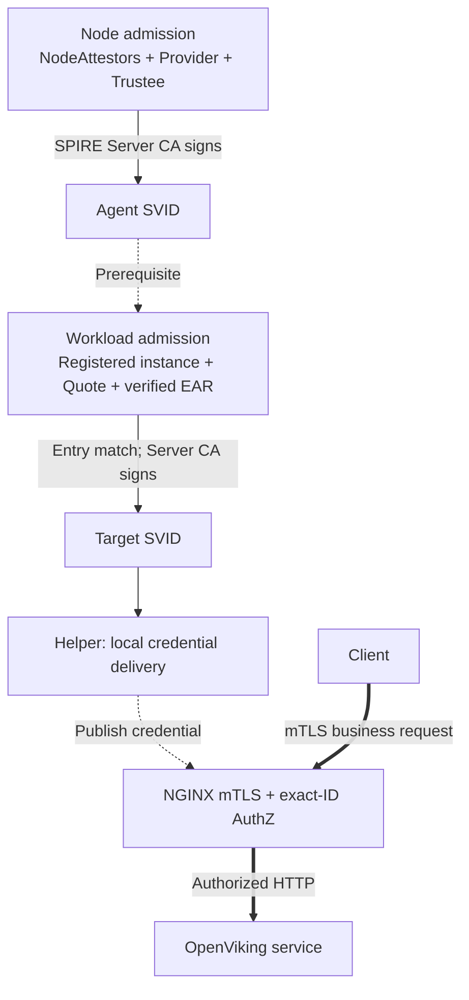

# Argus SPIRE integration

The current implementation includes Node Attestation and OpenViking Workload
Attestation with SPIRE Server/Agent and both Attestor SDKs pinned to v1.15.3:



Thick arrows carry business requests; admission runs before credential use.
Helper/NGINX hold the target private key outside the business container.

| Read next | Purpose |
|---|---|
| [Architecture](workload/ARCHITECTURE.md) | Components, admission sequence, lifecycle and trust boundaries. |
| [Runbook](workload/README.md) | Approved inputs, build, installation and Linux TDX acceptance. |
| [Plugin contract](plugins/argus-tdx-workloadattestor/README.md) | PID-reference checks, selectors and configuration. |
| [Node configuration](../argus/docs/configuration.md#spire-node-attestation) | Existing Node identity, proof key and trust setup. |
| [Validation](workload/VALIDATION.md) | Executed software tests and pending hardware checks. |

## Directory map

```text
spire/
  plugins/argus-tdx-nodeattestor/      Agent and Server Node plug-ins
  plugins/argus-tdx-workloadattestor/  PID-reference Workload plug-in
  helpers/spiffe-helper/             upstream v0.11.0 + Argus Broker/AuthZ tools
  workload/                         runbook, contracts, policy and lifecycle tools
  scripts/argus-node-attestation.sh   standalone Node operator commands
  tests/tdvm/                        TD Host and Guest preflight utilities
```

The TDX identity Evidence Provider is implemented by
[`../argus/src/bin/spire_evidence_provider.rs`](../argus/src/bin/spire_evidence_provider.rs),
built as `argus-spire-evidence-provider`.
It serves `POST /ra/v1/node-evidence` and, when workload configuration is supplied,
`POST /ra/v1/workload-evidence`. Both routes use the `/ra/v1/` namespace, with no
unversioned route aliases. These handlers use separate binding contracts and
share the real TSM Quote source. Workload SVID rotation does not generate a new
Quote; Helper reconnection triggers a new subscription and attestation.

Node enrollment requires a fresh Quote and Trustee appraisal, then returns
`CanReattest=false`. SPIRE renews a valid Agent SVID using the established Agent
identity without generating another Node Quote. Missing or expired Agent
credentials require fresh enrollment. This establishes initial node trust and
credential continuity, not continuously refreshed TDX/TCB assurance.

The [deployment configuration](workload/config/environment.example.json) supplies
identities, paths and ports. Agent ID must agree across Provider, Node/Workload
plugins, Helper, Entry and policy, with the same SPIRE trust domain. Current scope:
one pinned Agent slot, one registered OpenViking listener and experimental Broker.

## Node Attestation operator script

`scripts/argus-node-attestation.sh` wraps the deployed SPIRE Agent without
changing its configuration or generating bootstrap credentials. It validates
the policy deadline, pinned-key configuration, public trust bundle, Evidence
Provider socket, TLS certificate, ALPN, and HTTP/2 transport before starting an
Agent.

For an existing Node deployment, run from `cczoo/agent-cc` on the Agent node.
Set the actual approved policy deadline; the example below is a placeholder:

```bash
export ARGUS_POLICY_NOT_AFTER='<approved RFC3339 policy deadline>'
sudo core/spire/scripts/argus-node-attestation.sh preflight
sudo core/spire/scripts/argus-node-attestation.sh run
sudo core/spire/scripts/argus-node-attestation.sh status
```

`status` reports the Agent health, attestation phase, and Agent SPIFFE ID
without printing Quote, nonce, proof key, or SVID private material. The local
Workload API does not expose the Agent's own SVID. Run `server-status` on the
SPIRE Server node to obtain the authoritative Agent SVID serial number and
expiration:

```bash
sudo core/spire/scripts/argus-node-attestation.sh server-status
```

These commands inspect or run the existing Node configuration. Use the
[Workload runbook](workload/README.md) to deploy the combined authentication stack.
