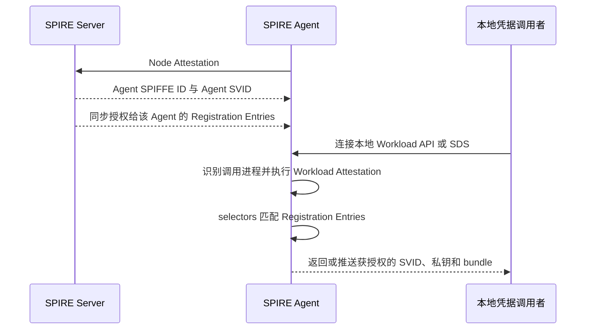
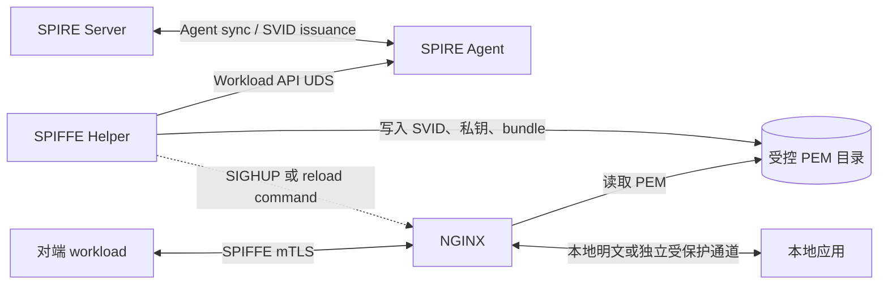
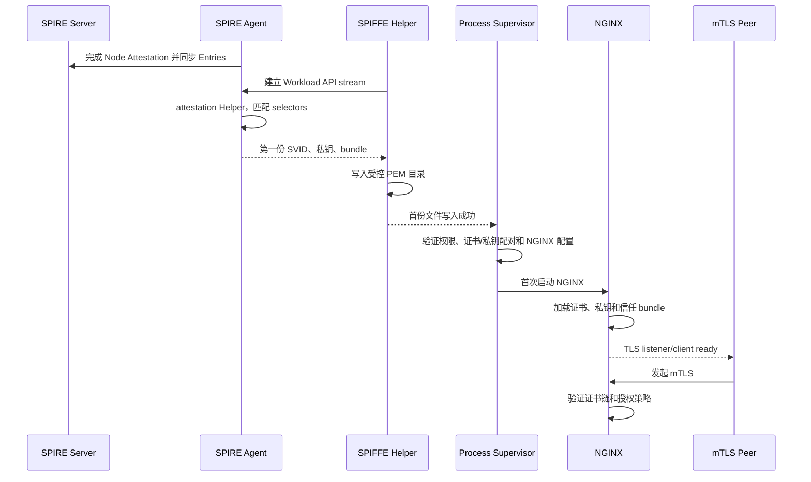
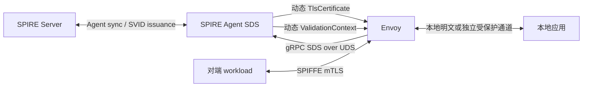
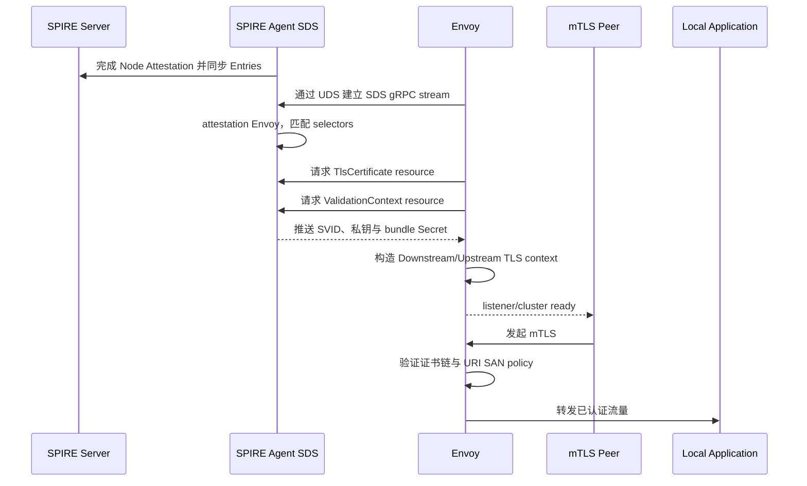
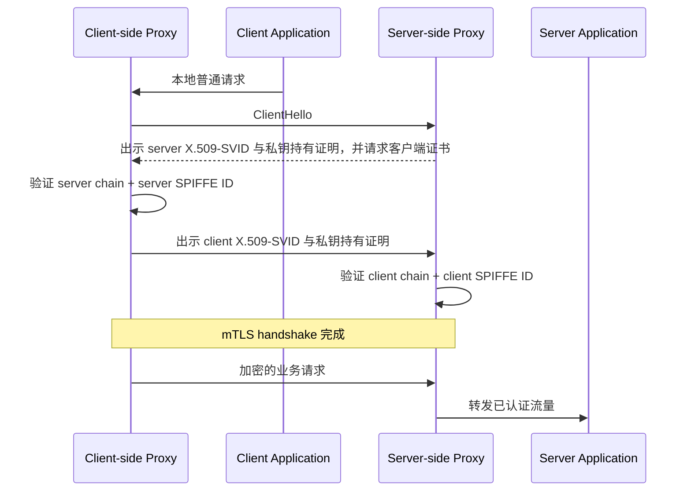

# SPIRE Workload 认证阶段的代理部署方案

## NGINX + SPIFFE Helper 与 Envoy + SDS

## 文档说明

| 项目 | 内容 |
| --- | --- |
| 文档目的 | 说明代理中间件如何接入 SPIFFE/SPIRE，取得 X.509-SVID，并用它建立和验证 mTLS 连接 |
| 方案范围 | 方案一：NGINX + SPIFFE Helper；方案二：Envoy + SPIRE Agent SDS |
| 讨论视角 | 只讨论 SPIFFE/SPIRE、NGINX、SPIFFE Helper、Envoy 之间的通用交互，不绑定具体业务系统 |
| 版本基线 | 2026-08-28 核对：SPIRE v1.15.3、SPIFFE Helper v0.11.0，以及当日 NGINX、Envoy 官方文档 |
| 示例平台 | 配置片段以 Linux/POSIX 的 UDS、文件 mode 和 signal 语义为准；Windows named pipe 仅作为接口能力说明 |
| 版本约束 | NGINX 与 Envoy 的最终版本/镜像不在本文中替代部署方决定；上线前必须固定版本并用该二进制验证配置 |
| 文档性质 | 架构与部署参考；路径、SPIFFE ID、selector、端口和授权策略必须按实际运行环境实例化 |

OpenViking 的具体业务流程见 [NGINX + Broker-aware SPIFFE Helper Workload 认证方案](../../documents_ly/Argus-OpenViking-NGINX-SPIFFE-Helper-Workload-Attestation-Workflow-CN.md)。该方案通过 Broker API 为指定 OpenViking 进程取得身份，包含 TC API 启动、TDX/Trustee 评估和实例生命周期约束；TC API 原日志上传保留，本轮不加入 Rekor 验证门禁。本文保留普通 Helper 经 Workload API 取得调用者身份的通用部署说明。

本文使用“Workload 认证阶段”作为总称，但 SPIFFE/SPIRE 中实际包含四个不同环节：

1. **Workload Attestation**：SPIRE Agent 识别本地调用者，并得到 selectors。
2. **身份签发与交付**：SPIRE 根据 Registration Entry 授权并交付 X.509-SVID、私钥和信任 bundle。
3. **mTLS 身份认证**：通信双方验证证书链，并证明各自持有 SVID 私钥。
4. **SPIFFE ID 授权**：在证书有效的前提下，继续判断 URI SAN 中的具体 SPIFFE ID 是否被允许访问。

这四步不能互相替代。尤其是：

> “证书由受信任 CA 签发”只完成了身份认证的一部分；如果没有校验具体 SPIFFE ID，任何同一受信任范围内、能够取得有效 SVID 的 workload 都可能通过证书链验证。

---

## 1. 结论先行

### 1.1 两种方案的本质区别

| 维度 | NGINX + SPIFFE Helper | Envoy + SPIRE SDS |
| --- | --- | --- |
| SPIRE 接口 | SPIFFE Workload API | SPIRE Agent 提供的 Envoy SDS API |
| 直接连接 SPIRE Agent 的进程 | SPIFFE Helper | Envoy |
| SVID 交付形态 | Helper 将证书、私钥和 bundle 写成 PEM 文件 | Agent 通过 gRPC SDS stream 向 Envoy 推送动态 Secret |
| 私钥是否落盘 | 是，除非输出目录本身是内存文件系统 | 否，正常 SDS 路径中由 Envoy 在内存中持有 |
| 轮换方式 | Helper 覆盖 PEM，随后触发 NGINX graceful reload | SPIRE Agent 推送新 Secret，Envoy 动态替换 TLS context |
| NGINX/Envoy 是否直接理解 Workload API | NGINX 不理解；Helper 负责适配 | Envoy 不调用 Workload API；Envoy 理解 SDS，SPIRE Agent 负责适配 |
| 精确 SPIFFE ID 校验 | NGINX 原生 SSL 模块没有专用 URI SAN exact matcher，需要扩展授权层 | Envoy TLS context 原生支持 URI SAN exact matcher |

### 1.2 NGINX 是否必须使用 SPIFFE Helper

**不是协议上的“必须”，但需要某种外部凭据适配器。**

当前 NGINX 官方 SSL 模块以 PEM 文件、变量数据或 OpenSSL provider/store URI 作为证书和私钥来源；它没有原生 SPIFFE Workload API 客户端，也不是 Envoy SDS 客户端。因此，如果由 NGINX 终止 SPIFFE mTLS，就必须有一个组件完成以下工作：

1. 连接本机 SPIRE Agent；
2. 接受 Workload Attestation；
3. 持续取得和轮换 X.509-SVID、私钥、bundle；
4. 把凭据转换为 NGINX 能消费的形式；
5. 在凭据更新后通知 NGINX 重新加载。

[SPIFFE Helper](https://github.com/spiffe/spiffe-helper) 是 SPIFFE 项目组织维护的通用文件桥接工具，正好实现上述职责，因此它是标准、低开发量的选择，但不是唯一实现。自研 Workload API materializer、另一个支持 Workload API 的 TLS proxy，或者让 NGINX 只做 L4 passthrough，都是其他可能路径。

### 1.3 SPIFFE 是否原生适配 Envoy

需要精确表述为：

> **SPIRE Agent 对 Envoy SDS 提供一等、官方维护的原生集成；SDS 本身不是 SPIFFE 标准的一部分。**

SPIFFE 标准定义 Workload API、SPIFFE ID、SVID 和 bundle。Envoy 原生实现通用的 SDS 客户端；SPIRE Agent 原生实现 Envoy 兼容的 SDS 服务端。二者通过 SDS 对接，因此 Envoy 无需实现 SPIFFE Workload API 客户端，也不需要额外 Helper。

SPIRE 官方文档明确说明：

- SDS 与 Workload API 由 SPIRE Agent 的同一个公共 Unix Domain Socket 或 Windows named pipe 提供；
- Envoy 连接 SDS 时，SPIRE Agent 会把 Envoy 作为 workload 进行 attestation；
- Agent 可以向 Envoy 返回 `TlsCertificate` 和 `CertificateValidationContext`；
- SVID 与 bundle 更新会持续推送给 Envoy。

参考：[SPIRE Agent Envoy SDS Support](https://github.com/spiffe/spire/blob/v1.15.3/doc/spire_agent.md#envoy-sds-support)、[SPIFFE 官方 Envoy 集成指南](https://spiffe.io/docs/latest/microservices/envoy/)。

---

## 2. SPIFFE/SPIRE 的共同基础

两种代理部署只是“身份如何交付给 TLS 终止组件”不同。它们之前的 SPIRE 控制面和节点身份流程基本相同。

### 2.1 共同组件

| 组件 | 职责 |
| --- | --- |
| SPIRE Server | 管理 trust domain、Registration Entries、上游 CA/签名密钥，并向已认证的 Agent 签发身份 |
| SPIRE Agent | 在每个节点上完成 Node Attestation、Workload Attestation，并在本地暴露 Workload API/SDS |
| NodeAttestor | 证明运行 SPIRE Agent 的节点符合预期，决定 Agent 的 SPIFFE ID |
| WorkloadAttestor | 根据本地进程、容器、Kubernetes Pod、systemd unit 等属性产生 selectors |
| Registration Entry | 把 parent ID、selectors 与允许签发的 SPIFFE ID 绑定起来 |
| X.509-SVID | 含 SPIFFE ID URI SAN 的短期 X.509 证书及其私钥 |
| X.509 bundle | 用于验证某个 trust domain 签发的 X.509-SVID 的 CA 证书（信任锚）集合 |
| 本地代理 | 终止或发起 mTLS，并将已经认证的连接与普通应用流量连接起来 |

### 2.2 从节点上线到 workload 取得身份



这里的关键规则是：

- Workload API 不要求调用者先持有客户端证书。Agent 通过 Unix socket peer credentials、PID、容器或编排平台上下文等带外信息识别调用者。
- 能打开 Agent socket 不等于一定能取得身份；最终身份由 attestation selectors 与 Registration Entry 共同决定。
- Agent socket 是身份签发边界，必须只暴露给预期 workload。
- Workload API/SDS 的调用进程是谁，Agent attestation 的首要对象就是谁。

### 2.3 代理部署中的“workload 到底是谁”

这是两种方案都必须先回答的问题。

#### NGINX + SPIFFE Helper

Workload API 的直接调用者是 **SPIFFE Helper**。SPIRE Agent 对 Helper 进程做 attestation，Helper 随后把取得的私钥交给 NGINX 使用。因此 Registration Entry 的 selectors 必须能可靠识别 Helper 所在的部署边界，同时文件权限必须保证只有预期 NGINX 进程能够消费该身份。

#### Envoy + SDS

SDS 的直接调用者是 **Envoy**。SPIRE Agent 直接对 Envoy 进程做 attestation，并把 Secret 交给 Envoy。因此 Registration Entry 的 selectors 应识别 Envoy 所在的 Pod、容器、Unix 用户、systemd unit 或其他部署属性。

#### 通用限制

这两种方案默认表达的是“代理实例或代理所在部署单元的身份”。它们不会自动证明代理后面的任意应用进程就是 SVID 所代表的进程。如果安全目标要求对某个具体应用 PID 单独 attestation，就需要让该进程直接调用 Workload API，或者使用明确支持身份委托/代理取证的独立机制；仅把代理放在应用旁边不足以产生该语义。

### 2.4 共同的部署前提

在部署任一方案前，应先满足：

1. SPIRE Server 已建立 trust domain，且签名密钥和数据存储符合生产要求。
2. SPIRE Agent 已通过 Node Attestation，并能稳定连接 Server。
3. 已为代理调用者创建 Registration Entry；parent ID 指向正确 Agent，selectors 不使用过宽匹配。
4. Agent 公共 socket 只挂载给需要身份的进程或 Pod，不在整台主机/整个集群中无差别共享。
5. 已明确本端 SPIFFE ID、允许的对端 SPIFFE ID，以及是否存在跨 trust domain federation。
6. 已明确入站和出站各自由谁发起 TLS、谁终止 TLS、谁执行授权。
7. 服务 readiness 必须等待第一份有效 SVID 和 bundle 就绪，不能先开放明文或无认证端口作为静默回退。

---

## 3. 方案一：NGINX + SPIFFE Helper

### 3.1 方案是什么

该方案把身份获取和 TLS 使用拆成两个组件：

- **SPIFFE Helper** 是 Workload API 客户端，负责持续获取、选择和轮换 SVID；
- **NGINX** 是 TLS 终止/发起组件，使用 Helper 写出的 PEM 文件；
- **进程监督器**（例如 systemd 或 Kubernetes）分别管理 Helper 和 NGINX，并协调启动顺序与健康检查。

它本质上是一个“动态身份流到传统证书文件”的适配方案：

```text
SPIRE Agent Workload API stream
        ↓
SPIFFE Helper
        ↓ 写入
svid.pem + svid_key.pem + svid_bundle.pem
        ↓ reload
NGINX TLS context
        ↓
mTLS connection
```

该方案适用于已经使用 NGINX、希望保持应用和大部分代理配置不变，同时能够接受短期私钥出现在受控文件系统中的场景。

### 3.2 它如何连接 SPIRE

#### 3.2.1 Helper 连接 Agent

Helper 的 `agent_address` 指向 SPIRE Agent 的本地 Workload API socket，例如：

```hcl
agent_address = "/run/spire/sockets/agent.sock"
```

Helper 通过 Workload API 的 X.509-SVID stream 取得：

- 一个或多个被授权的 X.509-SVID；
- 对应的私钥；
- 本 trust domain 的 X.509 bundle；
- 配置允许时的 federated bundles。

Workload API 是长连接流。身份轮换、bundle 变化或权限变化时，Agent 会发送新的完整快照；客户端不能只保留旧响应中已经被删除的身份材料。参考：[SPIFFE Workload API 规范](https://github.com/spiffe/spiffe/blob/main/standards/SPIFFE_Workload_API.md)。

#### 3.2.2 SPIRE Agent 如何决定 Helper 能拿到什么

1. Agent 从本地连接识别 Helper 进程。
2. 已配置的 WorkloadAttestors 为该进程产生 selectors。
3. Agent 用 selectors 匹配 Registration Entries。
4. 只有匹配到的 SPIFFE ID 才能返回给 Helper。
5. 如果同一 Helper 获得多个 SVID，应使用 Registration Entry hint 和 Helper 的 `hint` 配置明确选择，避免依赖返回顺序。

#### 3.2.3 Helper 如何连接 NGINX

Helper 不向 NGINX 提供网络 API。它把身份转换为 NGINX 可读取的文件：

| 默认用途 | 典型文件名 | 内容 |
| --- | --- | --- |
| 本端证书链 | `svid.pem` | X.509-SVID 叶证书及按配置放置的中间证书 |
| 本端私钥 | `svid_key.pem` | 与 SVID 匹配的私钥 PEM |
| 对端验证 CA bundle | `svid_bundle.pem` | 本 trust domain 的 trust anchors/中间 CA，以及按配置附加的 federated bundles |

文件更新完成后，Helper 可以：

- 读取 `pid_file_name` 并向 NGINX master process 发送 `renew_signal`；
- 通过 `cmd` 调用外部 reload 命令；
- 或者只更新文件，由能够监听文件变化的消费者自行 reload。

NGINX 通常需要显式 graceful reload。官方控制机制中，向 master process 发送 `HUP` 或执行 `nginx -s reload` 会启动使用新配置/证书的新 workers，并让旧 workers 优雅退出。参考：[SPIFFE Helper 运行模式](https://github.com/spiffe/spiffe-helper/blob/v0.11.0/README.md#operating-modes-and-configuration-details)、[NGINX 控制信号](https://nginx.org/en/docs/control.html)。

对 stock NGINX 验证路径，`svid_bundle.pem` 应只包含一个预期 trust domain 的 CA。不能把 `include_federated_domains` 当成普通的“多加几个可信根”开关；多 trust domain 的安全处理见第 3.7 节。

### 3.3 组件拓扑



NGINX 在这里位于业务连接的 TLS 边界：

- 入站场景中，NGINX 是 mTLS server，验证客户端 SVID，再转发到本地应用；
- 出站场景中，NGINX 是 mTLS client，向上游出示自身 SVID，并验证上游 SVID；
- 同一个 NGINX 可以同时承担两者，但入站和出站的对端 SPIFFE ID 策略必须分别定义。

### 3.4 启动流程



推荐的进程管理顺序是：

1. 启动并等待 SPIRE Agent ready。
2. 启动 Helper；启用其 health endpoint 或使用等价的 supervisor 条件，等待首份 X.509 文件成功写入。
3. 对 NGINX 配置执行 `nginx -t`。
4. 由专用 supervisor 首次启动 NGINX。
5. 只有在 NGINX 已加载有效凭据且 mTLS listener ready 后，才把实例加入负载均衡。

`pid_file_name` 只能向已经存在的进程发 signal，不能承担首次启动。不要把 Helper 当成完整的进程监督器；Helper 官方 README 也建议用 systemd 等专用 supervisor 管理外部进程，再使用 `pid_file_name` 或固定的 reload command 处理后续轮换。

Helper 自带的 readiness 只表示目标文件至少成功写入过一次。首次成功以后，Workload API watch 断流或 NGINX reload 失败不会自动把该状态改回 not ready。因此运行期健康还必须检查 stream/staleness、证书 `NotAfter`、reload 结果，以及 listener 实际出示的 serial/fingerprint。这个边界来自 [Helper v0.11.0 readiness 实现](https://github.com/spiffe/spiffe-helper/blob/1d0551d63787b528926b3e17fac949a376040bec/pkg/sidecar/sidecar.go#L481-L500)，不是对其健康语义的推测。

### 3.5 SVID 轮换流程

1. SPIRE Agent 取得或生成新的 X.509-SVID/bundle。
2. Workload API stream 向 Helper 发送新的完整 X.509 context。
3. Helper 依次将新证书、私钥和 bundle 写入目标目录。
4. Helper 在成功写入后触发 NGINX reload。
5. NGINX master 校验新配置并启动新 workers。
6. 新 TLS 连接使用新 SVID；旧 workers 对现有连接做 graceful shutdown。

需要注意：

- 轮换是“新连接使用新身份”，不等于立刻中断所有已经建立的长连接。
- 证书文件、私钥文件和 bundle 是同一代 TLS context，不能由三个互不协调的文件事件分别触发 reload。
- SPIFFE Helper v0.11.0 使用三个顺序 `os.WriteFile`，不提供整代目录的原子切换；只有三次写入都成功后才执行 signal/command。参考：[PEM 写入实现](https://github.com/spiffe/spiffe-helper/blob/1d0551d63787b528926b3e17fac949a376040bec/pkg/disk/x509.go#L60-L69)、[写入后通知实现](https://github.com/spiffe/spiffe-helper/blob/1d0551d63787b528926b3e17fac949a376040bec/pkg/sidecar/sidecar.go#L232-L265)。
- 如果中途写入失败，已经运行的 NGINX workers 仍持有旧的内存 TLS context，但磁盘上可能已经是新旧混代或截断文件。此时必须阻止任何重启/reload，并恢复或重新发布一套经过验证的完整文件。
- 如果证书写入成功但 reload 失败，必须告警；不能继续把实例报告为已完成轮换。
- 如果 Helper 与 Agent 的 stream 长期中断，已有文件不会自动变新。实例最多只能工作到当前 SVID 或 bundle 不再有效为止。

如果生产要求“证书、私钥、bundle 整代原子可见”，需要在 Helper 之外增加明确的 generation publisher：Helper 先写入 staging 目录，成功通知后由固定、受审计的 publisher 验证三者一致，发布到新的 generation 目录，再用原子 symlink switch 切换 NGINX 的 `current` 路径并 reload。该能力不是 stock Helper 已经提供的保证。

### 3.6 最小配置结构示例

以下只展示组件之间的关键接点，不是可直接复制的完整生产配置。

#### 3.6.1 SPIFFE Helper

```hcl
agent_address = "/run/spire/sockets/agent.sock"
daemon_mode = true

cert_dir = "/run/spiffe/nginx"
svid_file_name = "svid.pem"
svid_key_file_name = "svid_key.pem"
svid_bundle_file_name = "svid_bundle.pem"

include_federated_domains = false
add_intermediates_to_bundle = false

pid_file_name = "/run/nginx.pid"
renew_signal = "SIGHUP"

cert_file_mode = 0644
key_file_mode = 0600
```

生产配置还应明确：

- `hint`：调用者可能获得多个 SVID 时，选择预期身份；
- `include_federated_domains`：stock NGINX 验证路径保持 `false`；只有 SPIFFE-aware verifier 能按 URI SAN trust domain 选择 bundle 时，才设计 federation；
- `add_intermediates_to_bundle`：本文 NGINX 配置保持 `false`，使 `ssl_certificate` 文件包含 leaf-first 的完整出示链；
- Helper health endpoint：默认未启用；若把它用于冷启动 gating，必须显式启用并限制为本地访问。

`cert_dir` 必须在 Helper 启动前创建并设置 owner、group 和 mode。NGINX 的 `ssl_certificate` 文件要求叶证书在前、所需中间证书随后；如果将 `add_intermediates_to_bundle` 改为 `true`，必须另行生成 NGINX 可出示的完整 leaf-first chain，不能直接沿用本文示例。

示例中的 `key_file_mode = 0600` 只允许文件 owner 读取，适用于 NGINX master 以 root 读取或 Helper 与 NGINX 使用同一专用 UID 的模型。若两者是不同的非 root UID，应使用受限共享 GID/ACL 和经过验证的 `0640` 等权限模型。Helper 对已存在文件执行 `os.WriteFile` 时不会自动收紧原有宽松 mode，因此初始文件/目录权限也必须单独核验。

#### 3.6.2 NGINX 入站 mTLS

```nginx
server {
    listen 8443 ssl;

    ssl_protocols TLSv1.2 TLSv1.3;
    ssl_certificate     /run/spiffe/nginx/svid.pem;
    ssl_certificate_key /run/spiffe/nginx/svid_key.pem;

    ssl_client_certificate /run/spiffe/nginx/svid_bundle.pem;
    ssl_verify_client on;

    location / {
        proxy_pass http://127.0.0.1:8080;
    }
}
```

该配置只表示：

- NGINX 出示 Helper 写入的本端 X.509-SVID；
- NGINX 要求客户端提供证书；
- NGINX 用 bundle 验证客户端证书链。

它**没有完整表达“只允许某个具体 SPIFFE ID”**。

#### 3.6.3 NGINX 出站 mTLS

作为 reverse proxy 访问 TLS upstream 时，stock NGINX 可以通过 `proxy_ssl_certificate`、`proxy_ssl_certificate_key`、`proxy_ssl_trusted_certificate` 和 `proxy_ssl_verify on` 出示客户端证书并验证上游证书链。

但 `proxy_ssl_name` 是传统服务器名称校验，不是 SPIFFE URI SAN 校验；标准 upstream TLS 模块也没有把上游 peer certificate 暴露给 `auth_request` 的变量。因此：

> **NGINX + Helper 单独可以完成出站证书出示和 CA 链验证，但不能用 stock NGINX 完成上游 SPIFFE ID 的精确授权。**

如果出站必须校验具体 SPIFFE ID，只能选择一条明确路径：

1. 优先把出站 SPIFFE mTLS 交给本地 Ghostunnel、Envoy 等 SPIFFE-aware proxy，NGINX 连接该本地代理；
2. 使用经过安全审计、能够在 upstream TLS verify callback 中验证唯一 URI SAN 的自定义模块；
3. 让真正支持 Workload API/SPIFFE 的应用端点直接终止出站 TLS。

不要用 DNS hostname 校验代替 SPIFFE ID 校验，也不要把“证书链来自受信 bundle”写成“已验证预期上游 workload”。参考：[NGINX upstream TLS directives](https://nginx.org/en/docs/http/ngx_http_proxy_module.html#proxy_ssl_verify)。

### 3.7 NGINX 的 SPIFFE ID 授权限制

根据当前 NGINX 官方 `ngx_http_ssl_module` 指令和内置变量列表，原生模块能够：

- 要求并验证客户端证书；
- 暴露证书验证结果、原始客户端证书、subject DN、issuer DN、fingerprint 等信息；
- 使用指定 CA 文件建立客户端证书信任。

但它没有 SPIFFE-aware 的 URI SAN exact matcher，也没有直接暴露“客户端 SPIFFE ID”的专用变量。因此：

> `ssl_verify_client on` 只应视为证书链认证，不应被写成完整的 SPIFFE ID 授权。

对于 **入站 HTTP mTLS**，如果必须由 NGINX 终止 TLS 并对具体 SPIFFE ID 授权，需要增加明确的授权实现，例如：

1. `auth_request` 调用受信的外部认证服务，让它解析原始证书并验证 URI SAN；
2. 使用 njs/OpenResty 或经过安全审查的模块解析证书，并做 exact-match allowlist；
3. 把 SPIFFE mTLS 终止移到原生支持 Workload API/SPIFFE ID 授权的前置代理，NGINX 只处理已认证的内部流量。

`auth_request` 和 NGINX 客户端证书变量只适用于入站 HTTP 请求，不能补足第 3.6.3 节的 upstream TLS 验证缺口。对于 NGINX stream/TCP 入口，同样需要 stream 侧的受审计扩展或独立 SPIFFE-aware TLS proxy。

如果把客户端证书或解析后的 SPIFFE ID 通过 HTTP header 转交给后端，NGINX 必须先清除所有同名外部输入 header，再写入由本次已验证 TLS 会话产生的值；否则客户端可以伪造身份 header。

#### Federation 不能用混合 CA pool 代替 bundle 选择

SPIFFE Workload API 要求验证者先读取 X.509-SVID 唯一 URI SAN 中的 trust domain，再选择该 trust domain 对应的 bundle 验证证书链。这样做是因为通用 X.509 库通常不能依靠 URI name constraints 阻止一个 trust domain 的 CA 签出另一个 trust domain 的 SPIFFE ID。

SPIFFE Helper 的 `include_federated_domains = true` 会把 federated CA 追加到同一个 `svid_bundle.pem`；NGINX 的 `ssl_client_certificate`/`proxy_ssl_trusted_certificate` 只会把它看成一个通用 CA pool。即使之后再对 URI 字符串做 exact match，这个混合 pool 也无法证明“该 SPIFFE ID 是由其所属 trust domain 的 CA 签发”。参考：[Helper bundle 拼接实现](https://github.com/spiffe/spiffe-helper/blob/1d0551d63787b528926b3e17fac949a376040bec/pkg/disk/x509.go#L50-L57)、[SPIFFE Workload API federation 验证语义](https://github.com/spiffe/spiffe/blob/main/standards/SPIFFE_Workload_API.md#x509-svid-validation)。

因此，NGINX 路径只能采用以下任一方式：

- 保持 `include_federated_domains = false`，每个 listener/upstream 只使用一个 trust domain 的 bundle；
- 按 trust domain 分离不同 listener/验证路径；
- 使用 SPIFFE-aware verifier 执行“解析并确认唯一 URI SAN → 选择对应 trust-domain bundle → 验证证书链 → 校验完整 SPIFFE ID”。

不能直接把多 trust-domain roots 拼进一个 NGINX CA 文件后声称已实现 SPIFFE federation。参考：[Workload API federated bundles](https://github.com/spiffe/spiffe/blob/main/standards/SPIFFE_Workload_API.md#46-federated-bundles)、[X.509-SVID validation](https://github.com/spiffe/spiffe/blob/main/standards/X509-SVID.md#5-validation)。

参考：[NGINX SSL module](https://nginx.org/en/docs/http/ngx_http_ssl_module.html)。上述“没有专用 URI SAN matcher”是对当前官方指令/变量能力的核对结论，不是 SPIFFE 对 NGINX 的协议限制。

### 3.8 文件与权限要求

SVID 私钥从 Helper 写入文件的那一刻起，文件目录就是身份安全边界。

最低要求：

- 优先使用 `tmpfs` 或 Kubernetes memory-backed `emptyDir`，减少私钥持久化；
- 在 Helper 启动前创建 `cert_dir`，选择并验证一种真实访问模型：同一专用 UID、root NGINX master，或受限共享 GID/ACL；
- `0600` 只允许 owner 读取；不同的非 root UID 需要受限 `0640` group/ACL，不能通过 world-readable mode 解决；
- 初始化时核对已存在文件的 owner/mode；`key_file_mode` 不会自动修复一个已经存在且权限过宽的文件；
- 证书目录不可挂载给业务容器或无关 sidecar；
- 禁止把私钥目录纳入镜像、日志采集、备份或调试归档，并禁用或严格控制 Helper/NGINX core dump，因为进程内存也可能包含私钥；
- Agent socket 与 PEM 目录使用不同权限边界；需要读 PEM 的 NGINX 不一定需要直接访问 Agent socket；
- Helper 必须与 NGINX master 处于可发送 signal 的 PID/权限边界；否则使用受控 supervisor/reload hook，不要只共享 pid file；
- reload hook 不接受外部用户可控参数，避免把凭据更新变成命令注入边界；
- 首份私钥写入前，NGINX 的 SPIFFE listener 不应 ready。

### 3.9 故障行为

| 故障 | 预期行为 | 不应发生的行为 |
| --- | --- | --- |
| 冷启动时 Helper 无法连接 Agent | 首份文件未产生，部署保持 not ready 并重连 | NGINX 自动降级为明文或无客户端证书验证 |
| 首次成功后的 Workload API 断流 | Helper 记录错误并重连；外部健康检查根据 staleness/`NotAfter` 告警 | 只因 Helper `/ready` 仍为成功就认为轮换链路健康 |
| selectors 不匹配 Entry | Agent 拒绝交付目标 SVID，部署保持 not ready | 使用目录中某个长期静态证书作为静默回退 |
| PEM 中途写入失败 | Helper 不发送成功通知；旧 workers 仍用已加载 context；阻止重启/reload并修复磁盘完整代 | 假设磁盘仍保留完整旧代，或对混代文件 reload |
| NGINX 配置/证书校验失败 | 保持旧 workers；外部探针确认 reload 未生效并告警 | Helper 收到 signal 成功就报告新身份已生效 |
| Agent 在运行期宕机 | 已加载身份可暂时用于连接；必须在到期前恢复轮换 | 认为已有文件会无限有效 |
| 权限被撤销 | Helper 后续不应继续取得该 SVID；运营上应缩短旧连接和旧文件存活窗口 | 仅删除 Registration Entry，却长期保留可读旧私钥而不做处置 |

### 3.10 优点、代价与适用条件

#### 优点

- NGINX 与应用协议配置改动较少；
- Helper 由 SPIFFE 项目组织维护，无需自己实现 Workload API stream；
- 可以复用已有 NGINX 路由、限流、缓存和反向代理能力；
- 运行模型清晰，容易在 systemd、虚拟机或传统容器环境中部署。

#### 代价

- 私钥需要通过文件交付，扩大了读取和备份泄露面；
- stock Helper 的三文件写入不是整代原子更新，每次轮换需要额外协调文件代际与 NGINX reload；
- NGINX 原生客户端证书验证不等于具体 SPIFFE ID 授权；
- stock NGINX 出站无法精确校验上游 SPIFFE URI SAN；
- Helper 是被 Agent attestation 的调用者，NGINX 是实际私钥消费者，两者之间存在额外委托边界；
- 大规模同时轮换可能触发 reload 风暴，需要对实例轮换做抖动和可观测性设计。

#### 适用条件

当以下条件同时成立时，该方案合理：

- 已有 NGINX 是稳定的流量入口/出口；
- 可以接受受控的短期 PEM 私钥；
- 能用独立 supervisor 管理 Helper 和 NGINX；
- 能补充具体 SPIFFE ID 授权，或者使用场景只需要 trust domain 级认证且已明确接受该范围；
- 能执行轮换、reload 和故障注入验收。

---

## 4. 方案二：Envoy + SPIRE Agent SDS

### 4.1 方案是什么

该方案使用 Envoy 的 Secret Discovery Service 动态获取 TLS 凭据：

- Envoy 是 SPIRE Agent SDS 的直接客户端；
- SPIRE Agent 把 Envoy 作为 workload 做 attestation；
- Agent 把 X.509-SVID、私钥和 bundle 封装为 Envoy v3 TLS Secret；
- Envoy 把 Secret 直接装载到 `DownstreamTlsContext` 或 `UpstreamTlsContext`；
- 轮换通过 SDS stream 完成，不需要把私钥写成 PEM，也不需要 reload Envoy。

```text
SPIRE Agent SDS stream
        ↓
TlsCertificate + CertificateValidationContext
        ↓
Envoy in-memory TLS context
        ↓
inbound / outbound SPIFFE mTLS
```

### 4.2 它如何连接 SPIRE

SPIRE v1.15.3 的 Agent 在公共 endpoint 上同时提供 Workload API 和 SDS。相关开关为：

- `disable_workload_api`：是否禁用 Workload API；
- `disable_sds_api`：是否禁用 Envoy SDS；
- `socket_path`：Unix 上 Workload API 与 SDS 共用的 socket；
- `experimental.named_pipe_name`：Windows 上的公共 named pipe。

只使用 Envoy SDS 时可以按需要禁用 Workload API，但必须保留 SDS；默认情况下 SDS 是启用的。

Envoy 侧需要：

1. 定义一个使用 HTTP/2 gRPC 的静态 cluster，目标是 SPIRE Agent UDS；
2. 在 TLS context 中配置 `tls_certificate_sds_secret_configs`；
3. 配置 `validation_context_sds_secret_config` 或 `combined_validation_context`；
4. 在 validation context 中约束允许的对端 SPIFFE ID；
5. 对入站 mTLS 设置 `require_client_certificate: true`。

这里还有一个必须显式选择的校验模式。SPIRE v1.15.3 默认
`sds.disable_spiffe_cert_validation = false`，因此 Agent 返回的 validation context
默认包含 `envoy.tls.cert_validator.spiffe` 扩展；这不只影响 `ALL`，也影响按单一
trust domain 或 `ROOTCA` 请求的资源。如果希望使用 Envoy 标准 X.509 链验证器，
必须在 Agent 的 SDS 配置中全局禁用该扩展，或由具体 Envoy 实例通过
`node.metadata.disable_spiffe_cert_validation` 覆盖。两种模式的边界见第 4.8 节。

### 4.3 SPIRE SDS 的资源模型

SPIRE Agent 向 Envoy 提供两类关键 Secret：

#### 4.3.1 `TlsCertificate`

包含本端 X.509-SVID 证书链和私钥。

资源名可以是：

- Envoy 被授权取得的完整 SPIFFE ID，例如 `spiffe://example.org/service/backend`；
- `default`，表示选择 Envoy 的默认 X.509-SVID；该默认名可由 Agent 的 `sds.default_svid_name` 修改。

显式 SPIFFE ID 可读性更强；`default` 可以减少配置重复，但前提是 Registration Entries 不会让 Envoy 获得多个语义不清的身份。

#### 4.3.2 `CertificateValidationContext`

包含验证对端 X.509-SVID 所需的 CA bundle。

资源名可以是：

- trust domain SPIFFE ID，例如 `spiffe://example.org`；
- `ROOTCA`，默认表示 Agent 所属 trust domain 的 bundle；
- `ALL`，表示本地和授权给该 Envoy workload 的 federated bundles。

`ROOTCA`、`ALL` 名称可以通过 Agent SDS 配置修改。`ALL` 必须使用 Envoy
SPIFFE Certificate Validator；如果已经禁用该扩展，就不能使用 `ALL`。多 trust
domain bundle 选择及该扩展的安全限制必须结合第 4.8 节单独评审。

### 4.4 组件拓扑



Envoy 在通信过程中的位置与 NGINX 类似：它位于应用和网络对端之间，负责入站 TLS 终止、出站 TLS 发起，或者同时承担两者。

区别在于，Envoy 自身就是 Agent attestation 和动态凭据交付的直接对象，中间不存在 Helper-to-file-to-proxy 的第二次私钥交付。

### 4.5 启动流程



Envoy 官方 SDS 行为是：依赖远程 Secret 的 listener/cluster 在 Secret 取得前不会正常提供 TLS 服务；如果获取失败或响应无效，端口可能打开，但连接会被 reset，或发往 cluster 的请求被拒绝。因此 readiness 必须同时检查 Envoy 配置状态和 SDS Secret 是否就绪，不能只检查进程或监听端口存在。

### 4.6 SVID 轮换流程

1. SPIRE Agent 获得新的 SVID 或 bundle。
2. Agent 通过现有 SDS stream 推送新的 Secret version。
3. Envoy 校验 Secret 并更新内存中的 TLS context。
4. 新 TLS 连接立即使用新的证书、私钥和信任 bundle。
5. 已经建立的连接不因正常 Secret 更新而中断。

这条路径不需要：

- 写入 PEM 私钥；
- 运行 reload 命令；
- 重建 Pod 或重启 Envoy；
- 让应用读取或监听证书文件。

但长连接仍然是独立的生命周期问题。如果安全策略要求身份撤销后尽快终止既有连接，需要额外配置连接最大寿命、drain 或主动断连；SDS 轮换本身只保证新连接使用当前 Secret。

### 4.7 最小配置结构示例

以下示例明确选择“单一 trust domain + Envoy 标准 X.509 验证器”模式，避免示例
在未说明的情况下依赖 SPIFFE Certificate Validator。SPIRE Agent 配置需要包含：

```hcl
agent {
    # 其他 Agent 配置省略
    sds = {
        disable_spiffe_cert_validation = true
    }
}
```

也可以只在目标 Envoy 的 `node.metadata` 中设置同名布尔值，覆盖 Agent 默认行为。
以下 YAML 只说明关键接口关系，省略了 listener filter、route、upstream endpoint
和完整 bootstrap；它使用单一 trust domain 资源，不使用 `ALL`。

#### 4.7.1 SPIRE Agent SDS cluster

```yaml
static_resources:
  clusters:
    - name: spire_agent
      connect_timeout: 0.25s
      typed_extension_protocol_options:
        envoy.extensions.upstreams.http.v3.HttpProtocolOptions:
          "@type": type.googleapis.com/envoy.extensions.upstreams.http.v3.HttpProtocolOptions
          explicit_http_config:
            http2_protocol_options: {}
      load_assignment:
        cluster_name: spire_agent
        endpoints:
          - lb_endpoints:
              - endpoint:
                  address:
                    pipe:
                      path: /run/spire/sockets/agent.sock
```

SDS 使用 gRPC，所以 cluster 必须启用 HTTP/2。SPIRE Agent 在本机 UDS 上识别 Envoy，不需要为这条本地 bootstrap 连接预先准备另一套 TLS 证书。

#### 4.7.2 入站 mTLS 的关键 TLS context

```yaml
transport_socket:
  name: envoy.transport_sockets.tls
  typed_config:
    "@type": type.googleapis.com/envoy.extensions.transport_sockets.tls.v3.DownstreamTlsContext
    require_client_certificate: true
    common_tls_context:
      tls_certificate_sds_secret_configs:
        - name: "spiffe://example.org/service/backend"
          sds_config:
            resource_api_version: V3
            api_config_source:
              api_type: GRPC
              transport_api_version: V3
              grpc_services:
                - envoy_grpc:
                    cluster_name: spire_agent
      combined_validation_context:
        default_validation_context:
          match_typed_subject_alt_names:
            - san_type: URI
              matcher:
                exact: "spiffe://example.org/service/frontend"
        validation_context_sds_secret_config:
          name: "spiffe://example.org"
          sds_config:
            resource_api_version: V3
            api_config_source:
              api_type: GRPC
              transport_api_version: V3
              grpc_services:
                - envoy_grpc:
                    cluster_name: spire_agent
```

这里同时完成：

- 通过 SDS 取得本端 SVID；
- 强制客户端提供证书；
- 通过 SDS 取得 `example.org` 的 trust bundle；
- 对客户端证书 URI SAN 做 exact match。

如果允许多个客户端身份，应显式配置多个 matcher 或把授权交给 Envoy RBAC、OPA/external authorization filter。不要把 exact matcher 改成无约束的“只要同 trust domain 签发即可”，除非这是经过确认的授权策略。

#### 4.7.3 出站 mTLS

出站 cluster 使用 `UpstreamTlsContext`，其核心配置与入站相同：

- `tls_certificate_sds_secret_configs` 提供本端客户端 SVID；
- `combined_validation_context` 提供动态 bundle 和静态 URI SAN policy；
- URI SAN exact matcher 指向预期上游 SPIFFE ID。

出站场景不使用 `require_client_certificate`；该字段属于 downstream server 侧。客户端证书是否出示，由 `UpstreamTlsContext` 中是否配置本端 `TlsCertificate` 决定。

### 4.8 SPIFFE Certificate Validator 的边界

SPIRE v1.15.3 的默认行为与直觉可能相反：只要
`sds.disable_spiffe_cert_validation = false`，Agent 返回的 validation context 就会包含
`envoy.tls.cert_validator.spiffe`；并不是只有请求 `ALL` 时才使用该扩展。因此部署时
必须在以下两种模式中明确选择，不能依靠隐含默认值：

| 模式 | SPIRE/Envoy 设置 | 适用边界 |
| --- | --- | --- |
| Envoy 标准 X.509 验证器 | Agent 设置 `sds.disable_spiffe_cert_validation = true`，或具体 Envoy 在 `node.metadata` 中覆盖为 `true` | 每个 TLS context 请求一个明确的本地或 federated trust domain（或本地 `ROOTCA`），再用 `match_typed_subject_alt_names` 做 URI SAN 授权；不能请求 `ALL` |
| SPIFFE Certificate Validator | 保持默认值 `false`；Envoy 构建必须包含 `envoy.tls.cert_validator.spiffe` 扩展 | 可按 URI SAN 的 trust domain 选择隔离的 bundle；`ALL`，或同一 validation context 需要同时隔离多个 trust domain bundle 的路径，要求使用该扩展 |

如果 Envoy 构建不包含这个扩展，而 Agent 又按默认行为返回带扩展的 validation
context，Envoy 会拒绝该 Secret 更新；这应在固定版本和实际构建上用配置验证及
SDS ACK/NACK 指标检查。SPIRE 官方说明 `ALL` 从 Envoy 1.18 起才可用，并明确要求
SPIFFE Certificate Validator。

该扩展用于按 trust domain 隔离 bundle，并验证 SPIFFE URI SAN，但是当前 Envoy
官方文档同时明确警告：

- 该扩展功能可用，但缺少充分的生产 burn time；
- 该扩展尚未 hardened；
- 只应在上下游均受信任的部署中使用。

因此建议：

- 单一 trust domain 场景优先显式禁用自定义验证器，使用标准 `CertificateValidationContext` 加 `match_typed_subject_alt_names` exact match；
- federation 可以为每个目标 trust domain 使用独立的标准 validation context；只有选择 `ALL` 或需要在同一 context 中隔离多个 trust domain bundle 时，才必须承担自定义验证器及其安全评审；
- 不能仅因为 SPIRE 提供 `ALL` 资源，就默认启用未审查的 federation 路径。

参考：[SPIRE Agent Envoy SDS Support](https://github.com/spiffe/spire/blob/v1.15.3/doc/spire_agent.md#envoy-sds-support)、[Envoy SPIFFE Certificate Validator](https://www.envoyproxy.io/docs/envoy/latest/api-v3/extensions/transport_sockets/tls/v3/tls_spiffe_validator_config.proto.html)。

### 4.9 故障行为

| 故障 | 预期行为 | 观测重点 |
| --- | --- | --- |
| 首次启动时无法取得 Secret | listener/cluster 初始化被阻塞；获取失败或响应无效时，端口可能打开但入站连接被 reset，出站请求被 reject | readiness、`*_context_secrets_not_ready`、SDS ACK/NACK、连接 reset/reject |
| 已取得有效 Secret 后 SDS stream 断开 | 按 xDS 协议，Envoy 通常保留最后一次接受的资源并重连；它只能继续使用到该 SVID/信任材料失效或被替换，不等于身份仍可无限续期 | SDS 连接状态、重连次数、最后更新时间、SVID `NotAfter` |
| selectors 不匹配 Entry | Agent 不返回目标证书资源 | SPIRE Agent attestation/authorization 日志、Envoy SDS subscription |
| Agent 重启 | 等同于短暂 SDS stream 断开；Envoy 重连，已接受的 Secret 在其有效边界内继续使用 | 重连次数、断连持续时间、Secret 剩余有效期 |
| Entry 删除或 selectors 改变 | SPIRE v1.15.3 的 SotW `StreamSecrets` 可能因继续请求未授权资源而返回 `InvalidArgument` 并关闭 stream；Envoy 可能继续保留最后接受的 Secret，不能把 Entry 删除宣称为即时撤销 | Agent/SDS 错误、stream close/reconnect、Envoy config dump、Secret `NotAfter`、TLS 实测 |
| Agent 长时间不可用直至 SVID 过期 | 没有新 Secret 可替换时，新 TLS 握手最终失败；禁止静态证书或匿名回退 | `NotAfter`、握手失败、无回退验证 |
| SVID/bundle 更新 | Envoy TLS context update counter 增长，新连接使用新材料 | `ssl_context_update_by_sds` 等指标 |
| 对端 SPIFFE ID 不匹配 | TLS handshake 失败，不向本地应用转发 | TLS validation error、URI SAN policy |
| Envoy 配置错误 | 配置校验或启动失败，应快速暴露 | `envoy --mode validate`、admin config dump |

“stream 断开”和“资源被删除”是两个不同事件。本文使用 SPIRE v1.15.3 的 SotW
`StreamSecrets`；该版本未实现 `DeltaSecrets`，因此不能期待服务端通过 Delta
`removed_resources` 显式删除 Envoy 中的 Secret。Entry 删除或 selectors 改变可能让
SPIRE 拒绝后续订阅并关闭 stream，但 Envoy 仍可能保留最后一次接受的 Secret，直至
它被有效更新或自身有效期结束。若改用支持 Delta 的其他 SDS provider，资源删除语义
需要按该 provider 重新设计和验收，不能套用本文结论。

Envoy xDS 文档还说明，管理服务暂时不可达时会保留最后一次已知配置，除非资源带
TTL 并到期；本文的 SPIRE 路径不依赖 TTL 撤销。这不代表 SPIRE Entry 撤销会自动
终止既有连接，也不代表过期 SVID 还能建立新连接。现有 TLS 连接是否继续存在仍由
连接生命周期、drain 和会话策略决定。参考：[Envoy xDS resource deletion](https://www.envoyproxy.io/docs/envoy/latest/api-docs/xds_protocol.html#deleting-resources)、[Envoy xDS TTL](https://www.envoyproxy.io/docs/envoy/latest/api-docs/xds_protocol.html#ttl)、[SPIRE v1.15.3 DeltaSecrets 实现状态](https://github.com/spiffe/spire/blob/v1.15.3/pkg/agent/endpoints/sdsv3/handler.go#L256-L258)、[SPIRE 未授权资源处理](https://github.com/spiffe/spire/blob/v1.15.3/pkg/agent/endpoints/sdsv3/handler.go#L384-L386)。

### 4.10 安全与运维要求

- SPIRE Agent socket 只挂载给 Envoy，不挂载给无关应用容器；
- Envoy 的 Registration Entry selectors 必须匹配实际 Envoy workload，不能只使用宽泛 UID/namespace；
- 入站必须设置 `require_client_certificate: true`，否则配置了 validation context 也不等于强制 mTLS；
- 入站和出站分别配置对端 SPIFFE ID allowlist；
- Envoy admin interface 不对不受信任网络开放，因为其中可能包含敏感运行状态和配置；
- 对 SDS 连接、Secret update、证书剩余有效期、TLS handshake failure 建立监控；
- 验证 Agent restart、Server 不可达、Entry 撤销和 SVID 轮换时的真实行为；
- 为长连接定义最大连接寿命或撤销处置，不把 Secret 更新当成旧连接强制失效机制。

### 4.11 优点、代价与适用条件

#### 优点

- SPIRE 官方一等支持，组件接口清晰；
- 私钥正常情况下不落盘；
- SVID/bundle 通过 stream 动态轮换，不需要 reload Envoy；
- Envoy 能在 TLS context 中直接匹配 URI SAN；
- 同时支持入站、出站、HTTP/TCP、RBAC、external authorization 和丰富的可观测性；
- SPIFFE 官方文档、SPIRE tutorials、Istio 集成均有可参考实现。

#### 代价

- Envoy bootstrap、listener、cluster、TLS context 配置比传统 NGINX PEM 配置更复杂；
- 需要理解 SDS/xDS 初始化与故障状态，不能只看进程存活；
- 引入 Envoy 会增加一套代理运行、资源限制、升级和观测体系；
- federation 与 SPIFFE Certificate Validator 需要额外安全评审；
- 代理身份仍是 Envoy/deployment identity，不自动等同于代理后的具体应用进程身份。

#### 适用条件

当以下条件成立时，该方案通常更合适：

- 希望私钥不落盘；
- 需要高频、无 reload 的 SVID 轮换；
- 需要精确 SPIFFE ID 校验或更强的 L4/L7 授权；
- 可以承担 Envoy 配置与运维复杂度；
- 正在建设统一 sidecar、gateway 或 service mesh 数据面。

---

## 5. 两种方案的完整流程对比

### 5.1 身份取得流程

| 步骤 | NGINX + Helper | Envoy + SDS |
| --- | --- | --- |
| 1 | Helper 打开 Workload API UDS | Envoy 打开 SDS UDS |
| 2 | Agent attestation Helper | Agent attestation Envoy |
| 3 | selectors 匹配 Registration Entry | selectors 匹配 Registration Entry |
| 4 | Agent 在 Workload API stream 返回 X.509 context | Agent 在 SDS stream 返回 Envoy TLS Secrets |
| 5 | Helper 转换并写出 PEM | Envoy 直接装载内存 Secret |
| 6 | supervisor 负责首次启动；后续轮换由 Helper 通知 NGINX reload | 不需要 reload |
| 7 | NGINX 使用 PEM 建立 mTLS | Envoy 使用动态 TLS context 建立 mTLS |

### 5.2 mTLS 请求流程



该图描述认证语义，不是 TLS 1.2/1.3 的逐条 record transcript；实际握手消息顺序由
协议版本和握手模式决定。

无论选择哪种代理，都必须定义：

- client-side proxy 出示哪个 SPIFFE ID；
- server-side proxy 出示哪个 SPIFFE ID；
- client 允许哪些 server SPIFFE IDs；
- server 允许哪些 client SPIFFE IDs；
- 代理到本地应用的最后一跳如何防止绕过代理。

### 5.3 安全属性对比

| 属性 | NGINX + Helper | Envoy + SDS |
| --- | --- | --- |
| Agent attestation 对象 | Helper | Envoy |
| TLS 私钥最终使用者 | NGINX | Envoy |
| Agent 到使用者之间的交付边界 | stream → Helper → 文件 → NGINX | stream → Envoy 内存 |
| 私钥落盘风险 | 有 | 无普通 PEM 落盘 |
| 轮换中间态风险 | 需要控制多文件代际和 reload | SDS Secret 作为动态资源更新 |
| 精确 URI SAN 授权 | 需扩展 | 原生 TLS matcher |
| reload 风暴 | 可能 | 无进程 reload，但仍有大量 Secret update 压力 |
| 配置复杂度 | 中等 | 较高 |
| 官方 SPIRE 集成成熟度 | Helper 是官方通用 Workload API 工具；NGINX 不是原生集成 | SPIRE Agent 官方原生 SDS 集成 |

---

## 6. NGINX 方案的其他实现方式

“不必须使用 Helper”不代表“NGINX 可以什么都不加就直接连接 SPIRE”。可选方案如下。

### 6.1 自研 Workload API materializer

使用官方 Workload API protobuf 或成熟 SPIFFE SDK，实现一个小型守护进程：

- 维持 X.509-SVID stream；
- 按 SPIFFE ID/hint 选择身份；
- 将每次响应视为完整快照；
- 生成 NGINX 可用的证书链、私钥和 bundle；
- 保证同一代文件一致；
- 成功后执行 `nginx -t` 和 graceful reload；
- 处理权限撤销、stream 重连、首次 readiness 和可观测性。

它可以解决 Helper 与特定部署要求不匹配的问题，但也把凭据生命周期责任全部转移给维护者。除非 Helper 缺失的是明确、不可绕过的能力，否则不应仅为“可控”而重新实现这套状态机。

### 6.2 使用原生支持 Workload API 的独立 TLS proxy

例如 [Ghostunnel](https://ghostunnel.dev/docs/certificates/spiffe-workload-api/) 可以直接连接 Workload API、自动轮换证书和 bundle，并通过 `--allow-uri`/`--verify-uri` 授权对端 SPIFFE ID。此时可以让：

- Ghostunnel 终止 SPIFFE mTLS；
- NGINX 只处理 Ghostunnel 后面的普通代理流量；
- 或者完全省去 NGINX，只保留需要的 L4 转发。

这会增加一个代理 hop，但避免在 NGINX 中自定义 URI SAN 解析。

### 6.3 NGINX 只做 L4 passthrough

NGINX stream 层可以只转发加密字节，让后端真正的 SPIFFE-aware endpoint 终止 mTLS。此时：

- NGINX 不需要 SVID 和私钥；
- NGINX 不参与客户端/服务端 SPIFFE ID 认证；
- 真实 TLS endpoint 必须自己接入 Workload API 或其他动态凭据机制；
- 若需要按 HTTP route、SPIFFE ID 或应用层属性做策略，passthrough 无法在 NGINX 中提供这些能力。

### 6.4 NGINX 原生模块/插件的现状判断

截至本文核对日期，NGINX 官方 SSL 模块文档没有 SPIFFE Workload API 或 Envoy SDS 客户端能力；SPIFFE 官方集成文档也没有把 NGINX 列为类似 Envoy SDS 的直接集成。因此，生产设计不能假设存在一个由 NGINX 或 SPIFFE 官方共同维护的“NGINX SPIFFE 原生模块”。

第三方模块或历史实验即使能够读取 Workload API，也必须单独核对维护活跃度、NGINX/OpenSSL 版本兼容、安全审计、轮换语义和失败行为，不能仅因为仓库名称包含 SPIFFE 就视为官方生产路径。

---

## 7. Envoy 方案的其他实现方式

### 7.1 使用其他 SDS provider

Envoy 的 SDS 是通用 xDS 协议，不只支持 SPIRE。可以由其他控制面实现 SDS server 并向 Envoy 推送证书和 validation context。

代价是：

- 该 provider 必须自行解决 workload authentication；
- 必须定义身份授权、证书签发、轮换和 bundle 管理；
- 如果最终仍以 SPIRE 为 CA/身份源，还要再实现 SPIRE-to-SDS 的安全桥接。

因此，在已经采用 SPIRE 的环境中，优先使用 SPIRE Agent 自带 SDS，而不是增加第二个 SDS 控制面。

### 7.2 Envoy file-backed SDS

Envoy 也支持由文件中的 SDS Secret 引用 PEM，并监听目录 move event。官方文档建议用新目录加原子 symlink 切换来改善多文件轮换的一致性。

可以形成：

```text
SPIRE Workload API → Helper/materializer → file-backed SDS → Envoy
```

这种方式只有在无法让 Envoy 直接访问 Agent SDS 时才有意义。它重新引入私钥落盘和文件代际问题，通常不如直接 SPIRE SDS 简洁。

参考：[Envoy SDS filesystem key rotation](https://www.envoyproxy.io/docs/envoy/latest/configuration/security/secret.html#key-rotation)。

### 7.3 Istio + SPIRE

在 Kubernetes service mesh 场景中，可以由 Istio 管理 Envoy sidecar/gateway 配置，并让 Envoy 通过挂载的 SDS socket 向 SPIRE Agent 取得身份。Istio 官方提供 SPIRE 集成指南，并推荐使用 SPIFFE CSI Driver 挂载 SDS socket，而不是把宿主机目录直接暴露给 workload。

这条路径适合已经需要 service mesh 流量管理、统一授权和观测的环境；如果只需要保护一个或少量服务，引入完整 Istio 控制面可能超过必要范围。

参考：[Istio / SPIRE integration](https://istio.io/latest/docs/ops/integrations/spire/)。

### 7.4 应用直接使用 Workload API

如果应用语言和运行时已有成熟 SPIFFE SDK，可以不部署 TLS proxy：

- 应用直接连接 Workload API；
- 在内存中维护 SVID 和 bundle；
- 直接创建支持轮换和 SPIFFE ID 校验的 TLS context。

这样身份语义最直接，但证书轮换、stream 重连、TLS context 热替换、授权和观测都进入应用生命周期。对缺少成熟 SDK 的语言，这通常比 Envoy SDS 的维护责任更大。

---

## 8. 选择建议

### 8.1 选择 NGINX + SPIFFE Helper，当且仅当

- NGINX 已经是必须保留的流量组件；
- 最小化代理替换成本比“私钥绝不落盘”更重要；
- 可以把 PEM 放在严格受控的 tmpfs/内存卷；
- 已有可靠的 graceful reload 和进程监督体系；
- 已明确如何补充具体 SPIFFE ID 授权；
- 能接受 Helper 被 attestation、NGINX 使用其身份材料这一委托边界。

### 8.2 优先选择 Envoy + SPIRE SDS，当

- 这是新的 SPIFFE mTLS 代理层；
- 希望私钥只在 Agent/Envoy 内存路径中流转；
- 需要无进程 reload 的证书和 bundle 轮换；
- 需要原生 URI SAN exact match、RBAC 或 external authorization；
- 需要同时管理入站与出站 TLS；
- 团队能够维护 Envoy bootstrap、xDS/SDS 状态和相关监控。

### 8.3 两种方案都不满足，当

- 身份必须严格绑定代理后的具体应用 PID，而不是代理部署单元；
- 不允许代理代持应用身份；
- 应用到代理的本地链路无法防止绕过或冒用；
- 要求每次请求都携带应用级主体，而仅有连接级 workload identity 不足；
- 需要的授权模型不能由 NGINX 扩展或 Envoy filter 清晰表达。

这时应重新选择直接 Workload API、明确的 delegated identity/broker 机制，或应用级 token 与 workload mTLS 的组合，而不是继续在两种代理方案上叠加隐式假设。

---

## 9. 生产验收清单

### 9.1 共同成功标准

部署只有同时满足以下条件，才能称为完成 workload 身份接入：

- [ ] SPIRE Agent 已通过 Node Attestation，且 parent ID 与预期一致。
- [ ] 代理调用者的 Workload Attestation selectors 已在真实运行环境中核对。
- [ ] Registration Entry 只向预期代理实例签发目标 SPIFFE ID。
- [ ] 删除或收紧 Entry 后，调用者不能继续取得新的目标 SVID。
- [ ] Agent socket 只对预期 workload 可达。
- [ ] client 和 server 都验证证书链。
- [ ] client 和 server 都验证预期对端 SPIFFE ID，而不是只验证 trust domain CA。
- [ ] 代理到本地应用的链路不能被外部调用者直接绕过。
- [ ] 首份 SVID 未到达时，实例保持 not ready，且没有明文/匿名回退。
- [ ] 人工触发 SVID 轮换后，新连接观察到新的证书 serial/fingerprint。
- [ ] bundle 轮换后，新连接使用新信任材料。
- [ ] SPIRE Agent 重启后，凭据 stream 能恢复。
- [ ] Agent 长时间不可用直至 SVID 过期时，系统按预期拒绝新连接并告警。
- [ ] 不被允许的 SPIFFE ID 可以通过有效 CA 链，但仍被授权策略拒绝。
- [ ] SVID 轮换、Workload API/SDS reconnect、Workload Attestation 和 Node Attestation 在日志与指标中分别记录；不假设每次轮换都会重做 attestation。
- [ ] 已定义长连接在身份撤销、SVID 轮换和实例下线时的 drain 策略。

### 9.2 NGINX + Helper 专项验收

- [ ] Helper v0.11.0 或选定版本已固定并记录供应链来源。
- [ ] Helper readiness 只用于证明至少成功写过一次 X.509 context；另有独立探针检查当前 stream、文件新鲜度、证书 `NotAfter` 和 NGINX 实际装载的 serial/fingerprint。
- [ ] 首次启动由 supervisor/orchestrator 在 PEM 就绪后启动 NGINX；后续更新才由 Helper 通知现有 NGINX master reload。
- [ ] PEM 目录是 tmpfs/内存卷或满足同等级私钥保护要求。
- [ ] PEM 目录已由部署系统预创建；私钥文件 mode、owner、group/ACL 已从 Helper 写入用户和 NGINX 真实运行用户验证。
- [ ] 业务应用和无关容器无法读取私钥目录。
- [ ] `add_intermediates_to_bundle = false`，且 NGINX 实际向对端发送完整 SVID certificate chain。
- [ ] `include_federated_domains = false`；如需 federation，已经改用按对端 URI SAN 所属 trust domain 选择 bundle 的 SPIFFE-aware verifier，而不是把多个域的 CA 拼入同一 NGINX trust pool。
- [ ] 已明确接受 Helper 顺序覆写多个 PEM 文件的非原子窗口，或已引入经过验证的 generation directory + 原子 symlink 发布层。
- [ ] 每次轮换只在整套文件成功写入后触发一次 reload；故障注入证明混合代际、截断文件或不匹配 key/cert 会阻止 reload/restart。
- [ ] 使用示例的 `pid_file_name + SIGHUP` 时，依赖 NGINX master 重读并校验配置/证书；外部探针确认新 worker 已出示新 serial/fingerprint，未生效时旧 workers 继续服务并产生告警。若改用固定 reload wrapper，则由 wrapper 先执行 `nginx -t`。
- [ ] 入站 HTTP 场景在 NGINX 原生 CA 验证之外实现具体 SPIFFE ID 授权，并做 ALLOW/DENY 测试。
- [ ] 出站需要验证精确上游 SPIFFE ID 时，已使用 SPIFFE-aware 本地代理或经审计的自定义 verifier；没有把 stock NGINX 的 CA 链验证误写成 URI SAN 授权。
- [ ] 身份 header 在代理边界被覆盖，外部同名 header 不能伪造主体。
- [ ] 多实例轮换有抖动，避免同一时刻全部 reload。

### 9.3 Envoy + SDS 专项验收

- [ ] Agent 的 SDS API 已启用，Envoy 能通过预期 UDS/named pipe 连接。
- [ ] SDS cluster 使用 gRPC/HTTP2，连接目标不是可被外部访问的未认证 TCP endpoint。
- [ ] 使用完整 SPIFFE ID 作为 `TlsCertificate` resource 名时，名称与目标身份一致；使用 `default`（或自定义别名）时，已直接核对返回证书的 URI SAN，未把别名当作身份。
- [ ] validation context resource 与预期 trust domain 一致。
- [ ] 已显式选择标准 X.509 验证器或 SPIFFE Certificate Validator，不依赖未记录的 Agent 默认值。
- [ ] 选择标准验证器时，Agent SDS 配置或 Envoy node metadata 已把 `disable_spiffe_cert_validation` 设为 `true`，且没有请求 `ALL`。
- [ ] 选择 SPIFFE Certificate Validator 时，固定的 Envoy 构建包含该扩展，SDS Secret 能 ACK，并已接受和记录 Envoy 官方安全 caveat。
- [ ] 入站 TLS context 设置 `require_client_certificate: true`。
- [ ] URI SAN matcher 对预期 SPIFFE ID 做 exact match 或等价的显式授权。
- [ ] SDS Secret 未就绪时，readiness 不会仅因 Envoy 端口存在而通过。
- [ ] `ssl_context_update_by_sds` 等更新指标在人工轮换后增长。
- [ ] Envoy 文件系统中没有由该路径产生的长期 PEM 私钥。
- [ ] 首次 Secret 获取失败、已装载 Secret 后 stream 断开、Entry/selector 撤权导致订阅被拒绝，以及 SVID 过期四种状态分别做过故障注入，没有将其合并成同一种“Agent 不可用”。
- [ ] Agent restart 后 Envoy 能重新建立 SDS stream；重连期间只在已装载 Secret 的有效边界内继续服务。
- [ ] 不同 trust domain、错误 URI SAN、缺失客户端证书分别有独立 DENY 测试。

---

## 10. 官方与社区实现核对结果

| 项目 | 核对结论 | 证据 |
| --- | --- | --- |
| SPIRE Agent Envoy SDS | SPIRE 官方原生维护；SDS 默认可用，可单独禁用 | [SPIRE v1.15.3 Agent reference](https://github.com/spiffe/spire/blob/v1.15.3/doc/spire_agent.md#envoy-sds-support) |
| SPIFFE 官方 Envoy 指南 | 有，包含 Agent UDS、SDS certificate、validation context 与 URI SAN matcher | [Using Envoy with SPIRE](https://spiffe.io/docs/latest/microservices/envoy/) |
| SPIRE 官方 Envoy 示例 | 有 Kubernetes X.509-SVID tutorial | [spire-tutorials envoy-x509](https://github.com/spiffe/spire-tutorials/tree/main/k8s/envoy-x509) |
| SPIFFE Helper | 位于 `spiffe` GitHub 组织，当前 release 为 v0.11.0；支持持续获取、文件写入和外部进程通知 | [SPIFFE Helper](https://github.com/spiffe/spiffe-helper)、[releases](https://github.com/spiffe/spiffe-helper/releases) |
| NGINX 原生 Workload API | 当前 NGINX 官方 SSL 模块文档未提供 | [ngx_http_ssl_module](https://nginx.org/en/docs/http/ngx_http_ssl_module.html) |
| NGINX 原生 Envoy SDS | 当前 NGINX 官方 SSL 模块文档未提供 | [NGINX SSL module reference](https://nginx.org/en/docs/http/ngx_http_ssl_module.html) |
| NGINX 原生 SPIFFE ID URI SAN matcher | 当前官方模块没有专用 matcher；需要扩展授权层 | [NGINX SSL variables/directives](https://nginx.org/en/docs/http/ngx_http_ssl_module.html) |
| Ghostunnel Workload API | 社区成熟替代 TLS proxy，直接支持 Workload API 和 URI allow/verify | [Ghostunnel SPIFFE Workload API](https://ghostunnel.dev/docs/certificates/spiffe-workload-api/) |
| Istio + SPIRE | Istio 官方提供通过 Envoy SDS 集成 SPIRE 的方案 | [Istio / SPIRE](https://istio.io/latest/docs/ops/integrations/spire/) |

核对结论不能简化成“NGINX 不支持 SPIFFE”或“Envoy 就是 SPIFFE”。更准确的说法是：

- NGINX 可以使用 SPIFFE SVID 做 TLS，但需要外部组件把动态身份转换为它能消费的证书来源，并需要额外解决具体 SPIFFE ID 授权；
- Envoy 原生支持 SDS，SPIRE Agent 原生实现 Envoy SDS，因此二者有官方直接集成；
- SPIFFE 标准本身仍以 Workload API 为通用接口，SDS 是 SPIRE 对 Envoy 生态提供的实现适配。

---

## 11. 参考资料

### SPIFFE/SPIRE

- [SPIFFE Workload API specification](https://github.com/spiffe/spiffe/blob/main/standards/SPIFFE_Workload_API.md)
- [SPIFFE Workload Endpoint specification](https://github.com/spiffe/spiffe/blob/main/standards/SPIFFE_Workload_Endpoint.md)
- [SPIFFE X.509-SVID specification](https://github.com/spiffe/spiffe/blob/main/standards/X509-SVID.md)
- [SPIRE v1.15.3 release](https://github.com/spiffe/spire/releases/tag/v1.15.3)
- [SPIRE Agent configuration and Envoy SDS support](https://github.com/spiffe/spire/blob/v1.15.3/doc/spire_agent.md)
- [Using Envoy with SPIRE](https://spiffe.io/docs/latest/microservices/envoy/)

### SPIFFE Helper 与 NGINX

- [SPIFFE Helper README](https://github.com/spiffe/spiffe-helper/blob/v0.11.0/README.md)
- [SPIFFE Helper releases](https://github.com/spiffe/spiffe-helper/releases)
- [NGINX HTTP SSL module](https://nginx.org/en/docs/http/ngx_http_ssl_module.html)
- [NGINX proxy module upstream TLS directives](https://nginx.org/en/docs/http/ngx_http_proxy_module.html#proxy_ssl_verify)
- [Controlling NGINX](https://nginx.org/en/docs/control.html)

### Envoy 与其他集成

- [Envoy Secret Discovery Service](https://www.envoyproxy.io/docs/envoy/latest/configuration/security/secret.html)
- [Envoy xDS protocol and TTL behavior](https://www.envoyproxy.io/docs/envoy/latest/api-docs/xds_protocol.html#ttl)
- [Envoy SPIFFE Certificate Validator](https://www.envoyproxy.io/docs/envoy/latest/api-v3/extensions/transport_sockets/tls/v3/tls_spiffe_validator_config.proto.html)
- [Envoy TLS API](https://www.envoyproxy.io/docs/envoy/latest/api-v3/extensions/transport_sockets/tls/v3/tls.proto.html)
- [SPIRE Envoy X.509 tutorial](https://github.com/spiffe/spire-tutorials/tree/main/k8s/envoy-x509)
- [Istio / SPIRE integration](https://istio.io/latest/docs/ops/integrations/spire/)
- [Ghostunnel SPIFFE Workload API](https://ghostunnel.dev/docs/certificates/spiffe-workload-api/)
