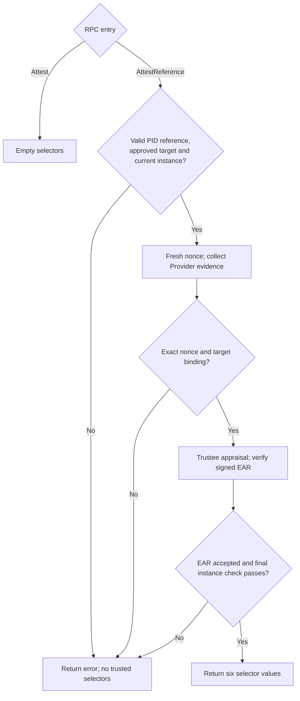

# Argus TDX WorkloadAttestor

SPIRE v1.15.3 Agent plugin for the host-managed OpenViking workload flow. It
implements `AttestReference` for a Broker `WorkloadPIDReference`; ordinary
Workload API `Attest` calls receive no trusted selectors.

Transport/collection errors also return no selectors. Node admission is a
prerequisite; the experimental Broker path supports one Linux/Docker OpenViking
listener. See the [full sequence and trust boundaries](../../workload/ARCHITECTURE.md).
The plugin does not measure process memory or writable data; SVID rotation does
not trigger a fresh attestation.

Provider evidence includes `rekor_entry_uuids`, an ordered list for the complete
measured chain. The plugin preserves it in Trustee's TDX evidence envelope.
[The Trustee hook](../../workload/trustee/README.md) verifies the original Rekor
entries, signer authorization, RTMR2 replay and current container association
before policy evaluation. Missing references or verification failure reject admission.

## Selectors

After successful EAR verification and the final target check, the plugin returns
the following values. SPIRE applies the configured plugin name `argus_tdx` as
their selector type; the target Entry requires all six plus the approved parent
Agent ID.

| Selector value | Source |
|---|---|
| `verified:true` | Successful completion of this admission attempt. |
| `workload_id:<id>` | Approved workload identity, matched to the registered target. |
| `policy:<id>` | Configured policy ID, matched to the target and signed EAR. |
| `image_config_digest:<sha256:...>` | Actual Docker image config digest, matched to the approved baseline. |
| `config_digest:<sha256:...>` | Observed configuration-file digest, matched to the approved baseline. |
| `agent_id:<SPIFFE-ID>` | Approved Agent identity, matched across deployment and evidence. |

SPIRE Server's CA signs the target SVID after Entry matching; Helper receives it
through the Agent Broker. The plugin itself returns only selectors.

## Configuration

Use the [deployment runbook](../../workload/README.md) and its single
`environment.json` input to generate the Agent HCL. The `argus_tdx` plugin data
accepts the fields below; the two fields with defaults may be omitted, and
unknown fields fail configuration.
The full deployment configuration is validated separately by the deployment tool.

| Field | Contract |
|---|---|
| `agent_id` | Expected `spiffe://<trust-domain>/spire/agent/argus_tdx/<node-id>`; must match registration, Provider and Node deployment. |
| `workload_id`, `policy_id` | Approved workload and Trustee policy identifiers. |
| `image_config_digest`, `config_digest` | Approved lowercase `sha256:` digests, not image tags or registry-name hashes. |
| `target_registration_path` | Protected absolute registration file path. |
| `evidence_endpoint` | `unix:///absolute/socket`; requests use `/ra/v1/workload-evidence`. |
| `trustee_endpoint` | Direct HTTPS origin. |
| `trustee_ca_path`, `trustee_server_name` | Explicit TLS trust anchor and peer name. |
| `ear_public_key_path`, `ear_expected_issuer`, `ear_expected_profile` | Explicit EAR verification key and expected claims. |
| `request_timeout` | Default `55s`; greater than `50s` (Trustee log verification budget) and at most `60s`. Applies separately to evidence collection and Trustee requests. Regenerate old `20s` configurations before use. |
| `max_response_bytes` | Default 2 MiB; greater than zero and at most 4 MiB. |

No example Agent ID is a built-in authorization. A different syntactically valid
ID still fails unless it equals the approved configuration. Identity, paths and
ports can change without modifying the `argus.workload.tdx.v1` evidence schema
or Node challenge/PoP contract. The application checks remain OpenViking-specific.

## Verification

Run `go test ./...` and `go vet ./...` from this module. The shared Go/Rust vectors
under `../../workload/testdata/` cover both the example and an alternative
deployment. Tests substitute evidence/Trustee transports; hardware acceptance
requires the Linux TDX procedure in the runbook. Test outcomes and unexecuted
checks are recorded separately in [VALIDATION.md](../../workload/VALIDATION.md).
