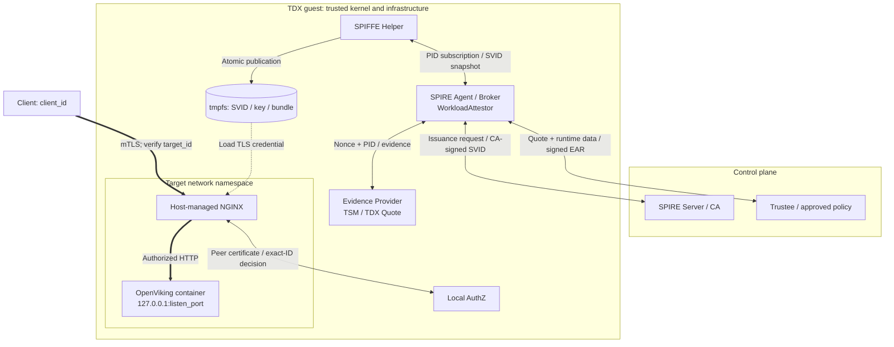

# TDX workload attestation and credential delivery

The diagrams describe the implemented OpenViking integration. Deployment steps
are in the [runbook](README.md); executed tests and pending hardware acceptance
are in the [validation record](VALIDATION.md).

## Supported deployment

| Requirement | Current scope |
|---|---|
| Host | Linux x86_64 TDX guest; Docker, systemd, TSM and pidfd support. |
| Versions | SPIRE v1.15.3 with experimental Broker; Helper fork based on v0.11.0; Trustee v0.21.0. |
| Instances | One pinned Node slot; one registered OpenViking process and IPv4 loopback listener. |
| Configuration | [One input](config/environment.example.json) supplies identities, paths, ports and approved baselines. Unit names and `argus-nginx` account are fixed. |

## Components and identities



Thick arrows carry business traffic. NGINX enters the target network namespace
but keeps its host filesystem; the target private key stays outside the
OpenViking container. TC API starts the container, then `argus-workload` registers
its actual listener before admission.

| Distinct identity | Role |
|---|---|
| `agent_id` | Node-admitted SPIRE Agent and authenticated Broker peer. |
| `helper_id` | Broker client; Unix Entry requires UID, executable path and binary SHA-256. |
| `target_id` | Registered service identity; Helper/NGINX hold its credential. |
| `client_id` | Exact peer identity allowed by AuthZ; client also checks `target_id`. |

## Admission sequence

Prerequisites: Node admission completed, approved baselines configured, actual
listener registered. Registration neither overwrites an instance nor approves
observed values automatically.

```mermaid
sequenceDiagram
    autonumber
    participant H as Helper
    participant A as Agent / Broker
    participant W as WorkloadAttestor
    participant P as Provider / TSM
    participant T as Trustee
    participant S as SPIRE Server CA
    H->>A: Workload API: request own identity
    A-->>H: Helper infrastructure SVID
    H->>A: mTLS Broker subscription: WorkloadPIDReference
    A->>W: AttestReference(PID)
    W->>W: Check approved target and process; generate nonce
    W->>P: POST /ra/v1/workload-evidence: protocol, nonce, PID
    P->>P: Observe target and TruCon snapshot; create Quote; recheck both
    P-->>W: Quote + runtime_data + rekor_entry_ids
    W->>W: Match nonce and all target fields
    W->>T: HTTPS /attestation: Quote, runtime_data, Rekor references, policy ID
    T->>T: Verify Quote/REPORTDATA; fetch and verify Rekor logs; replay RTMR2; match current container
    T-->>W: Signed EAR appraisal
    W->>W: Verify EAR; recheck process instance
    W-->>A: Six argus_tdx selector values
    A->>A: Match approved target Entry
    A->>S: Request target SVID
    S-->>A: CA-signed target SVID
    A-->>H: Complete SVID / key / bundle snapshot
```

| Check | Required result |
|---|---|
| Reference | `type.googleapis.com/spiffe.broker.WorkloadPIDReference`; ordinary `Attest` returns no trusted selectors. |
| Evidence | Fresh 32-byte random nonce; exact registered target; observation checks before/after Quote generation. |
| Trusted logs | Complete uploaded history; pinned Rekor and signer trust; replay equals authenticated RTMR2; explicit successful launch matches the current instance. |
| EAR | P-256/ES256 signature, issuer/profile, current validity, `cpu0=affirming`, policy ID and REPORTDATA. |
| Entry | Approved parent Agent, [all six selectors](../plugins/argus-tdx-workloadattestor/README.md#selectors), target SVID prefetch disabled. |

Failure produces no trusted selectors. Both evidence routes use `/ra/v1/` with
separate Node/Workload binding contracts and no unversioned aliases.

## Evidence and approval boundaries

The `argus.workload.tdx.v1` runtime-data object contains these fields:

| Group | Fields |
|---|---|
| Deployment | `agent_id`, `workload_id`, `policy_id` |
| Launch and container | `launch_id`, `container_id`, `image_config_digest`, `rootfs_read_only` |
| Process instance | `boot_id`, `pid`, `start_time`, `pid_namespace`, `net_namespace` |
| Service configuration | `executable`, `config_path`, `config_digest`, `listen_port` |
| Request | `protocol`, `nonce` |

Values use the protocol's restricted ASCII string representation; PID, start
time and port are decimal strings. `nonce` is canonical unpadded base64url.
Sorted compact JSON is JCS-compatible for this restricted schema:

```text
REPORTDATA = SHA-384(canonical runtime_data) || 16 zero bytes
```

Go, Rust and the Trustee contract tests share binding vectors. The full container
ID and Docker image config content digest are observed values; `executable` is a
path, not a separate executable-content hash.

| Approval layer | What it checks |
|---|---|
| Plugin configuration | Agent/workload/policy IDs and image/config digests. |
| Default Rego | `mr_td`, RTMR0/1, server-generated `tdx.trucon.verified`, approved `rtmr2_baseline`, non-debug TD, unexpired collateral, `UpToDate`, executable/config paths, port and runtime-field formats. RTMR3 is not pinned. |
| Explicit policy artifact | Operator-approved replacement; preflight pins its hash and exact Trustee readback. No name-based relaxation. |
| Signed EAR | Expected policy ID and binding; no policy-content digest check. Policy administration remains trusted. |

Trust includes the guest kernel/root, Docker, registration/Provider, Agent,
Helper and ingress. Quote-bound claims do **not** establish process-memory or
writable-data integrity, resistance to malicious guest root, or which PID served
each HTTP request. Observation checks do not freeze the workload.

## Publication, traffic and failure handling

```mermaid
stateDiagram-v2
    [*] --> Initializing
    Initializing --> Publishing: Valid initial Broker snapshot
    Initializing --> Stopping: Timeout / target or subscription failure
    Publishing --> Ready: Atomic generation + NGINX check + TLS probe
    Publishing --> Stopping: Invalid snapshot / publication failure
    Ready --> Publishing: SVID update on existing subscription
    Ready --> Stopping: Target change / identity loss / expiry / disconnect
    Ready --> Stopping: Helper killed; systemd stop hooks
    Stopping --> Stopped: Cleanup and NGINX stop completed
    Stopped --> Initializing: New Helper process; registered target must validate
```



| Boundary | Implemented behavior |
|---|---|
| Publication | Validate snapshot identity/chain/key/expiry; write generation in root-owned 0700 tmpfs, PEM 0600; switch `current`; publish `ready` after hook success. No fallback generation. |
| Probe vs business | Publication checks loaded TLS certificate. `verify` separately requires business 2xx and expected peer IDs. |
| Client authorization | NGINX validates the chain; AuthZ trusts its protected UDS headers and checks exact SPIFFE ID/profile/validity. Application authorization remains separate. |
| Startup | 60-second budget covers Helper identity, subscription and first publication. |
| Monitoring | pidfd plus local process/config/listener checks; up to 500 ms wait between checks, excluding check/scheduling time. No new Quote. |
| Failure | Clear readiness/PEM and request NGINX stop. systemd handles abrupt Helper death. Cleanup completion must be observed. |
| Timing | Worker/service stop timeouts are 5 seconds; actual detection, stop and existing-connection closure require measurement. |
| Rotation | Existing subscription updates do not re-attest; new Helper subscription does. No independent periodic re-attestation. |

Deleting PEM or an Entry does not globally revoke an issued SVID. The lifecycle
diagram describes control flow, not a measured availability or revocation SLA.

## Source and verification map

| Area | Implementation or test entry |
|---|---|
| Plugin and EAR validation | [WorkloadAttestor](../plugins/argus-tdx-workloadattestor/internal/workloadattestor/plugin.go), [Trustee client](../plugins/argus-tdx-workloadattestor/internal/trustee/client.go) |
| Protocol and target observation | [Go protocol](protocol/protocol.go), [Linux target](target/linux.go), [Rust observer](../../argus/src/bin/workload/mod.rs) |
| Evidence endpoint | [Provider](../../argus/src/bin/spire_evidence_provider.rs) |
| Policy and cross-language contract | [Rego template](policy/workload_cpu.rego.tmpl), [contract tests](trustee-contract/src/lib.rs), [vectors](testdata/) |
| Credential and ingress lifecycle | [Broker](../helpers/spiffe-helper/pkg/broker/), [NGINX hook](scripts/nginx-hook.py), [units](systemd/) |
| Client authorization | [NGINX template](config/nginx.conf), [AuthZ](../helpers/spiffe-helper/pkg/authz/authz.go) |
| Startup configuration and records | [TC API profile](../../tc_api/tc_api/services/workload_profile.py), [deployment](scripts/deployment.py), [operator commands](scripts/workload.py) |
| Build and acceptance | [build.sh](scripts/build.sh), [lifecycle checks](scripts/verify-lifecycle.py), [validation record](VALIDATION.md) |

`verify` correlates trusted journal events with boot, Helper invocation, instance,
policy and full serial; it does not re-verify raw Quote/EAR. Crash/exit scripts
observe service state and credential removal. Existing-connection delivery needs
a separate client probe. Record results against source revision, binaries,
configuration and policy.
