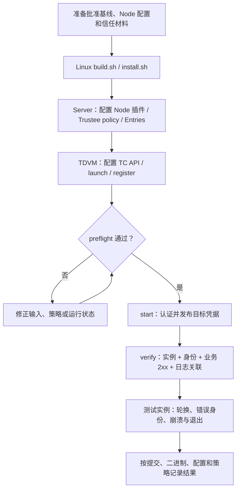
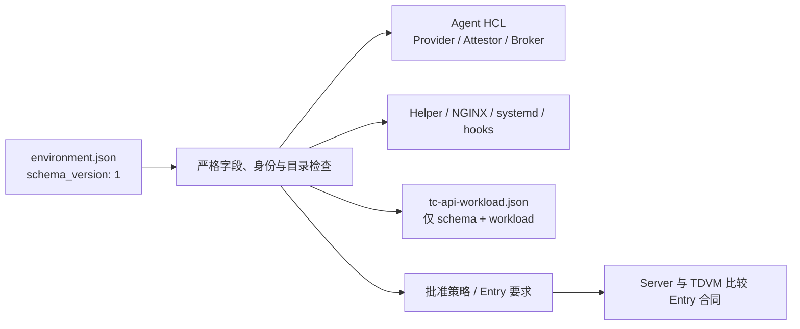

# OpenViking Workload Attestation：Linux TDX 部署与验收

本目录提供取证、身份交付、业务入口和验收工具。SPIRE Server/Agent 与两个 Attestor SDK 使用 **v1.15.3**；Helper 基于官方 **v0.11.0**，定制构建版本为 **0.11.0-argus.1**；Trustee 接口基线为 **v0.21.0**。部署依赖 SPIRE Agent 的 experimental Broker API。

先阅读 [机制与信任边界](ARCHITECTURE.md) 和 [插件配置及 selectors](../plugins/argus-tdx-workloadattestor/README.md)，再按本手册操作。[验证记录](VALIDATION.md) 区分当前实现待验项与历史测试结果；本手册中的命令不表示已完成真实 TDX 验收。Workload 准入要求 Trustee 按 Rekor UUID 验证完整日志链、重放 RTMR2 并关联当前容器；必须先部署 [Trustee 日志验证接入](trustee/README.md)。



上图对应下方 1—7 节；崩溃/退出用例需要可中断实例，已有连接停止交付另用客户端探针测量。

## 统一部署配置

唯一输入是 [environment.example.json](config/environment.example.json) 对应的 `schema_version: 1` 配置；缺少字段、未知字段和旧 `previous_*` 字段直接拒绝。示例中的域名、身份、端口和目录仅为一套部署值，下面命令使用这套示例路径。部署仍限定 OpenViking、Docker、一个 Node slot 和一个目标监听进程；服务 unit 名与 `argus-nginx` 账号固定。

| 配置段 | 内容及消费端 |
|---|---|
| `identity` | trust domain 与完整 Agent/Helper/target/client SPIFFE ID；贯通 Provider、Attestor、Helper、Broker allowlist、Entry、Rego、AuthZ 和验收探针。 |
| `paths` | 安装、配置、记录、SPIRE 二进制目录与 `run_name`；渲染全部 unit、socket、凭据、NGINX 日志/临时目录和清理 hook。 |
| `workload` | workload ID、宿主机/容器内配置与数据路径、内部监听端口、TLS 端口、宿主发布端口；贯通 TC API、登记、Provider、Rego 和 NGINX。 |
| `approved` 与信任字段 | 显式批准的镜像/配置/平台摘要、policy 及 TLS/EAR 材料；不会从当前观察值自动批准。 |
| `request_timeout_seconds` | 可选，默认 55，范围 51—60；生成插件请求超时，并派生 Helper 启动预算为两倍请求超时加 10 秒。 |



`run_name=argus` 派生 `/run/argus-workload/target.json`、`/run/argus/evidence-provider.sock`、`/run/argus-credentials/`、`/run/argus-nginx/`、`/run/argus-authz/authz.sock`。Workload API 与 Broker 分别使用 `/run/argus-spire-agent/agent.sock`、`/run/argus-spire-broker/broker.sock`，符合 SPIRE 对独立目录的要求。Linux 路径只接受干净的绝对路径；配置和可执行文件不能落入可写数据目录或 `/tmp`。

安装与 `render` 生成 Helper/NGINX 配置、systemd units、hook、TC API 最小配置；`render` 还生成 Agent HCL 和批准策略。安装、配置、记录与 SPIRE 二进制目录不能与派生的运行目录重叠，避免停服清理删除配置或程序。两者更新 unit 后执行 `daemon-reload`，不自动启动服务。应用新配置之前必须先停止现有认证栈；活跃服务会导致拒绝安装/渲染，防止旧实例的清理 hook 读到新目录。应编辑单独的输入文件，停止旧实例后再应用，不直接覆盖运行中的 `environment.json`。

## 1. 运行前提供的材料

准备已批准的 Node Agent/Server 配置、SPIRE bootstrap bundle、proof key、Trustee TLS CA、固定 EAR P-256 公钥及 issuer/profile，以及 Node policy 与对应信任材料。

同时提供：

- 已批准的 OpenViking 实际 image config digest（Docker `.Image` / image inspect `.Id`，格式为 `sha256:...`）、实际配置文件 SHA-256、服务进程 executable 路径。
- 已批准 TDVM 的 `mr_td`、`rtmr_0/1` 和 TruCon 初始化前的 `rtmr2_baseline`，均为 96 位小写十六进制。TruCon 继续 extend RTMR2，Trustee 从批准基准重放日志后与 Quote.RTMR2 核对。
- OpenClaw 客户端的有效 SVID、私钥、bundle，以及可返回 2xx 的 OpenViking 业务 URL。业务 API key 如需要，通过 `OPENVIKING_API_KEY` 环境变量提供。
- TDVM 上可以直连 Trustee 的 HTTPS 地址；可通过已配置 SSH alias 查询 SPIRE Server。SSH 必须使用已有 host key 校验，目标账号需能读取 Server socket 和运行中进程信息。

镜像 ID、配置摘要必须经过审批后填写基线。运行工具不会把当前观察值自动写成批准值。授权使用 `runtime_image_config_digest` 与 Provider 实际观察的 SHA-256 内容 ID。

## 2. 构建与安装

在 Linux x86_64 构建机运行，安装 Go 1.25.3 或更新版本、Rust 1.88 或更新版本、OpenSSL 开发包、pkg-config、Python 3.11+、NGINX（带 `http_auth_request_module`）、curl。已执行测试使用的具体工具链见验证记录。Python 构建环境需安装 TC API 依赖及 pytest：

```bash
cd cczoo/agent-cc/core/spire/workload
python3 -m pip install -r ../../tc_api/requirements.txt pytest pytest-asyncio
bash scripts/build.sh
# 先复制示例、填写两台主机各自的路径与批准值，并保存为 root:root 0600。
sudo bash scripts/install.sh --config /root/workload-environment.json
```

`build.sh` 执行 Node、Workload、定制 Helper（含上游测试）、NGINX、TC API 启动和 Trustee 合同测试，并用官方 SPIRE 校验生成配置与真实 Entry JSON，下载官方 SPIRE v1.15.3 二进制并检查固定 SHA-256。它不编译或修改 SPIRE Core。产物默认位于 `build/`，也可由 `ARGUS_WORKLOAD_BUILD_DIR` 指定，包含插件、Helper、Provider、辅助工具及哈希清单。构建测试中的 Quote/运行观察、Docker/registry/日志传输替身不能替代硬件验收。

构建开始时会使旧的 `SHA256SUMS` 失效，全部检查成功后才原子发布新清单。
安装前检查 [完整可执行产物列表](scripts/build-artifacts.sh) 中的 12 个文件及其哈希，
包括 Provider 和官方 SPIRE Agent/Server；只安装这些文件。
部署使用完整构建产物，缺失清单、缺失产物或被修改的二进制都会在安装前被拒绝。

把相同构建产物安装到 TDVM 与 Server 主机。Server 只使用其中的 Server/Node 插件和 Entry 工具。安装不会启动或启用服务；会将指定输入写入 `paths.config_dir/environment.json` 并重新渲染本栈配置。原 Node 源配置保持原样。

Evidence Provider 的 UDS 路由为 `POST /ra/v1/node-evidence` 和 `POST /ra/v1/workload-evidence`（后者需配置 workload 登记文件）。Provider 与 NodeAttestor 插件来自同一次完整构建；`workload.py render` 将插件路径与 SHA-256 写入 Agent 配置，`workload.py start` 自动执行 `render`。配置只指定 UDS socket，无需填写 HTTP 路径。

Provider 二进制为 `argus-spire-evidence-provider`，源码为 `core/argus/src/bin/spire_evidence_provider.rs`。安装脚本提供 `argus-tdx-provider.service`，显式传入 Agent ID、socket、登记文件、`--workload-data-path` 和 `--trucon-socket-path`。TruCon 的 root-only UDS 必须可访问，所有已度量记录必须已上传并获得 Rekor UUID；否则本次认证拒绝。

参考 `config/environment.example.json` 准备两台主机各自的输入配置，安装后保存至 `paths.config_dir/environment.json`，设为 root 所有、0600。填写真实路径和批准基线；示例占位值会被拒绝。两台机器的 Agent/Helper/目标身份、批准基线及 Helper 二进制必须一致；`paths.install_dir` 也须相同，因为 Server 使用本地同路径的 Helper 副本生成目标主机的 `unix:path` 与 `unix:sha256` selectors。TDVM 预检会逐项比较 Server 返回的 Entry 合同和本地预期，任一不一致直接拒绝。

## 3. 配置官方 SPIRE v1.15.3 与 Node 插件

先在 Server 上用已批准的 Node 配置生成部署配置：

```bash
sudo /opt/argus-workload/bin/argus-agent-config -role server \
  -source /etc/spire/argus-poc/server.conf \
  -node-binary /opt/argus-workload/bin/argus-tdx-nodeattestor-server \
  -trust-domain argus.local \
  -agent-id spiffe://argus.local/spire/agent/argus_tdx/openviking-node \
  -output /etc/argus-workload/server.conf
```

该工具要求显式指定 `-node-binary`，写入插件命令和校验摘要，保留 Server Node `plugin_data`、challenge、PoP、REPORTDATA、Trustee EAR 信任配置及 CA 配置。Server systemd unit 的 `ExecStart` 配置为：

```ini
[Service]
ExecStart=
ExecStart=/opt/spire-1.15.3/bin/spire-server run -config /etc/argus-workload/server.conf
```

重载 systemd 并重启该 Server unit。在 TDVM 执行：

```bash
sudo python3 /opt/argus-workload/scripts/workload.py render --config /etc/argus-workload/environment.json
```

Agent 配置从已批准的 Node 配置合并生成，保留 proof key 路径等协议设置，设置 Node 插件二进制、Provider socket、Workload API socket，加入 WorkloadAttestor 与本机 Broker。生成结果可在 `/etc/argus-workload/agent.conf` 审查。

NodeAttestor 支持配置 Agent ID，Provider 的 `--agent-id` 是必填项，必须等于 Server `plugin_data.agent_id`；该 ID 的 trust domain 必须与 SPIRE `trust_domain` 一致。Workload 合同保留 v1，只检查合法 Agent ID 格式；Provider、WorkloadAttestor、Helper、Entry 与策略进一步核对本次配置中的批准身份。更换域名/身份时还需同步现有 Node 配置与客户端身份材料；Server 工具会拒绝 Node 配置与部署值不一致。仍只支持单个已固定 proof key 的 Node slot，不新增多节点注册；完整格式见 [身份配置合同](../../argus/docs/configuration.md#spire-node-attestation)。

Provider 将配置中的 Agent ID、Server nonce 和 proof public key 绑定到 `REPORTDATA`；expiry 和 Quote digest 由 PoP transcript 签名覆盖。Trustee 负责 Quote/TCB/policy 评估，Server NodeAttestor 验证 PoP 与签名 EAR 后才返回 `AgentAttributes`，最终由 SPIRE Server CA 签发 Agent SVID。业务服务的 SVID 仍由后续 Workload 证明和静态 Entry 独立控制。

Node 运行脚本 `core/spire/scripts/argus-node-attestation.sh` 使用 v1.15.3 路径并检查 Agent/Server 二进制版本；Workload preflight 通过远端 `server-check` 核对 **正在运行** 的 Server executable。配置校验通过后仍需在目标 TDX 环境验证实际 Node 加入。

## 4. 安装固定 workload policy 与静态 Entry

`render` 生成 `/etc/argus-workload/argus-workload-openviking-v1_cpu.rego`（文件名前缀随批准 policy ID）。先审查内容，再通过已有 Trustee 管理通道安装。

默认模板要求 `tcb_status=UpToDate`。使用经过单独批准的策略时，显式配置 `approved_policy_artifact.path` 和 `approved_policy_artifact.sha256`；工具核对本地文件摘要及 Trustee 回读的逐字节一致性。该项不会根据 policy 名称或平台状态自动启用。例外策略的验证结果只对应其实际内容，不能写成默认严格策略通过。

Trustee v0.21 REST 的 `POST /policy` 接受 `policy_id` 与无补位 base64url 的 `policy`。例如生成可审查请求文件：

```bash
sudo python3 - <<'PY'
import base64,json,pathlib
p=pathlib.Path("/etc/argus-workload/argus-workload-openviking-v1_cpu.rego")
out=p.with_suffix(".request.json")
out.write_text(json.dumps({"policy_id":p.stem,"policy":base64.urlsafe_b64encode(p.read_bytes()).decode().rstrip("=")}))
out.chmod(0o600)
PY
```

将请求提交到受控的 Trustee 管理入口；policy 写权限属于管理员。评估请求使用不带 `_cpu` 的 policy ID；Trustee 为 CPU 选择带该后缀的存储 policy，EAR 中返回请求的原 ID。preflight 会直接读取 Trustee `GET /policy/<id>_cpu`，确认实际内容与批准的渲染结果一致。运行时 EAR 检查 policy ID，不包含策略内容摘要核验，因此同名策略的后续管理仍处于信任边界内。

在 SPIRE Server 主机执行：

```bash
sudo python3 /opt/argus-workload/scripts/workload.py apply-entries --config /etc/argus-workload/environment.json
sudo python3 /opt/argus-workload/scripts/workload.py server-check --config /etc/argus-workload/environment.json
```

Helper Entry 同时要求 root UID、实际二进制路径和 SHA-256。目标 Entry 同时要求 `argus_tdx:verified:true`、workload、policy、Agent ID、实际镜像和配置摘要，并关闭 X.509-SVID 预取（`disableX509SVIDPrefetch=true`）。

工具检查相同身份的 **全部 Entry**；发现旧的宽泛 Entry 会拒绝继续，输出 Entry ID。必须先审查并通过 Server 的 `entry delete -entryID ...` 移除绕过证明的旧授权，再运行。工具不会悄悄保留同身份旁路，也不会自行删除已有授权。

## 5. TC API 启动与目标登记

在 TDVM 部署本分支的 TC API。给 TC API 容器传入：

```text
ARGUS_WORKLOAD_CONFIG=/etc/argus-workload/tc-api-workload.json
```

该文件由统一配置导出，仅包含 schema 版本和 `workload` 段，以 root 所有且不可被组/其他用户写入的只读文件挂载给 TC API。`config_host_path` 与 `data_host_path` 必须同时在 Docker 宿主机存在，并以相同路径挂载给 TC API。OpenViking 配置中保持 `server.host=127.0.0.1`，`server.port` 等于 `workload.listen_port`、`storage.workspace` 等于 `workload.data_path`。基于现有 OpenViking 配置补齐模型、API key 等业务参数。

专用 profile 固定非特权容器、只读 rootfs、独立 bridge network namespace、单个监听进程、仅发布 `published_port:tls_port`、只读配置 bind mount 与单独可写数据目录。无 TDX 设备、SPIRE socket 或私钥挂入业务容器。镜像如果声明额外 volume、服务启动多个共享监听 worker、或实际读取不同配置，Provider 会拒绝；先修正运行配置再登记。

```bash
# 使用部署环境的 OIDC 登录流程取得 token；保留日志上传。
export TC_API_IDENTITY_TOKEN=...
# 查询结果默认复用 identity token 作为 Bearer；若网关另有要求，设置 TC_API_BEARER_TOKEN。
sudo --preserve-env=TC_API_IDENTITY_TOKEN,TC_API_BEARER_TOKEN \
  python3 /opt/argus-workload/scripts/workload.py launch --config /etc/argus-workload/environment.json
sudo python3 /opt/argus-workload/scripts/workload.py register --config /etc/argus-workload/environment.json
```

`launch` 使用 TC API 的 `nginx-spiffe-helper-v1` profile，保留 container/launch/image 内容关联。Docker argv 与启动日志的 mounts、ports、环境摘要使用同一份已校验配置快照；请求不能覆盖挂载或运行命令。请求拒绝 HTTP 重定向，需填写可以直接处理请求的 TC API 地址。`register` 在宿主机解析实际监听 `workload.listen_port` 的进程，而非直接采用 container init PID；生成 root 保护的 `/run/argus-workload/target.json`。

首次登记不覆盖已有登记。替换实例需要先 `stop`，再启动/登记新实例；不支持原地切换成另一个进程。`stop` 停止认证栈并撤下入口；旧 OpenViking 容器仍由 TC API/Docker 管理，启动替换容器前需按旧 container ID 停止它，释放 `workload.published_port` 指定的端口。业务容器不能修改登记文件。

## 6. 预检、启动、状态、验证与停止

```bash
sudo python3 /opt/argus-workload/scripts/workload.py preflight --config /etc/argus-workload/environment.json
sudo python3 /opt/argus-workload/scripts/workload.py start --config /etc/argus-workload/environment.json
sudo python3 /opt/argus-workload/scripts/workload.py status --config /etc/argus-workload/environment.json
sudo --preserve-env=OPENVIKING_API_KEY \
  python3 /opt/argus-workload/scripts/workload.py verify --config /etc/argus-workload/environment.json
sudo python3 /opt/argus-workload/scripts/workload.py stop --config /etc/argus-workload/environment.json
```

| 阶段 | 检查与结果 |
|---|---|
| `preflight` | 基线、版本、全部同身份 Entry、Trustee HTTPS/policy、EAR 公钥、TSM、当前实例和客户端材料。缺项即拒绝。 |
| `start` | 预检、渲染并启动 systemd；已有 Agent/Provider 进程占用时拒绝。 |
| 凭据发布 | 校验证书链/身份/密钥，原子切换代次；NGINX `-t` 和 `-tls-only` 加载检查通过后才发布 readiness。 |
| `verify` | 期望的客户端/服务端 ID、当前证书序列号、业务 2xx 及本次实例的日志关联。 |
| 失败清理 | 目标/身份失效、断连、过期、发布或 reload 错误触发 PEM/readiness 清理及停服请求；SIGKILL 由 systemd 补充处理。 |

组件连接与状态转换见 [架构图](ARCHITECTURE.md#components-and-identities) 和 [生命周期图](ARCHITECTURE.md#publication-traffic-and-failure-handling)。NGINX 在目标网络命名空间转发到 loopback；证书链由 NGINX 验证，精确客户端 ID 由受保护 UDS 后的 AuthZ 验证。客户端同时检查 `identity.target_id`。

| 运行约束 | 含义 |
|---|---|
| 凭据目录 | root 所有的 0700 tmpfs；每代证书、PKCS#8 私钥及 bundle，PEM 为 0600。 |
| TLS 会话 | session cache、tickets、early data 关闭。 |
| 初始化默认 120 秒 | 由 `2 × request_timeout_seconds + 10` 派生，覆盖取证、Trustee 验证及首次发布；成功后停止启动计时，目标退出可取消初始化。启动脚本额外等待 5 秒。升级需重新渲染 Agent/Helper 配置。 |
| 监测等待 500 ms | pidfd 与本地实例检查；检查/调度耗时另计，不产生新 Quote。 |
| 停服配置 5 秒 | worker/service timeout，实际检测、断流和连接关闭仍需测量。 |
| 轮换与重证明 | 普通 SVID 轮换不重证明；新 Helper 订阅会重证明，独立周期重证明未实现。 |

删除本地 PEM 不等于全局撤销 SVID。客户端应用的凭据生命周期和完整业务集成需另行验收。

## 7. 真实 TDX 验收与记录

### 终端查看 Workload 认证状态

在运行服务端认证栈的 TDVM 上，运行只读日志入口：

```bash
sudo python3 /opt/argus-workload/scripts/watch-attestation.py
```

它先打印最近一小时的已有事件，再持续显示新事件；按 `Ctrl+C` 只退出查看器。每行保留 journal 的原始 UTC 时间和 unit，使用 `[INSTANCE]`、`[QUOTE]`、`[EAR]`、`[SVID]` 标记订阅实例、Quote 生成、EAR 校验接受、目标 SVID 发布；已知认证/凭据错误显示 `[ERROR]`，其他进程错误显示 `[PROCESS-ERROR]` 并保留原日志。原日志字段中的 `launch_id`、PID、nonce、policy、EAR 摘要和 serial 可直接用于关联。SVID 行额外输出 `serial_hex`，便于与 OpenClaw 请求的十六进制序列号比较。

查看更早的一次准入、打印后退出：

```bash
sudo python3 /opt/argus-workload/scripts/watch-attestation.py \
  --since '24 hours ago' --no-follow
```

已有部署可以直接从更新后的仓库运行 `scripts/watch-attestation.py`，不必为查看日志重跑安装、重启服务或重新证明。脚本仅使用 Python 标准库和 `journalctl`。它不生成 Quote，不接触密钥，不修改策略，不把无日志当作通过；`[EAR]` 后仍需结合实例检查和目标 SVID 判断完整准入，`[SVID]` 轮换不是一次新认证。它显示原事件中的策略 ID，不根据名称推断 `tcb_status`；真实 TCB 结论仍以对应 EAR/验收记录为准。

### 联合验证

`verify` 同时检查实例、实际业务 2xx、客户端/服务端 SPIFFE ID、NGINX 当前证书序列号与固定 Entry。它读取 JSON journal，只接受当前 boot 和 Helper systemd invocation 内按订阅、EAR 接受、SVID 发布顺序关联的事件，逐字段精确比较 launch、container、PID、start time、policy 和完整证书序列号；验证期间 Helper 重启或就绪状态变化会拒绝通过。当前构建的 Helper 与 WorkloadAttestor 必须一并部署，缺少关联字段会拒绝验收。记录保存到 `/var/log/argus-workload/`，原始 JSON journal 保存为 `last-verify-journal.jsonl`；不写出私钥、原始 Quote 或 EAR token，保存 nonce、实例、policy、EAR 摘要与 SVID 序列号的运行日志关联。

`rotation` 和 `wrong-client` 分别检查轮换及身份拒绝。`helper-crash` 和 `target-exit` 会中断指定测试实例，应在可中断的验收部署中运行：

```bash
sudo --preserve-env=OPENVIKING_API_KEY python3 /opt/argus-workload/scripts/verify-lifecycle.py rotation --config /etc/argus-workload/environment.json
sudo --preserve-env=OPENVIKING_API_KEY python3 /opt/argus-workload/scripts/verify-lifecycle.py wrong-client --config /etc/argus-workload/environment.json \
  --wrong-client-cert /approved-test-client/svid.pem --wrong-client-key /approved-test-client/key.pem
sudo --preserve-env=OPENVIKING_API_KEY python3 /opt/argus-workload/scripts/verify-lifecycle.py helper-crash --config /etc/argus-workload/environment.json
# 重新 register/start/verify 后执行目标退出用例：
sudo --preserve-env=OPENVIKING_API_KEY python3 /opt/argus-workload/scripts/verify-lifecycle.py target-exit --config /etc/argus-workload/environment.json
```

普通轮换必须保持就绪、证书序列号改变且没有新的 appraisal。崩溃/退出用例从触发操作前开始计时，循环采用 6 秒截止条件，检查 NGINX unit inactive/failed、readiness 消失及 PEM 清理。外部命令耗时计入实际观测值，单次检查可能跨过截止时间，因此应报告 `stop_observed_seconds`，不能把 6 秒写成已证明的上限。该结果只说明服务状态和凭据清理，脚本没有测量已建立连接是否仍交付业务数据，后者需要独立客户端探针。崩溃/退出用例结束后工具停下认证栈，恢复需要重新登记。

完整验收记录至少关联源码提交、实际运行二进制摘要、部署配置版本、批准基线、实际 policy 内容摘要，以及 launch/container/PID/start time、nonce、EAR 摘要、SVID 序列号和业务结果。`verify` 保存的是受信任本机日志的运行关联，不会独立重新验证原始 Quote/EAR；其 `evidence_kind` 标签不能单独证明硬件验收通过。

插件/Provider 合同测试已覆盖 nonce、镜像、配置、policy、伪造/过期 EAR 等负向条件。真实环境仍需验证 Quote/DCAP 和策略拒绝，以及 Agent/Broker 断连、身份移除、过期、reload 故障和已有连接关闭行为。按提交、配置和策略分别记录 PASS、FAIL/BLOCKED、NOT_RUN，见 [验证记录](VALIDATION.md)。
