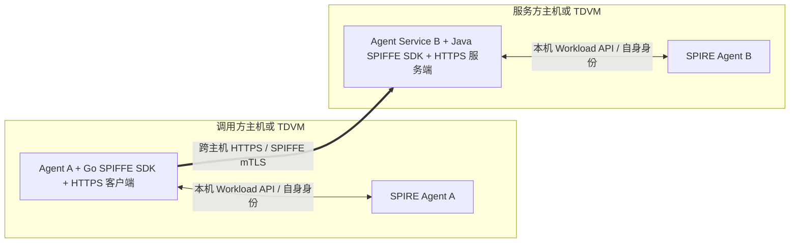
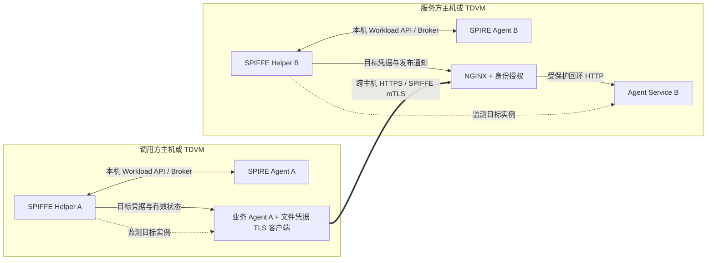
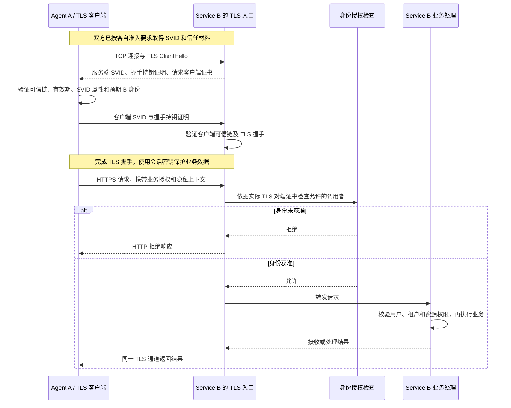

# Agent-CC：通用 Agent 与 Agent Service 的可信通信与隐私上下文交付

日期：2026-09-07。文档性质：通用架构设计与现有实现映射。核对基线：`feat/argus-spiffe-v2-val` / `467ad8a`，以及当前工作区尚未提交的 OpenClaw 客户端改动。

本文定义任意 Agent 与 Agent Service 如何根据可信身份和批准的执行条件建立连接、交换隐私上下文，并在条件失效后停止使用身份。共同约定是身份、证明准入、对端授权和 HTTPS/mTLS；身份接入同时支持应用通过 SPIFFE SDK 直接使用 Workload API，以及通过 Helper 交付凭据。Helper 是兼容接入方式，不是每个参与方必须部署的组件。OpenClaw、OpenViking 是接入示例；原生 SDK 对接本项目证明插件、Helper 复用等工作尚未完成，具体状态见第 12 节。

## 1. 项目背景与价值

Agent 执行任务时，需要把用户上下文交给记忆、检索、模型、工具或其他 Agent。这些能力可能由不同组织运营，部署在不同基础设施上。数据所有者关心的不只是服务是否可达，还包括：谁会收到数据、运行的是哪份获准代码、执行环境是否符合要求，以及这些依据在进程替换或策略变化后是否仍然适用。

框架的目标是让参与方根据自己认可的身份、执行条件和访问规则决定是否交付数据，同时让应用复用身份获取、证书轮换、通信认证和失败处理。项目背景参考 [框架价值与核心贡献研究](./论文/框架价值与核心贡献研究-2026-09-06.md)；其中的研究候选方向不作为已实现能力或已成立的新颖性结论。

| 参与方 | 需要解决的问题 | 框架的价值目标 | 应如何验证 |
|---|---|---|---|
| 数据所有者 | 私有上下文可能交给不符合要求的服务或执行位置 | 用批准的接收身份与执行条件约束数据交付 | 不合格接收方不能取得上下文，合格请求能完成业务 |
| Agent 提供者 | 每接入一个工具，都重复处理证书、证明和连接异常 | 通过通用身份与通信组件接入服务 | 对比接入修改量、失败恢复步骤和维护范围 |
| Agent Service 提供者 | 多种 Agent 访问同一服务，身份与用户权限容易混淆 | 统一工作负载身份入口，保留业务权限边界 | 错误服务身份、错误用户或租户均被相应层拒绝 |
| 平台与基础设施团队 | 应用、代理和证书使用者之间的关系不清楚 | 明确进程登记、凭据持有、TLS 终止和停用责任 | 实例替换、凭据移除、代理故障时行为可复现 |
| 跨组织协作方 | 交付依据难以追踪，各方准入政策可能不同 | 保留可关联的准入、身份与业务记录 | 能定位依据和失效时间；跨域政策互认另行验证 |

这些是工程与业务价值目标，尚不能写成已测得的成本下降、隐私泄漏率下降或市场收益。采用 TDX、SPIFFE、mTLS 和透明日志本身也不足以宣称新的论文贡献。后续研究可围绕“逻辑服务、实际实例、准入政策与数据通道的对应关系”以及变化后的失效语义开展，具体新性质仍需要近邻比较和反例验证。

## 2. 通用角色与必须保留的绑定

本文中的 **Agent** 指业务智能体或其运行程序；**SPIRE Agent** 指节点上的身份基础设施组件。**Agent Service** 指可由 Agent 调用的服务，包括上下文存储、检索、推理、工具执行和其他 Agent 的服务接口。

调用方和服务方是一次连接中的角色。A 可以调用 B，B 也可以在另一条获准连接中调用 A。框架不根据产品名称固定通信方向。

| 对象 | 含义 | 不能替代什么 |
|---|---|---|
| 逻辑 SPIFFE ID | 策略批准的工作负载身份，可在实例替换或合法扩容后延续 | 不能直接当成唯一 PID、唯一副本或硬件 Quote |
| 实际进程实例 | 当前运行者及启动时间、boot ID、namespace、容器/launch 关联等 | 仅有一个数字 PID 不能证明实例未被替换 |
| 获准运行基线 | 镜像内容、配置、平台及该工作负载必须满足的属性 | 镜像 tag、应用自报名称不能代替批准基线 |
| 网络 endpoint | 用于定位连接地址的 scheme、host、port | DNS 名称或 IP 不能代替预期 SPIFFE 身份 |
| TLS 使用者 | 实际持有或使用工作负载私钥、终止 TLS 的程序 | 使用某个身份不代表它就是被取证的业务进程 |
| 用户、租户、资源权限 | 本次业务动作可以访问的数据范围 | 工作负载身份认证不能代替数据访问授权 |

通用化应使名称、地址、身份、基线和应用协议可配置，同时保留以下约束：

1. SPIRE Entry 决定哪些获准运行属性可以取得哪个身份；SDK 选择的自身 ID 或 Helper 配置中的目标 ID 只是选择和校验条件，不授予身份。
2. 目标登记由受信任的启动/运维链生成，取证方独立观察真实运行属性。原生 Workload API 由 SPIRE Agent 识别实际调用进程；Helper 路径使用获准的目标引用。应用不能仅靠提交一个目标 ID 或 PID 给自己授权。
3. 调用地址与预期对端身份必须来自批准的连接配置；接收方对允许调用的身份作明确限制。
4. 同一逻辑身份可以有多个合法副本，但每个副本都必须符合准入要求。当前单进程部署的验证结果不能直接覆盖多 worker 或负载均衡场景。

数据所有者、应用运营方、基础设施运营方、身份签发方、证明验证方和策略批准方可以由不同主体承担。部署时需要记录这些角色及其信任关系；服务通过证明，不等于所有这些角色都可以被省略。

## 3. 组件分工与部署关系

调用方和服务方分别选择适合自身运行时的接入方式，无须采用相同语言、SDK 或代理。框架复用 SPIFFE 标准与各语言库，不要求跨语言共用同一个客户端程序。

### 3.1 原生 SDK 接入

Go、Java 等应用可以在实际业务进程中，通过各自的 SPIFFE 库订阅本机 Workload API，在内存中取得和更新自身 SVID、私钥及 bundle，并接入应用的 TLS 客户端或服务端。应用自己完成 TLS 时，这条路径不需要 Helper、Broker API、PEM 文件或 NGINX。



图中的语言只作示例，可以互换，也可以两端使用同一语言。SDK 获取的是实际调用进程获准使用的身份；将 SDK 放在另一个启动器进程中，并不会自动把身份绑定到它启动的业务进程。

### 3.2 Helper 兼容接入

应用暂不直接集成 Workload API 时，复用已有 SPIFFE Helper，在对应节点运行本机实例。Helper、被引用进程和对应 SPIRE Agent 必须满足本机 PID 引用关系。

下图中两端均采用 Helper：调用方应用加载 Helper 发布的凭据并自行使用 TLS，服务方由 NGINX 终止 TLS。这里的“应用自己使用 TLS”仍属于外部凭据接入，不能与上一节的“SDK 直接使用 Workload API”混称。



### 3.3 共同职责与可选组件

SPIRE Server 与 Trustee 属于身份签发和证明评估链，不在上述业务数据路径中。当前部署方案将它们放在工作负载 TDVM 外，并为 Trustee HTTPS 与 EAR 签名验证预置信任材料，避免用尚未取得的业务 SVID 完成自身准入。

| 组件 | 责任 |
|---|---|
| 启动器与登记工具 | 启动批准的工作负载，记录真实实例及镜像、配置关联；TC API 是当前实现 |
| Evidence Provider | 独立观察实例和运行属性，将新鲜挑战与运行数据绑定到真实 Quote |
| Trustee / 证明验证方 | 检查证据和批准策略，返回可验证的评估结果 |
| 自定义 Attestor | 核对评估签名、时效、policy 与本次绑定，成功后返回可信 selectors |
| SPIRE Server / Agent | 执行节点与工作负载准入、Entry 匹配、SVID 签发与身份交付 |
| 原生 SPIFFE SDK，按接入方式选择 | 在业务进程内订阅 Workload API、维护自身身份与 bundle，并接入该语言的 TLS 栈 |
| SPIFFE Helper，按接入方式选择 | 取得自身身份，以目标 PID 订阅业务身份，验证和发布凭据，处理目标失效 |
| 应用 TLS 栈或服务端代理入口 | 使用业务 SVID 完成 mTLS、对端身份匹配和连接生命周期管理 |
| 业务适配器与服务 | 提取上下文、组装已有 API 请求、验证业务权限、执行操作并解释结果 |

接收方通过 SDK 在 TLS 校验回调中执行调用者身份授权时，无须为了同一项身份检查再部署独立 AuthZ 服务。采用当前 NGINX 路径时，则由本机 AuthZ 补充精确 SPIFFE ID 检查。两种方式都保留业务权限检查，并分别验收持钥边界与失败处理。

### 3.4 被证明主体、密钥持有者与明文位置

| 部署方式 | 被登记和取证的主体 | 目标私钥可见范围 | TLS 终止与上下文明文位置 |
|---|---|---|---|
| Agent / Service 原生 SDK | 实际调用 Workload API 的业务进程实例 | 获准 SPIRE 交付组件、应用内 SDK/TLS 实现 | 对应业务进程；可以完全在内存中使用凭据 |
| Helper + 应用 TLS | 被引用的实际 Agent/Gateway 或服务进程实例 | 获准 SPIRE 交付组件、Helper、应用 TLS 实现 | 对应业务进程；另有受保护的凭据文件 |
| Helper + NGINX | 被引用的实际业务服务进程实例 | 获准 SPIRE 交付组件、Helper、NGINX | NGINX 解密，业务进程接收后端请求 |

原生 SDK 直接取得业务进程自身身份，无须先取得一个 Helper 身份。Helper 路径中，Helper 的自身 SVID 只用于身份交付调用，业务请求使用目标工作负载的 SVID。私钥经本机受控通道交付，不随业务 HTTP 请求传输。

采用 NGINX 时，Helper、NGINX、AuthZ、网络隔离与转发配置都是目标身份代理的受信任组成部分。TLS 握手证明持钥能力及身份，业务进程与 TLS 使用者的关联还依赖上述登记、代理和部署约束。当前方案没有逐请求向远端提供“某一 PID 已处理此上下文”的独立密码学证明。

## 4. 从运行准入到业务身份

对于要求机密计算证明的工作负载，准入过程如下：

1. **批准条件。** 策略批准方确定平台、镜像内容、配置、运行属性、目标身份和允许的身份签发关系。批准配置由受信任运维链管理。
2. **节点准入。** SPIRE NodeAttestor 按节点合同取得和评估证据，Server 认可后建立节点身份。节点身份为后续工作负载准入提供前提。
3. **启动并登记实例。** 启动器生成 launch/container 关联；登记工具解析实际业务进程并记录启动时间、boot ID、namespace 等。当前服务端实现还校验唯一 listener、只读 rootfs 和配置挂载。
4. **请求业务身份。** 原生路径由业务进程通过 SDK 连接 Workload API，SPIRE Agent 识别调用者并触发 `Attest`；Helper 路径先取得 Helper 自身身份，再通过受限 Broker API 提交本机 `WorkloadPIDReference`，触发 `AttestReference`。两条路径的目标权限都来自 SPIRE 准入与 Entry，普通 Workload API 请求不携带应用自选的目标 PID。
5. **工作负载取证。** WorkloadAttestor 生成新 nonce；Provider 独立检查目标、构造运行数据并生成 Quote，取证后确认实例未变化。
6. **评估并授权身份。** Trustee 评估真实证据；插件核对固定信任材料、签名、有效期、policy 和本次数据绑定。只有可信 selectors 满足批准的 Entry，SPIRE CA 才签发目标 SVID。
7. **加载并启用。** 原生路径由 SDK 维护内存中的 SVID/bundle，应用配置预期自身与对端身份，完成 TLS 初始化后才进入可用状态；Helper 路径验证完整快照、目标身份、证书链和密钥配对，发布完整凭据代次，等待使用方加载成功。

当前 TDX Workload 合同使用结构化 runtime data、SHA-384 和 64 字节 REPORTDATA。具体 schema、编码、接口与验证向量以 [当前 Workload 方案](./Argus-OpenViking-NGINX-SPIFFE-Helper-Workload-Attestation-Workflow-CN.md) 为准；通用化不能通过删除实例字段或降低 Entry 条件来实现。

各端的准入要求可以不同。例如，策略可以接受某种企业管理的 Agent 身份，同时要求接收隐私数据的 Service 提供 TDX 证明。这必须是数据所有者认可的明确策略。不能因为双方都有 SVID，就宣称双方都经过硬件证明；向 Agent 返回私有上下文时，同样需要考虑该接收方的获准条件。

### 4.1 业务对端实际相信什么

SVID 是身份凭据，通常不携带完整 Quote、镜像基线或 Trustee policy。调用方验证 SVID 时，也是在依赖所信任签发域对该身份执行的准入规则。因此部署必须维护“哪些签发域和身份代表哪些被接受的准入条件”，并检查同身份是否存在绕过证明的较弱 Entry。

第一阶段使用明确配置的 trust domain、可信 bundle 和获准对端身份。跨域场景需要外域 bundle 的可信取得，以及双方对签发权限和准入要求的约定。[SPIFFE Federation](https://spiffe.io/docs/latest/architecture/federation/readme/) 提供身份信任材料的互操作基础；证明政策是否符合调用方要求仍需独立判断。本项目尚未完成跨域政策互认和变化传播协议。

### 4.2 原生 SDK 对接当前证明插件的前提

SPIFFE 原生接入已有标准和库支持，但当前项目的证明插件有明确限制：[WorkloadAttestor 实现](../core/spire/plugins/argus-tdx-workloadattestor/internal/workloadattestor/plugin.go) 的普通 `Attest` 返回空 selectors，仅 `AttestReference` 执行目标检查、取证和 Trustee 验证。[现有测试](../core/spire/plugins/argus-tdx-workloadattestor/internal/workloadattestor/plugin_test.go) 也明确检查普通路径不返回证明 selectors。因此，直接换成 Go/Java SDK 尚不能取得要求该证明条件的目标 SVID。

要支持同等准入要求的原生路径，应让 `Attest` 使用 SPIRE Agent 识别的调用者 PID，与 Broker 的 `AttestReference` 复用同一套批准目标检查、nonce/Quote、EAR 验证和 selector 生成逻辑。仅受批准登记覆盖的调用进程才可进入该流程；普通 Helper 身份等无关调用不能被误授权。保留相同的证明 Entry 条件，不修改标准 Workload API，不要求应用自己向 Trustee 提交证据，也不通过降低 selectors 让原生 SDK 获得身份。

原生接入还需适配启动顺序。现有 OpenViking 登记依赖已存在的业务 listener，而部分原生服务会先取 SVID 再创建 TLS listener；不能直接照搬这一先后关系。相应部署 profile 应先定位实际 Go/JVM 等业务进程和批准基线，在尚未就绪的阶段完成证明与 TLS 初始化，再放行业务。是否预先绑定但不接受业务的 socket，以及哪些 listener 属性进入登记，由该 profile 明确定义；客户端进程也不应被要求具备服务监听端口。这些是待实现和验收的适配内容。

## 5. 两类连接与一次隐私上下文交互

| 连接 | 第一阶段形式 | 承载内容 | 生命周期 |
|---|---|---|---|
| 原生身份交付 | 业务进程内 SDK 到本机 SPIRE Agent 的 Workload API，当前 Linux 部署使用 UDS | 该进程获准的 SVID、私钥和 bundle 更新 | 后台持续订阅，通常在内存中维护，不承载业务上下文 |
| Helper 身份交付 | Helper 到本机 Workload API，再以自身 SVID 连接独立 UDS 上的实验性 Broker API | Helper 身份及获准目标进程的身份材料 | 仅在 Helper 路径使用；后续按使用方要求发布凭据 |
| 业务通信 | Agent TLS 客户端到 Service TLS 入口；TCP 上的 HTTPS/mTLS | 上下文请求、业务授权材料、处理结果 | 可以复用连接，但受身份有效期和失效处理约束 |

通用设计第一阶段以 HTTPS 业务 API 为落地接口。其他应用协议可复用身份设计，但需要对应的传输适配与验收，不能直接计入当前兼容能力。对端看到的是业务 SVID 和标准 TLS 握手，无须知道本地使用 Go、Java 还是 Helper。Broker 只用来代理目标身份取得；原生路径通过 Workload API 更新身份。两种方式的业务请求都不经过 Broker 或 Trustee。

### 5.1 网络连接中怎样确认对方

下图按当前 NGINX 路径展示。原生 SDK 接入时，对端身份授权可以直接并入 TLS 校验，省去独立的身份授权调用；业务权限仍在请求处理阶段检查。



SPIFFE ID 来自 X.509-SVID 的 URI SAN，验证需要标准证书路径检查与 SPIFFE 属性检查；不能仅比较 HTTP header 或应用自报的名称。[X.509-SVID 标准](https://github.com/spiffe/spiffe/blob/main/standards/X509-SVID.md)

客户端在发送隐私正文前必须确认预期服务端身份。接收端可在 TLS 授权回调中检查调用者；当前 NGINX 路径是在 TLS 链验证后，通过 HTTP `auth_request` 检查精确身份，再决定是否转发给后端。

这一区别影响数据边界：NGINX 的身份授权失败能阻止后端业务处理，但请求可能已经到达并在这个受信任 TLS 入口内解密。不能把当前流程描述成“双方业务授权完成前任何接收组件都看不到正文”。如果某场景另有先授权再释放独立解密密钥的要求，需要单独设计密钥交付合同。

### 5.2 哪一步算成功

| 阶段 | 可得结论 | 后续仍需确认 |
|---|---|---|
| TLS 与预期 SPIFFE 身份验证通过 | 当前连接对端持有相应私钥，且身份在信任范围内 | 此调用者是否获准访问业务资源 |
| 调用者身份授权通过 | 此工作负载可以访问配置允许的服务入口 | 用户、租户、具体上下文和操作权限 |
| 业务授权通过 | 本次操作符合应用权限规则 | 请求是否被接收、持久化或处理完成 |
| 业务结果确认 | 按 API 合同确认接收或执行结果 | 异步处理需要继续查询任务状态或读回结果 |

HTTP 2xx 的含义由业务 API 定义，异步 accepted 不等于持久化或处理完成。独立 health 探针也不能代替实际 Agent 请求和业务结果验证。

Agent 上传数据与 Service 返回数据可以使用同一条 TLS 连接。Service 主动发起另一项调用时，需要以调用方角色使用自己的身份，连接对方获准的 TLS 入口；是否开放反向接口由该部署配置决定。

## 6. 插件、客户端与业务接口的边界

应用插件承担三件事：从应用状态取得本次需要发送的上下文；转换为接收方已有 API 格式；解释响应并更新应用状态。普通程序也可以直接使用客户端库，不必具有插件机制。

各语言的通信接入负责验证预期对端、发送 HTTPS 请求、处理超时与身份失效：原生模式复用该语言 SPIFFE SDK 的身份源与 TLS 能力；Helper 模式加载外部凭据并响应其有效状态。应用还需管理已有连接与业务请求。业务适配器不能靠更改请求参数或跟随重定向扩大凭据的使用范围。

| 通用能力 | 应留在业务适配器中的能力 |
|---|---|
| SVID 获取、验证、更新与停用；按模式在内存中使用或发布文件 | OpenClaw 会话/消息提取或其他 Agent 的事件接入 |
| 地址与预期对端身份匹配 | 接收服务的 URL path、请求体和响应格式 |
| mTLS、连接池轮换与关闭 | OpenViking session、commit/archive，或其他服务的对应动作 |
| 最小身份与请求关联日志 | 应用用户、租户、资源范围和业务结果判断 |

通用框架无需规定所有服务都实现一个相同的“隐私上下文上传 API”。第一阶段通过受控 endpoint 配置和现有业务协议接入。跨语言共同维护配置含义、准入条件和验收用例，复用各自的官方库；无需为了共用一份传输代码，让 Go/Java 应用也绕经 Helper 或某个单独的网络服务。

下面是配置关系示意，尚不是可直接传给现有 CLI 的配置格式：

```yaml
caller:
  spiffe_id: spiffe://argus.local/workload/agent-a
  identity_source:
    mode: workload-api
    endpoint: unix:///run/spire/agent.sock
  peer:
    origin: https://service-b.internal:1943
    expected_spiffe_id: spiffe://argus.local/workload/service-b
receiver:
  spiffe_id: spiffe://argus.local/workload/service-b
  identity_source:
    mode: helper
    credentials_ref: local-service-b
  tls_termination: nginx
  allowed_peer_spiffe_ids:
    - spiffe://argus.local/workload/agent-a
  upstream: http://127.0.0.1:9000
```

示例展示原生调用方连接 Helper + NGINX 服务方；两端独立选择身份来源。具体业务授权凭据由应用的受控配置提供。上述连接配置、准入基线和身份授权应来自批准的管理流程；不把模型生成的 URL、工具描述或任意 SPIFFE ID 自动视为新的获准接收方。

## 7. 原生 SDK 接入与 Helper 复用

### 7.1 按应用能力选择接入方式

能修改应用且其网络栈可接入 SPIFFE 时，优先复用已有语言库。不直接接入 Workload API、但能够加载外部证书时，可以使用 Helper + 应用 TLS；要求业务程序不持钥时，使用 Helper + NGINX 等代理。选择依据是应用集成能力与持钥边界，不是仅按语言划分。

| 接入方式 | 可复用的上游能力 | 本框架需要配置或补齐的部分 |
|---|---|---|
| Go 原生 | [go-spiffe](https://github.com/spiffe/go-spiffe)：Workload API 身份源和 SPIFFE TLS 集成 | 自身身份选择、明确的对端允许规则、HTTP 栈接入、连接与失效管理、本项目普通 `Attest` 路径 |
| Java 原生 | [java-spiffe](https://github.com/spiffe/java-spiffe)：Workload API、内存 KeyStore/TrustStore、Java Security Provider 与 TLS 集成 | 明确的允许身份集合、客户端证书要求、所用 HTTP/服务框架的 TLS 配置与轮换验证、本项目普通 `Attest` 路径 |
| Helper + 应用 TLS | 现有 Broker-aware Helper 发布 PEM，应用通过对应语言 TLS 栈加载 | 文件权限、完整代次、使用状态、加载与旧连接处理 |
| Helper + NGINX | 现有服务端部署，NGINX 持钥并代理业务服务 | 目标引用、网络隔离、本机 AuthZ、reload 与停服 |

Go 可使用 `workloadapi.X509Source` 配合 `tlsconfig.MTLSClientConfig` / `MTLSServerConfig`，通过 `AuthorizeID` 或批准的身份集合限制对端。[Go TLS 配置 API](https://pkg.go.dev/github.com/spiffe/go-spiffe/v2/spiffetls/tlsconfig) Java 可使用 `DefaultX509Source` 和 `SpiffeSslContextFactory`，将 `acceptedSpiffeIdsSupplier` 等明确身份规则接入应用的 TLS 配置。[Java Provider 用法](https://github.com/spiffe/java-spiffe/blob/main/java-spiffe-provider/README.md) 示例中的接受全部身份选项不作为本框架默认授权策略。

SPIFFE 文档也列出了 Python 库；当前 OpenViking 使用 Helper，是对现有 Python 应用兼容性、改造范围和持钥边界的选择，不能推导出 Python 必须使用 Helper。[SPIFFE 语言库列表](https://spiffe.io/docs/latest/deploying/libraries/) 是否采用其他语言库，需要核对具体版本、维护状态与应用网络栈，不能把官方 Go/Java 支持范围直接套用到所有语言。

Go 与 Java 库独立发布，版本不与 SPIRE 二进制版本号强行对齐。SPIRE 与 Attestor SDK 仍按项目基线 v1.15.3 管理；应用语言库在接入时单独锁定版本和依赖，并记录兼容性测试。

### 7.2 Helper 路径内部共用实现

采用 Helper 时复用已有 Broker 实现，将差异放在目标登记适配与凭据使用方式中。每个需要它的节点运行本机实例，不由某台远程 Helper 引用其他主机的 PID；原生 SDK 路径不额外启动 Helper。

共用实现应覆盖：自身 SVID 获取、Agent 身份校验、目标 PID 引用、Broker 订阅、完整快照验证、实例监测、凭据有效期、完整代次发布与清理。轮换时更新凭据；断连或目标失效时停止交付并通知使用方。

| 使用方式 | Helper 的发布结果 | 凭据使用方动作 |
|---|---|---|
| 文件凭据 TLS 客户端 | 受保护的完整 PEM 代次及有效状态，配置明确的读取权限 | 新请求使用新连接池；身份无效时关闭旧连接并拒绝新请求 |
| NGINX 服务入口 | 受保护的完整 PEM 代次，执行发布和停止 hook | 配置检查、启动/reload、实际加载确认；失效时撤下入口 |
| 文件凭据 TLS 服务 | 相同的身份有效状态与凭据更新语义 | 服务端 TLS 配置更新与连接处理；需要对应实现和验收 |

客户端模式需要非 root 业务进程的只读权限以及交付进程存活状态；NGINX 模式有自己的 root/组权限与 reload 合同。可以共用身份生命周期，同时保留这些有意义的部署差异。

当前新增的 `spiffe-client-credentials` 仅复用了快照验证，却重复实现了订阅和生命周期管理，应在后续代码收敛中移除独立入口及重复逻辑。已有文件凭据 TLS 客户端继续服务相应接入方式，Go/Java 原生路径使用各自 SDK。本节是设计决定，不代表这次文档编写已经完成代码合并。

### 7.3 不同接入方式之间的互通

| Agent 侧 | Agent Service 侧 | 跨主机连接 |
|---|---|---|
| Go SDK | Java SDK | 应用到应用的 HTTPS/mTLS |
| Go/Java SDK | Helper + NGINX | 应用到 NGINX 的 HTTPS/mTLS，再经受保护通道到服务 |
| Helper + 应用 TLS | Go/Java SDK | 应用到应用的 HTTPS/mTLS |
| Helper + 应用 TLS | Helper + NGINX | 当前 OpenClaw/OpenViking 对应的接入组合 |

互通依赖受信任的 SVID/bundle、双方身份授权、兼容的 TLS 参数和业务 API。接入方式不会自动增加额外网络中转；两端的取证和 TLS 使用者仍须分别满足批准的绑定条件。

## 8. 轮换、实例替换与失效语义

身份可用至少要求：实际业务实例仍被接受、所用 SVID 验证通过且未过期、信任材料和身份授权有效、TLS 使用方成功加载，以及部署要求的身份源有效状态仍成立。Helper 模式额外要求 Helper 自身身份有效、完整凭据代次已发布；原生 SDK 模式检查内存身份源和 Workload API 状态，无须制造一个 PEM 发布步骤。

| 事件 | 所需处理 |
|---|---|
| 首次尚无目标 SVID | 保持不可用，不能降级到明文或其他身份 |
| 普通 SVID / bundle 更新 | 验证完整快照，更新 SDK 内存身份源或 Helper 文件代次；新握手使用更新材料，应用处理旧连接 |
| 完整快照不再包含所用身份，或收到该身份授权失效通知 | 撤下有效状态，停止使用旧凭据和连接；原生路径不以旧缓存替代被移除身份 |
| 目标退出或登记实例发生变化 | 结束当前身份使用；新实例重新登记与准入 |
| 已检测到的订阅断开、凭据过期、发布或加载失败 | 按本框架的停用要求拒绝新业务并处理旧连接，保留失败原因，恢复后重新建立有效状态 |
| Helper 崩溃或被冻结 | 由进程管理联动和可过期的有效状态兜底，使用方不能只检查证书 NotAfter |
| 批准策略、Entry 或信任 bundle 改变 | 根据实际更新传播、凭据期限和连接规则收敛，不能假设现有证书立即失效 |

上述是框架要求，不是引入任意 SDK 后自动获得的保证。官方 SDK 可以维护身份源与自动重连，但订阅故障是否继续使用缓存、如何通知应用、旧 TLS 连接何时关闭，要针对锁定版本与应用网络栈验收。原生路径通过适量的状态与连接管理接入这些要求，无须重写 SVID 协议、验证器或复制 Helper 的文件租约。

Workload API 按事件发送更新，不是固定间隔的存活心跳；不能把“较长时间未收到新证书”直接判为断连。普通轮换更新后续握手材料，已有 TLS 连接也不会自动用新证书重新认证；身份停用与连接清理由应用或代理显式处理。[Workload API 连接与更新语义](https://github.com/spiffe/spiffe/blob/main/standards/SPIFFE_Workload_API.md#4-client-and-server-behavior)

短期租约是检测交付进程失活的一种实现方式，不是重新证明。当前客户端草案每 500 ms 续租，租约最长 2.5 秒，客户端每 250 ms 及每次请求检查；这是当前实现参数，不是 SPIFFE 标准规定。共用 Helper 收敛后需要复验同样的失败行为。

当前 NGINX 路径通过 systemd 联动处理 Helper 退出，尚未配置独立的冻结检测。仅有进程依赖关系不能保证 Helper 收到 `SIGSTOP` 后入口也会停止；上表的冻结处理属于共用实现需要补齐并验收的要求。

现有文件凭据客户端对正常轮换的旧连接保留设置了最多 5 秒的处理窗口，并受凭据期限约束；NGINX 停服也配置了 5 秒连接清理上限。这些不是 Go/Java SDK 的默认行为，原生接入需要落实并验收相应的连接规则。实际收敛时间必须包括故障检测、更新传播、调度和连接关闭，网络断开并不一定立即被检测。

第一阶段要求关闭 TLS session resumption 与 early data，原生路径需在所选 TLS/HTTP 栈中核对配置。被中断的业务写入不在传输层自动重试；调用者依据业务请求标识、查询结果或业务支持的幂等机制决定是否重试，不能仅凭连接错误断言服务没有执行。

普通 SVID 更新不会自动生成新 Quote。当前 OpenViking 的新 Broker 订阅会走其配置的证明流程；原生路径重新建立 Workload API 订阅后，是否执行 TDX 证明取决于已实现和配置的 `Attest`，不能把 SDK 自动重连本身记作已完成重新证明。Agent 独立周期重新证明、跨域政策实时失效和长连接统一撤销仍属于后续能力。

## 9. 隐私和信任边界

传输保护覆盖实际 TLS 终止点之间的业务数据。使用 NGINX 时，明文会存在于入口和业务服务内；后端须限制在受保护的回环或本机通道，不能同时暴露可绕过身份授权的业务入口。上下文的存储加密、保留期限、用户授权和后续外发由明确的业务及部署机制负责。

TDX 旨在将 TDVM 的私有内存与执行状态隔离于物理宿主机的 OS/VMM；物理宿主机上的高权限软件与 TDVM 内部的 root 是不同的信任角色。[Intel TDX 安全说明](https://www.intel.com/content/www/us/en/developer/articles/technical/software-security-guidance/best-practices/trusted-domain-security-guidance-for-developers.html)

当前框架仍依赖获准 TDVM 内的内核、Provider、SPIRE Agent、启动/登记链及应用；按接入方式还包含应用内 SDK/TLS 实现，或 Helper、NGINX 等入口组件。TDVM 内部 root 或这些受信任组件被攻陷不在当前保证范围内；同一 TDVM 内的不同容器也不自动具有独立的硬件隔离。

节点与工作负载证明覆盖取证合同声明的可观测状态，不保证任意模型输出正确、生成代码安全或所有后续行为符合用户意图。如果服务把上下文继续交给模型 API、其他工具或后端，这条下游关系必须单独纳入数据交付策略和信任边界；一次 A→B 的 mTLS 不能覆盖后续全部调用。

更换实例、增加合法副本或在 TLS 入口后加入负载均衡时，需要重新检查目标登记、身份使用者与实际处理者的对应关系。保持相同 SPIFFE ID 可以是合法行为，但不足以独立证明新的后端继续满足原实例相关条件。动态服务发现、跨组织策略互认及关系变化的可核验协议需要单独研究和实现。

## 10. 记录与业务证据

为定位一次交付，可关联以下信息：

| 阶段 | 建议保留的最小关联信息 |
|---|---|
| 准入与实例 | 节点/逻辑身份、实例或 launch 引用、批准 policy、评估时间与结果摘要 |
| 身份加载/发布 | 业务 SPIFFE ID、证书序列号、更新引用或文件代次、有效期、加载或停用原因 |
| 业务连接 | 请求标识、双方 SPIFFE ID、双方证书序列号、时间、方法和必要路径 |
| 业务结果 | 应用定义的请求/session/task 引用、授权与接收状态、处理完成或读回结果 |

这些记录来自不同组件，是供关联分析的证据；当前没有跨组件签名、完整性和遗漏检测都齐备的统一交付回执协议。关联字段本身也不能证明某个实际实例完成了任意声明的业务。

日志避免记录私钥、原始隐私上下文、业务授权密钥和不必要的请求内容。路径及关联标识也可能暴露业务关系，应按部署的数据最小化要求处理。

TC API 现有日志上传 Rekor 的链路保留。当前准入与业务放行不依赖 Rekor inclusion 验证；“已上传日志”不等于声明真实、策略仍有效或业务完成。透明历史和跨域可核验交付属于背景研究中的候选方向，不能写成当前门禁保证。

## 11. 通用化的实现范围

第一阶段应以可配置的 Agent→Service HTTPS 交互同时容纳原生 SDK 与 Helper 接入，保留相同的准入和授权要求。共同部分是协议、评估逻辑、配置含义和验收规则，各语言复用相应 SDK；需要整理以下实现内容：

1. **普通调用者准入。** 在插件中让 `Attest` 与 `AttestReference` 复用证明校验，分别从 SPIRE 识别的调用进程和获准目标引用取得实例，保留同等 Entry 条件。
2. **身份和目标配置。** 将固定应用名称、Agent ID、身份路径拼接、监听端口与应用基线移入受控部署配置。为客户端进程、原生 TLS 服务和代理后端定义适用的登记/启动 profile，保留真实实例、镜像内容、配置和 policy 的独立验证。
3. **原生 SDK 适配。** 复用 Go/Java 官方库和应用 HTTP 栈，配置明确身份与双向 TLS，补齐所需的可用状态、失效与连接处理；不强制经过 Helper 或落盘。
4. **Helper 共用。** 在兼容路径合并重复的 Broker 订阅与生命周期管理，区分目标登记适配和凭据使用方式，保留 NGINX 的已有约束和回归测试。
5. **业务与通信适配分开。** 将已有文件凭据 HTTPS/SPIFFE 通信逻辑移出 OpenClaw 专用目录，供需要它的应用复用；Go/Java 使用各自 SDK，插件只保留必要业务适配。
6. **接收方授权配置与验收。** 统一允许身份及业务权限的含义，原生 TLS 回调与 NGINX/AuthZ 分别落实。以跨语言和不同接入组合验证共同行为，不把单身份检查写成完整多租户策略引擎。

涉及 Node challenge、PoP、REPORTDATA、Workload schema 或 Trustee policy 的变化，必须按现有合同管理版本和共用向量。当前冻结的验证合同不能在去除应用硬编码时被静默弱化或不兼容地改写。

跨域 Federation 部署、动态工具发现、策略实时互认、周期重新证明、生成工具自动准入和可核验透明回执不纳入这一步的完成条件。它们可以在背景研究的问题定义与证据基础上分别推进。

## 12. 当前代码与验证状态

下表记录 2026-09-07 核对时的状态，避免把通用设计、当前工作区和历史验收混在一起：

| 部分 | 当前状态 | 依据 |
|---|---|---|
| Node / Workload 准入 | 以 SPIRE v1.15.3、Trustee v0.21.0 为当前集成基线；有 Node 历史报告与本地软件测试，当前公司环境复验仍待执行 | [Node 说明](./Argus-TDX-Node-Attestation-CN.md)、[Workload 验证记录](../core/spire/workload/VALIDATION.md) |
| Go/Java 原生 Workload API 接入 | 上游库已支持；本项目普通 `Attest` 尚不输出证明 selectors，原生启动 profile 与失效处理未完成，未验收其 TDX 业务链路 | [WorkloadAttestor](../core/spire/plugins/argus-tdx-workloadattestor/internal/workloadattestor/plugin.go)、第 7.1 节官方库依据 |
| OpenViking 服务端链 | 实例取证、Broker-aware Helper、NGINX/AuthZ 已有实现与本地软件/Linux 集成记录，真实 TDX 全链路待验收 | [Workload 方案](./Argus-OpenViking-NGINX-SPIFFE-Helper-Workload-Attestation-Workflow-CN.md)、[部署手册](../core/spire/workload/README.md) |
| OpenClaw 文件凭据 TLS 客户端 | 当前工作区存在定制插件传输与独立凭据交付程序；18 项 Node/TLS/发布包测试、3 项 Python 测试及 Go 检查有通过记录，完整 Gateway/NGINX/业务联调未执行 | [客户端手册](../adapters/OpenClaw/spiffe_client/README.md)、[客户端验证记录](../adapters/OpenClaw/spiffe_client/VALIDATION.md) |
| Helper 兼容路径与应用无关传输组件 | 本文确定收敛方向；重复的 `clientcredentials` 与现有 `broker` 尚未合并，这不构成原生 SDK 的依赖 | [现有 Broker 实现](../core/spire/helpers/spiffe-helper/pkg/broker/run.go)、[客户端交付草案](../core/spire/helpers/spiffe-helper/pkg/clientcredentials/run.go) |
| 应用配置通用化 | 客户端 endpoint/身份已经可配置；Helper 仍有 `/service/<workload_id>` 约束，Workload 合同仍有固定节点身份；通用化待实现和验证 | [客户端传输](../adapters/OpenClaw/spiffe_client/lib/transport.mjs)、[Workload 合同](../core/spire/workload/protocol/protocol.go) |
| 跨域政策互认与可核验交付历史 | 研究/扩展方向，未作为当前端到端能力验收 | [背景与候选贡献研究](./论文/框架价值与核心贡献研究-2026-09-06.md) |

历史记录中的测试通过只覆盖当时的代码与环境。尤其是 Provider 接口命名统一后的 Rust 复验缺口，已在 Workload 验证记录中单独说明；早期 Rust/Linux 通过记录不能替代该改动或公司真实硬件的验收。

现有客户端记录基于 Windows 上的真实 TLS 测试服务和真实发布包代码；Linux 交叉编译通过不等于实际 pidfd/systemd 行为已经在该轮执行。本文编写只核对设计、源码和已有记录，没有新增部署或端到端运行结论。

## 13. 验收要求与价值验证

通用化的验收应覆盖原生 SDK 与 Helper 两类身份接入：Go/Java 各自有实际 HTTPS 调用或服务用例，组合验证原生↔原生、原生↔Helper/NGINX，并保留当前 OpenClaw/OpenViking 回归。各组合遵守同一准入与授权要求；原生路径不依赖 Helper，兼容路径不复制 Broker 订阅逻辑。上述是待完成的验收范围。

| 场景 | 必须观察到的结果 |
|---|---|
| 获准 Agent 调用获准 Service | 实际应用请求通过 mTLS，业务授权、写入/读取及结果确认符合服务合同 |
| 地址相同但服务端身份错误、证书不可信或过期 | 客户端拒绝，不能向该对端发送隐私正文或业务授权密钥 |
| 同一 CA 下的其他客户端身份 | 接收入口拒绝，后端业务不处理请求；区分入口可见正文与后端处理边界 |
| 工作负载身份正确但用户/租户权限错误 | 业务层拒绝，不把 mTLS 成功当成数据权限 |
| 取证中实例、镜像、配置或 policy 不匹配 | 不能得到按该证明合同授权的目标身份 |
| 原生调用者与 Broker 引用目标满足/违反同一基线 | 两种入口按相同规则通过或拒绝，错误调用者不能自报 PID/身份绕过检查 |
| 身份移除、目标退出或加载失败 | 两种模式均撤下可用状态，停止新请求并按约定处理已有连接；Helper 另测半成品 PEM 与发布失败 |
| Workload API 断连、拒绝授权、内存缓存与重连 | 原生模式按批准的失败规则停用，不以 SDK 自动重连代替已执行的失败处理或新证明 |
| Helper 崩溃、冻结或 Broker 网络故障 | 测出检测到停用的完整时延；不依靠长证书 TTL 掩盖失效 |
| 正常双端证书轮换 | 新连接使用新凭据，旧连接在边界内结束；不把轮换计为新证明 |
| 重启为新实例，或增加获准副本 | 新实例独立准入；单实例旧登记不能冒充新实例；多副本需要对应能力验收 |
| 更换语言或 SDK/Helper 接入方式 | 无须增加跨主机身份转发服务，继续通过共用身份、授权和失败测试；各 TLS/HTTP 栈分别记录证据 |
| 更换 Agent 或 Agent Service | 使用已有接入方式时只修改批准配置与业务适配；引入新的网络栈时补齐适配和验收 |

测试记录分别标明：本地单元/真实 TLS 软件测试、Linux 进程与入口集成、真实硬件/Trustee 证明、实际应用业务验收。模拟 Provider、测试 CA、探针和真实应用各自说明用途，不互相替代。

框架价值应通过接入修改量、重复组件数量、首次可用时间、证明与握手开销、正常请求时延、故障停用时延、误拒绝与越权结果来评估。性能比较必须保留相同的身份、准入和授权保证，不能将关闭安全检查后的速度当作等价方案收益。研究层面的跨域实例/策略对应性质和政策变化反例另行定义与验证。

## 14. 依据与相关文档

本文的背景定位和研究边界来自 [框架价值与核心贡献研究（2026-09-06）](./论文/框架价值与核心贡献研究-2026-09-06.md)，未在本文重新展开或宣称完成其中的论文方向。

标准与接口依据：

- [SPIFFE X.509-SVID](https://github.com/spiffe/spiffe/blob/main/standards/X509-SVID.md)：身份表达和证书验证。
- [SPIFFE Workload API](https://github.com/spiffe/spiffe/blob/main/standards/SPIFFE_Workload_API.md)：本机身份取得与凭据更新。
- [Go SPIFFE](https://github.com/spiffe/go-spiffe)、[Go TLS API](https://pkg.go.dev/github.com/spiffe/go-spiffe/v2/spiffetls/tlsconfig)：Go 原生身份源与双向 TLS 接入。
- [Java SPIFFE](https://github.com/spiffe/java-spiffe)、[Java Provider](https://github.com/spiffe/java-spiffe/blob/main/java-spiffe-provider/README.md)：Java Workload API 与内存 TLS 凭据接入。
- [SPIFFE 语言库列表](https://spiffe.io/docs/latest/deploying/libraries/)：各语言的已有接入入口；具体维护状态和版本需单独核对。
- [SPIRE v1.15.3 Agent / Broker API](https://github.com/spiffe/spire/blob/v1.15.3/doc/spire_agent.md#spiffe-broker-api)：当前使用的实验性 Broker 接口。
- [SPIFFE Helper v0.11.0](https://github.com/spiffe/spiffe-helper/tree/v0.11.0)：本仓库定制 Helper 的上游基线。
- [SPIFFE Federation](https://spiffe.io/docs/latest/architecture/federation/readme/)：外域身份信任材料的配置与互操作。

实际部署与执行结果以第 12 节所链接的运行手册和验证记录为准。
