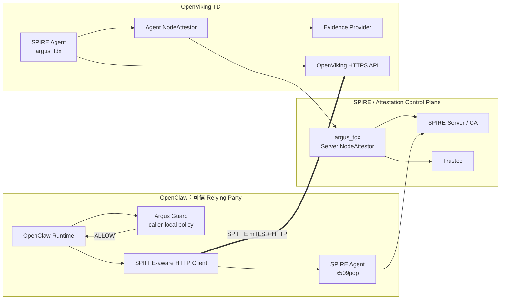
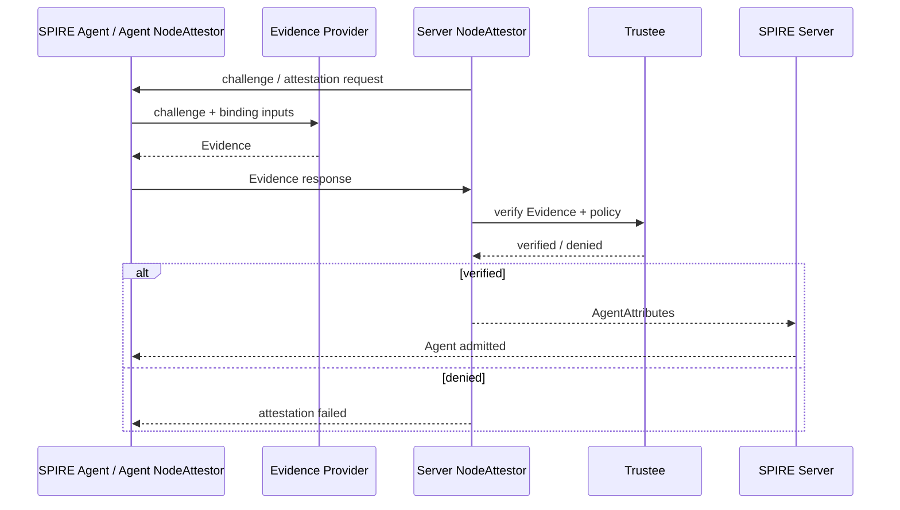
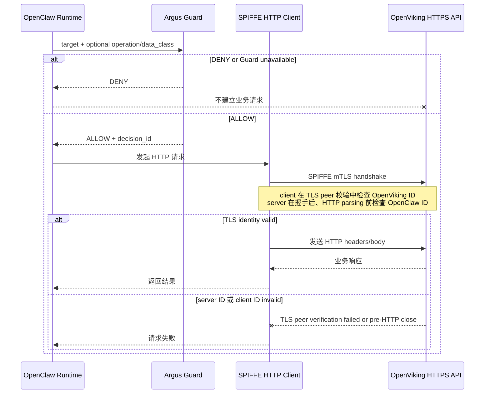

# Argus 非对称 Attestation-backed SPIFFE 架构

> Status: Source Implementation Complete / Remote Validation Pending
>
> Scope: OpenClaw 作为可信 Relying Party，OpenViking 作为被证明服务
>
> Trust Domain: `argus.local`

## 1. 文档目的与阶段边界

本方案将 Argus Initial 的 RATS 模型与 SPIFFE/SPIRE 结合，解决逐请求远程证明开销较大的问题：OpenViking 先通过远程证明取得 SPIFFE 身份，OpenClaw 在运行时通过 Guard 和 SPIFFE mTLS 决定是否向该身份发送敏感数据。

当前阶段采用非对称设计：

- OpenViking 使用 `argus_tdx` NodeAttestor，目标是由 TDX Attestation 支撑其 SVID。
- OpenClaw 使用 `x509pop` 加入 SPIRE，不部署 Evidence Provider，也不做 TDX 证明。
- OpenClaw 侧 Argus Guard 负责 caller-local `ALLOW/DENY`。
- 运行时不再逐请求获取 Quote。

当前仓库仍处于 **Mock RA**：Mock Evidence Provider 和 Mock Trustee 只验证 NodeAttestor 协议、身份签发和业务链路，不代表真实 Quote、QGS 或生产 Trustee 已完成。Real RA 是后续升级，不是当前完成条件。

## 2. 核心架构决策

| 事项 | 当前决策 |
|---|---|
| Attestation | 只证明 OpenViking 一侧 |
| OpenClaw Agent | `x509pop` |
| OpenViking Agent | `argus_tdx` |
| Relying Party | OpenClaw Runtime、Argus Guard 和 SPIFFE-aware HTTP Client 共同组成 |
| Guard 位置 | OpenClaw caller side |
| OpenViking Guard | 不部署 |
| 运行时认证 | 双向 SPIFFE mTLS，双方校验精确 SPIFFE ID |
| 业务通信 | OpenClaw 原生 HTTP client 到 OpenViking 原生 HTTPS server |
| Quote 频率 | Node Attestation 时获取；不与每个 HTTP 请求绑定 |
| 业务授权 | API key、scope 等应用授权继续保留 |

这里的“非对称”只指 **远程证明不对称**。两侧仍然都有 SPIFFE 身份，并通过 mTLS 双向认证。

### 2.1 当前非目标

当前阶段不实现：

- OpenClaw 侧 Evidence Provider 或 TDX Attestation。
- OpenViking 侧 Argus Guard。
- 每请求 fresh Quote。
- method、path、body hash、request digest 绑定。
- TLS exporter、证书哈希或 Guard receipt 与单条 TLS 连接的密码学绑定。
- 独立 egress/ingress proxy、Envoy 或 service mesh 作为目标架构组件。
- 对已失陷 OpenClaw Runtime、插件或 Guard 的防护。
- Docker 管理员级攻击、双 TD、多 trust domain 和复杂动态策略系统。

平台网络隔离、Docker Gate 等能力可以单独保留，但不作为本方案成立或完成的前提。

## 3. RATS 角色与总体架构

本方案包含两个不同阶段的 Relying Party，不能混为一谈。

| 阶段 | Attester / Subject | Verifier | Relying Party |
|---|---|---|---|
| OpenViking Node 准入 | OpenViking TD、SPIRE Agent、Evidence Provider | Trustee | SPIRE Server `argus_tdx` NodeAttestor |
| 运行时服务访问 | OpenViking workload SVID | SPIRE CA 和 SPIFFE TLS 验证 | OpenClaw Runtime、Guard 和 HTTP Client |



## 4. 身份模型

### 4.1 身份配置

| 对象 | Node Attestation | Workload SPIFFE ID |
|---|---|---|
| OpenClaw | `x509pop` | `spiffe://argus.local/agent/openclaw` |
| OpenViking | `argus_tdx` | `spiffe://argus.local/service/openviking-cmem` |

两侧必须使用独立的：

- SPIRE Agent data directory。
- Workload API socket。
- Agent parent identity。
- Workload registration entry 和 selectors。

初始 workload SVID TTL 可以使用当前配置的 600 秒，但该 TTL 只表示证书有效期，不表示每 600 秒重新执行一次 TDX Attestation。

### 4.2 从 Attestation 到 workload identity

OpenViking 的信任转换为：

```text
TDX Evidence
  -> Trustee 验证
  -> SPIRE Server 接受 OpenViking Agent
  -> WorkloadAttestor 识别 OpenViking workload
  -> SPIRE Server CA 签发 OpenViking workload SVID
```

因此当前最大声明是 **node-rooted attested workload identity**：Node Attestation 证明 Agent 所在环境，WorkloadAttestor 再识别本地工作负载。除非未来把镜像、实例和启动声明绑定进 Quote 并交叉验证，否则不声明 Quote 直接证明了某个应用进程。

## 5. 控制面链路

### 5.1 OpenClaw Agent 准入

OpenClaw Agent 使用 SPIRE 内置 `x509pop`：

1. OpenClaw SPIRE Agent 使用预配置 X.509 凭据加入 SPIRE Server。
2. SPIRE Server 接受该 Agent。
3. WorkloadAttestor 根据 selectors 识别 OpenClaw Runtime。
4. SPIRE Server CA 签发 OpenClaw client SVID。

该流程只提供普通 SPIFFE 身份，不产生 TDX 可信声明。

### 5.2 OpenViking Node Attestation



当前 Mock RA 使用 Mock Evidence Provider 和 Mock Trustee 走通同一协议。目标 Real RA 才会实际调用 TDX Quote/QGS 和生产 Trustee。

### 5.3 OpenViking workload SVID

Agent 准入后：

1. OpenViking Runtime 访问自己的 Workload API socket。
2. WorkloadAttestor 返回与 registration entry 匹配的 selectors。
3. SPIRE Server CA 签发 `spiffe://argus.local/service/openviking-cmem` SVID。
4. OpenViking HTTPS server 使用该 SVID 提供 mTLS。

SPIRE Agent 负责代理 Workload API 和 SVID 轮换，但签发者是 SPIRE Server CA。

## 6. 运行时敏感 HTTP 链路

Guard 和 SPIFFE TLS 各自只负责一层：

- Guard：判断 OpenClaw 是否允许访问配置的目标服务和操作。
- SPIFFE-aware HTTP Client：验证真实 TLS peer 是否为期望的 OpenViking SPIFFE ID。

默认链路不要求 Guard 读取实际 TLS 证书或连接上下文：



TLS 握手和 peer identity 校验发生在 HTTP application data 发送之前。因此在可信 OpenClaw 模型下，不需要自定义 Transport Adapter 暂停并复用一条 TLS 连接，也不需要把 `PeerContext` 交给 Guard 重复验证。

HTTP client 不应自动跟随到未配置 origin 或 SPIFFE ID 的重定向。若业务必须支持重定向，应对新目标重新执行 Guard 与 TLS 目标校验。

## 7. 组件职责

| 组件 | 必须负责 | 不负责 |
|---|---|---|
| OpenClaw Runtime | 识别敏感操作；先调用 Guard；只在 ALLOW 后调用 SPIFFE client | 远程证明、证书验证实现 |
| Argus Guard | caller-local policy、`ALLOW/DENY`、审计关联 | Quote、证书链、SVID 有效期和 HTTP body 验证 |
| SPIFFE HTTP Client | Workload API、client SVID、精确 server ID、TLS | caller-local 业务策略 |
| OpenClaw SPIRE Agent | `x509pop` 准入和 client SVID 交付 | TDX Evidence |
| Evidence Provider | 收集并绑定 OpenViking Evidence | `ALLOW/DENY` 和业务 HTTP |
| `argus_tdx` NodeAttestor | challenge/response、Trustee 调用、Agent 准入 | workload SVID 签发 |
| Trustee | 验证 Evidence 和 attestation policy | SPIFFE workload selectors |
| OpenViking SPIRE Agent | Node Attestation、Workload API、SVID 轮换 | 业务授权 |
| OpenViking HTTPS API | server SVID、精确 client ID、业务 API 授权 | caller-side Guard |

## 8. Guard 最小契约

### 8.1 Mode

Rust Guard 新增：

```text
GUARD_MODE=spiffe_identity
```

该名称表示策略基于已配置的 SPIFFE 服务身份，不表示 Guard 自己验证 SVID 证书。

### 8.2 请求

```json
{
  "request_id": "req-123",
  "caller_spiffe_id": "spiffe://argus.local/agent/openclaw",
  "target_spiffe_id": "spiffe://argus.local/service/openviking-cmem",
  "target_service": "openviking-cmem",
  "target_origin": "https://openviking:1943",
  "operation": "memory.write",
  "data_class": "sensitive"
}
```

要求：

- caller、target 和 origin 必须来自固定 OpenClaw 集成或受控配置。
- `operation`、`data_class` 在真实 API 映射确认后启用；当前可以作为可选字段。
- 不接收 certificate、SVID validity、Quote、TLS exporter、method/path/body hash。
- 当前信任模型明确相信 OpenClaw 不伪造这些 caller-local 字段。

### 8.3 响应

```json
{
  "request_id": "req-123",
  "decision": "ALLOW",
  "reason": "matched caller-local SPIFFE authorization policy",
  "decision_id": "...",
  "expires_at_unix": 1786000030,
  "policy_id": "argus-asymmetric-openviking-v1",
  "rule_id": "openclaw-to-openviking-cmem"
}
```

`decision_id` 只用于日志关联，不是可转让授权令牌。Guard 异常、超时、未知目标和策略不匹配都必须 fail-closed。

### 8.4 初始 Policy

当前必须检查：

- 精确 OpenClaw caller SPIFFE ID。
- 精确 OpenViking target SPIFFE ID。
- `target_service` 与 `target_origin` 映射。

当前固定映射为 `memory.read`、`memory.write`、`memory.delete` 和
`sensitive`；OpenClaw transport 按 HTTP method 提供默认映射，也允许通过受控
path-prefix 配置覆盖。请求字段在 schema 中仍可选，但当前规则要求二者存在并匹配。

## 9. 生命周期与失败语义

以下时间概念彼此独立：

| 概念 | 含义 |
|---|---|
| Node Attestation age | OpenViking Agent 上次通过证明的时间 |
| Workload SVID TTL | workload 证书有效期 |
| mTLS connection age | 已建立连接的持续时间 |
| Guard decision TTL | caller-local 策略决定的短期有效期 |

SVID 轮换不等于重新执行 TDX Quote。重新证明由 Node Attestation 生命周期和策略单独决定。

最小失败语义：

| 失败 | 结果 |
|---|---|
| Evidence Provider / Trustee 拒绝 | OpenViking Agent 不准入，不签发 workload SVID |
| OpenViking workload selectors 不匹配 | 不签发目标 SVID |
| Guard DENY、超时或不可用 | 不发起业务请求 |
| server SPIFFE ID 不匹配 | TLS 握手失败，不发送 HTTP body |
| client SPIFFE ID 不匹配 | 证书链握手后，OpenViking 在 HTTP parsing 前关闭连接 |
| SVID 过期且轮换失败 | 新连接失败 |
| API key/scope 无效 | OpenViking 应用层拒绝 |

Agent eviction 会阻止后续 SVID 获取，但不会自动关闭已有连接或立即撤销已签发证书。当前阶段只需要验证这一基本生命周期边界，不引入即时撤销系统。

## 10. 信任模型与声明边界

### 10.1 当前信任假设

当前方案信任：

- OpenClaw Runtime、固定 Guard client 和 SPIFFE HTTP client。
- Argus Guard 本身及其 caller-local 配置。
- SPIRE Server、CA、两侧 SPIRE Agent 和 WorkloadAttestor。
- Trustee 和 attestation policy。
- 目标 Real RA 中的 OpenViking TD、QGS 和 Evidence Provider 实现。

当前主要解决：

- 未经证明的 OpenViking Agent 不能取得目标服务 SVID。
- OpenClaw 不把敏感数据发送给错误的服务身份。
- caller-local policy 拒绝的操作不进入业务链路。

当前不声称防御可信组件已经被攻破，也不把容器或主机管理员攻击纳入完成标准。

### 10.2 可声明结果

当前 Mock RA 完成后可以声明：

> 非对称 NodeAttestor 协议、双 Agent 身份、Guard 门控和 SPIFFE mTLS 业务链路在远程环境中完成软件级验证。

完成 Real Quote/QGS/production Trustee 之后，才可以声明：

> OpenViking 服务身份由真实 TDX remote attestation 结果支撑，OpenClaw 通过该身份复用证明结果进行运行时访问。

任何阶段都不能把 SVID 轮换描述为一次新的 Quote 验证。

## 11. 当前仓库状态与缺口

| 能力 | 当前状态 |
|---|---|
| `argus_tdx` Agent/Server NodeAttestor | 已实现协议和 Mock 链路 |
| OpenClaw `x509pop` / OpenViking `argus_tdx` 双 Agent | 已有 v2 配置和运行基线 |
| 独立 data、Workload API、registration | 已有基线 |
| SPIFFE mTLS | 已切换为 OpenClaw/OpenViking 应用容器直接持有和使用 SVID；远程待验证 |
| Rust Guard | 已增加 `spiffe_identity`、YAML policy 和 `/guard/v1/authorize`；远程待验证 |
| OpenClaw 原生 SPIFFE HTTP client | 已实现进程内 fetch preload、Guard fail-closed、精确 server ID 和轮换凭据加载；远程待验证 |
| OpenViking 原生 SPIFFE HTTPS server | 已实现原生 ASGI mTLS listener、精确 client ID 和轮换 TLS context；远程待验证 |
| SPIRE 目录结构 | 已重排为 `components/plugins/runtime/tests/compatibility`；旧 proxy hardening 已移入 compatibility |
| Real Quote/QGS/production Trustee | Deferred |

源码中的目标 Compose 已移除业务 proxy service；旧 proxy 只保留在 compatibility
目录，并提供仅删除两个明确旧容器的迁移脚本。以上状态是本地源码完成状态，不是远程
运行通过或生产验收结论。

## 12. 验收与完成定义

### 12.1 执行环境

- 本地 Windows 只进行文档编辑、代码阅读和静态检查。
- 所有 `go test`、`cargo check`、`cargo test`、脚本、容器和 E2E 验证，均在用户同步仓库后的指定远程主机执行。
- 本方案不要求 Codex 从本机直接 SSH 到远程主机。

### 12.2 当前 Mock RA 完成条件

1. Mock Evidence/Trustee 成功时，OpenViking Agent 准入并取得目标 workload SVID。
2. Mock 验证失败时，OpenViking Agent 不准入，也不取得目标 SVID。
3. OpenClaw 与 OpenViking 取得各自精确 SPIFFE ID，且无关 workload 不能取得这些身份。
4. Guard `spiffe_identity` 对合法目标 ALLOW，对未知目标、异常和超时 DENY。
5. OpenClaw 原生 client 和 OpenViking 原生 server 完成双向 SPIFFE mTLS。
6. 错误 server SPIFFE ID 导致 client peer verification 失败；错误 client SPIFFE ID
   由 OpenViking 在 HTTP parsing 和业务处理前关闭连接。
7. Guard DENY 时不发送业务请求；ALLOW 且 mTLS 通过时敏感 HTTP API 成功。
8. SVID 到期、轮换失败和 Agent eviction 的基本行为符合第 9 节边界。

### 12.3 Real RA 后续条件

Real RA 升级另行验收：

- 真实 TDX Quote 和 QGS。
- 生产 Trustee/Verifier 与正式 policy。
- challenge、attestation key 和必要 runtime claims 的绑定。
- Quote、TCB、policy、replay 和 Trustee 故障矩阵。

这些项目不阻塞当前非对称 Mock RA 架构落地。

## 13. 参考

- [实施方案](./Argus-Asymmetric-Attestation-SPIFFE-Implementation-Plan.md)
- [Argus Initial](./archive/pre-asymmetric-architecture/argus-inital.md)
- [Argus-SPIFFE Integration](./archive/pre-asymmetric-architecture/Argus-SPIFFE-Integration.md)
- [Agent-CC](./archive/pre-asymmetric-architecture/Agent-CC.pdf)
- [`argus_tdx` NodeAttestor protocol](../core/spire/plugins/argus-tdx-nodeattestor/proto/argus/spire/nodeattestor/v1/nodeattestor.proto)
- [`argus_tdx` Agent plugin](../core/spire/plugins/argus-tdx-nodeattestor/internal/agent/plugin.go)
- [`argus_tdx` Server plugin](../core/spire/plugins/argus-tdx-nodeattestor/internal/server/plugin.go)
- [Rust Guard](../core/argus/src/bin/guard.rs)
- [SPIRE asymmetric runtime](../core/spire/runtime/asymmetric/README.md)
