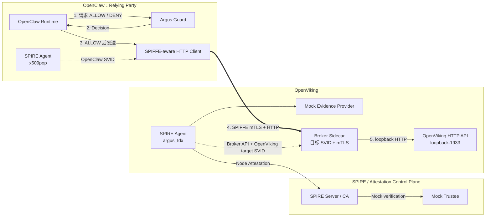

# Argus 非对称 Attestation-backed SPIFFE 评估方案

> 对应架构：[Argus-Asymmetric-Attestation-SPIFFE-Architecture.md](./Argus-Asymmetric-Attestation-SPIFFE-Architecture.md)
>
> 实施方案：[Argus-Asymmetric-Attestation-SPIFFE-Implementation-Plan.md](./Argus-Asymmetric-Attestation-SPIFFE-Implementation-Plan.md)
>
> 当前评估环境：Mock Evidence Provider + Mock Trustee
>
> 评估状态：Broker Sidecar 资源/SVID 采集适配待完成；不属于本次 A-F 功能验收

## 1. 文档目的

本文定义当前 Argus 非对称 SPIFFE/SPIRE 实现的性能、资源与容量评估方法。

当前阶段不再重复评估 OpenViking 身份冷启动，也不把 replay、Provider 503、
Trustee 503 和 timeout 故障矩阵作为性能实验。上述内容属于功能与 fail-closed
验收前置条件。

本轮评估聚焦以下问题：

1. Argus Guard 为每次敏感请求增加多少延迟和资源开销；
2. SPIFFE mTLS 握手和连接复用分别带来多少开销；
3. 完整 OpenClaw 到 OpenViking 链路可以稳定处理多少 QPS、并发和连接；
4. SVID 轮换是否影响持续业务；
5. 业务请求增长时，Node Attestation 和 Trustee 请求是否保持与业务请求解耦。

本文只定义实验方法，不包含尚未测得的性能数字或生产容量承诺。

## 2. 评估边界

### 2.1 当前纳入

- 单个 OpenClaw 实例；
- caller-local Rust Argus Guard，`GUARD_MODE=spiffe_identity`；
- OpenClaw 进程内 fetch preload 和原生 SPIFFE HTTPS client；
- 单个已经完成 Node Attestation 的 OpenViking 服务；
- OpenViking Broker Sidecar SPIFFE mTLS server 与回环 HTTP upstream；
- OpenClaw `x509pop` SPIRE Agent；
- OpenViking `argus_tdx` SPIRE Agent；
- Mock Evidence Provider 和 Mock Trustee；
- Guard、mTLS、完整业务链路、SVID 轮换和证明摊销评估；
- 各组件及主机的 CPU、内存、QPS、并发、连接和错误指标。

### 2.2 当前不纳入

- 反复执行 OpenViking 身份冷启动性能测试；
- 对 replay、503 和 timeout 故障矩阵进行重复压力测试；
- 真实 TDX Quote、QGS 和 production Trustee 性能；
- 真实 TCB、measurement 或 RTMR 判定能力；
- 周期性 re-attestation；
- 多 OpenViking、跨区域或多 SPIRE Server 容量；
- 对已失陷 OpenClaw、插件或 Guard 的额外防护评估；
- 生产级容量和安全性结论。

Mock 环境可以评估软件数据路径、身份复用、资源开销和系统容量，但不能说明真实
TDX 证明需要多少时间，也不能证明真实 Evidence 的安全性。

## 3. 被测链路



正式结果以完整的 `OpenClaw -> Guard -> SPIFFE mTLS -> OpenViking` 链路为准。
不经过 Guard 的 mTLS 请求只能作为传输诊断基线。

高并发实验应调用确定性的 OpenViking API，避免模型网关响应时间成为主要噪声。
完整 `commit/archive` 流程保留为低频业务验收，不作为主要压测流量。

## 4. 统一评估方法

### 4.1 负载模型

E3 到 E5 使用两类负载：

1. 固定并发：逐步增加并发，观察实际 QPS、延迟和资源；
2. 固定目标 QPS：逐步提高目标 QPS，观察稳定吞吐和容量拐点。

首轮可以采用以下探索性并发阶梯：

```text
1 -> 4 -> 8 -> 16 -> 32 -> 64
```

每档负载包含预热、稳定采样和冷却三个阶段。具体持续时间和最高负载由远程主机
资源决定，并记录到 run manifest，不提前写成生产 SLO。

### 4.2 通用请求指标

每档负载至少记录：

```text
requested_qps
achieved_qps
concurrency
request_count
request_success_rate
request_latency_p50_ms
request_latency_p95_ms
request_latency_p99_ms
timeout_rate
4xx_rate
5xx_rate
```

### 4.3 通用资源指标

| 组件 | 主要指标 |
|---|---|
| OpenClaw | CPU、RSS、FD、socket、Node.js heap（可获取时） |
| Argus Guard | CPU、RSS、FD、请求 QPS、in-flight、ALLOW/DENY/error |
| OpenClaw SPIRE Agent | CPU、RSS、FD、Workload API 和 SVID 错误 |
| OpenViking SPIRE Agent | CPU、RSS、FD、Workload API 和 SVID 错误 |
| SPIRE Server | CPU、RSS、goroutine、FD、签发与 NodeAttestor 指标 |
| OpenViking | CPU、RSS、线程、FD、QPS、in-flight、active connections |
| Mock Evidence Provider | CPU、RSS、请求数和错误数 |
| Mock Trustee | CPU、RSS、请求数和错误数 |
| 远程主机 | 总 CPU、内存、swap、磁盘 IO、网络吞吐、TCP retransmit |

资源数据应和负载窗口使用同一个 `run_id` 和时间轴，至少输出平均值、P95 或峰值，
从而能够判断延迟变化对应的是 Guard、OpenViking、SPIRE 还是主机资源饱和。

## 5. E3：Argus Guard 性能与开销

### 5.1 目标

评估正常 ALLOW 路径中的 Guard 决策延迟、吞吐、并发能力和资源开销，并确认
Guard 失败或 DENY 时不会发送业务请求。

### 5.2 时间点

```text
G0 = OpenClaw 开始调用 Guard
G1 = OpenClaw 收到并验证完整 Guard Decision
G2 = ALLOW 后开始发送 SPIFFE mTLS 请求
G3 = OpenClaw 收到 OpenViking 最终响应
```

```text
guard_decision_ms      = G1 - G0
guard_to_send_ms       = G2 - G1
guarded_request_e2e_ms = G3 - G0
```

跨进程时间由同一个 benchmark controller 使用 monotonic clock 记录，不依赖不同
容器的 wall clock 相减。

### 5.3 指标

- Guard decision P50/P95/P99；
- Guard achieved QPS 和 in-flight 峰值；
- ALLOW、DENY、timeout、malformed 和 error 数量；
- Guard CPU、RSS 和 FD；
- `decision_id` 与业务 `request_id` 的审计关联率；
- Guard DENY 或失败后仍然发送业务 body 的次数。

正确性约束：

```text
guard_deny_forwarded_count = 0
guard_failure_forwarded_count = 0
```

本实验不重新运行完整故障矩阵，只在开始正式采样前确认基础 fail-closed 行为。

## 6. E4：SPIFFE mTLS 连接开销

### 6.1 目标

比较每请求新建 mTLS 连接和 keep-alive 连接复用的成本。当前正式 Profile 以
keep-alive 为主，新连接模式只用于测量握手成本。

### 6.2 实验 Profile

| Profile | 行为 | 用途 |
|---|---|---|
| `guarded_new_connection` | 每个请求建立新 mTLS 连接 | 握手开销诊断 |
| `guarded_keepalive` | 复用 mTLS 连接 | 正式数据路径 |
| `diagnostic_mtls_only` | 不经过 Guard | 仅作为传输诊断基线 |

### 6.3 指标

- mTLS handshake P50/P95/P99；
- 完整请求 P50/P95/P99；
- active connections；
- new connections/s；
- connection reuse ratio；
- TLS handshake、peer SPIFFE ID、certificate、reset 和 timeout 错误；
- OpenClaw/OpenViking CPU、RSS、FD 和 socket；
- 网络吞吐与 TCP retransmit。

主要输出是 keep-alive 相对于新连接模式的延迟、CPU 和连接开销变化，不把
`diagnostic_mtls_only` 当作正式业务性能结果。

## 7. E5：完整业务链路容量

### 7.1 目标

评估单 OpenClaw、单 OpenViking 条件下完整受保护链路的稳定 QPS、并发、连接数、
延迟和资源曲线，并定位当前环境中的容量拐点和主要瓶颈。

### 7.2 指标

- requested/achieved QPS；
- 并发请求数和 active mTLS connections；
- 请求成功率及 P50/P95/P99；
- timeout、4xx、5xx 和 connection reset；
- Guard decision QPS 和延迟；
- 各组件 CPU、RSS、FD、线程或 goroutine；
- 主机内存、swap、网络和磁盘 IO。

### 7.3 容量输出

结果应输出负载阶梯曲线，而不是只报告一个最大 QPS：

```text
QPS / concurrency
  -> P50/P95/P99
  -> success/error rate
  -> active connections
  -> component CPU/RSS/FD
  -> host CPU/memory/network
```

```text
max_stable_qps
  = 在本次 run manifest 指定的延迟、错误率和资源限制内，
    能持续运行的最高 achieved QPS

capacity_knee
  = 延迟开始明显上升、吞吐增益下降或组件资源接近饱和的负载档位
```

首轮实验先形成曲线和瓶颈证据，再根据结果冻结后续 SLO，不在测试前假设生产容量。

## 8. E6：SVID 轮换期间的业务稳定性

### 8.1 目标

在持续业务流量下跨越至少三个 SVID TTL 周期，验证 SVID 自动轮换是否造成请求
中断、新连接失败、延迟峰值或额外 Trustee 请求。

### 8.2 方法

- 使用 `guarded_keepalive` 维持中等稳定负载；
- 记录每次 SVID 的 SPIFFE ID、serial、NotBefore 和 NotAfter；
- 同时观察复用连接，并在轮换前后主动建立新连接；
- 记录轮换窗口内各组件资源和错误变化；
- 对比 NodeAttestor 和 Trustee 请求计数器。

### 8.3 指标

```text
svid_rotation_count
svid_rotation_success_rate
rotation_interruption_ms
requests_failed_during_rotation
new_connection_failures_during_rotation
latency_spike_during_rotation
cpu_spike_during_rotation
trustee_requests_during_rotation
```

预期行为：

```text
requests_failed_during_rotation = 0（目标值）
trustee_requests_during_rotation = 0
```

Workload SVID 轮换不是重新远程证明。该实验只评估身份材料更新与业务连续性。

## 9. E7：远程证明摊销效果

### 9.1 目标

验证业务请求、SVID 轮换和远程证明已经解耦。E7 复用 E5、E6 的请求和 SPIRE
计数器，不再单独启动一套高负载环境。

### 9.2 指标

```text
business_requests_per_attestation
  = 成功业务请求数 / 成功 Node Attestation 次数

trustee_requests_per_1000_business_requests
  = Trustee 请求数 / 成功业务请求数 * 1000

business_requests_per_svid
  = 成功业务请求数 / 实际使用的 Workload SVID 数

trustee_requests_per_svid_rotation
  = Trustee 请求数 / SVID 轮换次数
```

预期关系是：业务请求量增加不会导致 Node Attestation 或 Trustee 请求线性增加，
SVID 轮换也不会触发新的 Trustee 验证。

可以附带计算：

```text
mock_identity_overhead_per_request
  = mock attestation 软件耗时 / 成功业务请求数
```

该数值只表示 mock 软件链路的摊销，不能代替真实 Quote/QGS/Trustee 的时间收益。
当前最有意义的结果是证明调用次数已经解耦，而不是声称节省了多少真实 RA 时间。

## 10. 数据采集与结果格式

当前不要求先搭建完整 Prometheus、Grafana 或告警平台。评估层至少需要：

1. 统一 benchmark runner；
2. 支持目标 QPS 和固定并发的请求生成器；
3. G0-G3 monotonic timing；
4. SPIRE metrics endpoint 定时抓取；
5. 容器和进程 CPU、RSS、FD、连接采样；
6. 主机 CPU、内存、磁盘和网络采样；
7. JSONL 原始记录和 Markdown 汇总报告。

### 10.1 当前实现入口

评估工具位于：

```text
core/spire/benchmarks/asymmetric/
  run.sh                    E3-E7 编排和远程运行入口
  load-generator.mjs       Guard、正式 keep-alive、新连接和 mTLS-only 负载
  collector.py             主机、容器、TD Guest、SPIRE、Guard、连接和 SVID 采样
  report.py                JSON/Markdown 聚合与 E7 摊销计算
  test_*.py / *.test.mjs   结果解析和公共 CLI 行为测试
```

正式远程入口为：

```bash
bash core/spire/runtime/asymmetric/scripts/remote-benchmark.sh all
```

Rust Guard 通过 `/metrics` 暴露 decision counter、in-flight 和 decision latency
histogram；OpenClaw preload 在评估进程设置 `ARGUS_SPIFFE_TELEMETRY=1` 时发出
G0-G3 事件。默认业务运行不启用逐请求评估事件。

每次运行必须保存：

```text
run_id
Git commit
远程主机与组件版本
Mock RA / Mock Trustee 标识
实验 Profile
目标 QPS 和并发
预热、采样和冷却时长
SVID TTL
请求与错误原始记录
SVID serial 和有效期
SPIRE/Trustee 计数器
资源时间序列
汇总结果
```

建议每个负载窗口生成统一记录：

```json
{
  "experiment": "E5",
  "profile": "guarded_keepalive",
  "requested_qps": 100,
  "achieved_qps": null,
  "concurrency": 16,
  "success_rate": null,
  "latency_ms": {
    "p50": null,
    "p95": null,
    "p99": null
  },
  "connections": {
    "active_peak": null,
    "new_per_second": null
  },
  "resources": {
    "openclaw_cpu_avg": null,
    "guard_cpu_avg": null,
    "openviking_cpu_avg": null,
    "spire_server_cpu_avg": null,
    "openclaw_rss_peak_mb": null,
    "guard_rss_peak_mb": null,
    "openviking_rss_peak_mb": null
  },
  "attestation": {
    "node_attestation_attempts": null,
    "trustee_requests": null,
    "svid_rotations": null
  }
}
```

`null` 表示尚未执行实验，不得用目标值或配置值填充测量结果。

## 11. 建议执行顺序

1. 确认当前非对称链路功能验收仍通过；
2. E3：建立 Guard latency/QPS/resource 基线；
3. E4：比较新建连接与 keep-alive；
4. E5：运行完整链路负载阶梯，定位容量拐点；
5. E6：在稳定负载下跨越至少三个 SVID TTL；
6. E7：汇总业务请求、Node Attestation、Trustee 和 SVID 计数器；
7. 生成带证据边界的最终评估报告。

## 12. 后续可扩展方向

真实业务中可能出现多个 OpenClaw 访问一个或少量 Agent Service（例如
OpenViking）的多对一拓扑。后续可以在当前单对单基线之上，逐步增加独立
OpenClaw Deployment Unit，评估 Guard 总吞吐、SPIRE Agent 和 Workload API
资源、mTLS 连接数、Agent Service 容量以及共享 SPIRE Server 的瓶颈。

该方向不属于当前评估范围。开始实施前需要提供独立 Unit launcher，为每个
OpenClaw 创建独立 Agent 身份、数据目录、Workload API socket、注册项和指标标识，
不能直接把当前固定 Compose 当作多实例容量环境。

## 13. 结果声明边界

当前评估可以形成以下结论：

- Guard、SPIFFE mTLS 和完整业务链路的软件开销；
- 当前远程主机上的 QPS、并发、连接和资源容量曲线；
- SVID 轮换期间的业务连续性；
- 远程证明次数是否与业务请求量解耦。

当前评估不能形成以下结论：

- 真实 TDX Quote 或 QGS 性能；
- production Trustee 和真实 TCB 验证性能；
- 真实远程证明节省的绝对时间；
- 多 OpenClaw、多 Agent Service 或生产环境容量；
- 生产级安全性和可用性承诺。

所有结果必须明确标记为 Mock RA / Mock Trustee 下的远程主机实测数据。
