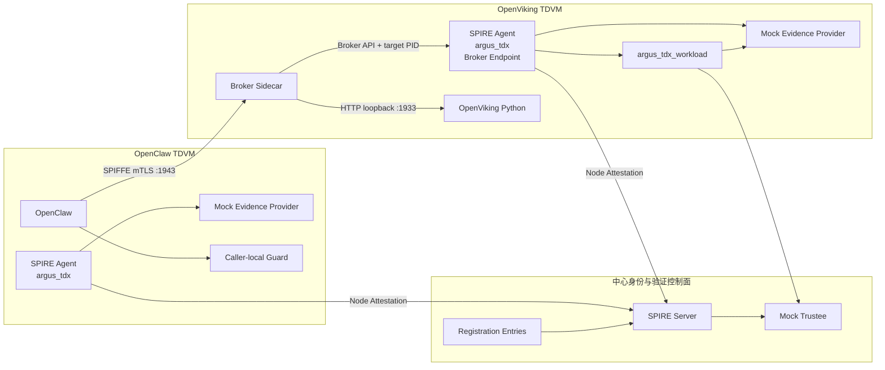

# Argus 双 TDVM + OpenViking Broker Sidecar 架构

> 状态：当前唯一目标架构
>
> 当前实现边界：统一 Profile 已完成代码集成与本地静态验证，远程双 TDVM 验收待执行
>
> 当前 Mock：两个 TDVM 的 Evidence Provider、中心 Trustee

## 1. 架构目标

系统需要同时满足两个目标：

1. OpenClaw 与 OpenViking 分别运行在独立 TDVM 中，拥有独立的 SPIRE Agent、
   Agent data、Workload API 和运行数据；
2. OpenViking 上游 Python 源码保持不变，不调用 Workload API、不持有 SVID，
   由 OpenViking TDVM 内的 Broker Sidecar 代表实际 Python PID 完成 Workload
   Attestation 和入站 mTLS。

最终验证命题是：

> 当前由 Broker 引用的进程，是否位于已经通过 Node Attestation 的 OpenViking
> TDVM 中，并且是通过可信启动链路运行、满足预期条件的 OpenViking workload。

## 2. 总体拓扑

中心控制面不运行 OpenClaw、OpenViking 或 Broker Sidecar，也不挂载两个 TDVM
的 Workload API、Docker socket 或业务数据。

## 3. 组件与身份

| 组件 | 身份与职责 |
|---|---|
| OpenClaw TDVM Agent | 独立 `argus_tdx` Agent，完成本 TDVM Node Attestation |
| OpenClaw | `spiffe://argus.local/agent/openclaw`；调用本地 Guard 并发起 mTLS |
| OpenViking TDVM Agent | 独立 `argus_tdx` Agent；提供 Workload API、Broker Endpoint 和 WorkloadAttestor |
| OpenViking Python | 被验证进程；不直接持有 SPIFFE 身份材料 |
| Broker Sidecar | `spiffe://argus.local/infra/openviking-broker`；引用 OpenViking PID 并代理入站 mTLS |
| OpenViking 目标身份 | `spiffe://argus.local/service/openviking-cmem`；只由 Sidecar 在内存中使用 |
| `argus_tdx_workload` | 对 Broker 引用的 PID 收集和验证 workload 证据，成功后返回可信 selectors |
| SPIRE Server | 按 Parent ID 和静态 Registration Entry 匹配并签发 SVID |

两个 TDVM 使用不同的 Agent attestation key、Agent ID、Parent ID、Docker daemon、
Workload API socket 和持久化目录。

## 4. 完整时序

### A. 两个 TDVM 分别建立节点信任

OpenClaw TDVM 和 OpenViking TDVM 的 SPIRE Agent 分别通过 `argus_tdx` 执行
Node Attestation。当前两个本地 Evidence Provider 和中心 Trustee 为 Mock。

任一 TDVM 的 Node Attestation 失败，只阻止该 TDVM Agent 及其子 workload 获得身份。

### B. OpenClaw 获得调用方身份

OpenClaw 通过自己 TDVM 内的 Workload API 获得
`spiffe://argus.local/agent/openclaw`。该身份只属于 OpenClaw，不与 OpenViking
TDVM 共享 socket、私钥或 Agent Parent。

### C. TC-API 启动 OpenViking

OpenViking TDVM 内由 TC-API 启动未修改的 OpenViking Python 容器，并形成与本次启动
关联的度量/审计记录。Launcher 取得实际 container ID 和 Agent 可见的宿主机 PID。

OpenViking 只在本 TDVM 回环地址提供 HTTP 服务，不挂载 SPIRE socket。

### D. Broker 取得自身身份

Broker Sidecar 通过 OpenViking TDVM Agent 的普通 Workload API 取得自己的 Broker
SVID。Broker 自身身份与 OpenViking 目标身份使用不同 Registration Entry。

### E. Broker 代表 OpenViking PID 请求目标身份

1. Sidecar 使用 Broker SVID 连接本 TDVM 的 Broker Endpoint；
2. Sidecar 提交 `WorkloadPIDReference`，引用当前 OpenViking PID；
3. Agent 验证 Broker 权限并对该 PID 运行 Docker/Unix 及
   `argus_tdx_workload` WorkloadAttestor；
4. WorkloadAttestor 调用 OpenViking TDVM 内的 Mock Evidence Provider，再请求中心
   Mock Trustee 裁决；
5. Trustee ALLOW 时，WorkloadAttestor 返回 `verified`、`workload_id` 和
   `policy` selectors；
6. SPIRE 使用这些 selectors、Docker selectors 和 OpenViking TDVM Agent Parent
   匹配静态 Registration Entry；
7. Entry 命中后，Broker stream 将 OpenViking 目标 SVID 交给 Sidecar。

Trustee DENY、PID 不匹配或任一必要 selector 缺失时，不交付目标 SVID。

### F. OpenClaw 调用 OpenViking

业务链路分成授权和通信两步：

1. OpenClaw 调用本 TDVM 内的 caller-local Guard；
2. Guard ALLOW 后，OpenClaw 使用自身 SVID 连接 OpenViking TDVM 的 Sidecar
   `:1943`；
3. Sidecar 验证客户端必须是精确的 OpenClaw SPIFFE ID；
4. Sidecar 使用 OpenViking 目标 SVID 终止 mTLS，并把请求转发到
   `http://127.0.0.1:1933`。

Guard 不是业务代理。OpenClaw 不直接访问 OpenViking 明文端口。

## 5. Registration Entry

至少存在三个不同 Entry：

| Entry | Parent | 必需条件 |
|---|---|---|
| OpenClaw | OpenClaw TDVM Agent | OpenClaw image、label 和 config digest |
| Broker Sidecar | OpenViking TDVM Agent | Broker image、label 和 config digest |
| OpenViking target | OpenViking TDVM Agent | OpenViking image/label/digest + `argus_tdx_workload` 可信 selectors |

OpenViking target Entry 使用 `disableX509SVIDPrefetch`，让目标身份由 Broker 的
PID-reference 请求触发。Entry 本身不会从 `verified=false` 动态变成
`verified=true`。

## 6. 网络与数据边界

- 两个 TDVM 不共享 Docker daemon、Agent data、Workload API 或持久化数据；
- 跨 TDVM 业务网络只需要 OpenClaw TDVM 到 OpenViking Sidecar 的 mTLS 1943；
- OpenViking HTTP 1933 只在 OpenViking TDVM 内部回环可达；
- Broker API 和 Workload API 都只存在于 OpenViking TDVM 本地；
- OpenViking Python 不获得 SVID、私钥或 SPIRE socket；
- Sidecar 的目标 SVID 私钥只保存在内存中。

这里不新增 service mesh、额外 Gateway、每请求 Quote 或请求正文证明。

## 7. 生命周期

Sidecar 持有目标进程的 pidfd。OpenViking 退出后，Sidecar 取消 Broker 订阅并退出；
新 OpenViking 进程必须使用新的 PID 重新执行完整流程。

Broker stream 的每次响应按完整身份快照处理。目标身份消失后，Sidecar 清空身份，
新的 TLS 握手失败。SVID 轮换不等同于重新执行 TDX Quote。

## 8. 当前实施状态

仓库当前已经把以下实现合并到统一 Profile：

- `core/spire/runtime/dual-tdvm`：双 TDVM、双 `argus_tdx` Agent、独立 Parent、
  Broker Endpoint、三个 Entry、TC-API 启动和统一验证入口；
- `adapters/OpenViking/broker_sidecar`、
  `core/spire/plugins/argus-tdx-workloadattestor` 和
  `core/spire/runtime/asymmetric`：Broker PID-reference 链路。

本地已经完成代码、Go 测试、配置校验和脚本静态检查。尚未完成的是在远程两台 TDVM
上执行 M3 ALLOW/DENY、双 TDVM ALLOW/DENY、Guard 与跨 TDVM mTLS 验收；在远程
报告填入实测证据前，不能声明当前组合方案已经远程跑通。

## 9. 完成标准

1. 两个独立 TDVM Agent 均完成 Mock Node Attestation，Parent ID 不同；
2. OpenClaw 只取得自己的身份；
3. OpenViking Python 无 SPIRE mount，Sidecar 引用的 PID 等于实际 OpenViking PID；
4. ALLOW 时 Sidecar 获得目标 SVID 并监听 1943；
5. DENY 时 Trustee metric 记录拒绝；Sidecar 无目标 SVID、无 ready、不监听 1943，
   并保持无身份等待状态；
6. OpenClaw 经本地 Guard ALLOW 后完成跨 TDVM mTLS；
7. 无客户端证书、错误 SPIFFE ID 和直接访问 1933 均失败；
8. OpenViking 退出后 Sidecar 因 pidfd 退出；
9. 报告明确标记 Mock Evidence Provider/Trustee，不升级为真实 TDX 结论。

## 10. 参考

- [实施与验证计划](./Argus-Dual-TDVM-Broker-Sidecar-Implementation-Plan.md)
- [Broker Sidecar 详细设计](./OpenViking-Non-Intrusive-SPIFFE-Broker-Sidecar-Plan-CN.md)
- [双 TDVM 运行 Profile](../core/spire/runtime/dual-tdvm/README.md)
- [双 TDVM 远程验证报告](./Argus-Dual-TDVM-Broker-Sidecar-Remote-Validation-Report.md)
- [Broker Sidecar](../adapters/OpenViking/broker_sidecar)
- [自定义 WorkloadAttestor](../core/spire/plugins/argus-tdx-workloadattestor)
