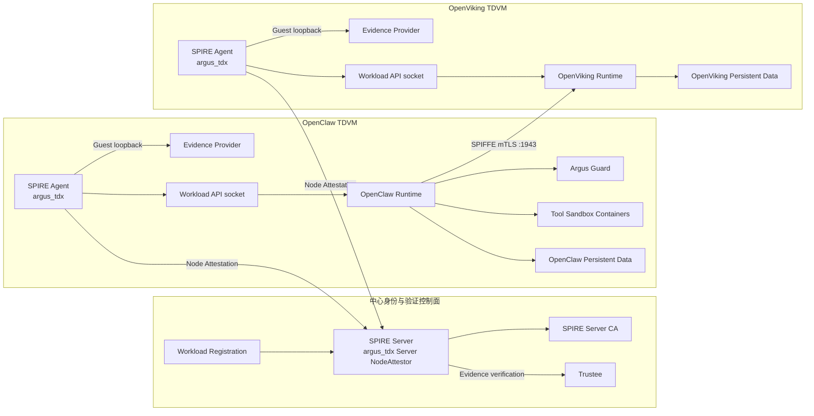
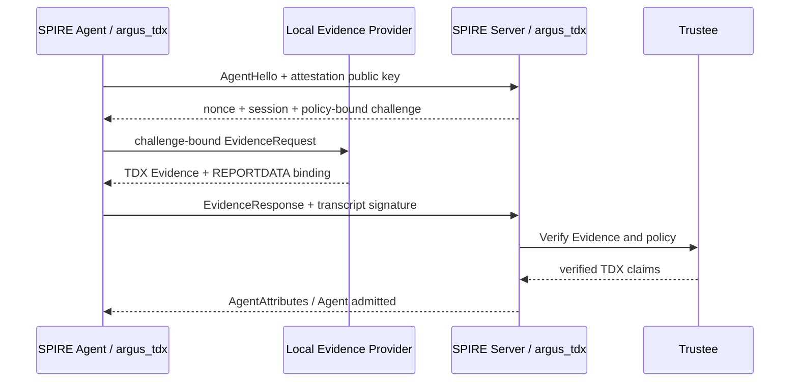
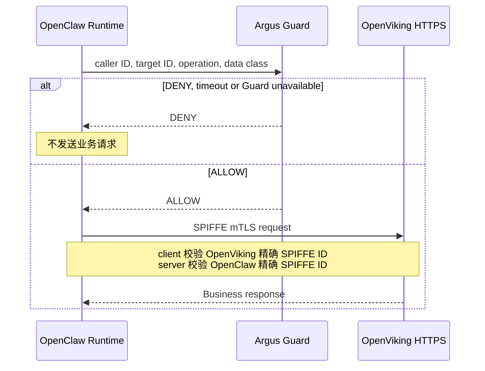

# Argus 双 TDVM Attestation-backed SPIFFE 架构设计

> 状态：备选架构；代码部署骨架已实现，尚未在双 TDVM 远程主机跑通或验收
> 范围：OpenClaw 与 OpenViking 分别运行在独立 Intel TDX TDVM 中，并取得各自独立的、由远程证明支撑的 SPIFFE workload identity
> 当前关系：不属于 Broker Sidecar 当前主线，也不作为当前方案的回退路径

对应实现位于 `core/spire/runtime/dual-tdvm/`。当前实现使用 Mock Evidence
Provider/Trustee；远程执行顺序和验收命令见该目录的 `README.md`。

## 1. 设计目标

系统由两个独立信任单元组成：

- **OpenClaw TDVM**：承载 OpenClaw Runtime、Argus Guard 和 OpenClaw 工具沙箱。
- **OpenViking TDVM**：承载 OpenViking Runtime 和记忆数据服务。

两个 TDVM 必须分别完成 TDX Node Attestation，分别取得 SPIRE Agent identity，再向本地 workload 交付独立 SVID。OpenClaw 通过 caller-local Guard 和 SPIFFE mTLS 调用 OpenViking。

目标结果：

1. OpenClaw 和 OpenViking 的运行时内存分别受各自 TDVM 保护。
2. 任一 TDVM 证明失败只影响自身身份签发，不影响另一 TDVM 已建立的身份。
3. 两个 workload 不共享 Docker socket、SPIRE Agent 数据、Workload API socket 或持久化目录。
4. OpenClaw 只向具有精确 OpenViking SPIFFE ID 的服务发送敏感请求。
5. OpenViking 只接受具有精确 OpenClaw SPIFFE ID 的客户端。

## 2. 核心架构决策

| 项目 | 决策 |
|---|---|
| 信任单元 | OpenClaw TDVM 与 OpenViking TDVM 相互独立 |
| 身份控制面 | 一个中心 SPIRE Server 和 SPIRE Server CA |
| 远程验证 | 一个独立 Trustee 服务，由 SPIRE Server 调用 |
| Node Attestation | 两个 TDVM 的 SPIRE Agent 都使用 `argus_tdx` |
| Evidence Provider | 每个 TDVM 一个，仅服务本 TDVM 的 Agent |
| Workload Attestation | 本地 Docker WorkloadAttestor + 精确 registration selectors |
| workload identity | OpenClaw 与 OpenViking 使用不同 SPIFFE ID 和不同 Agent Parent ID |
| 业务认证 | 双向 SPIFFE mTLS，双方校验精确 SPIFFE ID |
| 业务授权 | OpenClaw TDVM 内的 caller-local Argus Guard |
| Quote 生命周期 | Node Attestation 时执行，不与每个 HTTP 请求绑定 |
| TD 基线 | 两个 TDVM 优先使用同一批准的 TD runtime 基础镜像和 TDX node policy |

该设计是对称的 TD 身份架构，但不是对称的业务架构：OpenClaw 是调用方，OpenViking 是服务方，因此只在 OpenClaw 侧部署 caller-local Guard。

## 3. 总体拓扑

## 4. 组件放置

### 4.1 中心控制面

中心控制面只负责身份、验证和注册：

- SPIRE Server；
- `argus_tdx` Server NodeAttestor；
- SPIRE Server CA；
- TDX policy；
- workload registration entries；
- Trustee client；
- 独立 Trustee 服务。

中心控制面不运行 OpenClaw、OpenViking、Guard，也不挂载两个 TDVM 的 Workload API socket 或业务数据。

### 4.2 OpenClaw TDVM

OpenClaw TDVM 运行：

- 本地 Evidence Provider；
- `argus_tdx` SPIRE Agent；
- 本地 Workload API socket；
- Argus Guard；
- OpenClaw Runtime；
- OpenClaw 创建的工具沙箱容器；
- OpenClaw 配置、会话和 workspace 持久化目录。

OpenClaw 可以使用本 TDVM 的 Docker socket 创建工具沙箱。这个 Docker daemon 不管理 OpenViking TDVM，因此 OpenClaw 不具备控制 OpenViking 容器或其身份组件的路径。

Guard 只监听 OpenClaw TDVM 内部网络，不对外提供公共入口。

### 4.3 OpenViking TDVM

OpenViking TDVM 运行：

- 本地 Evidence Provider；
- `argus_tdx` SPIRE Agent；
- 本地 Workload API socket；
- OpenViking Runtime；
- OpenViking 配置和记忆持久化目录。

OpenViking 对 OpenClaw TDVM 提供 SPIFFE mTLS 端口 1943。除该业务端口外，不向 OpenClaw TDVM 暴露 Docker socket、Agent data、Evidence Provider 或 Workload API socket。

## 5. 身份模型

### 5.1 Node identity

每个 TDVM 拥有独立的：

- TDX TD 实例；
- instance ID；
- SPIRE Agent attestation key；
- Agent data directory；
- Agent Workload API socket；
- Agent SPIFFE ID：`spiffe://argus.local/spire/agent/argus_tdx/<key-id>`。

两个 Agent 可以服从同一个 `td-runtime-v1` TDX node policy，但不能复用 instance ID、attestation key 或持久化状态。

### 5.2 Workload identity

| Workload | SPIFFE ID | Parent | 必需 selectors |
|---|---|---|---|
| OpenClaw | `spiffe://argus.local/agent/openclaw` | OpenClaw TDVM Agent | workload label、image ID、image config digest |
| OpenViking | `spiffe://argus.local/service/openviking-cmem` | OpenViking TDVM Agent | workload label、image ID、image config digest |

registration 必须显式指定两个 Parent ID，不允许根据“当前只有一个 `argus_tdx` Agent”进行隐式选择。

Workload API socket只挂载到本 TDVM 内匹配的 workload。OpenClaw 不得挂载 OpenViking socket，OpenViking 不得挂载 OpenClaw socket。

### 5.3 身份声明边界

本架构首先实现 **node-rooted attested workload identity**：

1. TDX Quote 和 Trustee policy 证明 SPIRE Agent 所在 TDVM；
2. 本地 WorkloadAttestor 识别正在申请身份的容器；
3. registration selectors 将容器身份绑定到该 TDVM 的 Agent Parent；
4. SPIRE Server CA 签发 workload SVID。

因此可以声明 workload 位于已证明的 TD 节点，并经过本地 selector 识别。除非后续把 workload image/process claims 独立绑定进 Quote，否则不声明 TDX Quote 直接证明了某个应用容器镜像。

## 6. Node Attestation 流程

两个 TDVM 独立执行同一流程：

Quote binding 至少覆盖：

- SPIRE Server challenge nonce；
- policy digest；
- Agent attestation public-key digest；
- TD instance identity；
- TDX TCB、MRTD、RTMR 和 debug 状态。

OpenClaw 和 OpenViking 的证明相互独立。一个 Agent 的 Evidence、key 或 instance identity 不能被另一个 Agent 复用。

## 7. Workload SVID 流程

Agent 准入后：

1. 平台读取两个 TDVM 内实际 workload image config digest。
2. 为 OpenClaw 和 OpenViking 分别创建 registration entry，并指定确切 Parent ID。
3. workload 通过自己的 Workload API socket 请求 X.509-SVID。
4. Docker WorkloadAttestor 生成本地 selectors。
5. SPIRE Server 匹配 Parent 和 selectors 后签发 SVID。
6. SVID materializer 将匹配的 SVID、key 和 trust bundle交付给应用进程。

workload 镜像更新后必须重新计算 digest 并更新 registration。SVID 轮换只表示 workload certificate 更新，不表示重新执行 TDX Quote。

## 8. 业务请求链路

Guard 和 SPIFFE mTLS 的职责保持分离：

- Guard 决定当前 OpenClaw 操作是否允许访问目标服务；
- SPIFFE mTLS 证明实际通信双方的 workload identity；
- OpenViking 在 mTLS 后继续执行自身 API key 和业务权限检查。

## 9. 网络边界

| 来源 | 目标 | 用途 | 要求 |
|---|---|---|---|
| OpenClaw Agent | SPIRE Server | Node Attestation、Agent 上游 | 仅控制面端口 |
| OpenViking Agent | SPIRE Server | Node Attestation、Agent 上游 | 仅控制面端口 |
| SPIRE Server | Trustee | Evidence verification | HTTPS/mTLS |
| OpenClaw Runtime | Guard | caller-local authorization | OpenClaw TDVM 内部网络 |
| OpenClaw Runtime | OpenViking `:1943` | 业务调用 | SPIFFE mTLS |
| 外部用户 | OpenClaw Gateway | 用户入口 | 现有 Gateway 认证 |
| 两个业务 TDVM | 现有模型、频道或其他外部 API | 业务依赖 | 保持应用原有 TLS 和凭据机制 |

禁止的跨边界挂载：

- Docker socket；
- Workload API socket；
- Agent data directory；
- attestation key；
- OpenClaw/OpenViking 持久化目录。

两个 TDVM 不使用共享宿主目录或共享 Docker daemon。

TDX 保护 TDVM 内的数据使用过程，但不自动提供持久化数据的静态加密。本设计只要求两个 TDVM 的数据目录相互隔离；磁盘加密和密钥下发不作为本阶段完成条件。

## 10. 生命周期

### 10.1 TDVM 启动

1. 启动 TDVM。
2. 启动本地 Evidence Provider。
3. 启动 `argus_tdx` SPIRE Agent 并完成 Node Attestation。
4. 确认 Agent Parent ID。
5. 创建或核对 workload registration。
6. 启动 workload并取得 SVID。
7. 开放业务入口。

### 10.2 更新

- 更新 TDVM 基础镜像：重新计算并批准 TDX measurement policy，然后重新执行 Node Attestation。
- 更新 workload 镜像：更新 image config digest selector，然后重新获取 workload SVID。
- 更新 Guard policy：只影响 OpenClaw caller-local 授权，不改变 TD Node Attestation。

### 10.3 故障隔离

| 故障 | 结果 |
|---|---|
| OpenClaw TD 证明失败 | OpenClaw Agent 不准入，不签发 OpenClaw SVID；OpenViking 身份不受影响 |
| OpenViking TD 证明失败 | OpenViking Agent 不准入，不签发服务 SVID；OpenClaw不能建立目标 mTLS |
| 任一 workload selectors 不匹配 | 只拒绝该 workload SVID |
| Guard 不可用或 DENY | OpenClaw 不发送业务请求 |
| Trustee 不可用 | 新 Node Attestation 失败；已有 SVID 按其有效期继续生效 |
| SVID 轮换失败 | 该 workload 的新连接在证书失效后失败 |

不引入即时证书撤销或跨 TDVM 自动故障转移。

## 11. 部署顺序

1. 准备中心 SPIRE Server、`argus_tdx` Server plugin、TDX policy 和 Trustee。
2. 从批准的 TD runtime 基础镜像创建两个独立 TDVM，并分配不同 instance ID。
3. 在两个 TDVM 中分别部署 Evidence Provider、SPIRE Agent 和独立持久化目录。
4. 完成两个 Agent 的独立 Node Attestation。
5. 记录两个 Agent Parent ID。
6. 在 OpenClaw TDVM 加载 Guard、OpenClaw workload 和 sandbox image，准备配置但暂不启动 workload。
7. 在 OpenViking TDVM 加载 OpenViking image，准备配置但暂不启动 workload。
8. 读取两个 TDVM 内的实际 workload image digest并创建 registration entries。
9. 启动两个 workload并确认各自 SVID。
10. 验证 Guard、双向 SPIFFE mTLS 和真实 OpenClaw 到 OpenViking 业务请求。

## 12. 验收标准

### 12.1 TD 与 Agent

1. 两个运行节点都被确认是不同的 TDX TDVM。
2. SPIRE Server 中存在两个有效的 `/spire/agent/argus_tdx/` Agent。
3. 两个 Agent 的 key ID、instance ID 和持久化数据不同。
4. 任一 TD Evidence 或 policy 错误时，该 Agent 无法准入。
5. 一个 TD 的 Evidence 不能用于另一个 Agent challenge。

### 12.2 Workload identity

1. OpenClaw 和 OpenViking registration 指向不同 Parent ID。
2. 两个 registration 使用各自 TDVM 内实际运行镜像的 config digest。
3. 正确 workload 取得预期 SVID；错误 label、image ID 或 digest 均无法取得该身份。
4. 两个 workload 的 Workload API socket 和 SVID materialization path 不交叉。

### 12.3 业务与隔离

1. Guard ALLOW 且双方身份正确时，OpenClaw 能调用 OpenViking。
2. Guard DENY、超时或不可用时，不发送业务请求。
3. 错误 OpenViking SPIFFE ID 时，OpenClaw TLS peer verification 失败。
4. 错误 OpenClaw SPIFFE ID 时，OpenViking 拒绝连接。
5. OpenClaw 工具沙箱只出现在 OpenClaw TDVM。
6. 任一 TDVM 中不存在另一 TDVM 的 Docker socket、Agent data、Workload API socket 或持久化目录。

### 12.4 证据等级

- 使用 Mock Evidence Provider/Trustee：只能声明双 TDVM 拓扑、协议、身份和业务链路的软件验证。
- 使用真实 `/dev/tdx_guest`、Quote/QGS 和生产 Trustee：完成 TDX policy、binding、replay 和故障矩阵后，才能声明双 TDVM remote-attestation-backed workload identity。

## 13. 非目标

本设计不包含：

- 每请求 fresh Quote；
- service mesh、Envoy 或独立 mTLS proxy；
- 新 trust domain 或动态 SPIFFE ID 系统；
- OpenViking 侧第二个 Guard；
- 多 OpenClaw、多 OpenViking或自动扩缩容；
- 跨 TDVM 共享存储；
- 自动故障转移或高可用控制面；
- 新的 KBS、LUKS 或秘密下发协议；
- workload image/process claims 直接绑定 Quote 的新协议；
- 防护已经失陷并持有本 TDVM Docker 管理权限的 OpenClaw Runtime；
- 对现有业务 API、Guard contract 或 SPIFFE HTTP contract 的重构。

这些能力如有需求，应在双 TDVM 身份和业务链路完成验收后单独设计。
