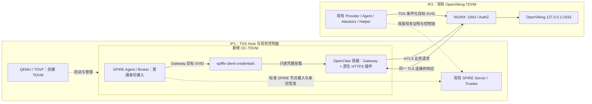

# IP1 新建 OpenClaw TDVM → IP2 OpenViking TDVM：首阶段实施计划

修订日期：2026-09-09。设计核对基线：`feat/argus-spiffe-v2-val` / `25fa9f6`；本阶段客户端代码随该分支交付，部署时以实际检出的完整提交 SHA 为准。本文保留首阶段设计与交付计划，后续公司执行结果见 [2026-09-09 客户端验收报告](../../../documents_ly/argus-openclaw-ip1-tdvm-client-acceptance-20260909.md)。

代码交付已完成：TDVM OpenClaw profile、x509pop 部署生成器与身份登记、客户端 Broker 存活检查、`argus.2` 真实业务/召回验收和连续生命周期证据工具。执行入口为 [IP1 / Guest / IP2 操作手册](../adapters/OpenClaw/spiffe_client/DEPLOY-IP1-TDVM.md)，本地软件验证见 [VALIDATION.md](../adapters/OpenClaw/spiffe_client/VALIDATION.md)，公司结果以对应执行报告为准。

按用户最新确定的范围：IP1 创建一个 TDVM，在其中运行 OpenClaw；OpenClaw 首阶段不接入 TDX Quote/Trustee 远程证明。OpenClaw 通过普通 SPIRE 身份接入取得 SVID，调用 IP2 已通过 PoC Workload Attestation 的 OpenViking，双方通过 mTLS 验证身份，业务响应沿同一连接返回。

“双向通信”已明确为 OpenClaw 发起调用、OpenViking 返回结果及双方身份认证，不增加 OpenViking 主动调用 OpenClaw 的反向业务 API。IP2 的 `tcb_status=OutOfDate` 继续作为现有明确 PoC 条件；不要求升级平台后才联调。

**一、首阶段目标与边界。**

| 对象 | 本阶段状态与目标 |
|---|---|
| IP1 Host | 继续运行现有 SPIRE Server/Trustee/控制通道，新增 TDVM 创建和管理 |
| 新 OC-TDVM | 必须实际作为 TDX Guest 启动；Host 配置和 Guest 检查确认运行形态，TDX 远程证明标记 NOT_RUN |
| OpenClaw 身份 | 普通 SPIRE 节点/工作负载识别与 SVID，默认采用标准 x509pop 节点接入；不声称已获 TDX 证明 |
| OpenViking 身份 | 复用 IP2 现有真实 TDX Node/Workload 证明链和目标 SVID，保留 OutOfDate PoC 例外 |
| 通信 | Gateway 插件原生 HTTPS，经 mTLS 精确校验双方 SPIFFE ID，接收端继续执行 AuthZ |
| 业务 | 真实会话写入、读回、归档，以及后续回答使用 OpenViking 检索结果 |
| 生命周期 | 双端普通轮换、客户端身份失效、Gateway/交付故障、连接中断与恢复 |
| 延期 | OpenClaw TDX Node/Workload 证明、多节点 argus_tdx 改造、新 workload schema、严格 UpToDate 验收 |

x509pop 是标准 SPIRE 的证书信任链和持钥校验，用于让新 Guest 的 Agent 取得节点身份；它不调用 TDX Provider/Trustee。OpenClaw 暂不做硬件远程证明，不意味着取消 SVID、Entry、证书链或身份白名单。依据：[SPIRE v1.15.3 Agent x509pop](https://github.com/spiffe/spire/blob/v1.15.3/doc/plugin_agent_nodeattestor_x509pop.md)、[Server x509pop](https://github.com/spiffe/spire/blob/v1.15.3/doc/plugin_server_nodeattestor_x509pop.md)。

**二、部署拓扑。**

新增 Agent、Broker、凭据交付程序和 Docker/OpenClaw 全部位于 OC-TDVM Guest。Gateway 的宿主机 PID 指 Guest OS 所观察的进程 PID，不是 IP1 Host 上的 QEMU PID。新 Guest 使用独立 data/key/socket/登记/凭据；不复用 IP2 的 Agent identity 或私钥。

| 身份 | 取值与授权 |
|---|---|
| OC-TDVM SPIRE Agent | 从本次 x509pop 成功入网取得真实 Agent ID，作为客户端 Entries 的 parent；不预填历史 fingerprint |
| OpenClaw Helper | `spiffe://argus.local/infra/openclaw-helper`；限定实际 UID、路径与二进制摘要，Broker 允许 PID reference |
| OpenClaw Gateway | `spiffe://argus.local/agent/openclaw`；绑定实际 parent Agent、批准镜像 config digest 及实测 Docker/Unix selectors |
| OpenViking | `spiffe://argus.local/service/openviking-cmem`；保留现有 TDX proof selectors 与 Entry |

Gateway Entry 使用官方 `docker:image_config_digest` 等真实可用 selectors。Guest 内实际 Gateway PID reference 必须能被已安装的 WorkloadAttestor 识别。PID 登记绑定交付生命周期；普通 Docker/Unix selectors 不代表硬件证明，也不自动绑定所有可写应用配置。依据：[SPIRE v1.15.3 Docker WorkloadAttestor](https://github.com/spiffe/spire/blob/v1.15.3/doc/plugin_agent_workloadattestor_docker.md)。

**三、顺序、分工和交付物。**

| 阶段 | 执行位置 | 工作与交付物 | 完成标准 |
|---|---|---|---|
| P0：复核当前基线 | IP1/IP2 | 现有 PoC 策略、配置、期限、Entries、socket、运行实例和恢复材料；IP1 TDVM 创建方式、资源和网络 | IP2 现有正向可复验；实际策略/配置差异已解释；TDVM 创建参数明确 |
| P1：客户端交付准备 | 开发/Linux | 整理已有客户端代码，修复 keepalive，固定镜像/插件，Linux 测试，准备 Guest 配置和 Entries | 明确提交和交付摘要；必要测试通过；部署差异可审查 |
| P2：创建 OC-TDVM | IP1 Host + 新 Guest | 独立基础镜像 overlay、VM 参数、SSH/console；Guest Docker/运行依赖、标准 SPIRE Agent/Broker | 确认真实 TDX Guest 启动；Guest 可达 SPIRE Server，普通 Agent 身份接入完成 |
| P3：部署真实 Gateway | OC-TDVM，IP1 控制面配合 | Helper/Gateway Entries，插件安装、Guest PID 登记、凭据交付、容器业务网络 | 真实 Gateway 对应 SVID 就绪；容器内到 IP2 的双向 mTLS 通过 |
| P4：业务闭环 | OC-TDVM → IP2 | Gateway 会话写入、插件读回/归档、后续检索和回答使用证据 | 真实 Gateway 请求和结果可关联，B1/B2 通过 |
| P5：生命周期与恢复 | 主要在 OC-TDVM | 轮换、错误身份、交付停止/崩溃/挂起、Gateway 替换、Broker/业务网络故障及恢复 | L1–L6 通过，恢复后 B1 再通过，IP2 冻结实例保持 |
| P6：阶段交付 | 三处角色汇总 | 报告、证据索引、安装/停止/恢复手册和交付包 | 可重复部署和演示；OpenClaw 远程证明明确延期，不混入本轮 PASS |

P0 现场采集、P1 本地代码整理和 P2 的 VM 资源准备可独立推进。正式 Gateway 身份验收依赖 P1/P2，业务依赖 P3，故障测试依赖已有正向与恢复步骤。

**四、部署前需要处理的现有问题。**

| 问题 | 处理方式 |
|---|---|
| `pkg/clientcredentials/run.go` 仍有 10 秒激进 keepalive | 同步处理公司已出现的 `too_many_pings` 问题；同时确认 Broker 断流检测和业务停止上限，不把持续更新的本地租约当作 Broker 健康证明 |
| PoC 策略正文没有随报告入库，默认 render 仍要求 UpToDate | 保存现场实际策略及 SHA-256；只补复现所需显式策略输入和远端回读一致性。严格默认保留，不能根据 policy ID 含 `poc` 隐式跳过检查 |
| 公司报告与默认 Agent/Helper socket 不一致 | 从实际配置、unit/override 和进程读取并解释，不照抄默认值覆盖 IP2 |
| 客户端代码尚未提交或部署到公司 | 固定本轮提交、插件和程序摘要，完成 Linux pidfd/tmpfs/GID/真实 Broker 验证 |
| 宿主机隧道不等于新 Guest 或容器网络可达 | 分别记录 IP1 Host、OC-TDVM Guest、Gateway 容器地址，从实际 Gateway namespace 验证 |
| 旧验收脚本部分输出仍称 Dual-TDVM/证明阶段不明 | 准确写明“两 TDVM 部署；OpenClaw 无 TDX 远程证明；OpenViking 保留真实 PoC 证明” |
| E2E 已覆盖写入/读回/归档，未覆盖回答使用记忆 | 增加 B2；辅助 CLI 的读取/归档如实标记，不冒充 Gateway 自主完成 |

默认不修改 `argus-tdx-nodeattestor`、Provider 的 identity 合同或新增 `argus.workload.tdx.v2`。这些是后续 OpenClaw 接入远程证明时的工作，不是本轮普通 SPIRE 身份接入的前提。

**五、Host 与 Guest 部署细节。**

IP1 优先使用公司已成功的 TDVM 创建方式。记录 QEMU/TDVF/基础镜像版本与摘要、独立 overlay、VM 名称、vCPU/RAM、SSH 和 console 路径，资源按现场余量配置。不能把旧脚本默认的 8 vCPU/8 GiB 当作运行需求或容量结论。

确认 Host 的 TDX 启动配置和 Guest 的 TDX 运行形态。本阶段不要求获取 Quote 或完成 DCAP appraisal；QGS 能力可记录供后续使用。现有 `check-tdx-host.sh` 把 QGS 纳入检查，因此部署工具应区分“TDVM 启动条件”和“远程证明条件”，不能因为本阶段未配置 QGS 就把可运行 TDVM 判为不可部署。现有 `tdvm.sh` 默认转发 OpenViking 1933/1943 并依赖 Host Docker bridge，不能原样作为 OpenClaw Guest profile；只保留本阶段实际需要的管理/业务网络设置。

Guest 内按以下顺序部署：

1. 安装固定版本 SPIRE Agent、Docker 和 Gateway 运行依赖。创建独立 Agent data/key/UDS；Workload API 计划为 `/run/spire/openclaw/agent.sock`，Broker 为 `/run/spire/openclaw/broker.sock`。
2. 核对 IP1 Server 是否已配置可用 x509pop。需要时增量启用该标准插件并提供受控 bootstrap 材料，保留现有 `argus_tdx` 配置、CA 和数据；验证新配置，必要重启后先复验 IP2，再继续新 Guest 入网。记录实际新 Agent ID。
3. 为 Gateway 创建专用容器网络，固定 OpenClaw/Node/插件版本和镜像 digest，使用现场可用远端 LLM provider、非 root OpenViking API key。程序/插件来源固化，运行配置与可写业务状态分开。
4. 发布限定 Helper 和 Gateway 的 Entries、Broker allowlist。审计同业务 SPIFFE ID 全部 Entries，单独处置旧临时客户端 Entry，不能用临时证书替代本次 Gateway 身份。
5. 准备 Guest 内 root 管理的配置与 tmpfs 凭据目录，以及实际可读 GID/user namespace 映射；只读挂载 `client.json` 和 credentials 到 Gateway，不挂载 Broker/Docker/Server socket。
6. 安装插件并完成 setup，启动或重启 Gateway；从 Guest OS 确认真实 PID，登记 PID/start time/boot/PID namespace，再启动 `spiffe-client-credentials`。
7. 取得 `spiffe://argus.local/agent/openclaw` SVID，运行 connect 与健康检查；setup 或配置生效如更换 Gateway PID，停止交付、清理旧登记并对新 PID 重新登记。辅助 CLI 成功只算 P3，真实业务由 P4 验收。

客户端 bootstrap 私钥、Agent 私钥、业务 SVID 在新 Guest 内保护和使用；不复制 IP2 key 或把它们放入公共 VM 镜像。Host 的 Server/Trustee 仍是现有可信控制面，不宣称本轮验证了对控制面失陷的抵抗能力。

**六、网络合同。**

| 连接 | 要求 |
|---|---|
| OC-TDVM Guest → IP1 SPIRE Server | Guest 可达的实际地址，保留 bootstrap trust bundle 和 TLS/HTTP2；不能把 Guest loopback 当作 Host Server |
| Gateway 容器 → IP2 NGINX :1943 | 真实容器 namespace 可达，精确校验 OpenViking SPIFFE ID；无法直连时使用专用 TCP 隧道，TLS 仍在 Gateway 与 NGINX 终止 |
| IP2 证明组件 → IP1 Server/Trustee | 保持现有已验收控制链 |
| IP1 运维 → OC-TDVM SSH/console | 用于安装和恢复，与业务连接区分 |

新 Guest 首阶段无需连接 Trustee，不部署 OpenClaw Evidence Provider。业务仅由 OpenClaw 发起，不必开放 OpenClaw 业务入站口；结果沿已有 mTLS 连接返回。DNS/地址映射和 TCP 转发只负责定位，不能替代 SPIFFE 身份校验。

**七、业务与生命周期验收。**

| 用例 | 输入与通过标准 |
|---|---|
| B1：真实会话持久化 | 用唯一 marker 发起真实 OpenClaw 会话；Gateway 原生 mTLS 写入有日志；OpenViking 内容可读回并完成 commit/archive。关联 Gateway 实例、session/task/request、双方 SPIFFE ID 与 SVID serial |
| B2：后续回答使用记忆 | B1 写入本轮随机测试事实；独立后续会话仅提问不重给答案；检索命中进入模型上下文并用于回答。加入不存在事实的对照，避免旧会话/其他用户数据误判 |
| L1：客户端与服务端普通轮换 | 各观察至少一次 serial 变化；期间持续执行有内容断言的读请求，记录超时、失败和 readiness；B1 前后通过，区分普通轮换与新 appraisal |
| L2：错误客户端身份 | 正确可信链、不同 SPIFFE ID 得到 AuthZ 403；恢复合法 Gateway 身份后正向通过；测试 Entry/材料单独清理 |
| L3：交付停止/SIGKILL/SIGSTOP | 从故障触发前开始计时，租约失效、拒绝新请求和连接清理有记录；处理自动重启对测试的影响，恢复原 unit 设置后 B1 通过 |
| L4：Gateway 更换 | 旧 PID 登记不能继续交付；新实例重新登记和取证后业务恢复，不需要 TDX appraisal |
| L5：身份移除/Broker 断流 | 分别记录故障触发、检测、撤销租约/PEM 与业务停止时间；恢复 Entry/Broker/订阅后 B1 通过 |
| L6：业务 TCP 中断与恢复 | 请求失败可解释，恢复后新请求成功；不确定结果的写入按 request/session ID 查询，不盲目自动重试 |

已有客户端租约上限为 2.5 秒，检查周期约 250 ms，旧代次连接 drain 为 5 秒。这些是代码参数。部署前为交付停止固定观察上限，可采用 3.5 秒作为初始门槛；超时如实记录 FAIL。Broker 连接故障需要独立检测上限，不能直接套用租约时限，因为交付进程可能尚未发现断流。

每项负向测试按“正向 → 单个故障 → 拒绝证据 → 恢复 → 正向复验”执行，先准备恢复操作。优先只操作新 Guest 的 Gateway、客户端 unit/Entry 或专用业务转发，不停止共享 Server/Trustee 或 IP2 现有唯一服务来做客户端故障测试。

B1/B2 前后只读比较 IP2 queue sequence、实例和批准基线。OpenViking 业务 `/sessions/.../commit` 与 TC API/TruCon 度量 commit 是不同操作；如果业务实际导致 RTMR2 变化，先保存证据并按 IP2 基线流程处理，不能事后改 reference value 继续标记通过。OpenClaw 首阶段无 TDX workload policy，不为它虚构 MR/RTMR 验收。

Linux 验证复用现有 `spiffe_client/test-client.sh`、Go clientcredentials/Broker/pidfd 测试及配置校验；现场补实际 Agent/Broker、Guest tmpfs/权限和真实 Gateway 验收。发布包测试不得以 skipped 计为通过。不为本阶段新增无关 Quote 协议测试或重跑全部项目测试。

**八、证据与恢复交付。**

统一 `RUN_ID`，证据区分 `ip1-host/`、`openclaw-guest/`、`ip2-existing/`，至少记录：

- Host/Guest/镜像/插件/二进制版本与摘要，VM 创建参数、实际身份/Entries、网络和实例 PID。
- IP2 PoC policy 原文/摘要、当前有效窗口、既有证明链复验；OpenClaw 的 TDX 远程证明明确为 NOT_RUN，不把标准 SPIRE 身份接入写成硬件证明。
- B1/B2 请求、检索、模型上下文和回答，L1–L6 的触发/检测/清理/恢复时间，实际结果与文件位置。
- 三处角色的部署与恢复步骤、备份位置、临时 Entry/材料/unit override 清理记录。报告不写私钥或业务 token。

恢复优先停止新 Guest 的 Gateway/交付或专用转发，恢复其镜像/配置，清理旧 PID 登记后重新取证。若增量修改 Server 的 x509pop 配置，保留完整回退配置并复验 IP2；不回滚运行数据库、不重建 CA 或 IP2 proof key。Guest 镜像更换导致 image config digest 改变时，先更新其对应 Entry。

本阶段完成要求：实际 OC-TDVM 部署、普通 SPIRE 身份接入、P3 双向 mTLS、B1/B2 和必需 L1–L6 通过；故障恢复后最终 B1 成功，IP2 现有实例与批准基线保持有效。某项 BLOCKED/NOT_RUN 时报告已完成子阶段，不把整个阶段标记完成。

**九、后续再接入 OpenClaw 远程证明。**

业务闭环稳定后，再单独实施：新 Guest TSM/QGS/真实 Quote 验证；为 `argus_tdx` 增加第二个批准节点和独立 proof key/policy；参数化 Go/Rust Node identity 绑定并兼容 IP2；新增 OpenClaw Gateway 的独立实例观察、Workload policy/绑定合同和 TDX 条件化 SVID；最后执行双端真实证明与跨节点拒绝验收。

当前代码固定 `openviking-node` 和 OpenViking workload profile 的限制仍存在，但已不阻塞本阶段。严格 UpToDate 验收、IP2 target-exit/重新 launch、动态 RTMR2 自动更新、独立周期重证明和大规模性能实验另行安排。

参考：[公司 Workload 报告](../../../documents_ly/argus-openviking-workload-attestation-status-20260909.md)、[OpenClaw 接入](../adapters/OpenClaw/spiffe_client/README.md)、[客户端验证](../adapters/OpenClaw/spiffe_client/VALIDATION.md)、[TDVM 工具](../core/spire/tests/tdvm/README.md)、[Workload 手册](../core/spire/workload/README.md)。
