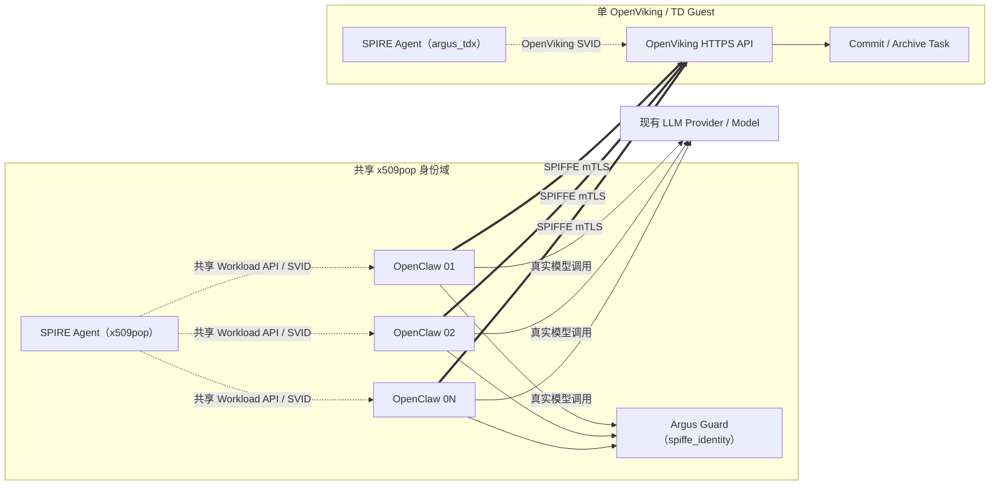

# Argus 多 OpenClaw 真实 LLM Agent 任务评估方案

> 前置评估：[Argus-Asymmetric-Attestation-SPIFFE-Evaluation-Plan.md](./Argus-Asymmetric-Attestation-SPIFFE-Evaluation-Plan.md)
>
> 当前基准结果：[Argus-Asymmetric-Attestation-SPIFFE-Benchmark-Report.md](./Argus-Asymmetric-Attestation-SPIFFE-Benchmark-Report.md)
>
> 真实业务 E2E：[verify-openclaw-plugin-e2e.sh](../core/spire/runtime/asymmetric/scripts/verify-openclaw-plugin-e2e.sh)
>
> 文档状态：**方案已确定，尚未实现或执行 E8 正式测试**

## 1. 文档目的

本文定义 Argus 非对称 SPIFFE Profile 的下一阶段评估：在一个已经运行的
OpenViking 服务左侧增加多个真实 OpenClaw 实例，让每个 OpenClaw 调用远程主机
当前已经配置的真实 LLM 生成文本，再由现有 OpenViking context-engine 插件捕获
会话并完成 `commit/archive`。

本轮不再以几百或几千 HTTP QPS 作为主要结果，而回答以下业务容量问题：

1. `N` 个 OpenClaw 并发工作时，每分钟可以完成多少个完整 Agent 任务；
2. Agent 任务端到端延迟如何随 `N=1/2/4/8` 变化；
3. 多个 OpenClaw 之间是否出现明显的吞吐或延迟不公平；
4. 瓶颈首先出现在模型 Provider、OpenClaw、Guard/SPIFFE 传输，还是
   OpenViking 的 capture、commit 或 archive 阶段；
5. 业务任务数增加时，Node Attestation 和 Trustee 调用是否继续与业务任务解耦。

本文只定义测试方法、实现合约和结果格式，不预填尚未测得的任务吞吐或延迟，
也不提前声明生产容量。

## 2. 已确认决策

| 决策 | 选择 |
|---|---|
| 首轮业务场景 | 真实 LLM 生成文本，OpenViking 自动捕获后执行 `commit/archive` |
| 模型配置 | 沿用远程主机当前 OpenClaw 和 OpenViking 已配置的 Provider、模型与参数 |
| 模型对比 | 本轮不切换模型，不做不同模型横向比较 |
| OpenClaw 数量 | 正式矩阵使用 `1 / 2 / 4 / 8` |
| 单实例负载 | closed-loop；每个 OpenClaw 同时最多执行一个任务 |
| OpenViking 数量 | 一个 |
| 左侧身份拓扑 | 首轮多个 OpenClaw 共享当前 x509pop SPIRE Agent、Workload API 和业务 SPIFFE ID |
| Guard | 共享当前 caller-side Guard，保持现有 `spiffe_identity` 配置 |
| 显式工具调用 | 不纳入首轮，保留为后续场景 |
| Attestation Profile | 保持当前 Mock Evidence Provider + Mock Trustee |

选择共享 x509pop Agent 是为了先测真实业务多客户端容量，避免让多套 Agent 证书、
数据目录和注册项的实现工作阻塞本轮评估。该拓扑必须在 manifest 和报告中写为
`shared_x509pop_agent`，不能表述为 `N` 个独立身份域。

## 3. 评估边界

### 3.1 当前纳入

- `1 / 2 / 4 / 8` 个真实 OpenClaw Gateway/Agent workload 容器；
- 每个 OpenClaw 调用远程主机当前已配置的同一个模型 Profile；
- 固定的合成文本生成任务；
- 唯一 `task_id`、response marker 和 session key；
- OpenViking 插件自动捕获 session；
- caller-side Guard 授权和原生 SPIFFE mTLS；
- OpenViking `commit`、异步 task 和 archive 完成；
- Agent 任务吞吐、端到端延迟、分阶段延迟、成功率和失败阶段；
- OpenClaw、Guard、SPIRE、OpenViking、Provider 可观测错误和主机资源；
- Node Attestation、Trustee 请求和 SVID 轮换计数器。

### 3.2 当前不纳入

- 不同 LLM、Provider、temperature 或 token 上限之间的效果比较；
- 多 OpenViking、多 TDVM、跨区域或多 SPIRE Server；
- 每个 OpenClaw 独立的 x509pop SPIRE Agent/证书/Workload API；
- OpenClaw 显式调用 OpenViking memory read/write 工具；
- Agent 输出质量的主观评分或 LLM-as-a-judge；
- 真实 TDX Quote、QGS 或 production Trustee 性能；
- 生产级容量、安全性、可用性或成本承诺。

“真实 LLM 业务任务”只表示 OpenClaw 确实调用当前模型 Provider 并完成真实业务路径；
它不改变当前 Mock RA + Mock Trustee 的证明边界。

## 4. 被测拓扑



多 OpenClaw 必须使用独立容器名、Gateway/Bridge 端口、config volume、workspace
volume、session key 和结果文件。禁止直接对当前固定 `container_name`、端口、数据卷
和单 `OPENCLAW_CONTAINER` runner 使用 `docker compose --scale`。

## 5. 远程现有配置复用合约

### 5.1 配置原则

远程执行器不得为本轮评估重新选择模型或修改 Provider。正式运行前只读取并记录
当前配置的非敏感字段，然后以当前已验证实例为只读来源，按 allowlist 复制模型、
Provider、插件和必要凭据配置，为各 OpenClaw 实例创建同源初始化快照。不得直接修改
或停止当前实例。

所有正式 case 必须保持以下项目一致：

- OpenClaw Provider 和 model；
- temperature、max tokens、context-window 等已显式配置的生成参数；
- 模型网关地址和 CA/proxy 行为；
- OpenViking context-engine 插件版本和配置；
- OpenViking archive 阶段使用的 Provider/model（如果当前配置可观测）；
- Guard policy、SPIFFE ID、OpenViking origin 和 API 行为；
- OpenClaw/OpenViking 镜像 digest。

### 5.2 Manifest 中记录的配置

正式 run 的 `manifest.json` 至少包含：

```json
{
  "schema_version": "argus-e8-agent-task-run-v1",
  "profile": "multi_openclaw_real_llm_shared_x509pop_agent",
  "git_commit": null,
  "host": null,
  "started_at_utc": null,
  "attestation_profile": "mock_ra_mock_trustee",
  "openclaw_provider": null,
  "openclaw_model": null,
  "openclaw_temperature": null,
  "openclaw_max_tokens": null,
  "openviking_archive_provider": null,
  "openviking_archive_model": null,
  "guard_evidence_mode": null,
  "non_secret_config_fingerprint": null,
  "config_snapshot_at_utc": null,
  "capture_poll_interval_ms": 1000,
  "archive_poll_interval_ms": 2000,
  "agent_timeout_ms": 180000,
  "capture_timeout_ms": 60000,
  "commit_timeout_ms": 300000,
  "archive_timeout_ms": 300000,
  "provider_retry_policy": null,
  "prompt_suite_sha256": null,
  "openclaw_image_digest": null,
  "openviking_image_digest": null
}
```

无法从当前配置可靠读取的字段保留 `null`，不得猜测或用文档默认值补齐。
manifest、日志和报告不得保存 API key、Gateway token、私钥或完整凭据配置。

### 5.3 多实例配置卷

每个 OpenClaw 使用独立的 config/workspace volume，但从远程当前已验证实例的同一
初始化快照生成。源卷只读挂载；复制时排除 session/history、cache、lock、PID、旧日志、
运行时 identity 和其他动态状态。每个 unit 必须从空 workspace/session 状态启动，避免
历史 marker 或 archive 污染本轮结果。复制过程只在主机内部完成，禁用 shell trace，
使用仅当前执行用户可读的临时目录，不把凭据打印到 stdout、JSONL、校验和清单或报告。

manifest 记录非敏感配置指纹、源实例标识、新卷名和实际端口，不记录秘密内容。非必要
Gateway/Bridge 端口不发布到主机；确需发布时由 launcher 先探测空闲端口，不能假设
`28789/28790` 未被当前实例占用。

建议命名：

```text
容器：argus-e8-openclaw-01 ... argus-e8-openclaw-08
配置卷：argus-e8-<run-id>-openclaw-01-config
工作区卷：argus-e8-<run-id>-openclaw-01-workspace
Gateway/Bridge：默认仅容器网络可见；需要主机端口时动态分配并写入 manifest
```

## 6. Agent 任务定义

### 6.1 Prompt Suite

仓库保存 10 个固定的合成材料，每个材料约 300–500 个中文字符，不依赖实时网络、
用户数据或外部文件。不同 case 和不同 OpenClaw 使用同一组材料及相同顺序，确保
输入复杂度可比。

任务模板：

```text
你正在完成一个受控评估任务。

请阅读下面的材料，生成 150–250 字的中文摘要，并严格使用 `1.`、`2.`、`3.`
三行编号列出三条关键结论。
不要调用额外工具，不要省略材料中的关键约束。
请在回答最后单独一行输出由固定前缀 `ARGUS-E8-RESULT-` 与下面 nonce
无空格拼接得到的字符串。不要在正文中输出该字符串。

nonce：{TASK_NONCE}

材料：
{SOURCE_TEXT}
```

prompt suite 本身纳入 Git；每次 run 在 manifest 中记录它的 SHA256。

### 6.2 任务标识

```text
task_id        = e8-<run-id>-<case>-<unit-id>-<sequence>
task_nonce     = <128-bit-random-hex>
response_marker = ARGUS-E8-RESULT-<task_nonce>
session_key    = argus-e8-<run-id>-<case>-<unit-id>-<sequence>
```

完整 `response_marker` 不得出现在 user/system prompt 中，只能由模型按 prefix + nonce
生成。每个任务创建新 session，不复用前一任务上下文。优先只在 assistant-role 消息
或 OpenClaw 最终回答字段中匹配 marker；如果 OpenViking 当前不暴露角色，Pilot 必须
证明完整 marker 未出现在输入事件，且精确匹配只出现一次，否则不得进入正式矩阵。

控制器必须建立并持久化
`session_key -> openclaw_run_id -> openviking_session_id -> openviking_message_id/message_digest`
映射。session 查询必须完整分页，或按 case 起始时间和 run/session metadata 服务端过滤；
禁止复用现有 E2E 中只查看前 100 个 session 的截断逻辑。零匹配、多匹配、跨 unit 串线、
重复 marker 或错误 session 归属均计为 `session_isolation` 失败。

### 6.3 Closed-loop 负载

每个 OpenClaw 同时最多执行一个任务。一个任务到达最终完成或 timeout 后，该
OpenClaw 才启动下一个任务。不同 OpenClaw 使用同步起跑 barrier 并并行工作。

这种负载模型测量“持续完成 Agent 任务”的能力，不制造与真实 Agent 行为无关的
无限请求队列。

## 7. 任务生命周期和时间点

控制器从 T0 开始并发轮询 OpenViking，并使用同一主机 monotonic clock 计算时长；
Unix wall clock 只用于与外部日志对齐。可观测时间点为：

```text
T0 = 控制器开始执行 `openclaw agent`
T1 = `openclaw agent --json` 返回并通过 status/runId/error 校验
T2 = 控制器首次在目标 OpenViking session 的 assistant 输出（或 Pilot 已证明的
     output-only fallback）中观察到 response_marker，且通过正文、marker 和 session 归属校验
T3 = 对目标 session 发起的 commit 返回本次 task_id
T4 = 本次 task_id 进入成功终态，目标 session 的 commit_count 相对 T3 前基线增加，
     且 archive revision/timestamp/digest 能证明归档在 T3 后更新
```

只有 T1、T2 都成立后才允许发起 commit，因此 T3/T4 一定晚于 T1/T2。

计算：

```text
agent_turn_ms             = T1 - T0
capture_first_observed_ms = T2 - T0
commit_to_archive_ms      = T4 - T3
agent_task_e2e_ms         = T4 - T0
```

`agent_turn_ms` 是控制器观察到的完整 OpenClaw turn 时间，可能同时包含模型 Provider、
OpenClaw runtime 和 context-engine 插件开销；不能在缺少 Provider 原生时间字段时把它
命名为纯 `model_latency`。T0-T1 与 T0-T2 是并行、可能重叠的观测窗口，不能相加作为
分阶段耗时；`capture_first_observed_ms` 也不能表述为 OpenViking 服务端纯处理延迟。

发起 commit 前必须读取目标 session 的 `commit_count` 和 archive revision/timestamp/digest
基线。
如果 API 没有 archive 时间或 revision，则至少要求本次 task 成功、`commit_count` 增量和
overview digest 相对基线发生变化。只检查“非空 overview”不能作为本任务完成证据。

如果 OpenClaw 返回可靠的 input/output token 或 Provider timing，则作为独立字段记录；
没有实测值时保持 `null`。

建议 capture 轮询间隔 1 秒、archive 轮询间隔 2 秒，并在 manifest 中记录实际值、所有
stage timeout 和 Provider retry policy。报告需要说明轮询间隔对 T2/T4 精度的影响。

timeout deadline 固定为：Agent 是 `T0 + 180s`；capture 轮询从 T0 开始，但 deadline 是
`T1 + 60s`，若 T1 前已观察到 T2 则保留该时间点；commit API 从发起请求起最多 300s；
archive 是 `T3 + 300s`。若 Agent 在 T0 deadline 前没有形成 T1，则任务直接在
`openclaw_agent` 阶段失败并停止该任务的 capture 轮询，不能先报 capture timeout。

## 8. 执行矩阵

### 8.1 Pilot

Pilot 验证多实例编排、配置隔离、marker 关联和任务收据，不用于正式容量结论。

| Case | OpenClaw 数量 | 每实例任务 | 总任务 | 目的 |
|---|---:|---:|---:|---|
| P0 | 1 | 2 | 2 | 对齐现有单实例真实 E2E |
| P1 | 2 | 3 | 6 | 验证并行任务和 session 隔离 |
| P2 | 4 | 3 | 12 | 验证多实例资源采集与报告 |

每个 Pilot case 的任务必须全部正确归属并完成，才能进入正式矩阵。`unit` 测试必须用
超过 100 个 session 的固定 fixture 验证完整分页；若远程已有超过 100 个可见 session，
P0 还要验证真实分页路径。Pilot 同时验证输入中不存在完整 response marker、每个结果
只命中目标 assistant 消息。若失败，先修复 harness、配置或业务路径，不通过降低验证
条件继续扩大实例数。

### 8.2 正式矩阵

| Case | OpenClaw 数量 | 每实例预热任务 | 每实例正式任务 | 正式任务总数 |
|---|---:|---:|---:|---:|
| C1 | 1 | 1 | 10 | 10 |
| C2 | 2 | 1 | 10 | 20 |
| C4 | 4 | 1 | 10 | 40 |
| C8 | 8 | 1 | 10 | 80 |

预热任务走完整业务链路，但不纳入正式延迟和吞吐统计。每个 case 使用新的 run-scoped
容器/数据卷和唯一 marker 命名空间。首次正式执行每档运行一次；只对无效 run、明显
环境故障或需要确认的异常档位复测，不默认重复整套矩阵。因此首轮结果是当前配置下的
单次探索性快照，不表述为稳定容量；需要容量结论时再重复关键档位。

沿用当前真实 E2E 的初始 timeout：

```text
OpenClaw Agent timeout：180 s
OpenViking capture timeout：T1 后 60 s
OpenViking commit timeout：请求发起后 300 s
OpenViking archive timeout：T3 后 300 s
```

实际 timeout 写入 manifest。达到 timeout 的任务仍必须输出失败收据。

## 9. 完成判定与失败分类

### 9.1 完整成功任务

任务只有同时满足以下条件才记为 `completed`：

1. `openclaw agent --json` 返回 `status=ok`、非空 `runId` 且无 error；
2. assistant 正文非空、中文正文为 150–250 字、包含三条可机械识别的结论，且唯一
   response marker 位于末行；这里只验证格式，不进行主观质量评分；
3. response marker 只属于预期 unit、sequence、session 和 assistant message；
4. OpenViking commit 成功返回本次 task ID；
5. 本次 commit task 进入成功终态；
6. `commit_count` 相对 T3 前基线增加，且 archive revision/timestamp/digest 能证明本次
   archive 已更新。

若 OpenClaw JSON 当前不能稳定暴露最终文本，则目标 OpenViking assistant message 中的
正文和唯一 marker 是强制业务完成证据，JSON 文本校验字段记录为 `null`，不能伪造为
成功。若两端都无法区分 assistant 输出与输入，Pilot 失败，不进入正式矩阵。

### 9.2 Guard/SPIFFE 证据粒度

preflight 先确定 `guard_evidence_mode`：

- `task_correlated`：受 Guard 保护的请求携带由 `task_id` 派生的 request ID，Guard 日志
  同时输出 request ID、decision ID、SPIFFE ID 和结果；收据保存逐请求映射；
- `case_level`：自动 capture 当前无法注入 correlation ID 时使用。Guard ALLOW/DENY、
  timeout 和 transport error 只作为 case 窗口指标，不能宣称某个具体任务“没有 DENY”。

首轮默认接受 `case_level`。业务任务通过正确 capture、commit 和 archive 证明链路完成；
case 窗口内出现 DENY 时标记 `guard_anomaly` 并单独分析，但不能把共享 Guard 的任意事件
强行归到并发任务。只有 `task_correlated` 模式才能在任务收据中形成 Guard 完成条件；
该模式下，任务关联的所有受保护请求都必须有 ALLOW 且不得有 DENY/transport error。

### 9.3 失败阶段

每个失败任务必须归入首个可证实的失败阶段：

```text
setup
openclaw_generation_provider
openclaw_agent
response_validation
guard
spiffe_transport
openviking_capture
openviking_commit
openviking_archive_provider
openviking_archive
session_isolation
unknown
```

`failure_stage` 保存首个可证实的组件阶段；`timeout`、`429`、`5xx` 等写入独立的
`error_class`，并记录 `timeout_limit_ms` 与 `elapsed_ms`，不能用通用 timeout 覆盖组件。
OpenClaw generation Provider 和 OpenViking archive Provider 分开统计。若 archive Provider
来源无法从日志证实，则归入 `openviking_archive` 或 `unknown`，不得推断。Provider 错误
会降低真实任务成功率，但报告必须将“模型 Provider 限制”与“Argus/OpenViking 回归”
分开，不能相互替代。

### 9.4 Run 有效性

“run 有效”和“所有任务成功”是两件事。正式 case 满足以下条件即可形成有效结果：

- manifest 完整且 Git/模型 Profile/prompt hash 可追踪；
- 计划的每个 OpenClaw 都成功启动并领取至少一个正式任务；
- 每个启动任务都有且只有一条最终成功或失败收据；
- marker/session 没有跨 unit 串线；
- 任务窗口内存在 OpenClaw、Guard 和 OpenViking 资源样本；
- summary 与原始任务计数一致。

任务失败率高时必须保留有效结果并报告失败阶段，不能仅因结果不好而丢弃 run。

## 10. 核心指标

### 10.1 任务吞吐与成功率

```text
completed_agent_tasks_per_minute
  = completed_tasks / ((measurement_end - measurement_start) / 60)

task_success_rate
  = completed_tasks / launched_tasks

per_unit_tasks_per_minute
  = unit_completed_tasks / unit_measurement_minutes

scaling_efficiency_N
  = throughput_N / (N * throughput_C1)

fairness_ratio
  = min(per_unit_tasks_per_minute) / max(per_unit_tasks_per_minute)
```

`measurement_start` 是该 case 首个正式任务的 T0；`measurement_end` 是最后一个正式
任务的 T4 或最终失败时间。预热不计入窗口。`unit_measurement_minutes` 是该 unit 首个
正式任务 T0 到该 unit 最后任务终态的时间。per-unit 表必须同时列 launched、completed、
success rate、tasks/min 和 E2E，避免只看吞吐掩盖失败差异。

若 C1 吞吐为 0，`scaling_efficiency_N=null`；若所有 unit 完成数均为 0，
`fairness_ratio=null`；若仅部分 unit 为 0，`fairness_ratio=0`。指标不可获得时一律写
`null` 并附 `unavailable_reason`，不得用 0 代替未知。

### 10.2 延迟

每个 case 输出：

- `agent_task_e2e_ms` P50/P95/max；
- `agent_turn_ms` P50/P95/max；
- `capture_first_observed_ms` P50/P95/max；
- `commit_to_archive_ms` P50/P95/max；
- 每个 unit 的任务 E2E P50/P95/max。

首轮 C1/C2 样本不足以稳定解释 P99，因此主报告使用 P50/P95/max。单个可比较样本组
成功任务超过 100 后可以附带 P99，但不能以少量样本 P99 作为主要结论。percentile 对
成功任务使用 nearest-rank 算法并在报告中写明样本数；失败任务单独进入 timeout/失败
阶段分布。

### 10.3 模型与 token

如果当前 OpenClaw 结果提供可靠 usage：

- input/output/total tokens；
- output tokens/minute；
- 每任务 token 分布；
- Provider 原生 latency；
- 429、5xx、timeout 和 retry 次数。

若 usage 不可获得则保持 `null`，不根据文本长度估算 token。

## 11. 资源与控制面指标

沿用现有 collector，并为每个 OpenClaw 增加唯一 label：

| 组件 | 指标 |
|---|---|
| 每个 OpenClaw | CPU、RSS、FD、PIDs、socket、restart、任务完成数 |
| OpenClaw 合计 | CPU/RSS 总量和峰值 |
| Guard | CPU、RSS、ALLOW/DENY/error、decision latency |
| OpenViking | CPU、RSS、FD、active connections、task/commit 状态 |
| 两侧 SPIRE Agent | CPU、RSS、SVID serial、Workload API 错误 |
| SPIRE Server | 左/右 Node Attestation、Trustee、SVID 签发相关计数器 |
| 主机/TD Guest | CPU、内存、load、网络、TCP retransmit、磁盘 IO |

每个 case 前后保存 SPIRE 和 Guard Prometheus 快照。首轮共享一个 x509pop Agent，
因此增加 OpenClaw workload 容器不应被表述为增加 Node Attestation 数量。左侧 x509pop
和右侧 argus_tdx 分开记录，至少保存：

```text
left_active_agents_at_start
right_active_agents_at_start
left_node_attestation_delta
right_node_attestation_delta
left_trustee_request_delta
right_trustee_request_delta
completed_tasks_per_new_left_node_attestation
completed_tasks_per_new_right_node_attestation
left_trustee_requests_per_1000_completed_tasks
right_trustee_requests_per_1000_completed_tasks
```

对应 node-attestation delta 为 0 时，tasks/attestation 比率写 `null`，并直接报告“业务
窗口新增 attestation 为 0”；完成任务为 0 时，Trustee 比率也写 `null`。collector 必须
保存 counter 前后原值并检测 reset，不能把 reset 后差值当成真实负增量。SVID 轮换只
记录为业务窗口事件，不等同于新的 `argus_tdx` 证明。

## 12. 原始任务收据

每个正式任务在 `tasks.jsonl` 中写一条最终收据。示例只定义结构：

```json
{
  "schema_version": "argus-e8-agent-task-v1",
  "run_id": "run-placeholder",
  "case": "C4",
  "unit_id": "openclaw-03",
  "task_id": "e8-placeholder-c4-openclaw-03-007",
  "task_nonce": "0123456789abcdef0123456789abcdef",
  "response_marker": "ARGUS-E8-RESULT-0123456789abcdef0123456789abcdef",
  "session_key": "argus-e8-placeholder-c4-openclaw-03-007",
  "status": "completed",
  "failure_stage": null,
  "error_class": null,
  "openclaw_run_id": null,
  "openviking_session_id": null,
  "openviking_message_id": null,
  "openviking_message_digest": null,
  "openviking_task_id": null,
  "clock_source": "monotonic",
  "t0_monotonic_ns": null,
  "t1_monotonic_ns": null,
  "t2_monotonic_ns": null,
  "t3_monotonic_ns": null,
  "t4_monotonic_ns": null,
  "started_unix_ms": null,
  "agent_returned_unix_ms": null,
  "capture_observed_unix_ms": null,
  "commit_created_unix_ms": null,
  "archive_ready_unix_ms": null,
  "agent_turn_ms": null,
  "capture_first_observed_ms": null,
  "commit_to_archive_ms": null,
  "agent_task_e2e_ms": null,
  "response_body_chars": null,
  "response_conclusion_count": null,
  "input_tokens": null,
  "output_tokens": null,
  "guard_evidence_mode": "case_level",
  "guard_requests": [],
  "timeout_limit_ms": null,
  "elapsed_ms": null,
  "transport_success_count": null
}
```

成功和失败使用同一 schema。原始模型输出可以保存在 run-scoped evidence 目录中用于
marker 校验，但正式报告只展示任务标识、统计和必要的短样例，不批量复制全部输出。
`response_body_chars` 按去掉末行 marker 后、去除空白的 Unicode code point 数计算；
`response_conclusion_count` 只按固定列表格式机械计数。绝对 monotonic 值仅用于同一控制器
进程内审计，跨组件日志对齐使用 Unix 时间；所有 duration 必须由 monotonic 差值生成。

## 13. 结果目录与报告

```text
/var/lib/argus-spire-asymmetric/agent-tasks/run-<UTC>/
├── manifest.json
├── prompts.json
├── cases/
│   ├── C1/
│   │   ├── metadata.json
│   │   ├── tasks.jsonl
│   │   ├── resources.jsonl
│   │   ├── guard-metrics-before.prom
│   │   ├── guard-metrics-after.prom
│   │   ├── spire-metrics-before.prom
│   │   ├── spire-metrics-after.prom
│   │   └── units/openclaw-01/{stdout,stderr}.log
│   └── C2/C4/C8/...
├── summary.json
├── report.md
└── SHA256SUMS.txt
```

`summary.json` 和 `report.md` 必须从 `tasks.jsonl + resources.jsonl + metrics snapshots`
生成，不手工填入性能数字。报告至少包含：

| Case | OpenClaw | 完成/启动 | Tasks/min | 成功率 | E2E P50/P95/max | Agent turn P50 | Archive P50 | Generation Provider errors | Archive Provider errors | OpenViking CPU |
|---|---:|---:|---:|---:|---:|---:|---:|---:|---:|---:|

还需要提供 per-unit 表、失败阶段表、资源曲线、Node Attestation/Trustee 增量和明确的
结果边界。

## 14. 最小实现方案

建议在现有 asymmetric benchmark 下新增：

```text
core/spire/benchmarks/asymmetric/agent-tasks/
├── README.md
├── prompts.json
├── run.sh
├── task-worker.mjs
├── report.py
├── task-worker.test.mjs
└── test_report.py
```

职责：

- `run.sh`
  - 读取当前远程配置的非敏感字段；
  - 创建 run/case 目录和 manifest；
  - 从只读源按 allowlist 创建 run-scoped config volume 和空 workspace/session volume；
  - 为每个 unit 启动唯一 OpenClaw 容器；
  - 检查每个容器的模型配置、OpenViking plugin、SVID 和 Guard 健康；
  - 使用同步 barrier 并行启动 unit worker；
  - 采集资源、metrics、日志并生成报告。

- `task-worker.mjs`
  - 在一个 OpenClaw 内串行执行 prompt suite；
  - 调用真实 `openclaw agent --json`；
  - 复用当前 E2E 的 commit/archive API 行为，读取当前 API 返回的完整 session 列表；
  - 只匹配目标 assistant 输出，禁止 `sessions.slice(0, 100)` 和全 context 无角色字符串搜索；
  - 记录 T0–T4、response marker、session/task ID、usage 和失败阶段；
  - 每个任务无论成功或失败都输出最终 JSONL 收据。

- 现有 `../collector.py`
  - 直接复用主机、TD Guest、容器、SVID 和 Prometheus 采集逻辑；
  - 通过已有的重复 `--host-container` 参数接收多个 OpenClaw label；
  - 保持统一时间轴，不新增 E8 collector 包装层。

- `report.py`
  - 校验任务计数、唯一标识和 summary 一致性；
  - 输出 tasks/min、成功率、阶段延迟、per-unit fairness 和资源；
  - 不将目标值或配置值填入测量结果。

现有 `run-sbx.sh` 已支持通过环境变量和 `--name/--port` 提供唯一容器、端口及
config/workspace volume。新 launcher 应复用这些入口，不复制完整 OpenClaw 启动实现。

## 15. 远程执行顺序

实现后的预期入口：

```text
remote-agent-task-benchmark.sh unit
remote-agent-task-benchmark.sh preflight
remote-agent-task-benchmark.sh pilot
remote-agent-task-benchmark.sh all
remote-agent-task-benchmark.sh report
```

执行顺序：

1. 确认目标 branch/HEAD 和工作树状态；
2. 记录当前 OpenClaw/OpenViking 模型 Profile 的非敏感字段；
3. 运行 `unit`；
4. 运行 `preflight`，验证当前单实例真实 E2E；
5. 运行 P0/P1/P2 Pilot；
6. Pilot 全部正确归属后运行 C1/C2/C4/C8；
7. 生成 summary/report/SHA256；
8. 核对报告与原始 JSONL 后再形成提交。

run-scoped 容器和卷在证据核对完成前保留。清理是独立显式动作，只能按本次 run ID
删除对应资源，不得把当前远程实例或源配置卷纳入清理范围。

模型 Profile、prompt suite 或镜像 digest 在正式矩阵中发生变化时，当前 run 结束；
变化后的数据进入新的 run，不能混入同一横向比较。

## 16. 执行推进条件

本轮不预设 tasks/min 或延迟 SLO。以下条件只决定是否继续扩大实例数：

- P0/P1/P2 必须 100% 完成且无 session/marker 串线；
- 当前 case 若出现无法解释的 harness/config 错误，修复后重跑当前 case；
- 当前 case 若 OpenClaw generation Provider `429/5xx/timeout` 占启动任务超过 20%，
  完成并保留当前 case，暂不扩大 `N`，结论写为 generation-provider-bound；
- 当前 case 若 OpenViking capture/commit 超时超过 20%，完成并保留当前 case，暂不扩大
  `N`，结论写为当前单 OpenViking 业务队列饱和；
- archive 超时超过 20% 时，先区分 archive Provider 错误与 OpenViking queue/service 错误；
  无法证实时只报告 observed archive bottleneck，不推断归因；
- 少量真实任务失败不导致丢弃 run，必须进入成功率和失败阶段统计。

这些是探索性实验推进规则，不是生产 SLO。

## 17. 结果解释边界

可以由本轮形成的结论：

- 当前远程模型配置下，多 OpenClaw 对单 OpenViking 的 Agent 任务吞吐；
- `N=1/2/4/8` 下端到端和分阶段延迟；
- per-unit fairness 和主要失败阶段；
- 当前瓶颈更接近模型 Provider、OpenClaw 还是 OpenViking；
- 共享 x509pop Agent Profile 下，业务任务与 Node Attestation/Trustee 调用的关系。

不能由本轮形成的结论：

- 其他模型、Provider 或 prompt 类型的任务容量；
- `N` 个独立 x509pop Agent 身份域的容量；
- 显式工具调用的成功率与性能；
- 多 OpenViking、跨 TDVM 或生产集群容量；
- 真实 TDX Quote/QGS/production Trustee 性能或生产安全结论。

正式表述应使用：

> 在远程主机现有模型配置、单 OpenViking、共享 x509pop Agent、Mock RA + Mock
> Trustee 条件下，测得 `N` 个真实 OpenClaw 完成生成并归档任务的任务吞吐、端到端
> 延迟和成功率。

不得把它缩写为“系统支持 N 个独立可信 Agent”或“生产 Agent 容量”。

## 18. 后续扩展

本轮完成后按实际瓶颈决定是否继续：

1. **显式工具场景**：模型产生结构化 tool request，执行 OpenViking memory read/write；
2. **独立身份域**：每个 OpenClaw 使用独立 x509pop Agent、证书、data dir、socket 和
   registration；
3. **单任务长稳态**：固定 `N` 运行更长时间，覆盖 Provider 波动和 SVID 轮换；
4. **多 OpenViking**：只有单服务明确成为瓶颈后才规划；
5. **真实 RA Profile**：独立运行真实 Quote/QGS/production Trustee 验证，不与本轮
   Mock 结果混合。

---

*End of plan.*
