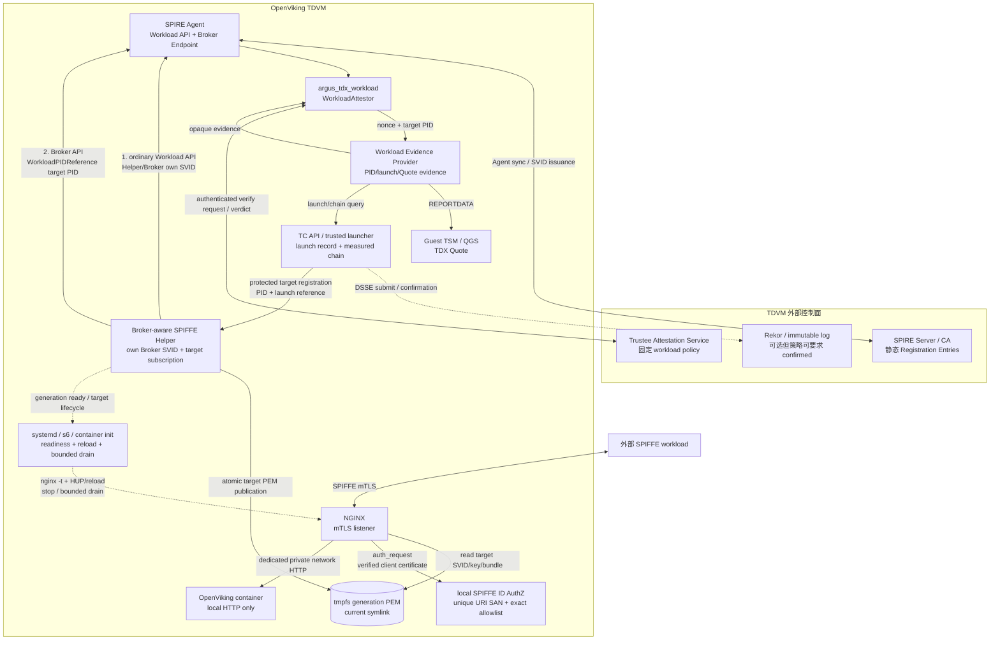
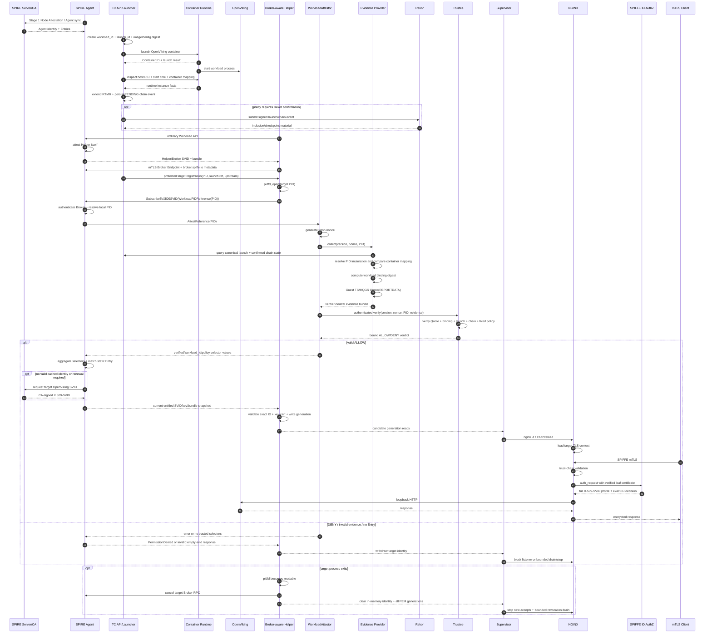
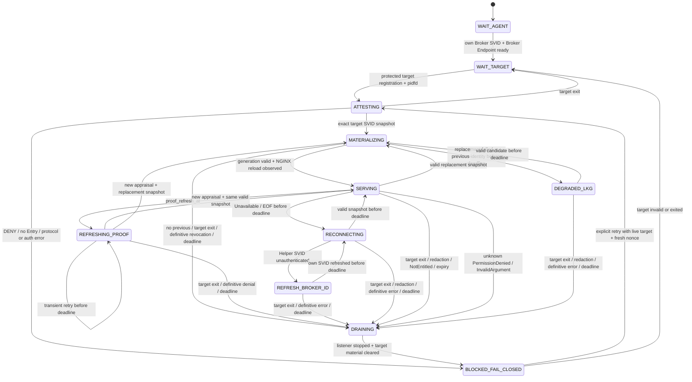

# Argus OpenViking Workload Attestation：NGINX + SPIFFE Helper 详细流程

## 文档状态

| 项目 | 说明 |
|---|---|
| 文档性质 | Stage 2 Workload Attestation 当前设计基线 |
| 目标部署 | 单个 TDVM 内的 OpenViking + Broker-aware SPIFFE Helper + NGINX |
| 身份获取接口 | 普通 Workload API 获取 Helper/Broker 自身身份；SPIFFE Broker API 获取目标 OpenViking 身份 |
| 被证明主体 | TC API 启动的具体 OpenViking 进程实例，而不是 Helper 或 NGINX 进程 |
| TLS 终止者 | NGINX |
| 目标 SVID 私钥持有者 | Broker-aware Helper 接收并写入受控 PEM，NGINX 加载并使用；OpenViking 不持有 |
| 前置条件 | Stage 1 Node Attestation 已完成，SPIRE Agent 已取得节点身份并同步 Registration Entries |
| v1 部署约束 | 每个TDVM只运行一个目标OpenViking实例；Agent、Helper、Evidence Provider使用同一host PID namespace；入站精确SPIFFE ID授权由本地AuthZ服务完成 |
| 协议冻结状态 | binding语义结构已收敛；字段字节编码、canonical schema与golden vectors仍需在实现前冻结 |
| 仓库核对基线 | `feat/argus-spiffe-v2-val`，`ebf0f74`，2026-09-02 |
| 实现状态 | 目标方案；当前仓库没有 Broker-aware Helper、目标 NGINX mTLS 配置、真实 workload Evidence Provider/Trustee E2E |

本文中的 **SPIFFE Helper** 特指基于官方
[SPIFFE Helper](https://github.com/spiffe/spiffe-helper) 扩展的
**Broker-aware SPIFFE Helper**。Stock Helper 只连接普通 Workload API，不能提交
`WorkloadPIDReference`，因此不能直接代表 OpenViking PID 触发本文的自定义
Workload Attestation。

本文不修改 Stage 1 Node Attestation 设计。Stage 1 的唯一当前事实源是
[Argus TDX + SPIFFE 两阶段真实认证重构方案](./Argus-TDX-Node-Attestation-Real-Evidence-Trustee-Refactor-Plan-CN.md)。

---

## 1. 结论

目标流程可以概括为：

> TC API 或同一可信启动边界内的 launcher 启动 OpenViking，记录本次启动的
> workload_id`、`launch_id`、容器实例、镜像与配置度量，并取得 SPIRE Agent
> 可见的宿主机 PID。Broker-aware Helper 先以自己的 Broker 身份连接 SPIRE
> Agent Broker Endpoint，再提交 `WorkloadPIDReference(OpenViking host PID)`。
> SPIRE Agent 针对该目标 PID 运行自定义 WorkloadAttestor；WorkloadAttestor
> 生成 fresh nonce，Evidence Provider 将 Node 上下文、精确进程实例和已确认
> 度量链状态规范化后绑定到新的 TDX Quote `REPORTDATA`，Trustee 在本次挑战和
> 固定 workload policy 下完成验证。只有有效 ALLOW verdict 才会被
> WorkloadAttestor 转换成 selectors；selectors 匹配静态 Registration Entry 后，
> SPIRE 才签发目标 OpenViking X.509-SVID。Helper 将该目标身份作为一代完整 PEM
> 原子发布并通知 NGINX reload；NGINX 使用该身份终止外部 mTLS，再通过不可被
> 外部绕过的本地 HTTP 链路转发给 OpenViking。

该流程必须同时保持四条边界：

1. **启动事实边界**：TC API 知道 PID，不等于它有权代表该 PID 取得身份。
2. **证明边界**：Trustee 的 ALLOW 只说明该启动实例在本次挑战和指定策略下通过验证，不表示其永远可信。
3. **身份边界**：Trustee 不签发 SVID；WorkloadAttestor 不选择最终 SPIFFE ID；Registration Entry 与 SPIRE CA 保留身份权威。
4. **TLS 边界**：SVID 表示 OpenViking workload，但目标私钥实际由 Helper 和 NGINX 代持，TLS 连接也由 NGINX 终止。

---

## 2. 安全命题与明确不证明

### 2.1 本方案需要证明什么

在本次target lifecycle首次取得OpenViking身份entitlement并交付可用SVID时，系统需要证明：

> 本次 Broker 请求引用的目标 PID，属于当前已通过 Node Attestation 的 TDVM
> 启动上下文，并且与 TC API 记录的特定 `launch_id`、容器实例、不可变镜像内容标识、
> 启动配置和已确认度量链状态一致；Evidence Provider 为 SPIRE WorkloadAttestor
> 本次 fresh nonce 生成了覆盖上述语义的 TDX Quote；Trustee 使用固定的
> workload policy 验证后返回与同一 nonce、PID 和协议版本绑定的 ALLOW verdict。

### 2.2 本方案不自动证明什么

- Node Attestation 通过，不自动证明后来启动的每个进程可信。
- TC API 成功启动容器，不自动证明 Broker 请求中的 PID 就属于该容器。
- 记录已经进入 Rekor，不自动证明记录内容真实；Rekor主要提供可包含、不可静默删除和可审计属性。
- Trustee ALLOW 不直接等于 selector、SPIFFE ID 或业务授权。
- SVID 正常轮换不等于重新生成 workload-bound Quote，也不等于重新执行 Trustee appraisal。
- NGINX `ssl_verify_client on` 只完成客户端证书链验证，不自动完成精确 SPIFFE URI SAN 授权。
- 删除 PEM 文件不等于已经从运行中的 NGINX worker 内存撤销私钥，也不会自动终止现有 TLS 连接。
- 镜像和启动配置摘要不自动证明进程运行后的内存、可写层、动态挂载或注入代码仍与初始镜像完全相同；运行时完整性需要另行定义度量事件和policy。

### 2.3 必须显式接受的信任假设

- SPIRE Server/CA、当前 Agent、Trustee verifier及其policy/reference values属于身份信任根的一部分；其中任一被攻陷都不能靠多hash几个字段恢复安全。
- TD guest kernel、Evidence Provider和trusted-launcher边界必须能可信读取目标 `/proc`、cgroup与容器运行时事实。Quote把声明与当前TD证明绑定起来，但hash本身不会把恶意观察者提供的假声明变真。
- TC API/TruCon launch record必须有明确的写入授权、owner signature或等价完整性来源；Trustee不能把任意可查询JSON当成可信启动事实。
- Broker-aware Helper和NGINX是OpenViking身份的授权代理。它们一旦被攻陷，攻击者可能在SVID或证明租约被撤销前使用目标私钥冒充OpenViking，因此必须进入目标workload的TCB与补丁、隔离、审计范围。
- 本地回环/UDS链路只有在其他不受信workload不能注入流量、读取PEM或绕过NGINX时，才可视为受保护的代理到应用边界。

---

## 3. 部署策略

### 3.1 推荐部署单元

第一阶段采用 **每个 TDVM 一个 OpenViking实例、一组 Helper + NGINX**：

```text
one OpenViking launch instance
  ├── one target PID / pidfd lifecycle
  ├── one Broker API subscription
  ├── one target SVID snapshot
  ├── one PEM generation tree
  └── one NGINX mTLS listener
```

这样可以避免一个共享 Helper 同时持有多个 workload 的私钥、PID、PEM 和 reload
状态，也使“获准的Helper只能代理本TDVM唯一目标”成为v1 Broker授权约束的一部分。
Agent、Helper与Evidence Provider必须运行在同一host PID namespace；不支持容器内PID
到host PID的隐式转换。多 workload 的 TDVM 级 Gateway、共享Broker身份或跨namespace
PID转换必须作为后续独立方案重新设计，不能直接扩展v1配置。

### 3.2 组件放置

| 位置 | 组件 | 必要访问权限 |
|---|---|---|
| TDVM 内 | SPIRE Agent | Agent/Server 通道、Workload API UDS、独立 Broker Endpoint、WorkloadAttestor plugin |
| TDVM 内 | Evidence Provider | 本地 Evidence UDS、目标 `/proc`/cgroup 或受信运行时信息、Guest TSM/QGS 路径、TC API/TruCon 证据查询 |
| TDVM 内 | TC API / trusted launcher | 容器运行时、启动记录、度量链、可选 Rekor 提交、受保护的目标登记通道 |
| TDVM 内 | OpenViking | 只监听回环或受保护的本地 HTTP；无 SPIRE socket、无 SVID 私钥目录 |
| TDVM 内 | Broker-aware Helper | 普通 Workload API、Broker Endpoint、受保护的目标 PID 登记、pidfd、PEM tmpfs、NGINX reload 权限 |
| TDVM 内 | NGINX | 只读当前 PEM generation、本地 OpenViking HTTP、外部 mTLS listener；不需要 Broker socket |
| TDVM 内 | SPIFFE ID AuthZ | 仅接收NGINX `auth_request`；按X.509-SVID profile验证本次客户端证书，再对规范化唯一SPIFFE ID执行exact allowlist；fail closed |
| TDVM 内 | 进程监督器 | 冷启动gating、Helper/NGINX异常退出、reload回滚、target退出、bounded drain与最终强制停止；stock Helper不承担完整监督职责 |
| TDVM 外控制面 | SPIRE Server/CA | Agent sync、Registration Entries、SVID 签发 |
| TDVM 外验证面 | Trustee | 认证的验证端点、TDX collateral/reference values、固定 workload policy、透明日志验证能力 |
| 可选外部日志 | Rekor | 接收 DSSE/透明日志记录并提供 inclusion/checkpoint 证明 |

### 3.3 总体拓扑



---

## 4. 组件职责

| 组件 | 必须负责 | 明确不负责 |
|---|---|---|
| TC API / trusted launcher | 启动 OpenViking；形成 `workload_id`、`launch_id`、container ID、镜像/配置度量；取得 host PID/start time；推动 RTMR/透明日志；向 Helper 提供受保护的目标引用 | 不签发 SVID；不制造 selectors；知道 PID 不构成 Broker 授权 |
| OpenViking | 提供本地业务 HTTP；作为被证明的目标进程存在 | 不连接 Workload/Broker API；不持有 SVID 私钥；不自行声明可信身份 |
| Broker-aware Helper | 获取自身 Broker SVID；认证 Broker Endpoint；持有目标 pidfd；提交目标 PID；消费目标 SVID snapshot；选择精确目标身份；原子发布 PEM；上报凭据/目标状态 | 不自行生成 selectors；不把自有 Broker SVID当作OpenViking身份；不相信业务请求传来的 PID；不替代独立进程监督器 |
| NGINX | 加载目标 PEM；终止入站 mTLS；执行证书链验证并调用本地AuthZ；转发至本地 OpenViking | 不调用 Broker API；不执行 workload appraisal；不因持有目标私钥而成为被证明的 Python PID |
| SPIFFE ID AuthZ | 重新验证单trust-domain X.509-SVID profile、唯一URI SAN与exact allowlist；清除/覆盖外部身份header | 不签发身份；不信任客户端自报header；不把普通CA链成功当成SPIFFE授权 |
| 进程监督器 | 首份身份前阻止listener；处理Helper/NGINX异常、reload回滚、target退出与有上限drain | 不选择SVID；不解析workload evidence；不把signal发送成功当成reload成功 |
| SPIRE Agent Broker Endpoint | 以`experimental.broker.brokers[]`认证/授权Broker ID与reference类型；独立解析本机PID；触发WorkloadAttestor stack；交付目标身份snapshot；按Broker API规范最终应独立监测目标生命周期 | 不相信Helper附带的自造selectors或进程属性；SPIRE 1.15.2配置不会自动把Broker限制到一个特定PID，stock 1.15.2也没有主动PID退出watcher |
| 自定义 WorkloadAttestor | 处理 `AttestReference`；生成 fresh nonce；调用 Evidence Provider 和 Trustee；验证 verdict 与请求绑定；只在有效 ALLOW 时返回 selectors | 不直接采集全部 TDX 证据；不签发 SVID；不决定最终 SPIFFE ID |
| Evidence Provider | 独立收集目标进程、容器、launch、chain 和 TDX Quote；构建 verifier-neutral evidence | 不做最终 ALLOW/DENY；不返回 selectors；不签发身份 |
| Trustee | 验证 Quote、freshness、目标实例绑定、透明链和固定 policy；返回与请求绑定的 verdict/claims | 不直接向 SPIRE 颁发 selector；不签发 SVID |
| Registration Entry | 静态描述 parent ID、目标 SPIFFE ID 与必须满足的 selectors | 不在运行时从 `verified=false` 变成 `true` |
| SPIRE Server/CA | 管理 Entries 与 trust domain；在规则匹配后签发 X.509-SVID | 不替代 Trustee 解释自定义 workload evidence |
| Rekor | 保存和证明透明日志条目被包含，提供审计/一致性材料 | 不证明日志里的 workload 声明天然真实 |

---

## 5. 三类身份与密钥边界

本文至少涉及三种不同身份，不能混用。

| 身份 | 被识别主体 | 获得方式 | 私钥实际持有者 | 用途 |
|---|---|---|---|---|
| Agent SVID | 当前 TDVM 内 SPIRE Agent | Stage 1 Node Attestation | SPIRE Agent | 连接 SPIRE Server、作为 workload Entry parent |
| Helper/Broker SVID | Broker-aware Helper 进程/部署单元 | Helper 调用普通 Workload API，Agent attestation Helper 自身 | Helper | 对 Broker Endpoint 做客户端 mTLS，证明它有资格使用 Broker API |
| OpenViking target SVID | 逻辑OpenViking服务身份；本次entitlement由具体PID/launch实例证明 | Helper 经 Broker API 提交目标 PID，目标 selectors 匹配 Entry 后取得 | SPIRE Agent生成/缓存并交付；Helper接收并写PEM；NGINX加载使用 | NGINX对外代表已获准的OpenViking服务终止mTLS |

因此对端观察到的是 OpenViking 的 SPIFFE ID，但 TLS 私钥持有证明由 NGINX 完成。
这是一种明确的代理代持/委托语义，不应写成“Python 进程自己完成了 TLS 握手”。
目标SPIFFE ID通常仍是逻辑服务身份，不会自动把`launch_id`编码进URI SAN；具体启动
实例的可信性来自本次签发前的Broker reference、workload evidence与活跃生命周期，
而不是仅从证书名字中恢复。

---

## 6. 前置配置

### 6.1 Stage 1 Node Attestation

SPIRE Agent 必须先通过当前 Stage 1 方案取得固定 Agent ID。Stage 1 的 Quote 证明
Node 加入条件；本文的新 workload-bound Quote 证明具体 OpenViking 启动实例。两者
不能互相替代。

### 6.2 Helper/Broker Registration Entry

需要一个只识别 Broker-aware Helper 的 Entry，例如：

```text
Parent ID: 当前 TDVM Agent SPIFFE ID
SPIFFE ID: spiffe://argus.local/infra/openviking-identity-broker
Selectors: helper 容器/可执行文件/Unix UID 等稳定部署属性
```

Registration Entry只负责向Helper签发Broker SVID；真正授予Broker Endpoint访问权的
是SPIRE Agent `experimental.broker.brokers[]`中的Broker ID allowlist和
`allowed_reference_types`。这仍不等于把Helper限制到某一个数值PID。v1通过“每个
Agent/TDVM只有一个可获准OpenViking目标”的部署约束缩小权限面，并明确接受该
Broker理论上可以提交本Agent范围内其他PID的剩余风险；如果同一TDVM运行多个可匹配
目标，必须增加目标级delegation policy后才能扩展，不能复用v1授权。

### 6.3 OpenViking target Registration Entry

目标 Entry 必须同时要求运行时 selectors 和自定义可信 selectors，例如：

```text
Parent ID: 当前 TDVM Agent SPIFFE ID
SPIFFE ID: spiffe://argus.local/service/openviking

Required selectors:
  docker:<expected runtime selector>
  argus_tdx_workload:verified:true
  argus_tdx_workload:workload_id:openviking
  argus_tdx_workload:policy:<pinned workload policy>
```

所有能够签发同一个 OpenViking SPIFFE ID 的 Entry 都必须要求自定义可信 selector。
如果仍保留 Docker-only 或 Unix-only 的弱 Entry，攻击者可以绕过 Trustee 门禁。

### 6.4 Broker Endpoint

Broker Endpoint 应满足：

- 与普通 Workload API 使用不同的 socket/目录和权限；
- 只允许精确的 Helper/Broker SPIFFE ID；
- 第一阶段只允许 `WorkloadPIDReference`；
- 仅限同一 TDVM 本机访问，不支持跨节点 PID reference；
- Helper 验证服务端的精确 Agent/Broker Endpoint SPIFFE ID，而不只验证 CA 链；
- 请求携带 Broker Endpoint 规范要求的 `broker.spiffe.io: true` metadata。

Broker API规范当前处于Incubating状态，SPIRE 1.15.2中的实现仍位于experimental
配置域。部署必须固定SPIFFE/SPIRE版本，并在升级时重新核对reference resolution、
snapshot、错误码和目标生命周期语义。

---

## 7. 详细时间流程

### 阶段 A：Node 前置条件成立

1. SPIRE Agent 启动并执行 Stage 1 Node Attestation。
2. SPIRE Server/Trustee 验证 Node 证据并准入固定 Agent ID。
3. Agent 取得 Agent SVID并同步授权 Entries。
4. Stage 1 未完成时，Helper、NGINX 和 OpenViking 对外入口都保持 not ready。

### 阶段 B：TC API 启动并记录 OpenViking

1. TC API 接收经过认证和授权的 OpenViking launch 请求。
2. TC API 生成 `workload_id` 与本次唯一 `launch_id`。
3. TC API 规范化镜像与安全相关启动配置，形成真实 OCI manifest digest 和
   `launch_config_digest`。
4. TC API 启动 OpenViking 容器并取得完整 Container ID。
5. 目标流程要求 TC API 或同一 trusted-launcher 边界进一步取得：
   - SPIRE Agent 所在 PID namespace 中的 OpenViking host PID；
   - `/proc/<pid>/stat` 语义的 process start time；
   - PID namespace/cgroup 到 Container ID 的映射；
   - 当前 TD boot context。
6. TC API 将这些值写入一个不可与其他 launch 混用的 canonical launch record。

当前代码已经生成 `workload_id`、`launch_id`、image/config digest 和 Container ID，
但尚未在 TC API launch record 中保存 host PID 与 process start time；这两项仍是
Stage 2 必须补齐的合同。目标实现还必须从registry/container runtime取得真实OCI
content digest，并在启动后核对实际生效配置；当前image resolver存在对image reference
做合成hash的fallback，现有`launch_config_digest`也主要覆盖请求与静态security
projection，不能直接宣称它们已经证明实际运行镜像和最终容器配置。

### 阶段 C：推进度量链并按策略确认 Rekor

1. TC API/TruCon 将 launch entries 形成确定性的事件内容摘要。
2. 事件附加 `chain_id`、`sequence_num`、`prev_event_digest` 等链上下文。
3. 系统推进本 TD 的指定 RTMR，保存本地 PENDING 记录。
4. 后台提交器按部署配置向 Rekor 提交 DSSE 记录并取得确认信息。
5. 如果 workload policy 要求“Rekor confirmed”，则在该条 launch 或包含它的链头
   完成 inclusion/checkpoint 验证之前，不允许进入可签发状态。
6. 如果部署选择不使用 Rekor，policy 必须显式定义替代的不可变证据源和最新性规则；
   不能仍把本地 PENDING 记录描述成 Rekor confirmed。

当前 TC API 的 launch 请求不会同步等待后台 Rekor confirmation。因此“启动 API
返回成功”和“Trustee 可以使用 confirmed chain state”是两个不同 readiness 条件。

### 阶段 D：Broker-aware Helper 获得自己的 Broker 身份

1. Helper 连接普通 Workload API UDS。
2. SPIRE Agent 根据 socket peer/PID 对 Helper 自身运行普通 Workload Attestors。
3. Helper selectors 匹配 Broker Entry。
4. SPIRE 返回 Helper/Broker SVID、私钥和 trust bundle。
5. Helper 用该身份连接独立 Broker Endpoint，并验证服务端精确 SPIFFE ID。

这一步证明“调用方是获准使用 Broker API 的 Helper”，还没有证明 OpenViking 可信，
也不能使用该 Broker SVID开启 OpenViking 对外 listener。

### 阶段 E：建立目标 PID 生命周期上下文

1. TC API/launcher 通过受保护的本机控制通道向 Helper 登记：

   ```text
   target_pid
   proc_start_time_ticks
   launch_id 或 launch_record reference
   runtime_instance_id
   local upstream endpoint
   ```

2. v1把该通道固定为文件权限受控的本机UDS，服务端用peer credentials只接受TC API/
   trusted-launcher专用UID；消息是单次完整替换，并以不可复用的`launch_id`拒绝旧登记
   重放。同一Helper只允许一个active target；原target退出前不得覆盖为另一PID。
3. 目标SPIFFE ID和hint来自Helper只读部署配置，不允许TC API在每次launch登记中动态
   选择最终身份。
4. Helper 不接受 OpenViking 业务请求或外部请求传入的任意 PID。
5. Helper 校验登记中的PID/start time仍与当前`/proc`一致，随后立即对`target_pid`
   执行 `pidfd_open` 并持续监控目标退出。
6. `pidfd` 只用于 Helper 本地生命周期稳定性，不会通过 Broker API 发送，也不进入
   `REPORTDATA`。
7. Helper 将 `target_pid` 与官方 Helper 的 `pid_file_name` 分成不同配置：
   - `target_pid`/`workload_reference` 指 OpenViking；
   - `pid_file_name` 指 NGINX master，用于 reload signal。

这份登记只负责把启动控制面与Broker客户端关联起来，不是Trustee直接采信的证明。
Agent/Evidence Provider仍必须独立解析PID、Container ID和launch record。

### 阶段 F：Helper 通过 Broker API 请求目标身份

1. Helper 调用：

   ```text
   SubscribeToX509SVID(
     WorkloadPIDReference(OpenViking host PID)
   )
   ```

2. SPIRE Agent 验证 Helper 的 Broker SVID、必需 metadata、reference 类型和本机调用边界。
3. Agent 将 PID reference 独立解析为当前本机进程，而不是相信 Helper 声明的
   Container ID、镜像或 selectors。
4. Agent 对该 PID 运行 Unix、Docker 与自定义 `argus_tdx_workload` WorkloadAttestors。
5. 自定义插件的普通 `Attest(PID)` 路径不应产生远程可信 selector；只有
   Broker `AttestReference` 路径进入下面的 workload evidence 流程。
6. Broker API规范要求Agent/Broker Server也监视被引用workload的生命周期，并在目标
   消失时停止该RPC。但固定SPIRE 1.15.2的Broker service只在建流时执行一次
   `AttestReference`，之后等待selector cache更新或RPC context；没有主动PID退出watcher。
7. 因此当前v1必须由Helper pidfd首先检测目标退出并立即cancel该RPC。若要宣称服务端也
   满足Broker API生命周期MUST，需要为SPIRE 1.15.2增加server-side watcher patch，或采用
   已实现该能力的替代版本，并单独做“Helper失效时服务端仍能停流”的集成测试。

### 阶段 G：WorkloadAttestor 发起本次证明

1. `argus_tdx_workload` 接收目标 PID。
2. 插件生成新的 256-bit nonce。
3. 插件向本地 Evidence Provider 发送强类型请求，至少携带：

   ```text
   protocol_context/version
   fresh_nonce
   target_host_pid
   ```

4. PID 只是查找键。Evidence Provider 必须独立读取当前进程 incarnation、容器映射
   与 launch record，不能直接使用 Helper 提供的扩展属性。

### 阶段 H：Evidence Provider 构造 workload-bound TDX evidence

1. Evidence Provider对收到的数值PID自行执行`pidfd_open`，再读取目标 `/proc`、PID
   namespace、cgroup/container runtime，得到当前
   `host_pid + process_start_time + resolved_runtime_instance_id`。
2. Provider 查询 TC API/TruCon，取得目标 launch record 与经过 policy 要求确认的链状态。
3. Provider 验证进程解析出的 Container ID 与 launch record 中的 runtime instance ID 相同。
4. Provider 规范化 Node 上下文、目标实例和链状态，计算第 9 节定义的 binding digest。
5. Provider 将 `binding_digest || zero[16]` 写入 64-byte TDX `REPORTDATA`，通过 Guest
   TSM/QGS 获取新的 raw TDX Quote。
6. Quote返回后，Provider在释放自己的pidfd前再次核对process start time与container
   mapping；目标已经退出或incarnation发生变化时丢弃证据并fail closed。
7. Provider 返回 verifier-neutral evidence bundle，包括 Quote、未哈希的规范化字段、
   launch/chain material、Rekor proof/checkpoint（若策略要求）和算法标识。
8. Provider 不返回 ALLOW/DENY、selectors 或 SVID。

即使进行前后两次检查，Quote证明的仍是Provider在evidence time观察并绑定的实例事实，
不是TDX硬件直接读取了Python进程，也不保证该进程此后持续存活。取证完成到NGINX
开始服务之间的剩余TOCTOU由Helper pidfd与进程监督器共同关闭。

### 阶段 I：Trustee 验证并返回 verdict

1. WorkloadAttestor 通过经过认证的 HTTPS/mTLS 通道把 exact evidence 交给 Trustee。
2. Trustee 验证：
   - TDX Quote 签名、collateral、measurement 与 debug/TCB policy；
   - `REPORTDATA` 与规范化 transcript 完全一致；
   - nonce 与本次请求一致且未重放；
   - Quote绑定的PID/start time/boot context声明表示取证时的进程incarnation；
   - Quote绑定的进程到Container ID声明与launch record一致；
   - image/config/launch record 满足固定 workload policy；
   - 目标 launch event 被包含在绑定的 chain state 中；
   - 根据完整链重放得到的预期RTMR值与同一Quote内受签名保护的RTMR值一致；
   - Rekor inclusion/checkpoint 与链最新性满足策略。
3. Trustee 返回与 `protocol version + nonce + PID` 绑定的 verdict，例如：

   ```json
   {
     "protocol_version": 1,
     "nonce": "<same nonce>",
     "pid": 4321,
     "decision": "allow",
     "stable_error_code": "OK",
     "workload_id": "openviking",
     "policy_id": "openviking-workload-v1"
   }
   ```

4. 这里的准确表述是：

   > 该启动实例在本次 challenge 和指定 workload policy 下通过了验证。

   不能写成“Trustee 已永久确认这个 workload 可信”。

Trustee是远端verifier，不能自行读取TDVM当前`/proc`。它验证的是受信Provider在
evidence time观察、规范化并由同一Quote绑定的事实，以及这些事实与透明记录和policy
之间的一致性；持续存活由本地pidfd/supervisor负责。

### 阶段 J：verdict 转换为 selectors，SPIRE 签发 SVID

1. WorkloadAttestor严格检查 verdict 回显的 version、nonce 和 PID。
2. 只有 `decision=allow`、`stable_error_code=OK` 且 workload/policy 字段合法时，插件返回：

   ```text
   argus_tdx_workload:verified:true
   argus_tdx_workload:workload_id:openviking
   argus_tdx_workload:policy:openviking-workload-v1
   ```

3. SPIRE Agent 汇总各 WorkloadAttestors 的 selectors。
4. 完整 selector 集合匹配预先存在的 OpenViking Registration Entry。
5. Agent使用当前有效缓存，或在缺失/需要轮换时向SPIRE Server/CA取得CA签发的目标
   OpenViking X.509-SVID；一次新的appraisal不保证证书serial必然变化。
6. Agent 通过 Broker API stream 向 Helper 交付当前获准的目标身份 snapshot。

Trustee 返回的是 verdict/claims；真正向 SPIRE 返回 selector values 的是
WorkloadAttestor；真正签发 SVID 的仍是 SPIRE。

### 阶段 K：Helper 原子发布目标 PEM

1. Helper把每个 Broker stream 响应视为目标身份的完整 snapshot。
2. `svids`为空属于协议无效响应，Helper必须丢弃并fail closed；目标存在但无entitlement
   时服务端应返回`PermissionDenied`，并应携带`google.rpc.ErrorInfo`：
   `domain=spiffe.io`、`reason=WORKLOAD_NOT_ENTITLED`，而不是发送正常空snapshot。
   后续非空snapshot不再包含此前目标ID时，视为target identity redaction并立即撤下
   目标身份。
3. Helper按精确 OpenViking SPIFFE ID或明确 hint 选择目标身份，不能使用列表第一项。
4. Helper校验：
   - URI SAN 等于预期目标 SPIFFE ID；
   - 证书链可由对应 trust-domain bundle 验证；
   - 私钥与叶证书公钥匹配；
   - SVID 尚未过期；
   - snapshot 中没有同 hint/ID 的歧义身份。
5. Helper写入新的 generation：

   ```text
   /run/spiffe/openviking/
     generations/
       <generation-id>/
         svid.pem
         svid_key.pem
         svid_bundle.pem
     current -> generations/<generation-id>
   ```

6. 三个文件全部写入并验证成功后，原子切换 `current` symlink。
7. PEM 目录使用 tmpfs；私钥只允许 Helper 写、NGINX master 读，OpenViking 和其他
   workload 无权读取。

Stock SPIFFE Helper v0.11.0 对三个固定文件顺序写入，不保证整代原子切换。本文的
generation publisher 是 Broker-aware fork 必须新增的安全能力。

### 阶段 L：NGINX reload 并开放数据面

1. 冷启动时由独立 supervisor 等待首个完整 PEM generation。
2. supervisor 执行 `nginx -t`，成功后首次启动 NGINX。
3. 后续 SVID/bundle 更新时保留`previous` generation：Helper发布candidate并原子切换
   `current`，supervisor执行`nginx -t`；验证失败时立即把`current`回滚到`previous`。
   如果previous重新验证成功且尚未到`identity_use_deadline`，进入`DEGRADED_LKG`并
   标为不健康；否则立即进入`DRAINING -> BLOCKED_FAIL_CLOSED`。
4. `nginx -t`成功后才发送`SIGHUP`/reload；外部探针未在超时内观察到candidate
   fingerprint时，supervisor回滚`current`并重新加载previous generation。previous
   恢复且仍在绝对期限内时进入`DEGRADED_LKG`/告警；previous不可用或期限已到时进入
   `DRAINING -> BLOCKED_FAIL_CLOSED`，而不是静默继续报告成功。
5. Helper 的 `pid_file_name` 指向 NGINX master PID；对 NGINX 使用 `HUP`，不能误用
   只负责 reopen logs 的 `USR1`。
6. 新 workers 加载新 generation；旧 workers 停止接受新连接并按有上限策略处理已有连接。
7. 外部探针必须验证 listener 实际出示的新 serial/fingerprint，不能只看 signal
   发送成功。
8. NGINX listener ready 后，实例才进入可服务状态。

### 阶段 M：外部 mTLS 与本地转发

1. 外部客户端连接 NGINX mTLS listener。
2. NGINX出示 OpenViking target X.509-SVID并证明持有对应私钥。
3. 客户端验证 trust-domain bundle 和精确 OpenViking URI SAN。
4. NGINX要求客户端证书，并用单一`argus.local` trust-domain bundle验证其证书链。
5. NGINX通过`auth_request`把本次TLS会话的escaped leaf certificate交给本地AuthZ；
   AuthZ按X.509-SVID profile重新验证唯一URI SAN、trust domain和exact allowlist。
6. 成功后 NGINX通过与OpenViking共享的专用network namespace内
   `127.0.0.1:1933`转发普通HTTP。该namespace不得加入其他不受信容器，且1933不发布
   到TDVM host或外部网络。
7. NGINX先删除外部同名身份header，再写入由本次已验证TLS会话产生的内部header。
8. v1只允许同一`argus.local` trust domain，暂不支持federation或CRL交付；需要这些
   能力时必须重新设计按trust domain选择bundle和同代snapshot的验证路径。

---

## 8. 完整时序图



---

## 9. Workload Quote binding 目标结构

### 9.1 字段收敛原则

不要把所有字段无结构地拼成一个列表。当前已经收敛的是下列语义结构，而不是
可直接互操作的最终字节协议：

```text
fixed protocol context
+ fresh nonce
+ node_context_digest
+ target_instance_digest
+ chain_state_digest
```

完整字段随 Quote 一起发送给 Trustee；`REPORTDATA` 只放确定性 transcript 的摘要。

### 9.2 子摘要

```text
protocol_context =
  "argus-spire/workload-binding/v1"

node_context_digest =
  SHA384(canonical(
    agent_spiffe_id,
    td_boot_id
  ))

launch_record_digest =
  SHA384(canonical(
    workload_id,
    launch_id,
    recorded_runtime_instance_id,
    oci_manifest_digest,
    launch_config_digest
  ))

target_instance_digest =
  SHA384(canonical(
    host_pid,
    proc_start_time_ticks,
    pid_namespace_inode,
    observed_runtime_instance_id,
    launch_record_digest
  ))

chain_state_digest =
  SHA384(canonical(
    chain_id,
    sequence_num,
    prev_event_digest,
    head_event_digest
  ))

binding_digest =
  SHA384(
    LP(protocol_context)
    || LP(fresh_nonce)
    || LP(node_context_digest)
    || LP(target_instance_digest)
    || LP(chain_state_digest)
  )

TDX_REPORTDATA = binding_digest || zero[16]
```

`agent_spiffe_id`是Stage 1分配给当前Agent的canonical SPIFFE ID字符串；`td_boot_id`
是Provider从当前guest boot context取得并解析后的16-byte UUID。二者都是v1必选字段，
不设置可选的`node_attestation_context`。Stage 1与Stage 2的授权衔接仍主要来自“已经
准入的Agent本地调用该WorkloadAttestor”，`node_context_digest`用于防止跨Agent/跨boot
复用进程事实，不应被夸大成一份独立的Server签名Node admission receipt。

`LP`计划定义为`uint32` big-endian长度加原始字段bytes。实现前仍必须冻结：字符串
UTF-8/大小写规则、整数宽度和字节序、UUID与digest的raw/hex表示、空值规则、字段顺序、
launch/chain canonical schema以及拒绝未知字段的行为，并为Provider和Trustee生成共同
golden vectors。在这些事项完成前，本节只能称为binding目标结构，不能称为已冻结线协议。

### 9.3 原始 binding 字段的去除与整合决策

| 原始事实 | 处理 | 最终归属与理由 |
|---|---|---|
| domain separator + protocol version | 合并 | 固化为单一、带版本的`protocol_context`，避免两个可独立组合的自由字段 |
| fresh nonce | 顶层保留 | 证明本次挑战新鲜度；Rekor timestamp、launch ID或证书serial都不能替代 |
| Agent identity + boot context | 合并 | 放入`node_context_digest`；只绑定canonical Agent ID和本次boot，不绑定会轮换的Agent证书serial |
| workload ID + launch ID | 保留但下沉 | 两者语义不同：前者驱动受限selector，后者区分启动实例；共同进入`launch_record_digest` |
| container ID | 改名并拆成两份观察 | `recorded_runtime_instance_id`来自launch record，`observed_runtime_instance_id`来自当前PID解析；两值都进入transcript，Trustee必须比较相等 |
| image digest + launch config digest | 下沉 | 进入`launch_record_digest`；只接受真实OCI content digest与规范化实际配置，不在顶层重复 |
| host PID + process start time + PID namespace | 合并 | 进入`target_instance_digest`；数值PID单独不构成稳定进程身份 |
| measured chain position/head | 合并 | 进入`chain_state_digest`；单个event digest不能表达顺序、前驱和当前head |
| Rekor entry ID/proof/checkpoint | 移出身份摘要 | 作为Quote旁边的验证材料；它们证明包含/视图，不是workload身份，且proof编码可能更换 |
| pidfd | 删除出线协议 | 只作为Helper和Provider本地生命周期句柄，不序列化、不进入Quote |

因此原始平铺列表不再同时保留`container_id`与多个同义runtime字段，也不保留
`confirmed_rekor_head`这种把“日志证明材料”和“进程身份”混在一起的字段。唯一有意
出现两次的运行时实例语义分别来自launch记录和当前PID观察；如果只保留其中一个，
Trustee就无法验证“启动时登记的容器”和“现在被引用PID所属容器”是否相同。

### 9.4 最新性仍需独立策略

fresh nonce 只能证明 Quote 针对本次请求生成，不能阻止 Provider 在新 Quote 中引用
一个旧但曾经合法的链头。因此 Trustee 仍需执行至少一项链最新性策略：

- 在线查询 Rekor/透明日志的当前状态；
- 限制 signed checkpoint 最大年龄；
- 要求 sequence 不低于 policy 记录的最低值；
- 检查目标 launch event 可达且之后没有策略定义的终止/撤销事件。

单个inclusion proof只证明条目相对于某个已签名checkpoint被包含。“不能静默删除”还
依赖checkpoint持久化、consistency proof以及独立witness/gossip或等价监测。v1 policy
必须明确它信任哪些checkpoint signer和持久化/见证来源，不能只因取得一个Rekor UUID
就声称获得全局一致的最新视图。

---

## 10. selector、policy 与 SVID 签发边界

正确顺序是：

```text
Trustee verdict/verified claims
  -> WorkloadAttestor validates request binding
  -> WorkloadAttestor returns selector values
  -> Agent aggregates all selectors
  -> static Registration Entry matches
  -> SPIRE Server CA issues SVID
```

当前插件会将合法 ALLOW verdict 转换为：

```text
verified:true
workload_id:<value>
policy:<value>
```

在 SPIRE 中它们由 `argus_tdx_workload` selector type 承载。

`workload_id`必须由Trustee从已验证launch record派生，`policy`必须等于本地固定的
expected policy；两者都不能直接复制Helper、TC API请求参数或调用方自报值后生成
selector。

必须额外修正一个策略边界：当前插件只要求 Trustee 返回非空、语法合法的
`PolicyID`，插件配置尚未 pin `expected_policy_id` 或 policy digest。目标实现应选择：

1. Trustee endpoint 固定且只能执行唯一 workload policy，插件配置同时 pin 预期 policy；或
2. 如果请求可以选择 policy，则把 `expected_policy_digest` 纳入 challenge transcript 并严格比对 verdict。

不能允许调用方或被攻陷的中间组件选择一个更宽松 policy，再把其 ALLOW 作为同等可信
selector 使用。

---

## 11. Broker-aware Helper 的必要扩展

可以直接基于官方 SPIFFE Helper 延伸，但应把身份来源扩展为独立模块，而不是修改
几行配置后声称 stock Helper 已支持 Broker。

### 11.1 可复用部分

- HCL 配置与进程运行框架；
- PEM certificate/key/bundle 输出；
- daemon/watch/reconnect 基础结构；
- `pid_file_name`、signal/cmd 通知；
- 基础 health/metrics；
- 文件 mode 与目录配置。

### 11.2 必须新增部分

- 保留并隔离stock Helper的普通Workload API identity source，用它只获取Helper/Broker自身身份；
- 使用自身 SVID 对 Broker Endpoint 做 mTLS和精确服务端 SPIFFE ID验证；
- Broker API `SubscribeToX509SVID` 客户端；
- `target_pid_file` 或受保护 `workload_reference` 输入，不能复用 reload PID file；
- 目标 pidfd 生命周期；
- 精确目标 SPIFFE ID/hint 选择；
- full snapshot replace 与 identity removal 处理；
- Broker错误到 fail-closed 状态的映射；
- generation directory + atomic `current` 发布；
- 目标退出、DENY、协议无效空响应、target identity redaction和SVID expiry时对NGINX listener/drain的协调；
- 强制重新 appraisal 的 proof lease/重新订阅策略。

### 11.3 建议状态机



状态不变量如下：

- `DEGRADED_LKG`只允许使用已经验证且仍在绝对期限内的previous generation；definitive
  denial、target exit和identity redaction绝不能进入该状态。
- `MATERIALIZING`（存在previous时）、`SERVING`、`REFRESHING_PROOF`、`RECONNECTING`、
  `REFRESH_BROKER_ID`和`DEGRADED_LKG`都可能持有目标身份；任一状态发生target exit、
  identity redaction、definitive denial或absolute deadline时都必须立即进入`DRAINING`。
- 定义`last_valid_target_snapshot_at`为Helper完整验证最近一次target snapshot的本地时刻，
  `staleness_deadline = last_valid_target_snapshot_at + max_staleness_duration`，再计算：

  ```text
  identity_use_deadline =
    min(SVID NotAfter, proof_lease_deadline, staleness_deadline)
  ```

  实现应把这些时间点映射到同一单调时钟deadline，避免wall clock回拨延长期限。只有
  新收到并完整验证的target snapshot可以建立新的`staleness_deadline`；状态切换、重试
  或刷新Helper自身SVID都不能后移现有期限，普通SVID snapshot也不能更新proof lease。
- `DRAINING`立即停止接受新连接，并在有界期限内结束已有连接。
- `BLOCKED_FAIL_CLOSED`表示listener已停止、目标内存状态与全部PEM generations已清除；
  它不能继续对外服务previous generation。

---

## 12. NGINX 数据面与授权限制

### 12.1 目标配置形态

以下只说明接点，不是可直接部署的完整配置：

```nginx
upstream argus_spiffe_authz {
    server unix:/run/argus-authz/authz.sock;
}

server {
    listen 1943 ssl;

    ssl_protocols TLSv1.2 TLSv1.3;
    ssl_certificate     /run/spiffe/openviking/current/svid.pem;
    ssl_certificate_key /run/spiffe/openviking/current/svid_key.pem;

    ssl_client_certificate /run/spiffe/openviking/current/svid_bundle.pem;
    ssl_verify_client on;
    ssl_session_tickets off;
    ssl_session_cache off;

    location / {
        auth_request /_spiffe_authz;
        proxy_pass http://127.0.0.1:1933;
    }

    location = /_spiffe_authz {
        internal;
        proxy_pass http://argus_spiffe_authz;
        proxy_set_header X-Verified-Client-Cert $ssl_client_escaped_cert;
        proxy_set_header X-Nginx-Client-Verify $ssl_client_verify;
    }
}
```

NGINX与OpenViking必须共享一个只包含这两个业务组件的专用network namespace，
OpenViking只绑定该namespace的`127.0.0.1:1933`；不同普通容器中的`127.0.0.1`
不是同一地址，不能把两个独立network namespace按此示例连接。

### 12.2 不能省略的授权层

Stock NGINX能验证客户端证书链，但没有 SPIFFE-aware 的唯一 URI SAN exact matcher。
v1固定使用本机UDS上的独立AuthZ服务，并由NGINX `auth_request`调用，不在v1中同时
保留njs、自定义module或额外TLS代理等多条运行路径。AuthZ必须：

- 只接受受限NGINX UID通过本机UDS访问；
- 只接受`$ssl_client_verify=SUCCESS`的请求，并重新解析escaped leaf certificate；
- 按SPIFFE X.509-SVID profile验证证书、唯一URI SAN和规范化SPIFFE ID；
- 确认trust domain为`argus.local`，再执行完整SPIFFE ID exact allowlist/policy；
- 对证书缺失、多个URI SAN、非SPIFFE URI、解析失败或policy无匹配全部fail closed；
- 返回经过认证的内部主体值，供NGINX覆盖写入后端header。

外部传入的 `X-SPIFFE-ID`、`X-Client-Cert` 等 header 必须先删除，再由已验证 TLS
会话生成，不能把客户端自报 header 当作身份。

v1不启用federated bundle和CRL传递。NGINX的PEM snapshot只包含`argus.local`
验证材料；跨trust-domain连接必须在后续设计中引入SPIFFE-aware bundle选择，不能把
多个trust-domain roots混入一个通用CA池。

### 12.3 私钥与文件

- PEM 必须位于 tmpfs 或同等级内存卷；
- Agent socket 与 PEM 目录权限分离，NGINX不需要访问 Agent/Broker socket；
- 私钥目录不得挂载给 OpenViking、日志采集、备份或调试容器；
- 明确 Helper 与 NGINX master 的 UID/GID/ACL；
- 禁止 world-readable key；
- 控制 Helper/NGINX core dump，因为进程内存也包含私钥。

---

## 13. SVID 轮换、重新证明与退出

### 13.1 普通 SVID 轮换

Broker stream 后续推送目标 SVID/bundle snapshot时：

1. Helper 验证并发布新 generation；
2. NGINX graceful reload；
3. 新连接使用新 SVID；
4. 旧连接和旧 worker 在独立的 `max_rotation_drain` 内退出；到期由supervisor强制终止
   旧worker，不能让WebSocket、gRPC或长keepalive无限延长旧身份使用时间。

这通常是证书生命周期更新，不表示 WorkloadAttestor、Evidence Provider 和 Trustee
再次执行了完整证明。v1同时关闭服务端TLS session tickets和共享session cache，避免
reload后新连接通过会话恢复继续沿用旧TLS身份上下文；如果后续重新启用，必须把恢复
票据寿命纳入同一个轮换上限。

### 13.2 强制重新 Workload Attestation

如果 policy 要求定期重新检查 launch/chain/TDX 状态，应定义两个时间点：

```text
proof_refresh_at < proof_lease_deadline
proof_refresh_at = proof_lease_deadline - refresh_margin
```

`refresh_margin`必须覆盖一次完整appraisal的最大耗时和允许的重试预算。在
`proof_refresh_at`开始刷新，而不是等到租约已经到期：

1. Helper关闭当前目标 Broker subscription；
2. 确认原 target pidfd仍对应存活进程；
3. 重新提交相同目标 PID；
4. Agent重新执行 `AttestReference`；
5. WorkloadAttestor生成新 nonce和新 Quote；
6. Trustee产生新的appraisal，WorkloadAttestor重新返回selectors并匹配同一个静态Entry；
7. Agent交付当前有效的目标SVID snapshot。它可能是仍有效的缓存SVID，也可能是按需
   重新签发的SVID，不能以serial变化作为重新证明成功的条件。

“关闭后重新订阅会再次执行 `AttestReference`”是v1 proof lease所依赖、但尚未取得
本仓库集成证据的SPIRE 1.15.2版本特定假设。必须先用版本锁定测试确认，才能写成已
验证实现行为；Broker API规范本身不承诺所有实现都以这种方式强制重新appraisal。
Registration Entry始终是同一个静态Entry，不会因proof lease重新创建。

proof lease控制的是Helper/NGINX serving gate：到`proof_lease_deadline`仍未取得可关联
的新nonce、Quote和ALLOW appraisal，就停止接受新连接。刷新从`SERVING`进入
`REFRESHING_PROOF`，瞬时失败只允许在既有`identity_use_deadline`前重试；成功后按收到
的snapshot回到`SERVING`或`MATERIALIZING`。旧身份不能无限沿用last-known-good，也不能
用“证书还没过期”覆盖已经到期的证明租约。

### 13.3 OpenViking退出或重启

目标 pidfd报告退出时：

1. Helper立即cancel Broker subscription/RPC；
2. 固定SPIRE 1.15.2因RPC context取消而结束该stream；不能把这描述成Agent主动监测
   目标退出。server-side独立监测仍需要patch或替代版本；
3. Helper清除该目标的内存SVID/key/bundle、`current`/`previous`引用以及磁盘中的全部
   PEM generations，不能只删除当前symlink；
4. supervisor立即阻止新连接，并对已有连接执行revocation drain；v1要求
   `max_revocation_drain <= 30s`，到期强制终止旧worker和连接；
5. OpenViking重启后取得新 PID、start time和 launch ID；
6. 从目标登记和 Workload Attestation重新开始。

不得把旧PID subscription、旧entitlement或旧serving state转移给重启后的进程。新进程
必须用新的process start time、boot context、container/launch mapping完成全新appraisal。
如果它仍匹配同一个逻辑服务Entry，Agent可能再次交付仍有效的缓存SVID，因此serial和
key不保证变化；这不等于复用了旧进程的entitlement。如果威胁模型要求每个launch必然
使用新密钥，必须另行增加Agent缓存失效/强制rekey合同和验收，当前方案未提供这一保证。

退出后的本地停止不能让已经外泄或复制的私钥失效；其最坏冒充窗口仍受目标SVID TTL
限制。因此目标SVID必须使用短TTL，且proof lease不得长于可接受的凭证暴露窗口。

### 13.4 Broker stream 与 last-known-good

Broker stream错误必须按语义分类，不能统一按瞬时断线重试：

| 事件 | Helper/监督器行为 | last-known-good规则 |
|---|---|---|
| `Unavailable`或普通EOF | 立即重连并有界退避；保持目标pidfd监控 | 仅可用到既有`identity_use_deadline` |
| `Unauthenticated` | 刷新Helper自己的Broker SVID后重连 | 不延长原期限 |
| `PermissionDenied` + `ErrorInfo(domain=spiffe.io, reason=WORKLOAD_NOT_ENTITLED)` | 视为目标确定失去entitlement，立即清除并进入revocation drain | 禁止使用last-known-good |
| Endpoint级或没有可识别`ErrorInfo`的`PermissionDenied` | 无法安全归类时撤下目标身份、进入`BLOCKED_FAIL_CLOSED`并告警，不盲目重试 | 禁止依赖错误字符串猜测并保留身份 |
| target-scoped RPC返回任何`NotFound`，或identity redaction | 无论是否附`WORKLOAD_NOT_FOUND` detail都视为目标不存在，立即清除并进入revocation drain；detail只用于诊断 | 禁止使用last-known-good |
| `InvalidArgument` | 视为协议/配置错误，进入`BLOCKED_FAIL_CLOSED`并要求修复 | 禁止按瞬时故障无限重试 |
| 正常响应但`svids`为空 | 视为协议无效响应，丢弃并fail closed | 禁止解释为“暂无更新” |

任何 definitive revocation、target exit、proof lease expiry或SVID expiry都优先于
断流时的last-known-good窗口。

API层“目标无entitlement”和Broker Endpoint层“调用者未授权”都可能使用gRPC
`PermissionDenied`。Helper只在收到规范化`google.rpc.ErrorInfo`时区分二者；如果
固定SPIRE 1.15.2没有提供该detail或返回未知reason，统一采取撤下目标身份并进入
`BLOCKED_FAIL_CLOSED`的fail-closed行为。状态区分只影响告警与恢复操作，不影响凭证撤回。

`NotFound`不同：该RPC本身已经绑定单一target reference，因此code-only `NotFound`
足以表示目标当前不存在；`ErrorInfo`不是执行清理动作的前提。

---

## 14. 失败语义

| 故障 | 预期行为 | 禁止行为 |
|---|---|---|
| Stage 1 Node Attestation未完成 | 整个 workload入口 not ready | 先启动匿名/明文外部入口 |
| Helper无法取得自身 Broker SVID | 不连接 Broker Endpoint | 使用静态证书或目标旧证书回退 |
| Broker服务端SPIFFE ID不符 | 拒绝连接 | 只验证同 trust-domain CA |
| TC API目标登记缺失/来源不可信 | 不提交 PID | 接受业务请求传来的 PID |
| PID不存在或已退出 | `NotFound`/`WAIT_TARGET`或`BLOCKED_FAIL_CLOSED` | 尝试最近一个 PID |
| PID被复用 | start time/boot/container/launch不一致，DENY | 只比对数值 PID |
| Container ID与launch record不一致 | DENY | 采信 Helper 声明绕过独立解析 |
| Rekor仍PENDING且policy要求confirmed | 暂不签发 | 将本地提交成功写成Rekor已确认 |
| Quote/QGS/Provider失败 | 无可信 selectors | 使用 Node旧Quote代替 workload Quote |
| Trustee超时或DENY | 无可信 selectors、无目标 SVID | 仅凭Docker/Unix selectors签发目标ID |
| verdict nonce/PID/version不匹配 | 丢弃 verdict | 接受跨请求 ALLOW |
| policy ID不是本地pin值 | 丢弃 verdict | 接受任意非空 policy ID |
| selector未匹配 Entry | Broker snapshot不含目标身份 | 由Helper自选SPIFFE ID |
| 后续非空snapshot删除目标SVID | 视为identity redaction，立即撤下并进入revocation drain | 继续使用旧 snapshot |
| 正常响应的`svids`为空 | 协议无效，丢弃并fail closed | 当成正常“空snapshot” |
| target-scoped NotFound（有或无`ErrorInfo`） | 目标不存在，清除目标状态并进入revocation drain | 等待detail或以网络故障语义保留last-known-good |
| workload NotEntitled（结构化`ErrorInfo`） | 确定撤权，清除目标状态并进入revocation drain | 以网络故障语义保留last-known-good |
| Broker Unavailable/EOF | 有界退避重连；仅在三重期限内使用last-known-good | 永久保留旧身份或误判为确定撤权 |
| Broker Unauthenticated | 刷新Helper Broker SVID后重连 | 用目标SVID冒充Broker调用身份 |
| Endpoint或未知 PermissionDenied/InvalidArgument | 撤下目标身份、进入`BLOCKED_FAIL_CLOSED`、告警并修复授权或协议配置 | 依赖错误字符串猜测或无界瞬时重试 |
| PEM任一文件写入/校验失败 | 不切换 generation、不reload | 对混合代文件reload |
| NGINX reload失败 | previous仍有效且在deadline前则回滚并进入`DEGRADED_LKG`；否则`DRAINING -> BLOCKED_FAIL_CLOSED` | 只因HUP发送成功就报告healthy，或在`BLOCKED_FAIL_CLOSED`继续服务previous |
| SVID到期且无法刷新 | 停止新连接并fail closed | 无限使用过期或last-known-good身份 |
| target PID退出 | Helper pidfd触发cancel RPC、清空内存和全部PEM代；NGINX在30秒内停止使用 | 等待stock Agent主动发现退出，或只删除磁盘PEM而保留可接新连接的worker |

---

## 15. 当前仓库实现状态

### 15.1 已存在的代码基础

| 能力 | 当前代码事实 |
|---|---|
| Stage 1 Node Attestation | 当前实施主线；真实 TDX Evidence Provider 与 Node binding 已单独设计/实现 |
| TC API launch事实 | 已生成 `workload_id`、`launch_id`、image/config digest和Container ID，并写入TruCon/映射存储 |
| 自定义 WorkloadAttestor骨架 | 已实现 Broker `AttestReference(WorkloadPIDReference)`、fresh nonce、Evidence/Trustee client、verdict binding与selector values |
| Go Broker Sidecar历史实现 | 已有PID订阅、内存SVID和Go TLS reverse proxy代码，但它不是本文Helper/NGINX方案 |
| 通用Helper/NGINX研究 | 已有通用部署文档，覆盖PEM、reload、权限和stock NGINX授权限制 |

### 15.2 仍未实现或未接线

| 缺口 | 当前状态 |
|---|---|
| Broker-aware SPIFFE Helper fork | 不存在；stock Helper不能调用 Broker API |
| `target_pid`受保护登记协议 | 不存在 |
| PID/start time/boot/container/launch完整记录 | TC API当前没有保存host PID/start time |
| 真实镜像与实际启动配置摘要 | 当前image digest允许合成fallback，config digest主要覆盖请求/静态projection，尚未完成运行后核对 |
| workload binding schema | 当前插件请求只有version/nonce/PID；第9节目标结构尚未实现，字节合同与golden vectors也未冻结 |
| workload Evidence Provider endpoint | 插件要求的 `/ra/v1/workload-evidence`没有对应生产服务端 |
| workload-bound真实TDX Quote | 未实现；当前attested-head Quote只绑定`head_log_id` |
| Trustee workload policy与服务端 | 当前只有客户端合同/测试替身，没有真实E2E |
| expected workload policy pin | 插件配置尚未提供 |
| SPIRE Agent Broker/Plugin HCL | 仓库没有可执行部署配置 |
| Broker/OpenViking Registration Entries | 仓库没有可执行配置/注册脚本 |
| proof lease重订阅语义 | 依赖SPIRE 1.15.2重订阅会重新运行`AttestReference`的版本特定假设；尚无集成证据 |
| Broker服务端目标生命周期 | Broker API要求server-side停流；stock SPIRE 1.15.2没有主动PID退出watcher，需要patch/替代版本与集成测试 |
| 原子PEM generation publisher | 未实现 |
| OpenViking NGINX mTLS listener | 未实现；现有NGINX只是TC API普通HTTP反代 |
| 本地X.509-SVID AuthZ | 未实现；v1已固定为UDS `auth_request`服务，但没有代码/部署单元 |
| Helper/NGINX独立supervisor与有界drain | 未实现 |
| NGINX/OpenViking共享专用network namespace | 未形成可执行部署配置 |
| 真实Linux/TDX/Trustee端到端验收 | 未完成 |

因此本文是 **当前讨论形成的目标流程与实现合同**，不是“当前仓库已经可以部署运行
NGINX + Helper workload attestation”的证明。

---

## 16. 实施顺序

为避免同时改变所有边界，建议按下列顺序推进：

1. 冻结 Stage 2 protocol、binding golden vectors和expected policy pin。
2. 补齐 TC API/launcher 的 host PID、start time、boot/container/launch canonical record。
3. 实现 workload Evidence Provider endpoint和真实 workload-bound Quote。
4. 实现/对接固定 workload Trustee policy及正负例。
5. 先用最小 Broker API客户端验证 `AttestReference -> selectors -> Entry -> target SVID`，
   同时验证重订阅与stock 1.15.2目标退出行为；补server-side watcher patch或选择满足
   Broker API生命周期要求的替代版本。
6. 在官方 Helper fork中保留并隔离stock Workload API identity source，再加入Broker
   target identity source、target lifecycle和snapshot/错误状态机。
7. 加入原子PEM generation publisher、独立supervisor、回滚以及普通轮换/撤权两类
   有界drain。
8. 实现本地X.509-SVID AuthZ，并把NGINX与OpenViking放入无其他不受信workload的
   共享专用network namespace。
9. 执行Linux容器、真实TDX/QGS、真实Trustee、Rekor、SPIRE 1.15.2重订阅行为和
   生命周期故障注入。

---

## 17. 验收标准

### 17.1 身份与证明

- [ ] Agent先通过真实Stage 1 Node Attestation。
- [ ] Helper只能取得自己的Broker SVID，不能通过普通Workload API取得OpenViking目标ID。
- [ ] 只有授权Helper可以连接Broker Endpoint并提交`WorkloadPIDReference`。
- [ ] Agent实际attest的是OpenViking host PID，不是Helper或NGINX PID。
- [ ] Quote `REPORTDATA`覆盖fresh nonce、Node context、精确进程实例与chain state。
- [ ] 冻结canonical字段类型/顺序、整数宽度与字节序、UUID和digest的raw/hex表示、
      `LP`编码、缺失字段与未知字段规则；协议版本随任何不兼容变化递增。
- [ ] Evidence Provider产物与Trustee重算通过同一组跨组件正负golden vectors；单字节、
      字段顺序、长度、endianness、unknown/missing field变体均按预期通过或拒绝。
- [ ] wrong nonce、PID复用、wrong container、wrong launch、wrong image/config、旧chain state均DENY。
- [ ] Trustee只在固定expected workload policy下产生有效ALLOW。
- [ ] 所有目标ID Entries都强制要求自定义可信selectors，不存在弱Entry旁路。
- [ ] Trustee ALLOW日志、WorkloadAttestor selectors、Entry匹配和SVID签发能分别观察和关联。

### 17.2 Helper与NGINX

- [ ] Helper精确验证Broker Endpoint SPIFFE ID。
- [ ] Helper精确选择目标OpenViking SVID，不使用Broker自身SVID或列表第一项。
- [ ] PEM位于tmpfs并按generation原子发布；证书、私钥和bundle属于同一代。
- [ ] 首份完整PEM前NGINX不启动SPIFFE listener。
- [ ] `nginx -t`、reload结果和listener实际证书fingerprint均被验证。
- [ ] 客户端验证服务端精确OpenViking SPIFFE ID。
- [ ] NGINX除证书链验证外，还执行客户端精确SPIFFE ID授权。
- [ ] NGINX与OpenViking共享专用network namespace；`127.0.0.1:1933`不发布到host，
      且namespace中没有其他不受信workload。
- [ ] v1只接受同一`argus.local` trust domain；federation/CRL输入被明确拒绝而非忽略。

### 17.3 生命周期与故障

- [ ] 普通SVID轮换后新连接观察到新serial/fingerprint，且未误报为重新attestation。
- [ ] `proof_refresh_at`在`proof_lease_deadline`之前启动刷新；固定SPIRE 1.15.2测试确认
      重订阅确实强制新nonce、新Quote和新Trustee appraisal，且不依赖新证书serial。
- [ ] Unavailable/EOF、Unauthenticated、endpoint PermissionDenied、workload NotEntitled、
      code-only NotFound、identity redaction、InvalidArgument、无效空响应和SVID expiry
      分别有预期状态测试。
- [ ] `PermissionDenied`只按`google.rpc.ErrorInfo`的domain/reason分类；detail缺失或未知时
      撤下目标身份并进入`BLOCKED_FAIL_CLOSED`，不按错误字符串猜测。
- [ ] Helper pidfd监测目标退出并立即cancel Broker RPC，随后清除内存身份与全部PEM generations。
- [ ] target exit、redaction和definitive denial分别在`MATERIALIZING`、`REFRESHING_PROOF`、
      `RECONNECTING`、`REFRESH_BROKER_ID`和`DEGRADED_LKG`期间注入，均立即停止新连接
      并进入有界drain，不等待staleness deadline。
- [ ] 在宣称符合Broker API server lifecycle前，SPIRE patch/替代版本能在Helper不cancel的
      故障注入下独立发现目标退出并停止响应；stock 1.15.2不得被误报为已满足。
- [ ] target pidfd退出后立即停止新连接，撤权drain不超过30秒；仅删除PEM不能算通过。
- [ ] 已复制私钥只能由短SVID TTL限制的剩余暴露窗口已被记录并满足威胁模型。
- [ ] OpenViking重启后使用新PID/start time/launch ID完整重做流程。
- [ ] Rekor pending、submission失败、checkpoint过旧不会被写成confirmed。
- [ ] 长时间Agent/Trustee/Rekor故障不会产生静态证书或明文回退。

只有真实 Linux/TDX/QGS、真实 Trustee policy、SPIRE Broker/Entry、Broker-aware Helper、
NGINX和外部mTLS负例同时通过，才可以把该方案标记为部署验收完成。

---

## 18. 参考资料

### 仓库文档与代码

- [Stage 1 Node Attestation事实源](./Argus-TDX-Node-Attestation-Real-Evidence-Trustee-Refactor-Plan-CN.md)
- [通用NGINX + Helper与Envoy + SDS部署文档](../core/spire/SPIRE-Workload-Authentication-Proxy-Deployment-CN.md)
- [历史Broker Sidecar设计](./OpenViking-Non-Intrusive-SPIFFE-Broker-Sidecar-Plan-CN.md)
- [当前WorkloadAttestor协议](../core/spire/plugins/argus-tdx-workloadattestor/internal/protocol/types.go)
- [当前WorkloadAttestor实现](../core/spire/plugins/argus-tdx-workloadattestor/internal/workloadattestor/plugin.go)
- [当前TC API launch流程](../core/tc_api/tc_api/api/workflows.py)
- [当前TruCon attested-head binding](../core/tc_api/tc_api/trucon/evidence.py)

### 官方规范与组件

- [SPIFFE Broker API specification](https://github.com/spiffe/spiffe/blob/main/standards/SPIFFE_Broker_API.md)
- [SPIFFE Broker Endpoint specification](https://github.com/spiffe/spiffe/blob/main/standards/SPIFFE_Broker_Endpoint.md)
- [固定核验提交的Broker API specification](https://github.com/spiffe/spiffe/blob/dc4e9d9b4eff8aa181a54cd330ff9f877186060e/standards/SPIFFE_Broker_API.md)
- [SPIRE Agent Broker API configuration](https://github.com/spiffe/spire/blob/v1.15.2/doc/spire_agent.md#spiffe-broker-api)
- [SPIRE 1.15.2 Broker service implementation](https://github.com/spiffe/spire/blob/v1.15.2/pkg/agent/broker/api/service.go)
- [SPIFFE Workload API specification](https://github.com/spiffe/spiffe/blob/main/standards/SPIFFE_Workload_API.md)
- [SPIRE workload registration](https://spiffe.io/docs/latest/deploying/registering/)
- [SPIFFE Helper v0.11.0](https://github.com/spiffe/spiffe-helper/blob/v0.11.0/README.md)
- [NGINX control signals](https://nginx.org/en/docs/control.html)
- [NGINX HTTP SSL module](https://nginx.org/en/docs/http/ngx_http_ssl_module.html)
- [Intel TDX Module ABI](https://cdrdv2-public.intel.com/853289/intel-tdx-module-abi-spec-348551006.pdf)
- [Sigstore transparency log overview](https://docs.sigstore.dev/logging/overview/)
