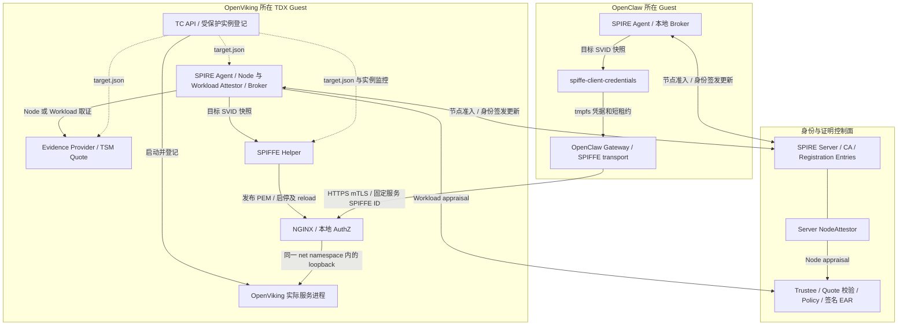

# Argus-SPIFFE：当前代码总览

整理日期：2026-09-16。代码基线：`feat/argus-spiffe-v2-val`，`a0f19e08c58db1bc2cdb770f6cd301dfb8629345`。

本文负责组件拓扑、端到端流程和代码导航。绑定编码、EAR 校验、凭据交付与失效细节由下文列出的专题文档维护；部署步骤和带日期的验证报告分别引用。本文按源码整理，本次未执行远程部署或现场复验。

## 1. 当前系统做了什么

当前实现把 OpenViking 所在 TDX 节点的准入、实际 OpenViking 服务实例的准入、SPIFFE 身份交付，以及 OpenClaw 到 OpenViking 的业务访问连起来：

**批准基线 → 节点证明 → SPIRE Agent 身份 → 受控启动与实例登记 → Workload 证明 → 服务 SVID → Helper 发布凭据 → NGINX mTLS/AuthZ → OpenViking 业务处理。**

OpenClaw 端有另一条身份交付链：**既有或部署脚本配置的 SPIRE Agent → Gateway 实际 PID → Broker → 客户端 SVID → 原生 HTTPS transport**。当前交付脚本采用 `x509pop` 节点准入和 Unix/Docker workload selectors；不能把 OpenViking 的 TDX Workload 证明能力直接算到 OpenClaw 端。

这里的 SVID 是带 SPIFFE ID 的 X.509 身份证书，身份位于证书 URI SAN 中。Node、Helper 和业务 Workload 使用不同身份；证书统一由 **SPIRE Server CA** 签发。

## 2. 组件与实际拓扑

图中实线包含身份控制流与业务流；真正跨主机传送业务内容的是 **OpenClaw transport → NGINX → OpenViking**。两个本地 Broker 都用于按目标进程引用交付身份，不转发这条跨主机业务流量。

| 组件 | 当前代码职责 | 主要入口 |
|---|---|---|
| TC API | 按固定 profile 启动 OpenViking，保留 launch/container 关联和原有日志提交 | [workload_profile.py](../core/tc_api/tc_api/services/workload_profile.py)、[launch.py](../core/tc_api/tc_api/services/launch.py) |
| NodeAttestor：Agent 侧 | 读取 proof key，接收 challenge，取 Quote，签名响应 | [agent/plugin.go](../core/spire/plugins/argus-tdx-nodeattestor/internal/agent/plugin.go) |
| NodeAttestor：Server 侧 | 固定 proof key 对应的 Agent slot，验证 challenge、PoP 和 Trustee EAR | [server/plugin.go](../core/spire/plugins/argus-tdx-nodeattestor/internal/server/plugin.go) |
| Evidence Provider | 在 TDX Guest 内生成 Node/Workload Quote；Workload 路径独立检查实际实例 | [spire_evidence_provider.rs](../core/argus/src/bin/spire_evidence_provider.rs)、[workload/mod.rs](../core/argus/src/bin/workload/mod.rs) |
| WorkloadAttestor | 接受目标 PID reference，检查批准基线，取证、验 EAR、返回 selectors | [workloadattestor/plugin.go](../core/spire/plugins/argus-tdx-workloadattestor/internal/workloadattestor/plugin.go) |
| Trustee | 外部部署的证明验证服务；按指定 policy 评估 Quote，返回签名 EAR | 项目内的 [Node 客户端](../core/spire/plugins/argus-tdx-nodeattestor/internal/trustee/client.go)、[Workload 客户端](../core/spire/plugins/argus-tdx-workloadattestor/internal/trustee/client.go)、[策略模板](../core/spire/workload/policy/workload_cpu.rego.tmpl) |
| SPIRE Server/Agent | Server 管理 Entry 和 CA 签发；Agent 提供 Workload API/Broker，协调认证与身份更新 | [配置与 Entry 编排](../core/spire/workload/scripts/workload.py) |
| 服务端 SPIFFE Helper | 用自己的身份访问 Broker，为 OpenViking PID 取得目标凭据并管理 NGINX 生命周期 | [pkg/broker/run.go](../core/spire/helpers/spiffe-helper/pkg/broker/run.go) |
| NGINX/AuthZ | 终止业务 mTLS，校验真实客户端证书身份，转发到 OpenViking | [nginx.conf](../core/spire/workload/config/nginx.conf)、[authz.go](../core/spire/helpers/spiffe-helper/pkg/authz/authz.go) |
| OpenClaw 凭据交付进程 | 绑定实际 Gateway PID，订阅客户端 SVID，发布带短租约的凭据 | [pkg/clientcredentials/run.go](../core/spire/helpers/spiffe-helper/pkg/clientcredentials/run.go) |
| OpenClaw transport | 从只读凭据目录加载身份，限制 HTTPS origin，验证服务器 SPIFFE ID，处理轮换和失效 | [transport.mjs](../adapters/OpenClaw/spiffe_client/lib/transport.mjs) |

SPIRE Server/Agent 与两个 Attestor SDK 当前固定为 `1.15.3`。Helper 基于上游 `0.11.0`，当前定制版本为 `0.11.0-argus.1`。构建脚本使用官方 SPIRE Core，不修改其核心实现。

### 身份分工

| 身份 | 用途与实际持有者 |
|---|---|
| `spiffe://argus.local/spire/agent/argus_tdx/openviking-node` | OpenViking 节点的 SPIRE Agent 身份；也是该节点下 Entry 的 Parent ID |
| `spiffe://argus.local/infra/openviking-helper` | 服务端 Helper 自身身份，仅用于获准的本地 Broker 访问 |
| `spiffe://argus.local/service/openviking-cmem` | OpenViking 服务身份；这条部署路径由 NGINX 使用其证书和私钥终止 TLS |
| `spiffe://argus.local/spire/agent/x509pop/<fingerprint>` | 当前 OpenClaw 部署脚本生成的节点身份，具体值由部署证书确定 |
| `spiffe://argus.local/infra/openclaw-helper` | 客户端凭据交付进程自身身份 |
| `spiffe://argus.local/agent/openclaw` | OpenClaw Gateway 使用的业务客户端身份 |

Node 插件可以配置一个固定 proof key 对应的 Agent slot。当前 Workload 协议、策略与服务端工具仍固定 `argus.local`、`openviking-node` 和 OpenViking profile，尚不是任意工作负载、多节点自动注册框架。

## 3. 从批准基线到业务请求

| 阶段 | 输入与结果 | 细节入口 |
|---|---|---|
| 准备与配置 | 操作者提供批准的镜像/配置摘要、测量值、Node 身份和信任材料；工具生成插件、policy、Entry 与服务配置 | [Workload 运行手册](../core/spire/workload/README.md)、[配置参考](../core/argus/docs/configuration.md#spire-node-attestation) |
| Node 准入 | Agent 响应 fresh challenge；Provider 取 Quote，Server 插件验证持钥证明和 Trustee EAR，SPIRE 签发 Agent SVID | [Node 专题](./Argus-TDX-Node-Attestation-CN.md) |
| 启动与登记 | TC API 按批准 profile 启动 OpenViking，登记工具定位实际监听进程并保护实例记录 | [Workload 专题](./Argus-OpenViking-NGINX-SPIFFE-Helper-Workload-Attestation-Workflow-CN.md) |
| Workload 准入 | Helper 引用目标 PID，Attestor 与 Provider 核对实际实例并完成 Quote/EAR 校验；SPIRE 根据 selectors 与 Entry 交付服务身份 | [Workload 专题](./Argus-OpenViking-NGINX-SPIFFE-Helper-Workload-Attestation-Workflow-CN.md) |
| 双端凭据就绪 | 服务端 Helper 发布目标凭据、启动 NGINX；客户端交付进程为实际 Gateway 发布 SVID 和租约 | [Workload 专题](./Argus-OpenViking-NGINX-SPIFFE-Helper-Workload-Attestation-Workflow-CN.md)、[客户端说明](../adapters/OpenClaw/spiffe_client/README.md) |
| 业务调用 | OpenClaw 插件建立 mTLS 并检查服务 ID；NGINX/AuthZ 检查客户端 ID，OpenViking 处理业务并返回结果 | [客户端部署与验收](../adapters/OpenClaw/spiffe_client/DEPLOY-IP1-TDVM.md)、[演示手册](../../../documents_ly/argus-e2e-demo-plan-20260909.md) |

批准状态来自操作者提供的基线，实例登记不是批准基线。每次业务请求使用已交付的 SVID，不逐次获取 Quote 或调用 Trustee。应用 API key 继续由业务接口校验；SPIFFE mTLS 不替代应用鉴权。

## 4. 当前实现的边界

- **证明对象与用证组件分开。** Workload 取证绑定 OpenViking 实际服务实例，Helper 交付目标身份，NGINX 持有该身份终止 TLS。具体绑定字段及信任假设见 Workload 专题。
- **轮换与重新证明分开。** 普通 SVID 轮换不生成新 Quote；Workload 新订阅会重新证明，Node 重新认证另有自己的流程。服务端停止与清理合同由 Workload 专题维护，客户端租约、Broker 探测及连接失效合同由客户端说明维护。
- **客户端证明范围独立。** 当前 OpenClaw 部署采用 x509pop 与 Unix/Docker selectors，TDX 远程证明未接入。原生 transport 覆盖已集成的 OpenViking 插件调用，不接管所有 OpenClaw 工具流量。
- **独立 Guard 是可用组件。** `argus-guard` 支持证据验证和 SPIFFE 身份策略两种模式，但当前原生 transport 与 NGINX/AuthZ 路径没有调用它。模式、实际配置与策略 YAML 见 [配置参考](../core/argus/docs/configuration.md)；不能把所有请求先经过 Guard 写成当前流程。
- **日志与外部服务各有职责。** TC API 的日志上传保留；当前身份门禁不依赖 Rekor inclusion proof。KBS/加密存储属于周边运行时能力，不参与 SVID 签发。
- **通用接入尚有适配工作。** Go/Java SDK 可提供标准 SVID/mTLS 接入；本项目 TDX Workload selectors 当前只在 `AttestReference` 返回，普通 `Attest` 返回空结果。同等 TDX 条件的原生接入需要额外适配。

## 5. 文档分工与验证记录

| 维护对象 | 唯一细节入口 |
|---|---|
| 通用设计、原生 SDK 与 Helper 两种接入选择 | [通用 Agent 与 Agent Service 可信通信](./Argus-Agent-Agent-Service-Trusted-Communication-CN.md)；其中设计目标与当前实现分别标明 |
| Node 身份、绑定编码、PoP、EAR 与准入结果 | [Node Attestation](./Argus-TDX-Node-Attestation-CN.md) |
| 服务实例取证、selectors、Helper/NGINX 与服务端失效处理 | [Workload Attestation](./Argus-OpenViking-NGINX-SPIFFE-Helper-Workload-Attestation-Workflow-CN.md) |
| 可执行配置输入与 Guard 策略 | [configuration.md](../core/argus/docs/configuration.md) |
| 构建、安装、Entry、启动与现场操作 | [服务端运行手册](../core/spire/workload/README.md)、[客户端部署手册](../adapters/OpenClaw/spiffe_client/DEPLOY-IP1-TDVM.md) |
| 客户端 transport、凭据租约与生命周期 | [OpenClaw 客户端说明](../adapters/OpenClaw/spiffe_client/README.md) |
| 本地测试及公司环境的分阶段执行结果 | [文档索引中的验证记录](./README.md#验证记录) |
| 被替代的实施计划与旧架构 | [历史归档](./archive/README.md) |

公司验证结论以各报告的日期、提交和环境为准。2026-09-09 的记录区分了 OpenViking PoC 通过、严格 UpToDate TCB 验收阻塞，以及 OpenClaw 联合业务验收中长期记忆召回失败。源码流程和 mTLS 成功均不能替代完整业务验收；后续结果应补充到对应报告，本文不复制逐项结果表。
