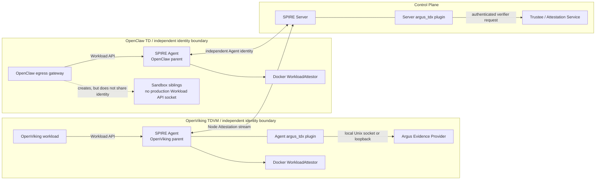
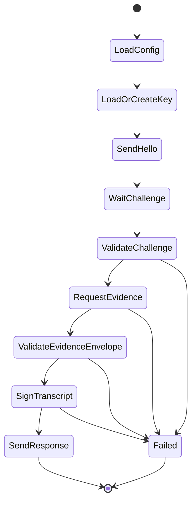
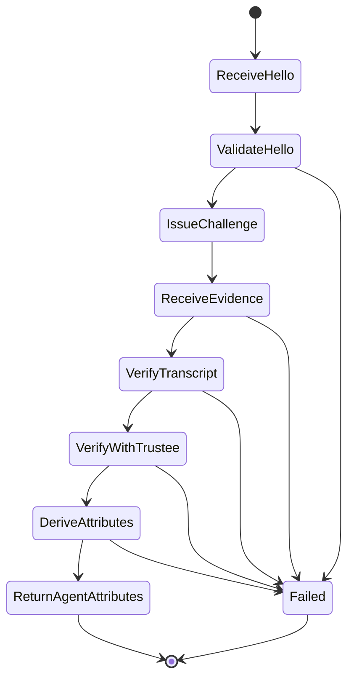

# Argus-SPIFFE v2：实现、配置、测试与回滚

## 1. 文档定位

本文是 Argus-SPIFFE v2 的实施规格，核心交付物是成对的自定义 `argus_tdx` NodeAttestor 插件。本文描述待实现的协议、代码组织、配置、测试、迁移和回滚，不作为源码完成状态报告。

架构决策和信任边界见 [Argus-SPIFFE-Integration.md](Argus-SPIFFE-Integration.md)。Phase 1 的本机记录和已有身份平面可作为迁移输入，但 v2 的验收必须以本文的自定义 Node Attestation 测试结果为准。

阅读导航：

| 读者 | 建议优先阅读 |
| --- | --- |
| 架构与安全评审 | 第 2、3、6、14 节 |
| 插件开发者 | 第 4–8 节 |
| 部署与运维 | 第 9–11、13、15 节 |
| 测试与验收 | 第 12、14、16 节 |

## 2. v2 交付范围

### 2.1 必须交付

1. Agent 侧外部插件 `argus-tdx-nodeattestor-agent`。
2. Server 侧外部插件 `argus-tdx-nodeattestor-server`。
3. 版本化的 challenge/response 内层协议。
4. Agent 证明密钥、challenge、EvidenceRequest 与 TDX `report_data` 的绑定。
5. Evidence Provider 适配器和 Trustee verifier 适配器。
6. 唯一 Agent SPIFFE ID 与经过验证的 node selectors。
7. SPIRE Server、SPIRE Agent 和 registration entry 配置。
8. 单元测试、插件契约测试、SPIRE 集成测试和 TDX 硬件端到端测试。
9. 从现有身份平面切换到 `argus_tdx` 的操作步骤与回滚步骤。

### 2.2 不纳入首个 v2 交付

- 自定义 CredentialComposer 或在 X.509-SVID 中加入 TDX Quote。
- 自定义 WorkloadAttestor。
- 默认的请求级 fresh Quote。
- 自动化周期性 re-attestation controller。
- workload-bound Quote 的完整实现。
- SPIFFE Federation。
- OpenClaw 节点身份平面的实现。v2 只消费其输出的强制输入 `OPENCLAW_PARENT_ID` 和 TDX 准入审计材料，但负责验证该 parent 已通过获批 TDX node policy，且不与 OpenViking 的授权 Agent 集合重叠。

首个 v2 版本将 `can_reattest` 设为 `false`。只有在持久化证明密钥、重复 attestation、Agent SVID 轮换和失败恢复均通过专项测试后，才单独启用 `true`。

## 3. 实施基线

| 项目 | 基线 |
| --- | --- |
| SPIRE | `1.15.1` |
| SPIRE Plugin SDK | `github.com/spiffe/spire-plugin-sdk v1.15.1` |
| Trust domain | `argus.local` |
| Agent NodeAttestor 插件名 | `argus_tdx` |
| OpenClaw SPIFFE ID | `spiffe://argus.local/agent/openclaw` |
| OpenViking SPIFFE ID | `spiffe://argus.local/service/openviking-cmem` |
| OpenViking node alias | `spiffe://argus.local/node/openviking-td` |
| OpenClaw/OpenViking parent | 生产环境均为 TDX Node Attestation 准入且使用不重叠的受信 Agent 集合；node alias 不得同时授权同一个 Agent |
| `OPENCLAW_PARENT_ID` | 强制部署输入，无默认值；由独立、通过获批 TDX node policy 的 OpenClaw identity plane 提供并在 M0 冻结 |
| OpenClaw role label | `argus.workload=openclaw` |
| OpenViking role label | `argus.workload=openviking-cmem` |
| 不可变启动与镜像 selectors | `docker:image_id:sha256:<final-image-config-digest>` + `docker:image_config_digest:sha256:<final-image-config-digest>` |
| Workload SVID TTL | 初始沿用 `600s`，生产值由生命周期策略确定 |

版本升级必须同时验证 SPIRE 与 Plugin SDK 的兼容性，不能只修改 `go.mod` 或二进制版本号。

### 3.1 目标部署拓扑



部署约束：

- SPIRE Agent、Agent 插件和 Evidence Provider 必须运行在被证明的 OpenViking TDVM 内。
- Server 插件与 SPIRE Server 同机部署，Trustee 可以是独立服务。
- Evidence Provider 优先使用 Unix socket；若使用 TCP，只监听 TD 内 loopback。
- SPIRE Agent 仍使用预置的 Server trust bundle 验证 SPIRE Server。
- 单个 Agent 只配置一个 NodeAttestor；Server 可以同时加载多个 NodeAttestor。
- OpenViking workload entry 只授权给 OpenViking 的受信 Agent/node alias。OpenClaw 使用独立 parent；生产环境不能让具备 OpenClaw Docker 管理权限的主体控制 OpenViking 所在 Docker daemon。

若沿用单宿主机 Phase 1 拓扑，只能用于插件协议和身份签发联调，不能作为“OpenViking TD 已通过 TDX 证明”的硬件验收结果，也不能声称能够抵御同一 Docker 管理域内的身份冒充。

### 3.2 Workload API 与 Docker 容器发现

自定义 `argus_tdx` 只替换 Node Attestation；OpenClaw/OpenViking 仍由 SPIRE 1.15.1 内置 Docker WorkloadAttestor 识别。完整调用链必须是：

1. 只有身份所有者容器挂载 `/run/spire/sockets/agent.sock`，并设置 `SPIFFE_ENDPOINT_SOCKET=unix:///run/spire/sockets/agent.sock`。
2. 容器内的 mTLS client/server 进程调用 Workload API。
3. SPIRE Agent 从 Unix domain socket 对端取得调用进程 PID。
4. Docker WorkloadAttestor 从 PID 的 cgroup 定位 container ID，再查询 TD 内本地 Docker daemon。
5. 插件生成 `docker:label:*`、`docker:image_id:*`、`docker:image_config_digest:*` 等 selectors。
6. SPIRE Server 根据 Parent ID 把 entry 授权并下发给对应 Agent；该 Agent 再要求调用者满足 entry 中的全部 workload selectors，才返回对应 X.509-SVID。

`SPIFFE_ENDPOINT_SOCKET`、socket mount、容器名和 workload 自报的服务名都不是身份 selector。基线使用以下三个 selector：

```text
docker:label:argus.workload:<role>
docker:image_id:sha256:<final-image-config-digest>
docker:image_config_digest:sha256:<final-image-config-digest>
```

在 SPIRE 1.15.1 中，`docker:image_id` 原样来自容器配置中的镜像引用；以 `repo/image:tag` 启动时它就是可变 tag，以完整 `sha256:<config-digest>` 启动时它才形成本文要求的不可变启动约束。`docker:image_config_digest` 是插件用该引用查询 Docker daemon 后得到的最终 image config 内容摘要；它与 registry manifest digest、multi-arch index digest、上游 base image digest 不是同一对象。两个 selector 使用同一完整 config digest，分别约束“如何启动”和“解析到什么镜像”。

这三个 selectors 只能在受信 parent 和受控 Docker 管理域内识别目标容器。拥有 Docker daemon 管理权限的主体可以创建任意 label、复用允许镜像并挂载 Workload API socket，因此 workload selectors 不能替代 parent 隔离。OpenClaw 若需要 Docker 权限来创建 sandbox，其权限边界必须与 OpenViking 的 Agent、socket 和 Docker daemon 分离。

## 4. 建议代码组织

建议在现有 `core/spire` 下增加独立 Go module，避免把 SPIRE Plugin SDK 依赖引入 Rust workspace：

```text
core/spire/
├── conf/
│   ├── server.conf
│   ├── agent.conf
│   └── argus-tdx-policy.yaml
├── plugins/
│   └── argus-tdx-nodeattestor/
│       ├── go.mod
│       ├── go.sum
│       ├── cmd/
│       │   ├── agent/main.go
│       │   └── server/main.go
│       ├── internal/
│       │   ├── agent/
│       │   ├── server/
│       │   ├── protocol/
│       │   ├── evidence/
│       │   ├── trustee/
│       │   ├── identity/
│       │   └── telemetry/
│       └── testdata/
└── scripts/
    ├── build-nodeattestor.sh
    ├── install-nodeattestor.sh
    ├── register-v2-workloads.sh
    ├── verify-node-attestation.sh
    └── rollback-nodeattestor.sh
```

两个可执行文件共享 `internal/protocol` 和规范化逻辑，但分别只注册 Agent 或 Server NodeAttestor gRPC 服务。生产二进制必须以非 root 运行所需的最小权限为目标。

## 5. SPIRE Plugin SDK 接口

### 5.1 Agent 侧

Agent 插件实现：

```go
nodeattestorv1.NodeAttestorServer
```

核心 RPC 为双向流：

```go
AidAttestation(grpc.BidiStreamingServer[
    nodeattestorv1.Challenge,
    nodeattestorv1.PayloadOrChallengeResponse,
]) error
```

SPIRE 要求 Agent 插件先发送 initial payload；只有 Server 返回 challenge 时，SPIRE Agent 才把 challenge 传入插件。插件不能等待第一个 challenge 后才发送 initial payload。

### 5.2 Server 侧

Server 插件实现：

```go
servernodeattestorv1.NodeAttestorServer
```

核心 RPC 为：

```go
Attest(grpc.BidiStreamingServer[
    servernodeattestorv1.AttestRequest,
    servernodeattestorv1.AttestResponse,
]) error
```

Server 插件接收 initial payload，返回 challenge，接收 challenge response，最终只返回一次 `AgentAttributes`：

```text
AgentAttributes {
  spiffe_id
  selector_values[]
  can_reattest
}
```

SPIRE Plugin SDK 的 `payload`、`challenge` 和 `challenge_response` 都是 opaque bytes。Argus 必须在这层 bytes 内定义自己的版本化协议，不能依赖未版本化 JSON 字段或日志字符串。

### 5.3 插件配置与进程入口

两个插件都需要同时实现 NodeAttestor 和 Plugin SDK Config service：

```go
type Plugin struct {
    nodeattestorv1.UnimplementedNodeAttestorServer
    configv1.UnimplementedConfigServer

    // Configure 构造新配置后，通过锁或 atomic pointer 一次性替换。
    // Attestation RPC 只读取不可变配置快照。
}

func (p *Plugin) Configure(
    ctx context.Context,
    req *configv1.ConfigureRequest,
) (*configv1.ConfigureResponse, error)

func (p *Plugin) Validate(
    ctx context.Context,
    req *configv1.ValidateRequest,
) (*configv1.ValidateResponse, error)
```

实现要求：

- 嵌入对应的 `UnimplementedNodeAttestorServer` 和 `UnimplementedConfigServer`；
- `Validate` 解析 `hcl_configuration` 并返回全部可诊断问题，但不改变运行中配置；
- `Configure` 完成路径、权限、trust domain、URL、超时和尺寸限制校验后原子替换配置；
- `Configure` 可能与 attestation RPC 并发执行，不能原地修改共享配置；
- `main.go` 使用 `pluginmain.Serve` 注册 NodeAttestor plugin server、Config service 和 SPIRE logger；
- Server 与 Agent 使用各自的 NodeAttestor proto package，不能在同一进程中混用错误的 service type。

配置解析和进程入口应从 Plugin SDK `v1.15.1` 的 Agent/Server NodeAttestor template 起步，首个构建里程碑必须包含“最小插件被 SPIRE 加载并通过 `validate`”的测试。

## 6. Argus Node Attestation 内层协议

### 6.1 消息

建议使用 protobuf，并为所有消息保留 `protocol_version`：

```proto
syntax = "proto3";

package argus.spire.nodeattestor.v1;

message AgentHello {
  uint32 protocol_version = 1;
  bytes attestation_public_key = 2;
  bytes agent_nonce = 3;
  string instance_hint = 4;
  repeated string capabilities = 5;
}

message ServerChallenge {
  uint32 protocol_version = 1;
  bytes session_id = 2;
  bytes nonce = 3;
  int64 issued_at_unix = 4;
  int64 expires_at_unix = 5;
  string policy_id = 6;
  bytes evidence_request_json = 7;
}

message EvidenceResponse {
  uint32 protocol_version = 1;
  bytes session_id = 2;
  bytes evidence_json = 3;
  bytes transcript_signature = 4;
}
```

约束：

- `attestation_public_key` 固定为 32 字节 raw Ed25519 公钥，不使用 PEM、PKIX DER 或带算法头的编码。
- `agent_nonce` 至少 32 字节，由 Agent 插件生成。
- `session_id` 和 `nonce` 至少 32 字节，由 Server 插件使用 CSPRNG 生成。
- challenge 必须有短有效期，初始建议 30 秒。
- `evidence_json` 和 event log 必须设置明确的最大尺寸。
- protobuf 中禁止加入 secret、Agent 私钥或 workload SVID 私钥。

`instance_hint` 只用于诊断和关联请求，不参与 Agent ID、selector 或授权。可用于授权的 instance ID 必须来自 Quote-bound、Trustee-verified 的 claims。

### 6.2 Normative wire format

协议 v1 冻结以下字节规则：

| 对象 | 规范编码 |
| --- | --- |
| `AgentHello`、`ServerChallenge`、`EvidenceResponse` | protobuf deterministic marshal；接收方拒绝未知协议版本和超出限制的消息 |
| Ed25519 公钥 | 32 字节 raw public key |
| `key_id` | 对 raw public key 执行 SHA-256，输出 64 个小写十六进制字符 |
| `EvidenceRequest`、`BindingClaims` | `argus-canonical-json-v1` |
| `policy_digest` | 对规范化 policy model 执行 SHA-256，格式为 `sha256:<64-lowercase-hex>` |
| TDX `REPORTDATA` | 前 48 字节放 SHA-384 digest，后 16 字节固定为 `0x00` |

`argus-canonical-json-v1` 定义为 [RFC 8785 JSON Canonicalization Scheme](https://www.rfc-editor.org/rfc/rfc8785) 加下述 Argus schema 约束。Agent、Evidence Provider、Trustee 和 Server 必须使用同一实现库，不能分别手写排序逻辑。

解析和规范化规则：

- 输入必须是 UTF-8 JSON object，拒绝重复 key、非法 Unicode 和非有限数值；
- 所有 schema 字段都必须出现；可空字段使用 JSON `null`，不得用“字段缺省”表达同一状态；
- 本协议不使用浮点数；`owning_pid` 是 `0..4294967295` 的 JSON integer；
- 时间字符串使用 UTC RFC 3339，固定 `YYYY-MM-DDTHH:MM:SSZ`；
- digest 使用 `<algorithm>:<lowercase-hex>`，不接受大写或省略算法名；
- `service_name`、`instance_id`、`instance_scope`、container/VM ID 和 map key 使用规范化 ASCII；
- URI 与 SPIFFE ID 在进入 JCS 前完成语法和路径规范化；
- `claim_support` 中的 source 数组先去重，再按 UTF-8 字节序排序；
- 未在当前 schema 中定义的字段一律拒绝，不能静默忽略后再参与安全判断。

Node Attestation 的最小 `BindingClaims` wire schema 为：

```text
BindingClaims = {
  "assurance_level": "L0" | "L1" | "L2" | "L3",
  "service_identity": {
    "service_name": string,
    "service_id": string | null,
    "instance_id": string,
    "instance_scope": string,
    "image_digest": string | null,
    "executable_digest": string | null,
    "spiffe_id": string | null
  },
  "runtime_binding": {
    "endpoint": string,
    "owning_pid": integer,
    "process_start_time": string,
    "container_id": string | null,
    "pod_uid": string | null,
    "vm_instance_id": string | null,
    "namespace": string | null,
    "cgroup_path": string | null
  },
  "claim_support": object<string, array<string>>,
  "verifier_validated_support": object<string, array<string>> | null,
  "provider_claim_assurance": object<string, "L0" | "L1" | "L2" | "L3">
}
```

字段语义与 [Argus API](../core/argus/docs/api.md) 保持一致；上面的 wire schema 冻结类型、可空性和嵌套结构，Argus API 负责更完整的业务说明。

TDX 写入规则固定为：

```text
digest = SHA384(
  "argus-evidence-v1" || 0x00
  || Canon(EvidenceRequest)
  || Canon(BindingClaims)
)

REPORTDATA[0:48]  = digest
REPORTDATA[48:64] = 0x00 * 16
```

M0 协议冻结必须提交至少两个 golden vectors：

1. 完整正常输入、canonical bytes、SHA-384 digest 和最终 64 字节 `REPORTDATA`；
2. 只改变 nonce、证明公钥或 policy digest 的输入，证明最终 `REPORTDATA` 必然变化。

Agent、Evidence Provider、Trustee 和 Server 插件必须消费同一组 vectors。

协议 v1 的初始限制：

| 项目 | 限制 |
| --- | --- |
| `AgentHello` | 不超过 4 KiB |
| `ServerChallenge` | 不超过 64 KiB |
| `EvidenceResponse` | 不超过 4 MiB |
| `agent_nonce`、`session_id`、challenge nonce | 固定 32 字节 |
| `capabilities` | 最多 16 项；每项 1–64 个小写 ASCII 字符、数字、`-` 或 `_` |
| `instance_hint` | 最多 128 字节；只允许可打印 ASCII；不参与安全决策 |
| selector values | 最多 32 项；每项不超过 512 字节；拒绝控制字符 |
| event log | 计入 EvidenceResponse 的 4 MiB 总上限 |

超过限制的消息必须在进入 Quote 生成或 Trustee 调用前被拒绝。

### 6.3 Agent 证明密钥

Agent 插件首次启动时生成独立的持久化 Ed25519 证明密钥：

```text
/var/lib/spire/argus-tdx/attestation-key
```

要求：

- 私钥文件只允许 SPIRE Agent 运行用户读取；
- 密钥不能写入镜像、仓库、日志或 attestation payload；
- 重新部署同一 Agent 实例时保留密钥；
- 克隆 TD 镜像时不得克隆已经生成的实例私钥；
- Agent ID 由公钥摘要导出，而不是由主机名或 `instance_id` 直接导出。

Agent ID 规则：

```text
key_id = lowercase-hex(SHA256(attestation_public_key))

agent_spiffe_id =
  spiffe://argus.local/spire/agent/argus_tdx/<key_id>
```

NodeAttestor API 不要求自定义插件直接访问最终 Agent SVID 私钥。本协议通过“Quote 绑定证明公钥 + 公钥导出 Agent ID + challenge 签名”建立实例 proof-of-possession，再由 SPIRE 核心为该唯一 Agent ID 签发 Agent SVID。

持久化文件权限只能阻止 TD 内普通进程读取密钥，不能单独阻止不可信 host 克隆或回滚虚拟磁盘。部署必须满足以下之一：

- 使用具备 TD sealing、加密完整性和 anti-rollback 语义的持久化存储；或
- 将该 key 明确视为逻辑持久身份，并在 Server 侧拒绝同一 key ID 与不同 verified instance/launch ID 的并发使用。

密钥删除后生成的新 key 对应新的 Agent ID。恢复流程不得把旧 Agent ID 自动转移给新 key。

### 6.4 EvidenceRequest 与 `report_data` 绑定

ServerChallenge 中携带完整的 Argus `EvidenceRequest`。建议映射为：

```json
{
  "version": "v1",
  "nonce": "<server-challenge-nonce>",
  "caller_id": "spiffe://argus.local/spire/server",
  "target": {
    "service_name": "argus-tdx-node",
    "target_uri": "argus-node:<sha256-attestation-public-key>"
  },
  "requested_claims": ["TeeQuote", "IdentityClaims"],
  "profile_digest": "sha256:<argus-tdx-policy-digest>"
}
```

该 profile 中：

- `nonce` 是 32 字节 Server challenge 的无 padding base64url；
- `target.target_uri` 中的摘要是 raw Ed25519 public key 的 SHA-256 小写十六进制；
- `requested_claims` 固定按 `TeeQuote`、`IdentityClaims` 排序；
- `profile_digest` 必须出现且非 `null`；
- 其余字段类型和可空性遵循 [Argus API](../core/argus/docs/api.md) 的 `EvidenceRequest`，未知字段被拒绝。

Evidence Provider 继续使用 Argus 已定义的绑定算法：

```text
domain = "argus-evidence-v1" || 0x00
canonical_request = Canon(EvidenceRequest)
canonical_binding_claims = Canon(BindingClaims)

report_data_digest =
  SHA384(domain || canonical_request || canonical_binding_claims)

REPORTDATA =
  report_data_digest || (0x00 * 16)
```

这样，以下内容同时进入 Quote 绑定：

- Server 生成的 fresh nonce；
- 预期 trust domain 与调用方；
- 证明公钥摘要；
- verifier policy digest；
- Evidence Provider 返回的实例与运行时 claims。

Server 插件必须把自己发送的原始 `EvidenceRequest` 交给 Trustee 重算 `report_data`。不能只比较 Agent 回传的 `report_data` 字符串。

### 6.5 Transcript 签名

Agent 插件使用证明私钥签名。`DeterministicProto` 表示 protobuf deterministic marshal 的原始输出：

```text
hello_bytes = DeterministicProto(AgentHello)
challenge_bytes = DeterministicProto(ServerChallenge)

transcript_hash = SHA256(
  "argus-spire-nodeattestor-v1" || 0x00
  || hello_bytes
  || challenge_bytes
  || SHA256(evidence_json)
)

transcript_signature = Ed25519.Sign(
  attestation_private_key,
  transcript_hash
)
```

Server 插件必须先验证签名，再调用 Trustee。签名失败、challenge 过期、`session_id` 不匹配或协议版本不支持时立即终止本轮 attestation。

## 7. Agent 侧插件设计

Agent 插件状态机：



处理要求：

1. 配置加载失败时不启动插件。
2. 证明密钥生成必须使用原子写入和严格权限。
3. initial payload 只包含 `AgentHello`，不提前生成无 challenge 的 Quote。
4. 只接受一个受支持版本、未过期且长度合法的 challenge。
5. 将 `evidence_request_json` 原样交给本地 Evidence Provider。
6. 对 Evidence Provider 设置连接、请求和总超时。
7. 对响应做 JSON schema、大小和必需字段检查。
8. 不把 raw Quote、event log、nonce 或完整 evidence 写入普通日志。
9. 每个 RPC 使用独立上下文，不在全局变量中复用 challenge。

Evidence Provider 适配器建议接口：

```go
type EvidenceProvider interface {
    GetEvidence(
        ctx context.Context,
        request []byte,
    ) (evidenceJSON []byte, err error)
}
```

首选端点：

```text
unix:///run/argus/evidence.sock
```

HTTP 兼容端点可以使用：

```text
POST http://127.0.0.1:8008/ra/v1/evidence
```

## 8. Server 侧插件设计

Server 插件状态机：



处理要求：

1. 校验公钥类型、长度、`instance_hint` 格式和 capability allowlist；`instance_hint` 不进入授权。
2. 为每个 stream 生成独立 `session_id`、nonce 和 EvidenceRequest。
3. 不允许同一 session 返回第二个 `AgentAttributes`。
4. Trustee 返回前保持 fail closed；超时不能转成成功或缓存旧结果。
5. 只从 verifier 已确认的 claims 生成 selectors。
6. 对 selector 值做长度、字符集和数量限制。
7. Agent SPIFFE ID 只由经过签名验证的证明公钥导出。
8. v2 首个版本返回 `can_reattest: false`。
9. `instance_hint` 非空时必须与 Trustee 返回的 verified instance ID 一致；无论是否相等，都不得直接把 hint 输出为 selector。

### 8.1 Trustee 适配器

建议内部接口：

```go
type TrusteeVerifier interface {
    VerifyNode(
        ctx context.Context,
        evidenceJSON []byte,
        expectedEvidenceRequest []byte,
        policyID string,
    ) (VerifiedNodeClaims, error)
}
```

`VerifiedNodeClaims` wire schema 为：

```text
VerifiedNodeClaims = {
  "quote_verified": boolean,
  "report_data_verified": boolean,
  "tcb_status": string,
  "mrtd": string,
  "rtmr": {
    "0": string | null,
    "1": string | null,
    "2": string | null,
    "3": string | null
  },
  "debug_enabled": boolean,
  "instance_id": string,
  "launch_id": string | null,
  "policy_id": string,
  "policy_digest": string,
  "attestation_key_digest": string,
  "evidence_request_digest": string,
  "verified_at": string,
  "expires_at": string
}
```

measurement 使用小写十六进制，digest 使用 `<algorithm>:<lowercase-hex>`，时间使用 UTC RFC 3339。

Server 插件必须同时检查：

- `quote_verified == true`；
- `report_data_verified == true`；
- TCB 状态在 allowlist 中；
- `mrtd`、RTMR 和 debug 状态符合 `policy_id`；
- `attestation_key_digest` 等于本轮 `AgentHello` 中 raw public key 的 SHA-256；
- `evidence_request_digest` 等于 Server 插件本轮发送的 canonical EvidenceRequest 摘要；
- verifier 返回的 instance/key binding 与本轮 challenge 一致；
- verifier 响应来自配置的信任锚，且未过期。

Trustee 连接使用 mTLS 或等价的服务身份认证，并配置 CA pinning、总超时和有限重试。重试只能重复同一 challenge 的幂等验证请求，不能生成新 challenge 后混用旧 evidence。

首个 v2 版本固定使用 `mtls_files` 和 HTTPS JSON：

```text
POST /v1/verify/tdx-node
Content-Type: application/json
Accept: application/json
```

request 的所有字段必需：

```text
TrusteeVerifyRequest = {
  "protocol_version": 1,
  "session_id": string,
  "evidence": object,
  "evidence_request": EvidenceRequest,
  "evidence_request_digest": string,
  "attestation_key_digest": string,
  "policy_id": string,
  "policy_digest": string
}
```

response 的所有字段必需；`verified_claims` 只在 `decision = "allow"` 时为 object，其他情况固定为 `null`：

```text
TrusteeVerifyResponse = {
  "protocol_version": 1,
  "session_id": string,
  "decision": "allow" | "deny",
  "stable_error_code":
      "OK"
    | "QUOTE_INVALID"
    | "BINDING_MISMATCH"
    | "TCB_REJECTED"
    | "MEASUREMENT_REJECTED"
    | "POLICY_REJECTED"
    | "MALFORMED_EVIDENCE"
    | "UNSUPPORTED_VERSION"
    | "VERIFIER_UNAVAILABLE"
    | "INTERNAL_ERROR",
  "verified_claims": VerifiedNodeClaims | null,
  "evidence_request_digest": string,
  "attestation_key_digest": string,
  "policy_id": string,
  "policy_digest": string,
  "issued_at": string,
  "expires_at": string
}
```

字段格式：

- `session_id` 是 32 字节值的无 padding base64url；
- 所有 digest 都是 `<algorithm>:<lowercase-hex>`；
- `evidence_request_digest = sha256(JCS(EvidenceRequest))`；
- `evidence` 是 Evidence Provider 返回的 JSON object，不做 JSON-in-string 二次编码；
- `issued_at`、`expires_at` 使用 UTC RFC 3339；
- response 使用普通 UTF-8 JSON 传输，Server 解析后按字段语义校验；安全绑定不依赖 HTTP body 的原始空白或 key 顺序。

已完成证据评估的 allow/deny 使用 HTTP `200`。`400` 表示请求 schema 无效，`401/403` 表示 mTLS 身份未通过，`413` 表示 payload 超限，`429` 表示 verifier 限流，`5xx` 表示 verifier 无法完成评估。任一非 `200` 响应均按 attestation 失败处理。

Server 插件要求 response 中的 session、request digest、key digest、policy 和有效期全部与本轮请求匹配。`decision != "allow"`、`stable_error_code != "OK"`、未知错误码、响应超时或缺少绑定字段均按拒绝处理。

策略文件采用以下最小 schema：

```yaml
version: 1
policy_id: openviking-prod-v1

tee:
  type: tdx
  allow_debug: false
  allowed_tcb_status:
    - up_to_date
  allowed_mrtd:
    - "<lowercase-hex>"
  allowed_rtmr:
    "0":
      - "<lowercase-hex>"
    "1":
      - "<lowercase-hex>"

binding:
  require_report_data: true
  require_attestation_key_digest: true
  require_instance_id: true
```

`policy_digest` 不对 YAML 原始文本求 hash。插件先把 YAML 解析为版本化 policy model，完成字段校验、默认值展开、列表去重和小写规范化，再按 `argus-canonical-json-v1` 编码并执行 SHA-256。未知 policy 字段、空 allowlist 或重复但冲突的值使配置校验失败。

### 8.2 AgentAttributes

成功后返回：

```text
spiffe_id:
  spiffe://argus.local/spire/agent/argus_tdx/<key_id>

selector_values:
  policy:openviking-prod-v1
  policy_digest:<sha256>
  mrtd:<hex>
  tcb_status:up_to_date
  debug:false
  instance_id:<normalized-id>

can_reattest:
  false
```

`selector_values` 中不带插件名前缀；SPIRE 最终以插件名形成完整 selector，例如：

```text
argus_tdx:policy:openviking-prod-v1
argus_tdx:debug:false
```

不要把未经策略使用的所有 RTMR、event log 或可变元数据都转成 selector。高基数诊断字段进入审计记录，不进入 registration entry。

## 9. 配置

以下配置为目标结构，路径和 checksum 在构建产物确定后填写。

### 9.1 SPIRE Server

```hcl
plugins {
    NodeAttestor "argus_tdx" {
        plugin_cmd = "/opt/spire/plugins/argus-tdx-nodeattestor-server"
        plugin_checksum = "<sha256-hex>"

        plugin_data {
            trustee_url = "https://trustee.argus.local"
            trustee_ca_path = "/etc/spire/argus/trustee-ca.pem"
            trustee_client_cert_path = "/etc/spire/argus/trustee-client.pem"
            trustee_client_key_path = "/etc/spire/argus/trustee-client-key.pem"
            trustee_server_name = "trustee.argus.local"
            trustee_expected_spiffe_id = "spiffe://argus.local/service/trustee"
            trustee_auth_mode = "mtls_files"
            policy_path = "/etc/spire/argus/argus-tdx-policy.yaml"
            challenge_ttl = "30s"
            verifier_timeout = "15s"
            max_evidence_bytes = 4194304
        }
    }
}
```

`trustee_server_name` 用于 TLS hostname 校验；若 Trustee 证书包含 SPIFFE URI SAN，还必须精确匹配 `trustee_expected_spiffe_id`。client key 只允许 SPIRE Server 运行用户读取，不能由插件配置热重载时以明文写入日志。

### 9.2 OpenViking SPIRE Agent

```hcl
plugins {
    NodeAttestor "argus_tdx" {
        plugin_cmd = "/opt/spire/plugins/argus-tdx-nodeattestor-agent"
        plugin_checksum = "<sha256-hex>"

        plugin_data {
            evidence_endpoint = "unix:///run/argus/evidence.sock"
            attestation_key_path = "/var/lib/spire/argus-tdx/attestation-key"
            evidence_timeout = "10s"
            max_evidence_bytes = 4194304
        }
    }

    KeyManager "disk" {
        plugin_data {
            directory = "/var/lib/spire/agent"
        }
    }

    WorkloadAttestor "docker" {
        plugin_data {
            docker_socket_path = "unix:///var/run/docker.sock"
        }
    }

    WorkloadAttestor "unix" {
        plugin_data {}
    }
}
```

Docker WorkloadAttestor 读取的 `docker_socket_path` 必须指向与目标 workload 同一 TD/Node 内的 Docker daemon。不要把 TD 外 host 的 Docker socket 作为受信 selector 来源。SPIRE Agent 是唯一需要读取 Docker 元数据的身份组件；OpenViking 容器本身不挂载 Docker socket。

OpenClaw 使用另一套 Agent identity、`data_dir`、Workload API socket 和 Docker 管理边界。其身份平面可以使用独立的 TDX NodeAttestor 实现，但必须输出可审计的 TDX policy 与 parent-to-Agent 解析结果；若复用同一 `argus_tdx` 插件二进制，也必须使用独立实例与明确的 OpenClaw node policy。OpenClaw workload 不得连接本节配置的 OpenViking Agent socket。

Agent 启动时仍需：

```hcl
agent {
    trust_domain = "argus.local"
    trust_bundle_path = "/etc/spire/bootstrap.crt"
    server_address = "<spire-server-address>"
    server_port = 8081
    data_dir = "/var/lib/spire/agent"
    socket_path = "/run/spire/sockets/agent.sock"
}
```

### 9.3 配置校验

```bash
/opt/spire/bin/spire-server validate \
  -config /etc/spire/server.conf

/opt/spire/bin/spire-agent validate \
  -config /etc/spire/agent.conf

sha256sum /opt/spire/plugins/argus-tdx-nodeattestor-agent
sha256sum /opt/spire/plugins/argus-tdx-nodeattestor-server
```

checksum 必须由受信构建产物生成，并与配置中的值逐字节匹配。

## 10. Registration entries

迁移前的单 Agent 联调配置可能只使用 `docker:label:argus.workload:*`。v2 目标配置不得继续把 label-only、共同 parent 当作生产身份边界；切换时要显式替换为“独立 TDX parent + role label + immutable `image_id` + final `image_config_digest`”。

### 10.1 Node alias

使用经过验证的稳定 selectors 创建 OpenViking 节点别名：

```bash
/opt/spire/bin/spire-server entry create \
  -socketPath /tmp/spire-server/private/api.sock \
  -node \
  -spiffeID spiffe://argus.local/node/openviking-td \
  -selector argus_tdx:policy:openviking-prod-v1 \
  -selector argus_tdx:debug:false \
  -selector argus_tdx:tcb_status:up_to_date
```

不要把易变化的 instance ID 同时作为 node alias 的强制 selector，否则每次实例替换都需要重建 entry。instance ID 保留在具体 Agent 的 attestation record 和审计记录中。

### 10.2 Selector 合同与最终镜像摘要

以下值是强制 deployment inputs，不是可保留到部署阶段的文档占位符：

| 输入 | 来源 | 解析期限 |
| --- | --- | --- |
| `OPENCLAW_PARENT_ID` | 独立 OpenClaw identity plane 输出的具体、经 TDX Node Attestation 准入的 Agent ID 或 node alias | M0 冻结；记录 NodeAttestor、获批 TDX policy 及 parent-to-Agent 解析结果，并证明不会授权 OpenViking Agent |
| `OPENCLAW_IMAGE_CONFIG_DIGEST` | 最终 OpenClaw gateway 镜像的 Docker config digest | 每次构建后、创建 canary entry 前 |
| `OPENVIKING_IMAGE_CONFIG_DIGEST` | 最终 OpenViking service 镜像的 Docker config digest | 每次构建后、创建 canary entry 前 |

OpenClaw parent 的生产准入材料至少包含：NodeAttestor 类型与版本、TDX policy ID/digest、通过该 policy 的具体 Agent ID，以及 node alias 到当前 Agent 集合的解析快照。使用不同插件实现时可以采用不同 node selector 命名，但必须证明其判断的是 TDX evidence，而不是静态 token、人工登记或未验证的主机属性。

任一值为空、仍含 `<...>`、摘要类型不明确，`OPENCLAW_PARENT_ID` 等于 `spiffe://argus.local/node/openviking-td`，或 OpenClaw parent 缺少上述 TDX 准入材料时，registration entry 配置必须 fail closed，当前文档模板不可直接部署。

每个 workload entry 同时要求角色 label、不可变启动引用和最终 image config digest。部署前先对最终运行镜像取值：

```bash
docker image inspect \
  --format '{{.Id}}' \
  '<final-image-reference>'
```

输出必须是完整 `sha256:<hex>`，并与 SPIRE Docker WorkloadAttestor 实际生成的 `docker:image_config_digest` selector 一致。不要使用以下值替代：

- `docker images` 显示的短 ID；
- `repo:tag` 或 `latest`；
- `RepoDigests` 中的 registry manifest digest；
- Dockerfile 中 `FROM ...@sha256:` 的上游 base image digest；
- TC API 或其他系统未标明摘要类型的 `image_digest`。

SPIRE 1.15.1 不是直接从已启动容器记录的 image object 取摘要，而是使用 `ContainerInspect.Config.Image` 再调用 `ImageInspectWithRaw`。因此仅在 entry 中登记 config digest 仍不足以约束启动时的镜像：若 `Config.Image` 是可变 tag，tag 在容器启动后重指，插件可能为旧容器解析出新 tag 指向镜像的摘要。

部署器必须用上一步得到的完整 config digest 作为 `docker run` 或 Compose 的 image reference，不能用 `repo:tag` 或 `repo@manifest-digest` 启动。启动后先执行：

```bash
: "${FINAL_IMAGE_CONFIG_DIGEST:?set full sha256 config digest}"
: "${CONTAINER_ID:?set the started container ID}"

test "$(docker inspect --format '{{.Config.Image}}' "${CONTAINER_ID}")" \
  = "${FINAL_IMAGE_CONFIG_DIGEST}"
```

registration entry 同时要求 `docker:image_id:${FINAL_IMAGE_CONFIG_DIGEST}` 与 `docker:image_config_digest:${FINAL_IMAGE_CONFIG_DIGEST}`。前者使 tag 启动的容器无法匹配，后者确认 Docker daemon 解析出的镜像内容。任一 selector 缺失或不同都不签发 SVID。

构建或重新打包任何一层都会产生新的最终 image config digest。更新流程必须先创建或 canary 验证新 digest 对应的 entry，再切换 workload；不能把旧摘要静默沿用到新镜像。

### 10.3 OpenViking workload

OpenViking 容器启动合同：

```text
container label:
  argus.workload=openviking-cmem

image reference:
  ${OPENVIKING_IMAGE_CONFIG_DIGEST}

environment:
  SPIFFE_ENDPOINT_SOCKET=unix:///run/spire/sockets/agent.sock

mount:
  OpenViking TD 内 SPIRE Agent Workload API socket

must not mount:
  OpenClaw SPIRE Agent socket
  OpenClaw Docker daemon socket
```

```bash
: "${OPENVIKING_IMAGE_CONFIG_DIGEST:?set the final OpenViking image config digest}"

/opt/spire/bin/spire-server entry create \
  -socketPath /tmp/spire-server/private/api.sock \
  -parentID spiffe://argus.local/node/openviking-td \
  -spiffeID spiffe://argus.local/service/openviking-cmem \
  -selector docker:label:argus.workload:openviking-cmem \
  -selector docker:image_id:${OPENVIKING_IMAGE_CONFIG_DIGEST} \
  -selector docker:image_config_digest:${OPENVIKING_IMAGE_CONFIG_DIGEST} \
  -x509SVIDTTL 600
```

### 10.4 OpenClaw workload

OpenClaw 身份属于发起 SPIFFE mTLS 的 egress gateway/client proxy 容器，不属于它动态创建的 sandbox sibling。其 parent 必须是 OpenClaw 自己经获批 TDX node policy 鉴别的 Agent ID 或 node alias，生产中不得设置为 `spiffe://argus.local/node/openviking-td`。下列命令只消费已完成审计的 parent；它本身不验证 TDX evidence。

```bash
: "${OPENCLAW_PARENT_ID:?set an attested OpenClaw Agent ID or node alias}"
: "${OPENCLAW_IMAGE_CONFIG_DIGEST:?set the final OpenClaw image config digest}"

if [[ "${OPENCLAW_PARENT_ID}" == "spiffe://argus.local/node/openviking-td" ]]; then
  echo "OPENCLAW_PARENT_ID must not reuse the OpenViking node alias" >&2
  exit 1
fi

/opt/spire/bin/spire-server entry create \
  -socketPath /tmp/spire-server/private/api.sock \
  -parentID "${OPENCLAW_PARENT_ID}" \
  -spiffeID spiffe://argus.local/agent/openclaw \
  -selector docker:label:argus.workload:openclaw \
  -selector docker:image_id:${OPENCLAW_IMAGE_CONFIG_DIGEST} \
  -selector docker:image_config_digest:${OPENCLAW_IMAGE_CONFIG_DIGEST} \
  -x509SVIDTTL 600
```

OpenClaw gateway 的运行时 image reference 必须是 `${OPENCLAW_IMAGE_CONFIG_DIGEST}` 本身；以 tag 或 manifest digest 启动不满足 `docker:image_id` selector。

OpenClaw 与 OpenViking 不能共享 label、entry、SPIFFE ID、parent、Workload API socket 或私钥目录。若开发环境暂时共用一个 Agent parent，文档和测试报告必须标记为弱隔离联调拓扑。

### 10.5 Sandbox 与 socket 约束

OpenClaw gateway 创建的 sandbox sibling 默认满足以下要求：

- 不设置 `argus.workload=openclaw` 或 `argus.workload=openviking-cmem`；
- 不挂载任一生产 Workload API socket；
- 不继承 gateway 的 SVID、私钥目录或本地 mTLS proxy；
- 即使能够访问业务网络，也不能通过 Workload API 获得 OpenClaw/OpenViking 身份。

若 sandbox 必须拥有身份，应为它定义单独的 SPIFFE ID、受信 parent、selectors、socket 暴露范围和最小权限策略。不能通过共享 gateway SVID 解决。

## 11. 构建与安装

### 11.1 构建要求

- `go.mod` 固定 Plugin SDK `v1.15.1`。
- 构建时启用 `-trimpath`，注入版本、commit 和协议版本。
- 生成 SBOM 和 SHA-256 checksum。
- CI 执行 `go test ./...`、`go vet ./...` 和静态检查。
- 不在二进制或构建日志中嵌入 Trustee credential。

示例：

```bash
cd core/spire/plugins/argus-tdx-nodeattestor

go test ./...
go vet ./...

go build -trimpath \
  -o dist/argus-tdx-nodeattestor-agent \
  ./cmd/agent

go build -trimpath \
  -o dist/argus-tdx-nodeattestor-server \
  ./cmd/server

sha256sum dist/argus-tdx-nodeattestor-*
```

### 11.2 安装顺序

1. 备份 SPIRE Server、Agent 配置和 registration entries。
2. 安装 Server 插件二进制、policy 和 Trustee CA。
3. 在 Server 配置中启用 `argus_tdx`，校验后重启 Server。
4. 确认 Server healthcheck 和既有 Agent 通信正常。
5. 在 OpenViking TD 内安装 Agent 插件二进制。
6. 创建证明密钥目录、Evidence Provider socket 和最小文件权限。
7. 使用独立 data directory、证明密钥路径和临时 Workload API socket 启动 v2 canary Agent：

   ```text
   data_dir = /var/lib/spire/agent-v2-canary
   attestation_key_path = /var/lib/spire/agent-v2-canary/argus-tdx/attestation-key
   socket_path = /run/spire-v2-canary/sockets/agent.sock
   ```

8. 验证 Agent ID、node selectors 和 Trustee 审计结果。
9. 创建 node alias 与 canary workload entry，使用测试 workload 验证 SVID。
10. 停止原 Agent，将 v2 Agent 切换到正式 Workload API socket；保留 canary 阶段的 data directory 和证明密钥，不能在晋级时生成新 key 或改变 Agent ID。
11. 更新正式 workload entry 的 parent，重建或重启 workload。
12. 完成 SVID、mTLS、Guard 与负向测试后进入观察窗口。

Server 切换期间可以加载多种 NodeAttestor；同一个 Agent 配置中只能保留 `argus_tdx` 一个 NodeAttestor。

## 12. 测试计划

### 12.1 单元测试

| 模块 | 必测内容 |
| --- | --- |
| Protocol | protobuf round-trip、未知版本、缺字段、超大 payload、重复字段处理 |
| Challenge | CSPRNG、长度、过期、session mismatch、重复 response |
| Identity | 公钥摘要、Agent ID 确定性、非法 SPIFFE path、不同 key 不同 ID |
| Binding | EvidenceRequest canonicalization、golden `report_data`、key hash 和 policy digest 变化 |
| Signature | 正常签名、错误 key、篡改 hello/challenge/evidence |
| Selector | verified claims 映射、非法字符、超长值、未验证 claim 不输出 |
| Config | 必需字段、路径权限、超时边界、checksum 与 endpoint 校验 |

### 12.2 插件契约测试

- 使用 Plugin SDK 测试工具加载两个外部插件。
- 验证 Agent 插件先发送 initial payload。
- 验证 Server 可以完成一次 challenge/response。
- 验证任一失败只返回 gRPC error，不返回半成功 `AgentAttributes`。
- 验证并发 stream 不共享 nonce、session 或 claims。
- 验证插件进程崩溃、超时和重启时 SPIRE 保持 fail closed。
- 验证 `Configure` 与 attestation RPC 并发时，每个 RPC 只观察一个完整配置版本。

### 12.3 无硬件集成测试

使用 fake Evidence Provider 和 fake Trustee：

1. 启动 SPIRE Server 1.15.1 与 Server 插件。
2. 启动 SPIRE Agent 1.15.1 与 Agent 插件。
3. fake Provider 根据 golden vector 返回可预测 evidence。
4. fake Trustee 验证请求并返回 allowlisted claims。
5. 确认 Agent ID 路径、node selectors、node alias 和 workload SVID。
6. 在 OpenViking parent 上以完整 config digest 启动正确 label 的容器，确认 `image_id` 与 `image_config_digest` 均匹配并获得 OpenViking SVID。
7. 分别让 role label、`image_id`、`image_config_digest` 中任一项错误或缺失，确认均不能获得 OpenViking SVID。
8. 先用可变 tag 启动不允许的镜像，再把同一 tag 重指到允许镜像后调用 Workload API；即使插件解析出的 config digest 变为允许值，也必须因 `docker:image_id:<repo>:<tag>` 不匹配而拒绝。
9. 在 OpenClaw parent 上运行同时满足 OpenViking 三个 workload selectors 的容器，确认因 parent 不匹配仍不能获得 OpenViking SVID。
10. 让 OpenClaw gateway 与 OpenViking service 的实际 mTLS 进程分别取 SVID，确认不能获得对方身份；不能只用 `docker exec spire-agent` 代替生产调用路径。
11. 让 OpenClaw sandbox sibling 在无 Workload API socket、无 identity label 的条件下启动，确认不能获得 OpenClaw 或 OpenViking SVID。

fake 模式只能验证插件协议和 SPIRE 集成，不能计入 TDX 安全验收。

### 12.4 TDX 硬件端到端测试

| 场景 | 预期结果 |
| --- | --- |
| 合法 TD、合法 policy、fresh challenge | Agent attested，OpenViking 获得目标 SVID |
| 重放旧 evidence | challenge 或 `report_data` 校验失败 |
| 篡改 EvidenceRequest nonce | `report_data` 校验失败 |
| 替换证明公钥 | transcript 或 key binding 校验失败 |
| MRTD/RTMR 不匹配 | Trustee 拒绝，Agent 不进入信任域 |
| debug TD 被禁止 | Trustee 拒绝 |
| TCB 状态不在 allowlist | Trustee 拒绝 |
| Trustee 超时或不可用 | 首次 attestation 失败 |
| Evidence Provider 不可用 | Agent 插件失败，不返回 AgentAttributes |
| workload label、不可变 `image_id` 或 image config digest 不匹配 | Node 可受信，但 workload 不获得目标 SVID |
| OpenClaw parent 无获批 TDX policy/NodeAttestor 审计材料 | 发布门禁失败，不创建生产 workload entry |
| OpenClaw parent 上复制 OpenViking label 与允许镜像 | parent 不匹配，不能获得 OpenViking SVID |
| peer SPIFFE ID 错误 | mTLS 或 Argus Guard 拒绝业务调用 |
| 同一证明 key 与不同 verified instance/launch ID 并发使用 | Server 拒绝后加入的冲突 Agent 并告警 |
| 证明密钥被删除后重建 | 产生新的 Agent ID，旧 ID 不自动转移 |
| Agent data directory 回滚 | 检测身份/状态回退或按新实例重新证明，不静默复用冲突状态 |

### 12.5 回归测试

- Workload API socket 权限不扩大。
- OpenClaw sandbox sibling 不获得生产 Workload API socket。
- SVID 私钥不落盘到 workload 共享目录。
- OpenClaw/OpenViking mTLS 正向路径仍通过。
- plaintext 端口仍被拒绝或不暴露。
- Argus Guard 在发送敏感请求体前执行 peer ID 检查。
- SPIRE Server、Agent、Evidence Provider 和 Trustee 日志不泄露 raw Quote、token 或私钥。
- Agent eviction 后不再签发新 SVID；旧 SVID 按 `NotAfter` 到期；已有连接按 `max_connection_age` 或主动 drain 终止。
- `can_reattest=false` 时验证 Agent SVID 轮换、Agent 重启和 data directory 丢失的实际失败/恢复行为。

## 13. 可观测性与审计

建议指标：

```text
argus_nodeattestor_attempts_total{side,result,reason}
argus_nodeattestor_duration_seconds{side}
argus_nodeattestor_evidence_bytes
argus_nodeattestor_trustee_requests_total{result}
argus_nodeattestor_last_success_timestamp
argus_nodeattestor_policy_info{policy_id,policy_digest}
```

审计事件至少记录：

- protocol version、session ID 的不可逆摘要；
- Agent key ID；
- policy ID 与 policy digest；
- verifier、TCB 和 measurement 裁决；
- 返回的 Agent ID 与 selector 集；
- 失败阶段和稳定错误码；
- attestation 开始、结束和耗时。

日志不记录：

- 证明私钥、Agent SVID 私钥、workload SVID 私钥；
- 完整 Quote、event log 或 Trustee credential；
- 可被直接重放的 challenge response。

## 14. 验收标准

v2 完成需要同时满足：

1. 两个外部插件均由 SPIRE 1.15.1 成功加载，checksum 校验通过。
2. 两个插件的 Config `Validate`/`Configure` 通过，并能在并发 attestation 中原子切换配置。
3. Agent initial payload、Server challenge 和 Agent response 符合版本化协议及尺寸限制。
4. 四个组件使用同一组 canonicalization 与 64 字节 `REPORTDATA` golden vectors。
5. TDX Quote 的 `report_data` 绑定 fresh nonce、证明公钥摘要和 policy digest。
6. Trustee 独立重算并确认 `report_data`。
7. Server 插件只从 verified claims 生成 Agent ID 和 selectors。
8. Agent ID 唯一且符合 `/spire/agent/argus_tdx/<key-id>` 约定。
9. 合法 Agent 获得预期 node selectors；伪造、重放、key clone 冲突和错误度量均失败。
10. OpenViking 只有在 OpenViking parent、role label、不可变 `image_id` 与最终 `image_config_digest` 同时匹配时获得目标 SVID；可变 tag 启动和 tag 重指测试均不能绕过该约束。
11. OpenClaw 使用独立受信 parent；即使复制 OpenViking label 和允许镜像，也无法获得 OpenViking SPIFFE ID。
12. OpenClaw 与 OpenViking 无法获得对方 SPIFFE ID，OpenClaw sandbox sibling 也不能继承 gateway 身份。
13. SPIFFE mTLS 正向路径通过，错误 peer ID 和 plaintext 路径失败。
14. Argus Guard 在敏感数据发送前基于 peer SPIFFE ID 作出决定。
15. Agent eviction、旧 SVID 到期、Guard deny 和连接排空的实际收敛时间得到记录。
16. 回滚演练能够恢复原身份平面和 workload 身份签发，且旧 v2 SVID 不在临时 deny 解除后继续被接受。
17. 安全验收报告明确区分 fake 集成测试与真实 TDX 测试。
18. 文档不把 Node-rooted 结果描述为 workload-bound 证明。
19. `OPENCLAW_PARENT_ID` 已解析为可审计的具体 Agent ID 或 node alias，并有获批 TDX node policy、NodeAttestor 和当前授权 Agent 集合的审计材料；两个最终 image config digest 已由实际构建产物填充；部署配置中不存在 `<...>`、摘要类型未决项或未证明的静态 parent。

## 15. 回滚

### 15.1 切换前保留

- 原 SPIRE Server/Agent 配置文件及 checksum；
- 原 Agent data directory；
- 原 Agent SPIFFE ID；
- 原 workload registration entry ID、parent ID、selectors 和 TTL；
- 原 Workload API socket 路径；
- v2 canary 的独立 data directory 和日志；
- Server、Agent 和 workload 的启动方式。

在观察窗口结束前，不 evict 原 Agent，不删除原 data directory。

### 15.2 回滚步骤

1. 在 Guard 或入口策略中临时阻断正式 workload SPIFFE ID，并主动排空相关 mTLS 连接。
2. 禁用 v2 workload registration entry 或撤销其 node alias 授权，停止继续扩展 v2 信任。
3. 停止 OpenClaw/OpenViking workload 和 v2 Agent，记录最后一张 v2 workload SVID 的 `NotAfter`。
4. 恢复原 Agent 配置和 data directory。
5. 启动原 Agent 并确认 Server 能看到原 Agent ID。
6. 将 workload registration entries 的 parent 恢复为原 Agent ID。
7. 恢复正式 Workload API socket 的挂载和权限。
8. 重启 OpenClaw/OpenViking workload，使其重新连接 Workload API 并获取新 SVID。
9. 验证两个 workload 的 SVID、身份隔离和 mTLS；确认旧连接已经关闭。
10. 同一正式 SPIFFE ID 被 v2 与回滚路径复用时，临时 deny 至少保持到最后一张 v2 SVID 过期。若业务必须立即恢复，使用预先注册的临时 rollback SPIFFE ID 和对应 Guard allow rule，待旧 v2 SVID 过期后再恢复正式 ID。
11. 恢复正常 Guard allow rule，重新验证端到端调用。
12. 保留 v2 插件日志、policy、Quote 摘要和失败审计用于分析。

若原 Agent 已被 evict，则按原 bootstrap 流程重新建立 Agent 身份，再恢复 registration entries。回滚成功以 workload 实际取得正确 SVID 和端到端调用恢复为准，不以进程启动成功为准。

### 15.3 稳定后清理

观察窗口结束且 v2 验收通过后：

1. evict 原 Agent；
2. 移除不再使用的旧 NodeAttestor Server 配置；
3. 删除旧 bootstrap secret；
4. 归档旧配置和审计记录；
5. 保留经过演练的离线回滚说明。

删除 secret 或 Agent state 前必须确认目标路径，且不能删除 SPIRE Server CA、datastore 或 v2 Agent 证明密钥。

## 16. 实施里程碑

| 里程碑 | 结果 |
| --- | --- |
| M0：协议冻结 | protobuf、EvidenceRequest 映射、绑定公式、Agent ID、OpenClaw parent 的 TDX 准入审计合同和 selectors 通过评审 |
| M1：Agent 插件 | initial payload、challenge、Evidence Provider 调用、证明密钥与签名完成 |
| M2：Server 插件 | challenge、Trustee adapter、claims 校验和 AgentAttributes 完成 |
| M3：无硬件联调 | SPIRE 1.15.1 + fake Provider/Trustee 完成身份签发、parent/label/digest 组合矩阵与负向测试 |
| M4：TDX 验收 | 真实 Quote、重放、错误度量、Trustee 故障测试通过 |
| M5：切换与回滚 | canary、正式切换、观察窗口和回滚演练完成 |
| M6：生命周期增强 | 评估并测试 `can_reattest=true`、周期触发和 eviction 收敛 |

### 16.1 当前实施状态（非规范性）

截至 2026-07-29：

- M0、M1、M2、M3 已完成，并通过对应协议、插件和无硬件集成测试；
- M4 的软件故障矩阵已通过，包括 replay、Evidence Provider 503、Trustee 503、
  Trustee timeout 和 Prometheus 分类；
- v2 架构验证模式已通过：真实 OpenClaw 经 Host loopback 转发访问 TD VM 内真实
  OpenViking v0.4.8，health、ready 与带 User API Key 的 sessions 请求均成功；远程
  认证在该模式中按版本决策使用 mock Evidence Provider 与 mock Trustee；
- TD VM 启停、OpenViking 镜像与完整状态迁移、Guest 状态回滚已固化在
  `core/spire/m4/`；业务端点已完成 `2933 -> 1934 -> 2933` 双向回滚演练，两个方向
  的认证 sessions 请求均返回 HTTP 200；
- M4 的 TDX 硬件安全验收尚未完成。当前 Host 缺少 QGS 及 QEMU QGS socket 连接，
  因此真实 Quote、v2 REPORTDATA 独立验证和 production Trustee 不得标记为通过；
- M5 仅完成业务端点切换与回滚子项。完整 canary、SPIRE 身份平面切换、观察窗口、
  SVID 失效与 deny 收敛仍待执行。

上述架构验证结果不降低第 12.4 节和第 14 节的规范性硬件验收标准，也不能作为
真实远程认证已上线的声明。

M0 至 M5 是自定义 NodeAttestor v2 的主路线。M6 是后续生命周期增强，不应阻塞首个 Node-rooted v2 交付，也不能在完成前写入生产安全承诺。

## 17. 参考资料

- [架构决策与信任模型](Argus-SPIFFE-Integration.md)
- [SPIRE Plugin SDK Agent NodeAttestor v1.15.1](https://pkg.go.dev/github.com/spiffe/spire-plugin-sdk@v1.15.1/proto/spire/plugin/agent/nodeattestor/v1)
- [SPIRE Plugin SDK Server NodeAttestor v1.15.1](https://pkg.go.dev/github.com/spiffe/spire-plugin-sdk@v1.15.1/proto/spire/plugin/server/nodeattestor/v1)
- [Extending SPIRE](https://spiffe.io/docs/latest/planning/extending/)
- [SPIRE Agent configuration](https://spiffe.io/docs/latest/deploying/spire_agent/)
- [SPIRE Server configuration](https://spiffe.io/docs/latest/deploying/spire_server/)
- [Registering workloads](https://spiffe.io/docs/latest/deploying/registering/)
- [SPIRE 1.15.1 Docker WorkloadAttestor](https://github.com/spiffe/spire/blob/v1.15.1/doc/plugin_agent_workloadattestor_docker.md)
- [SPIRE 1.15.1 Docker WorkloadAttestor selector implementation](https://github.com/spiffe/spire/blob/v1.15.1/pkg/agent/plugin/workloadattestor/docker/docker.go)
- [SPIRE 1.15.1 Unix WorkloadAttestor](https://github.com/spiffe/spire/blob/v1.15.1/doc/plugin_agent_workloadattestor_unix.md)
- [Argus API](../core/argus/docs/api.md)
- [Argus architecture](../core/argus/docs/architecture.md)
