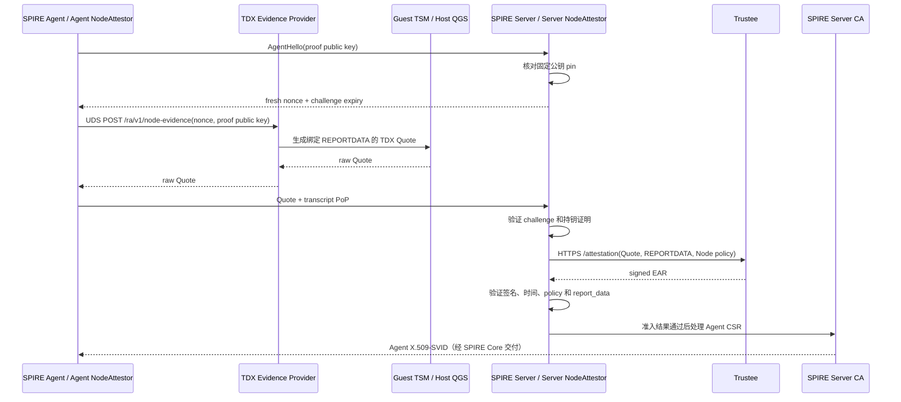

# Argus TDX Node Attestation

更新日期：2026-09-16；代码核对基线：`a0f19e0`。本文维护 Node 身份、绑定编码、PoP、EAR 与准入结果的协议细节。整体拓扑见 [当前代码总览](./Argus-SPIFFE-Current-Code-Architecture-CN.md)，服务实例证明见 [Workload 专题](./Argus-OpenViking-NGINX-SPIFFE-Helper-Workload-Attestation-Workflow-CN.md)，构建部署见 [运行手册](../core/spire/workload/README.md)，执行结果见 [文档索引中的验证记录](./README.md#验证记录)。

## 1. 阶段与身份

Node Attestation 通过真实 TDX evidence 和 Trustee 评估控制 SPIRE Agent 准入。当前 Server/Agent 与插件 SDK 固定为 **SPIRE v1.15.3**，沿用原 Node challenge、proof key、PoP、REPORTDATA 与 EAR 验证合同。

| 阶段 | 被证明对象与绑定内容 | 验证结果与身份 |
|---|---|---|
| Node Attestation | TDVM/节点；绑定 fresh nonce、进程配置的 Agent ID、proof public key | Server NodeAttestor 验证 EAR 后返回 AgentAttributes，SPIRE Server CA 签发 Agent SVID |
| Workload Attestation | 本次启动的 OpenViking 实际服务进程；绑定 nonce、运行实例、镜像、配置与 workload policy | Agent WorkloadAttestor 验证 EAR 后返回 selectors，SPIRE 按静态 Entry 授权并交付目标 SVID |

Node-only 部署的 Agent ID 可配置为 `spiffe://<trust-domain>/spire/agent/argus_tdx/<node-id>`。Provider 的必填 `--agent-id` 必须与 Server 插件的 `agent_id` 一致，其 trust domain 必须与 SPIRE core 配置一致；该身份在 Provider 进程内固定，请求不能覆盖。当前只支持一个固定 proof key 的 Agent slot，不包含多节点自动注册。格式和插件输入统一见 [配置参考](../core/argus/docs/configuration.md#spire-node-attestation)。

启用当前 OpenViking Workload 路径时，Provider、绑定合同、静态 Entry 和 policy 仍要求：

```text
spiffe://argus.local/spire/agent/argus_tdx/openviking-node
```

它是后续 workload Entry 的 parent。Node 准入本身不证明某个 OpenViking 进程，也不直接签发 OpenViking 身份。

## 2. 组件与运行流程



| 组件 | 当前职责 | 源码 |
|---|---|---|
| Agent NodeAttestor | 读取 proof key、响应 challenge、请求 Quote、签署 transcript | [internal/agent](../core/spire/plugins/argus-tdx-nodeattestor/internal/agent/) |
| SPIRE Evidence Provider | 接收本机请求、构造 REPORTDATA，通过 TSM 生成 Quote | [spire_evidence_provider.rs](../core/argus/src/bin/spire_evidence_provider.rs) |
| TDX Quote 基础层 | 创建 TSM report instance、写入 REPORTDATA、读取 Quote、清理 instance | [tsm.rs](../core/tdx-quote/src/tsm.rs) |
| Server NodeAttestor | 核对 pin、nonce、PoP，调用 Trustee 并返回固定 AgentAttributes | [internal/server](../core/spire/plugins/argus-tdx-nodeattestor/internal/server/) |
| Trustee Client | 提交证据并验证签名 EAR，measurement policy 由 Trustee 执行 | [internal/trustee/client.go](../core/spire/plugins/argus-tdx-nodeattestor/internal/trustee/client.go) |

Provider 生产证据；Trustee 评估证据；Server 插件决定是否接受节点；SPIRE Core/CA 管理节点记录与签发。Argus Guard 的业务请求授权是另一条流程。

## 3. Node 绑定合同

Agent 使用预置的 Ed25519 proof key；Server 配置 `slot_owner_key_sha256`，固定允许领取该 Agent ID 的公钥 SHA-256。公钥和 nonce 均为 32 字节。

```text
node_runtime_data = LP16("argus.node.tdx.reportdata")
                 || LP16(configured Agent ID)
                 || nonce
                 || proof public key

REPORTDATA = SHA-384(node_runtime_data) || 16 zero bytes

transcript = LP16("argus.node.tdx.transcript")
           || proof public key
           || nonce
           || U64BE(challenge expiry in milliseconds)
           || SHA-256(raw Quote)

PoP = Ed25519.Sign(proof private key, SHA-512(transcript))
```

`LP16` 是两字节大端长度前缀。编码实现见 [binding.go](../core/spire/plugins/argus-tdx-nodeattestor/internal/protocol/binding.go)，固定向量见 [report-data.json](../core/spire/plugins/argus-tdx-nodeattestor/internal/protocol/testdata/report-data.json)。

proof key 与 Agent SVID/CSR key 是两套密钥。Quote 绑定 proof public key，PoP 将该密钥与本次 challenge、有效期及 exact Quote 关联；该设计不声称 SVID 私钥已硬件封存或 proof key 不可复制。

## 4. Trustee 与准入结果

Node 客户端向固定 HTTPS origin 的 `/attestation` 提交真实 Quote。当前 Trustee v0.21.0 请求合同使用 `verification_requests`：Quote 放入 TDX evidence JSON，`runtime_data.raw` 发送完整 64 字节 REPORTDATA 的无补位 base64url，`runtime_data_hash_algorithm` 为 `sha384`，`policy_ids` 使用 Server 配置的固定 Node policy。

Server 只接受固定 P-256 公钥验证的 ES256 EAR，并核对：

- `iss`、`eat_profile` 与配置一致，`iat/exp` 有效；
- `submods.cpu0` 的 `ear.status` 为 `affirming`；
- `ear.appraisal-policy-id` 与本次 Node policy 一致；
- 已签名的 `ear.veraison.annotated-evidence.report_data` 与本次 nonce、公钥派生的 64 字节 REPORTDATA 完全一致。

验证通过后返回 Server 配置的 `AgentID`、空 `SelectorValues` 与 `CanReattest=true`。每次执行 Node 重新认证都会重新生成 challenge、Quote 和 EAR；普通 workload SVID 轮换不能据此算作新的 Node 或 Workload 证明。

pin、PoP、challenge 或 EAR 校验失败，以及 Provider/Trustee 调用失败，均不返回成功的准入结果。

## 5. 与 Workload 实现的衔接

`argus-spire-evidence-provider` 的两个独立 handler 使用 `/ra/v1/` 前缀：

| 接口 | 调用方 | 绑定方式 |
|---|---|---|
| `POST /ra/v1/node-evidence` | Agent NodeAttestor | 进程配置的 Agent ID、nonce、proof public key |
| `POST /ra/v1/workload-evidence` | Agent WorkloadAttestor | OpenViking 运行实例与 nonce；配置 workload 参数后启用 |

Provider 与 Agent NodeAttestor 按同一版本部署。安装新插件后，按运行手册重新生成 Agent 配置以更新 `plugin_checksum`，再重启服务。部署配置指定 UDS socket，HTTP 路径由插件固定。

两者复用 QuoteSource，但不复用身份主体、request schema 或 policy。Workload 使用结构化 runtime data；Node 继续使用上述二进制绑定。新部署通过 [配置合并工具](../core/spire/helpers/spiffe-helper/cmd/argus-agent-config/) 保留原 Node 配置与密钥，再加入 WorkloadAttestor、Broker socket 和当前 Provider 配置。

Node 准入后，Helper 用自己的身份连接本机 Broker，为登记的 OpenViking 实例获取目标 SVID。NGINX 使用该身份终止 mTLS。完整启动、Entry 和生命周期流程由 [Workload 方案](./Argus-OpenViking-NGINX-SPIFFE-Helper-Workload-Attestation-Workflow-CN.md) 定义。

## 6. 部署与验证入口

[运行手册](../core/spire/workload/README.md) 是两阶段的构建、版本升级与公司部署入口。它要求真实环境提供已批准的 Node 配置、proof key/pin、SPIRE bootstrap bundle、Trustee TLS/EAR 信任材料及 policy，不自动生成批准基线。

单独检查既有 Node 部署可使用 [argus-node-attestation.sh](../core/spire/scripts/argus-node-attestation.sh) 的 `preflight`、`run`、`status` 和 Server 侧 `server-status`；这组命令不会替代 Workload 启动流程。TDX Host/Guest 可用性检查见 [tests/tdvm](../core/spire/tests/tdvm/README.md)。

本地回归与 Linux 插件构建结果见 [Workload VALIDATION](../core/spire/workload/VALIDATION.md)。公司 Node-only 记录见 [2026-09-03 至 09-04 Enrollment 报告](./Argus-IP2-TDVM-Node-Attestation-Real-Enrollment-Report-CN.md)，后续两阶段联调见 [2026-09-09 Workload 状态报告](../../../documents_ly/argus-openviking-workload-attestation-status-20260909.md)。这些报告各自限定提交、版本与策略；本次文档更新没有重新执行现场验收。

原重构计划和历史验证快照保留在 [历史归档](./archive/pre-workload-implementation/README.md)，不再作为当前执行要求。
