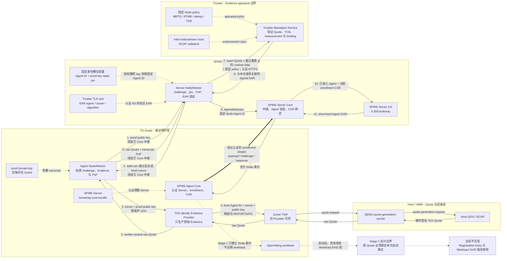

# Argus TDX + SPIFFE 两阶段真实认证重构方案

> 本文详细设计第一次 Quote（SPIRE Node Attestation）。第二次 Quote 只冻结目标与边界，不展开 workload 启动信息、可信观察、binding、policy、selector 或 SVID 生命周期设计。

## 1. 结论与范围

### 1.1 整体架构流程图

本次重构把当前 Mock Node Attestation 单向替换为真实链路。下图中的实线表示运行时调用或数据流，虚线表示静态信任输入或尚未实施的 Stage 2 边界：



主方案只保留五个运行角色、六项必要控制和一条 fail-closed 认证链。部署控制、测试工具、审计归档和线协议细节不再被描述成新的运行组件。

### 1.2 已冻结的决策

实施前先冻结一条代码约束：Argus 自有的 Node 认证链只保留一个 canonical 合同。直接删除旧 Mock message、schema、generated code、fixture、import、配置和测试，并在原代码位置完成替换；不新增带数字代际后缀的 package、目录、endpoint、domain separator 或 policy ID，也不保留双栈、协商、adapter和兼容分支。SPIRE、Trustee等外部依赖的正式发行号、上游API路径、构建工具schema值以及与本轮Node认证无关的外部服务API路径不属于本项目的代际标识，不擅自改写。

1. 第一次 Quote 直接接入真实 TDX、QGS/DCAP 和 Trustee，不保留 Mock、synthetic evidence、旧私有 Trustee verdict 或运行时 fallback。
2. 不设计回滚到 Mock。切换失败时停止新身份签发，保存失败证据并向前修复。
3. SPIFFE 集成分成两个认证阶段：
   - Node 阶段验证 TDVM/Node 是否可信；
   - Workload 阶段验证具体 OpenViking workload 启动是否可信。
4. 本文只详细设计 Node 阶段。第一次 Quote 不能代替第二次 Quote。
5. 保留独立 Evidence Provider，使 NodeAttestor 不直接依赖 TSM/QGS，并为未来 WorkloadAttestor 保留共享 evidence production plane。
6. Stage 1 Agent ID 固定为：

   ```text
   spiffe://argus.local/spire/agent/argus_tdx/openviking-node
   ```

7. 固定 Agent ID 使用 proof key 和 Server 静态公钥 pin 限制槽位领取者；proof-key-derived Agent ID 只作为未来备选，不进入当前协议和运行路径。
8. Stage 1 完成前，不给 OpenViking 目标 workload 签发可被误认为真实 attested 的 Workload SVID。
9. OpenClaw Agent 不得领取 `openviking-node` 固定 ID；其后续 Node enrollment 不在本文范围内。
10. 本文是目标实施方案，不是当前实现或真实硬件验收证明。
11. 因为Stage 2尚未完成且OpenViking目标Workload SVID保持禁用，Stage 1单向切换首先是隔离验证环境中的**非业务服务切片**；它不能被描述为现有OpenViking端到端mTLS业务链的无中断生产切换。完整业务恢复/上线还依赖后续Stage 2。

### 1.3 两阶段边界

| 阶段 | 发生时机 | 本文状态 | 能证明 | 不能证明 |
| --- | --- | --- | --- | --- |
| Stage 1：Node Attestation | SPIRE Agent 首次加入或重新认证时 | 详细设计 | 本次 fresh challenge 对应的真实 TDX TD 满足固定 Node policy，响应者持有预授权 proof key | OpenViking 已启动、某个进程/容器可信、proof key 不可复制、物理 TDVM 唯一 |
| Stage 2：Workload Attestation | OpenViking 启动后、准备签发首张 Workload SVID 时 | 延期设计 | 未来必须证明本次 OpenViking 启动实例可信 | 本文不宣称已设计或实现 |

第二次 Quote 必须绑定本次 OpenViking workload 的启动信息。如果只是重新生成一份与第一次内容相同的通用 TDVM Quote，它只能增加新鲜度，不能证明具体 OpenViking 进程。

“第一次/第二次 Quote”表示两个认证阶段，不表示每阶段只产生一次工件。每次Node首次join和reattest都必须生成新的Stage 1 Quote。

### 1.4 当前审计基线

| 项目 | 当前值 |
| --- | --- |
| 日期 | 2026-08-26 |
| 审计基线 HEAD | `4d2c1a2ff629ab29d09a0b9c00af62ae1aeadc48` |
| 当前 Node 路径 | 自定义 Agent/Server NodeAttestor 已存在，但仍使用 Mock Evidence Provider 和私有 Mock Trustee verdict |
| 真实链主要缺口 | Provider 尚未通过 Guest TSM 取得 Node Quote；QEMU/QGS wiring 未形成已验收链路；Server 未完成官方 `/attestation` 与严格 signed EAR 验证；最终镜像 measurement coverage 未关闭 |

## 2. 从 Argus 原始架构推导职责

### 2.1 原始架构的三个责任

Argus 原始设计不是“把所有认证逻辑放进一个插件”，而是明确分离：

| RATS/Argus 责任 | 原始组件 | 责任 |
| --- | --- | --- |
| Attester / evidence production | 被证明的目标 + Evidence Provider | 目标是被证明对象；Provider在目标侧取得本地事实，将fresh request与选定事实绑定进TDX Quote，输出Evidence |
| Evidence appraisal | Trustee / Attestation Service | 验证 Quote、collateral、TCB、measurement、binding 和 policy，返回可信验证结果 |
| Authorization / identity decision | Argus Guard 或身份系统 | 消费验证结果，决定是否授权请求或签发身份 |

原始原则是：

> target produces evidence, verifier validates it, caller authorizes the data transfer.

映射到本次 SPIRE Node Attestation：

| 原始责任 | Stage 1 对应组件 |
| --- | --- |
| Attester / 被证明对象 | OpenViking TDVM/Node |
| Attesting environment / evidence producer | TD Guest内的Evidence Provider + TDX Quote substrate |
| verifier | Trustee Attestation Service |
| Relying Party / 准入决定 | Server NodeAttestor验证EAR上下文并返回AgentAttributes；SPIRE Server Core消费结果并完成Agent准入 |
| credential issuer | SPIRE Server CA / X.509 Authority；可选UpstreamAuthority只向Server CA提供上游签名材料/证书链 |
| enrollment transport与claimant侧协调 | SPIRE Agent Core、SPIRE Server Core和Agent NodeAttestor |

Argus Guard 不在第一次 Quote 主链中。它在取得 SVID 后处理业务请求授权，不能替代 Node Attestation，也不应成为 Stage 1 完成依赖。

### 2.2 为什么保留 Evidence Provider

Evidence Provider 的逻辑职责是目标侧证据生产，而不是 Trustee 的别名，也不是只暴露 `/dev/tdx_guest` 的薄包装器。

本文中的运行组件特指新建的 **TDX identity Evidence Provider**。它继承原始 Argus 的 evidence-producer 职责边界，但不替换现有 `evidence_provider.rs` 所服务的 Argus Guard Evidence API；二者只共享拆出的 QuoteSource/TSM cleanup 基础能力。这样既不让 NodeAttestor重新耦合TSM，也不会为 Stage 1 顺带破坏既有 Guard 调用链。

本阶段 Node handler 的职责收敛为：

```text
Validate typed Node request
  -> Bind nonce + fixed Agent ID + proof public key
  -> Generate real TDX Quote
  -> Return verifier-neutral TDX evidence
```

Node 阶段没有 OpenViking PID、container、image 或 launch facts，因此不保留空泛的 `Collect` 模块。未来 Workload handler 才可能增加本地 runtime observation：

```text
Observe workload facts
  -> Bind workload challenge + launch facts
  -> Generate real TDX Quote
  -> Return workload evidence
```

删除独立 Provider 进程并不会在密码学上使 Node Attestation 不可能，因为可以把 TSM/Quote 代码嵌入 Agent NodeAttestor；但会产生三个直接后果：

1. NodeAttestor 同时承担 SPIRE stream、binding、TSM 和 Quote 生命周期，职责重新耦合；
2. WorkloadAttestor 需要复制 TSM/QGS 和清理逻辑，或反向依赖 Node 插件；
3. 多个 Attestor 都需要 TSM 写权限，Quote oracle 与实现漂移面扩大。

因此，独立 Provider 是当前“NodeAttestor 解耦 + 后续 WorkloadAttestor 复用”目标下必须保留的架构组件，但不是 TDX 协议强制要求的独立 daemon。

### 2.3 Provider 不应承担的责任

Provider 明确不负责：

- SPIRE NodeAttestor stream；
- proof private key 和 transcript 签名；
- 决定 Agent ID；
- 编码 Trustee 特定版本的 HTTP request/evidence JSON；
- 调用 Trustee 或验证 EAR；
- 判断 MRTD/RTMR/TCB 是否允许；
- 返回 `ALLOW/DENY`、selectors 或 SVID；
- 业务请求授权。

Trustee 的 wire encoding 和 EAR 验证放在 Server 侧 `TrusteeClient` 中。这样更换 verifier 合同时不需要重新修改 TD Guest 内的 Provider，也不会把 Trustee v0.21.0 schema 传播到未来 WorkloadAttestor。

Provider在Node binding中使用fixed Agent ID，不表示它拥有身份授权权威；该值是部署时固定的协议常量。只有Server NodeAttestor能在appraisal通过后把该ID写入`AgentAttributes`。

## 3. Stage 1 的安全命题

### 3.1 接受条件

第一次 Quote 成功只允许表达：

> 一份通过固定Trustee Node policy的真实TDX Quote，其REPORTDATA绑定了SPIRE Server本次fresh nonce、固定Node Agent ID和指定proof public-key bytes；同一attestation transaction的响应者另外证明自己持有对应private key；Server确认该key被带外授权领取固定Node身份槽位后才完成准入。

最小接受条件为：

```text
EvidenceValid :=
    real_tdx_quote
    AND quote.report_data_matches_expected_node_runtime_data
    AND trustee_quote_collateral_and_node_policy_appraisal_passed
    AND signed_ear_is_bound_to_this_exact_appraisal_request
    AND signed_ear_signature_time_and_policy_valid

SessionBound :=
    authenticated_spire_server_connection
    AND fresh_random_server_nonce
    AND one_response_per_attestation_transaction
    AND transcript_proof_of_possession_valid

FixedIdentityAuthorized :=
    fixed_identity_owner_static_pin_matches

NodeAccepted :=
    EvidenceValid AND SessionBound AND FixedIdentityAuthorized
```

只有全部条件通过，Server NodeAttestor 才返回固定 Agent ID 对应的 `AgentAttributes`。随后由 SPIRE Server Core/CA 签发 Agent SVID；NodeAttestor 插件本身不签发 SVID。

### 3.2 部署前提

以下条件必须通过构建、部署和运行验收，但不能写成 Quote 已经持续证明的密码学结论：

```text
DeploymentAssumptions :=
    final measured image and reference policy are correctly published
    AND Evidence Provider is the only application process allowed to write TSM
    AND Provider UDS is accessible only to the SPIRE Agent runtime identity
    AND SPIRE Agent Core authenticates the expected SPIRE Server with the provisioned bootstrap trust bundle
    AND SPIRE Agent / Provider / Guest root are inside the declared Guest TCB
    AND the managed topology runs one OpenViking Node for the fixed Agent ID
    AND no claim is made that same-key clones are cryptographically detected
```

MRTD/RTMR 可以覆盖最终镜像、启动链和被测配置，但不能持续证明“当前只有一个进程”“当前 ACL 未被修改”或“系统中不存在私钥副本”。这些必须作为部署前提和验收检查单独记录。

### 3.3 明确不证明

第一次 Quote 不证明：

- OpenViking 已启动；
- 某个 PID、container ID、image digest 或 launch configuration 可信；
- proof key 不可复制；
- proof private key 与 TD 之间存在不可转移的硬件共址；
- 不存在同 policy TD 之间的 relay/cuckoo；
- 固定 Agent ID 表示唯一物理 TDVM；
- TDVM 在 Quote 之后持续未被攻陷；
- Agent SVID 持有者的每个业务请求都应被允许；
- 第二次 Quote 或 OpenViking Workload SVID 已经完成。

如果威胁模型要求识别 same-key clone 或证明不可转移共址，需要另行引入 TDX 内封存密钥、外部不可回滚状态或其他 anti-cuckoo 机制。静态 pin、固定 ID 和部署脚本都不提供该证明。

## 4. 最小组件与删除后果

### 4.1 五个运行角色

| 运行角色 | 唯一职责 | 为什么需要 | 去掉后会怎样 |
| --- | --- | --- | --- |
| SPIRE Agent进程：Agent Core + Agent NodeAttestor + proof signer | Agent Core认证Server、建立enrollment流并中继plugin payload/challenge；Agent plugin调用Provider并签署transcript | 它是加入trust domain的claimant侧运行时，并把本地证据接入SPIRE协议 | Provider即使取得Quote，也无法完成SPIRE Agent enrollment/renewal |
| TDX identity Evidence Provider 进程 | 根据强类型 Node 请求构造 REPORTDATA，经 TSM 取得真实 Quote，返回 verifier-neutral evidence | 隔离 TSM 权限和证据生产逻辑，并为两个认证阶段提供共同 production plane | 若完全删除则没有 evidence producer；若嵌入 NodeAttestor则失去解耦和后续复用 |
| TDX Quote substrate：Guest TSM、QEMU quote socket、Host QGS/DCAP | 生成硬件签名的真实 TDX Quote | 这是从软件声明跨越到硬件 evidence 的基础 | 只能得到 Mock、自报或不可远程验证的数据 |
| Trustee Attestation Service | 验证 Quote、collateral、TCB、debug、MRTD/RTMR、runtime binding 和 Node policy，返回 signed EAR | Quote bytes 本身不是准入结论 | Server 无法判断 Quote 是否有效、是否来自目标软件栈 |
| SPIRE Server进程：Server Core + Server NodeAttestor + CA/X.509 Authority | Core中继payload/challenge并消费结果；plugin生成challenge、验证pin/PoP/EAR并返回AgentAttributes；Core绑定Agent状态/CSR后由Server CA签发SVID | 它把一次appraisal转化为trust domain内的受管Agent记录和短期Node identity | EAR只能作为孤立验证结果，不能阻止或完成SPIFFE身份签发 |

### 4.2 必要控制和静态工件

这些不是新的运行组件：

| 控制/工件 | 为什么需要 | 去掉后会怎样 |
| --- | --- | --- |
| fixed Agent ID | 为当前单 Node 拓扑提供稳定、可读的 Agent parent | Agent parent 命名重新依赖实例/key，后续 Entry 必须随替换迁移 |
| proof key + transcript PoP | 证明当前stream响应者持有Quote中绑定公钥对应的私钥 | 只有一个被Quote覆盖的public key声明，不能证明响应者实际持钥 |
| Server静态pin | 因当前选择固定Agent ID，带外指定哪把proof key有权领取该身份槽位 | 任意通过相同Node policy的新key都可领取相同principal；它不是TEE/RATS信任根，也不防same-key clone/relay |
| final measurement manifest + content-addressed Node policy | 把“真实 TDX”限制为“被允许的 OpenViking Node 软件栈” | 任意有效 TDX Guest 都可能通过 |
| Trustee TLS/EAR trust | 认证AS endpoint并固定谁有权签发Attestation Result | 可能把Evidence发送到错误端点或接受伪造appraisal |
| Provider UDS/TSM permissions | 限制Guest内谁能调用Node evidence能力以及谁能写TSM | 普通workload或同Guest其他进程可能滥用Quote能力 |

### 4.3 Stage 1 不需要的组件

以下内容不进入第一次 Quote 的运行主链：

- Argus Guard；
- WorkloadAttestor 和 Workload Evidence handler；
- OpenViking Registration Entry 与目标 Workload SVID；
- 通用 `subject/profile` router 或动态 profile DSL；
- KBS、独立 RVPS；
- Provider `/healthz` HTTP route；
- pin revision、在线热更新、active-stream cancellation、ABA 状态机；
- 自定义 singleton lease 或将 inventory 描述为 anti-clone 证明；
- proof-key-derived Agent ID 的运行时支持；
- telemetry recorder、完整 evidence archive 作为认证依赖；
- Mock Provider、Mock Trustee、synthetic backend 和 cached `ALLOW`。

运行日志、审计 bundle、golden vectors 和 smoke 工具仍然需要，但它们是验证与运维工件，不是认证链组件。

单元测试可以使用进程内 fake QuoteSource 或受控 HTTP test server；它们不得编译进 production runtime、不得成为可配置 fallback，也不能作为真实 TDX/Trustee 验收证据。这里删除的是旧 Mock 服务和身份信任路径，不是禁止所有测试替身。

## 5. 固定 Agent ID 与 proof key

### 5.1 Agent ID 的语义

```text
trust domain = argus.local
Agent ID     = spiffe://argus.local/spire/agent/argus_tdx/openviking-node
```

该 ID 由 Server NodeAttestor 在验证成功后返回，Agent 和 Provider 都不能动态选择。它表示：

- `/spire/agent/`：这是 SPIRE Agent identity，不是业务 Workload identity；
- `/argus_tdx/`：该 Agent 由 `argus_tdx` NodeAttestor 准入；
- `/openviking-node`：这是承载 OpenViking 的 Node 部署槽位，不表示 OpenViking 进程已经可信。

不使用更短的 `/openviking`，因为它无法区分 Node parent 与未来 OpenViking workload identity，也丢失 attestor 类型层次。

固定 ID 的理由是当前只有一个受管 OpenViking Node，替换或重启后希望后续 workload parent 保持稳定。它不是比 per-key ID 更强的硬件身份方案。

### 5.2 proof key 与静态 pin

使用 Ed25519 proof key：

1. 首次 real-only provisioning 时在 TD Guest 内生成；
2. private key保存在Agent专用持久目录，父目录`0700`、文件`0600`，仅Agent运行身份可读；Guest root仍属于TCB；
3. private key 不进入镜像、测试 fixture、日志、普通备份或 evidence bundle，也不允许通过TDVM snapshot复制作为正常恢复方式；
4. 正常 Agent 重启复用同一 key；
5. 运行时 key 缺失、格式或权限错误时快速失败，不自动生成替代 key；Guest/数据盘替换使用5.3节显式replacement；
6. Server 配置预置：

   ```text
   slot_owner_key_sha256 = lowercase_hex(SHA256(raw_ed25519_public_key))
   ```

7. Server 在发送 challenge 前校验 AgentHello 中的 public key，不采用 first-seen/TOFU。

proof key 必须保留，因为当前 SPIRE NodeAttestor plugin contract 只提供 opaque payload/challenge-response，没有可直接放入 TDX REPORTDATA 的标准 Agent CSR key 或 channel binding。proof key 的作用仅为：

- public key 被绑定进 Quote；
- private key 对当前 transcript 签名；
- Server 确认响应者持有预授权 key。

它不证明 key 不可复制或唯一驻留于某个 TD。

proof key与static pin是两个不同机制：PoP解决“当前响应者是否持有Quote中绑定的私钥”；static pin解决“在固定Agent ID语义下，哪把key被带外授权领取该槽位”。static pin不是RATS必需项，也不是TDX trust root；如果未来迁移到proof-key-derived唯一Agent ID，可以重新评估并删除pin，但本版本不同时支持两种身份方案。

### 5.3 简化后的 key replacement

首版不支持进程运行期间在线换 pin：

1. 停止旧Agent并撤销其受管启动/网络访问，阻止继续续签；
2. 排空连接并等待旧Agent SVID到`NotAfter`；不声称Agent record删除等于已签证书即时吊销；
3. evict/delete旧Agent record，并确认fixed ID下没有旧记录或banned记录；
4. 停止Server/plugin，更新静态pin配置；
5. 在新Guest中生成或装载新proof key；
6. 重启Server/plugin，再启动新Agent；
7. 使用新nonce、Quote、EAR完成固定ID的重新认证。

`ban`适合事件处置但不能与`evict`视为同义步骤：同一fixed ID仍处于banned状态时，新claimant会被拒绝。若此前执行过ban，replacement必须先按锁定SPIRE版本的操作合同完成旧记录清理，并验证新attestation不再命中ban状态；本方案不假设存在自动unban。

Server/plugin 重启会结束所有旧 stream，因此不需要 pin revision、active-stream cancellation 或 ABA 状态机。受管部署的 Node 副本数固定为一，但不新建自定义 lease 子系统；same-key unmanaged clone 仍是明确残余风险。

Node image/policy升级也采用同一forward-only原则：构建并实测新最终image，生成新的reference manifest和content-addressed policy，停止旧Agent并等待旧SVID排空，发布新policy/trust配置并重启Server，再启动新Agent。首版不同时接受新旧两套Node policy，也不保留回退到旧Mock或旧measurement的分支。

## 6. 构建、测量与 provisioning 顺序

真实运行流程之前必须先完成以下顺序。

### 6.1 G0：打通真实 Quote 与 Trustee 基础链

```text
Host QGS
  -> QEMU quote-generation-socket
  -> Guest TSM configfs
  -> fixed diagnostic REPORTDATA
  -> non-empty real TDX Quote
  -> locked Trustee AS
  -> signed EAR
```

此阶段使用 `tdx-quote-smoke` 作为诊断工具，确认：

- QGS socket 不只是存在，而是 Guest 能取得非空 Quote；
- Quote 中 REPORTDATA 与输入一致；
- 锁定 Trustee 版本能够解析真实 evidence 并返回 signed EAR；
- 实际 EAR serialization、claim path/type、policy identity 和时间字段；
- 目标启动链的 MRTD、RTMR 与 event log 覆盖范围。

smoke 工具不进入 production identity path，G0 的 measurement 也不是最终 reference values。

### 6.2 G1：构建最终 measured image

1. 将 SPIRE Agent、Agent NodeAttestor、Evidence Provider、Node binding/QuoteSource 和不可变关键配置放入最终受测 image/initrd/verity 链；
2. 禁止在启动后通过未度量 copy 或 mutable bind mount 替换上述 artifact；
3. 在目标硬件启动这个精确最终 image；
4. 重新采集最终 MRTD、RTMR 和 measured-boot event log；
5. 生成以下映射：

   ```text
   source commit
     -> binary/image/initrd/verity digest
     -> measured-boot event
     -> final MRTD/RTMR reference values
     -> content-addressed Trustee Node policy
   ```

6. 使用最终 policy 验证最终 image 内 Provider 生成的新 Quote。

如果不能证明 NodeAttestor、Provider 和关键配置进入最终 measurement chain，Stage 1 停止验收。拿到一份可验证 Quote 不等于实际认证代码已被测量。

### 6.3 G2：身份与信任配置

1. 部署固定 digest 的 Trustee AS、Node policy 和 EAR signer；
2. Server 配置固定 HTTPS origin、TLS root、EAR signer public key/fingerprint、issuer、algorithm、policy ID/hash；
3. Agent配置并测量预期SPIRE Server的bootstrap trust bundle；Agent Core只有在认证Server连接后才接受Node challenge，proof-key transcript签名不替代Server authentication；
4. 在 Guest 内生成 proof key；
5. 通过已认证 provisioning 通道把 public-key digest 写入 Server 静态 pin；private key 不离开 Guest。该通道必须认证Guest端点和操作者、授权固定槽位更新、原子写入并回读pin、记录审计且拒绝旧值回滚；具体机制在M1前冻结，缺失时阻塞enrollment；
6. Provider 以专用身份启动并独占应用层 TSM 写权限；
7. Provider 创建受限 UDS；
8. SPIRE Agent 只挂载/访问该 UDS，不获得 TSM writable mount；
9. 启动 Agent，进入首次 Node Attestation。

## 7. 第一次 Quote 的运行时流动顺序

### 7.1 总体时序

```text
SPIRE Agent Core
    | authenticate expected SPIRE Server with bootstrap trust bundle
    | open enrollment / relay AgentHello
    v
SPIRE Server Core -> Server NodeAttestor
    | plugin verifies static pin; generates fresh nonce
    v
SPIRE Agent Core -> Agent NodeAttestor
    | typed NodeEvidenceRequest over protected UDS
    v
TDX identity Evidence Provider
    | build REPORTDATA
    v
Guest TSM -> QEMU quote socket -> Host QGS/DCAP
    | raw TDX Quote
    v
TDX identity Evidence Provider -> Agent NodeAttestor
    | raw Quote
    v
Agent NodeAttestor
    | sign semantic transcript
    | Agent Core -> Server Core relay raw Quote + signature
    v
Server Core -> Server NodeAttestor
    | encode official Trustee request
    v
Trustee Attestation Service
    | signed EAR
    v
Server NodeAttestor
    | AgentAttributes(fixed Agent ID, CanReattest=true)
    v
SPIRE Server Core
    | consume AgentAttributes; validate/register Agent; bind current CSR
    v
SPIRE Server CA / X.509 Authority
    | short-lived Agent SVID
    v
SPIRE Agent
```

### 7.2 逐步流程

1. SPIRE Agent Core使用预置bootstrap trust bundle认证预期Server，建立enrollment连接，并打开到Agent NodeAttestor plugin的本地stream。
2. Agent NodeAttestor产生包含proof public key的初始payload；Agent Core将其发送给Server Core，Server Core再中继到Server NodeAttestor plugin。
3. Server NodeAttestor校验key长度和静态pin。失败时立即拒绝，不生成challenge、不调用Provider/QGS。
4. Server NodeAttestor为本plugin stream生成32-byte CSPRNG nonce和本地过期时间；Server Core把challenge中继给Agent Core，再交给Agent plugin。
5. Agent NodeAttestor校验challenge后，通过受保护UDS调用Provider的强类型Node API。
6. Provider 使用固定 Node profile 构造：

   ```text
   node_runtime_data =
       fixed_domain_separator
       || fixed_agent_id
       || server_nonce
       || proof_public_key
   ```

7. Provider 将其确定性映射到64-byte TDX REPORTDATA，创建每请求唯一的TSM report instance，经QEMU/QGS取得raw Quote，并在所有结束路径清理instance。
8. Provider返回verifier-neutral TDX evidence；不返回policy verdict、Agent ID、selector或Trustee envelope。
9. Agent plugin校验`evidence_type`和`quote_format`等于本方案冻结的唯一值，解码并限制raw Quote大小，然后对当前Hello、Challenge和exact raw Quote bytes组成的transcript签名；Agent Core将response中继到Server Core，再交给Server plugin。
10. Server NodeAttestor消费nonce，验证stream状态、过期时间和Ed25519 PoP，并独立重算`node_runtime_data`。
11. Server侧TrusteeClient将raw Quote编成锁定AS版本要求的TDX evidence JSON，使用Server自己的`node_runtime_data`和固定policy构造`/attestation`请求；建立连接时认证配置的AS TLS endpoint。
12. Trustee验证Quote、collateral、TCB/debug、MRTD/RTMR、runtime-data binding和Node policy，返回signed EAR。
13. Server NodeAttestor验证EAR signer、issuer、algorithm、时间窗、与本次exact request的关联、policy identity/hash以及完整appraisal结果。
14. 全部通过后，Server NodeAttestor向Server Core返回固定Agent ID对应的`AgentAttributes`；失败时不返回部分attributes。
15. Server Core校验并记录Agent，把当前enrollment请求中的CSR与已通过的Agent结果绑定，再由SPIRE Server CA/X.509 Authority签发短期Agent SVID。可选UpstreamAuthority只为Server CA提供上游签名材料/证书链，不必逐张签Agent SVID。

顺序不可改变。Agent 不得直接写 TSM；Provider 不得调用 Trustee；Server 不得相信 Provider 回传的 digest/verdict；SPIRE Core 不得在 NodeAttestor 失败时通过旧 join token 或 Mock 路径签发同一身份。

### 7.3 失败与重试

| 失败位置 | 行为 |
| --- | --- |
| Hello/key 格式或静态 pin 不匹配 | Server 在 challenge 前拒绝 |
| Provider UDS caller、schema 或权限失败 | 当前 stream 失败 |
| TSM、QEMU、QGS、Quote 或 cleanup 失败 | Provider 不返回成功 evidence，当前 stream 失败 |
| transcript/PoP 失败 | Server 拒绝，不调用 Trustee |
| Trustee transport、collateral、measurement、binding 或 policy 失败 | 不返回 AgentAttributes |
| EAR signer、issuer、time、policy identity/hash 或 appraisal 失败 | 不返回 AgentAttributes |

任意重试必须创建新 stream、新 nonce、新 Quote 和新 EAR。禁止 cached `ALLOW`、direct-TSM fallback、Mock fallback 或复用旧 response。

### 7.4 renewal

`CanReattest=true` 只是允许 SPIRE 发起 re-attestation，不是完成证据。验收必须观察至少一次：

```text
old Agent SVID approaching renewal
  -> new NodeAttestor stream
  -> new Server nonce
  -> new Provider request
  -> new real Quote
  -> new signed EAR
  -> new Agent SVID
```

首版配置有限 Agent TTL，建议初值为 `10m`；具体值是部署/容量参数，不是协议常量。renewal 失败时不签发新 SVID，旧 SVID 只存活到既定 `NotAfter`，本方案不声称即时撤销。

## 8. 最小协议合同

### 8.1 Agent/Server NodeAttestor 内部消息合同

删除现有与 Mock schema 绑定的 message、generated code和本地import，在唯一 canonical 路径原位生成以下最小合同：

```text
proto/argus/spire/nodeattestor/nodeattestor.proto
gen/argus/spire/nodeattestor/
```

不创建平行版本目录，不保留旧message解析、协议协商、兼容adapter或fallback：

```protobuf
message AgentHello {
  bytes proof_public_key = 1;     // 32-byte Ed25519 public key
}

message NodeChallenge {
  bytes nonce = 1;                // 32 bytes
  uint64 expires_at_unix_ms = 2;  // Server-local freshness bound
}

message NodeEvidenceResponse {
  bytes tdx_quote = 1;            // exact raw Quote bytes
  bytes transcript_signature = 2; // 64-byte Ed25519 signature
}
```

这些是装入SPIRE Plugin SDK opaque `payload`、`challenge`和`challenge_response`中的Argus内部消息，不是Agent plugin与Server plugin之间新增的直连RPC。SPIRE Agent Core和Server Core负责网络连接与字节中继。

这些消息由唯一的当前protobuf package定义，不增加`version`字段。`trust_domain`、fixed Agent ID 和 policy 都由 Server 固定配置；Provider 的 Node profile固定同一 Agent ID。它们不由 Agent 在 wire 中自报。

跨边界只校验安全命题需要的内容：长度、过期时间、Quote 大小和状态顺序。单个 stream 状态为：

```text
WAIT_HELLO -> CHALLENGE_SENT -> RESPONSE_RECEIVED -> ACCEPTED | REJECTED
```

每个 stream 只接受一个 response；成功、失败、超时和断线都会消费该 nonce。

`expires_at_unix_ms`由Server时钟解释，并作为整个NodeAttestor transaction的截止时间：Server在接收response时和返回`AgentAttributes`前都检查期限，避免AS调用无限延长旧challenge。G0必须冻结Server/AS时钟来源和允许skew；时间不可信或超出范围时fail closed。

### 8.2 REPORTDATA

定义：

```text
LP16(x) = 2-byte unsigned big-endian length || x

node_runtime_data =
    LP16("argus.node.tdx.reportdata")
    || LP16("spiffe://argus.local/spire/agent/argus_tdx/openviking-node")
    || nonce[32]
    || proof_public_key[32]

node_binding_digest = SHA-384(node_runtime_data)  // 48 bytes
TDX_REPORTDATA      = node_binding_digest || zero[16]
```

不再重复绑定：

- `trust_domain`：已经包含在完整 Agent ID 中；
- `evidence_profile`：由固定domain separator和Node方法表达；
- `policy_id`：它是 Server/Trustee 的验证侧选择，不是 Provider 的本地事实；Server必须验证 EAR 中的 policy identity/hash；
- `subject.kind=node`：由 Node 方法本身确定。

Provider 和 Server 必须分别实现/计算该合同，并使用跨语言 golden vectors 验证。禁止两个组件共享同一个运行时 encoder 形成“同错通过”。

本次冻结唯一的消息与binding合同。以后若binding覆盖字段或编码发生不兼容变化，必须在同一次变更中同步替换Agent、Provider、Server、golden vectors和部署配置；不通过并行package或运行时协商保留旧合同。

### 8.3 transcript PoP

```text
transcript_digest = SHA-512(
    LP16("argus.node.tdx.transcript")
    || proof_public_key[32]
    || nonce[32]
    || BE64(expires_at_unix_ms)
    || SHA-256(exact_raw_quote_bytes)
)

transcript_signature = Ed25519.Sign(proof_private_key, transcript_digest)
```

这里的transcript是上述字段组成的canonical semantic transcript，不是直接签exact protobuf serialization。REPORTDATA证明Quote覆盖本次nonce、固定身份和public key；transcript signature证明响应者持有对应private key，并把exact Quote bytes绑定到同一attestation transaction。两者不能互相替代。

### 8.4 Evidence Provider Node API

Provider 只监听 Guest 内 Unix Domain Socket，例如：

```text
/run/argus/evidence-provider.sock
```

Stage 1 只暴露一个显式 typed endpoint：

```http
POST /node-evidence
Content-Type: application/json
```

```json
{
  "nonce": "<BASE64URL_NOPAD(32 bytes)>",
  "proof_public_key": "<BASE64URL_NOPAD(32 bytes)>"
}
```

成功响应：

```json
{
  "evidence_type": "tdx_quote",
  "quote_format": "<G0 real sample frozen value>",
  "quote": "<BASE64URL_NOPAD(raw TDX Quote)>"
}
```

必须满足：

- 不监听 TCP/loopback，不启用 CORS 或 redirect；
- Provider使用专用`argus-evidence`身份，Agent使用专用`spire-agent`身份；不得让其他进程共享`spire-agent` UID。socket目录仅Provider和Agent组可访问，numeric UID/GID与mode由最终measured image manifest冻结；
- 文件系统 ACL 是主调用授权边界，只允许 SPIRE Agent runtime identity 连接；`SO_PEERCRED` 可作为额外校验/日志，而不是另一套复杂路由授权系统；
- 不接受 raw REPORTDATA、通用 claims map、subject、policy ID 或 Trustee request；
- unknown field、错误 encoding、错误长度、超限和未授权 caller 快速失败；
- writable TSM configfs只进入Provider的mount namespace；Agent和普通workload不挂载该路径，也不获得等价device/capability。Provider是唯一应用层TSM writer，Guest root仍属于TCB；
- 每请求使用唯一 TSM instance，成功、错误、timeout、cancel 都清理；cleanup 失败则本请求失败；
- 不提供 `/healthz` 安全子协议。service manager 可检查进程/socket readiness，真实可用性由 Quote 集成测试证明。

未来 Stage 2 使用独立的 typed WorkloadEvidence API；具体endpoint在Stage 2详细设计时冻结。当前请求不预留optional workload字段，也不建立通用`subject/profile` router。

### 8.5 Trustee Client 与 EAR

Stage 1使用锁定版本和image digest的**standalone Trustee REST Attestation Service**，并配置EAR token broker。它不是完整KBS/RVPS Compose；本阶段不进行secret/resource release，也不引入KBS或独立RVPS。

Server 内只保留一个 TrusteeClient 逻辑模块：

```text
raw Quote
  -> encode locked Trustee TDX evidence request
  -> POST /attestation over authenticated HTTPS
  -> receive signed EAR
  -> verify signer/issuer/algorithm/time/policy/appraisal
```

语义固定为：

```text
tee                = tdx
evidence           = Server-encoded TDX evidence containing exact raw Quote
runtime_data.raw   = exact node_runtime_data
runtime_data_hash  = sha384
policy             = Server-configured content-addressed Node policy
```

Server 传给 AS 的是完整 `node_runtime_data`，不是已经计算好的 48-byte digest，避免 AS 对 digest 再哈希一次。

精确 Trustee evidence JSON、EAR serialization、claim path/type、clock skew 和 collateral receipt 必须由 G0 的真实成功样本冻结，不能根据 Mock schema 猜测，也不加入多版本 alias/fallback。Server 不再维护第二份本地 YAML MRTD/RTMR evaluator；它验证固定 policy 确实返回完整通过结果。

signed EAR必须可认证地对应本次exact raw Quote、`node_runtime_data`/REPORTDATA和policy。Server不能只检查“签名有效、时间新、policy pass”，也不能依赖“它刚从同一HTTPS响应返回”作为关联证明。G0必须冻结EAR中的evidence/request hash、verified runtime-data/report-data claim或AS支持的request nonce等实际关联机制；若真实EAR无法提供等价的签名关联，Stage 1阻塞而不是接受可在时间窗内重放的通用pass token。

如果真实 EAR 不提供可认证的 policy identity/hash，G0 必须停止并重新选择可验证的 policy 固定方式，例如为不可变 policy 使用独立 AS 实例和固定配置证据；不能在方案里声称 Server 校验了实际不存在的 claim。

### 8.6 AgentAttributes

Server NodeAttestor 成功后返回：

```text
AgentID:
  spiffe://argus.local/spire/agent/argus_tdx/openviking-node

SelectorValues:
  empty

CanReattest:
  true
```

Node selectors 在 SPIRE SDK 中是可选的。当前下游只需要固定 Agent ID 作为未来 Workload Registration Entry 的 parent，因此不返回 `verified:true`、profile 或 policy 等恒真/重复 selector。未来只有在具体 Entry 确实需要稳定 Node selector 时才增加。

proof key与SPIRE Agent SVID/CSR key是两套不同密钥。方案依赖SPIRE 1.15.2 Core合同：Server NodeAttestor返回的`AgentAttributes`只作用于同一AttestAgent enrollment transaction，Server Core只在该结果成功后把当前连接中的Agent CSR交给Server CA签名。M2必须通过锁定版本源码核对和集成测试确认这一绑定；若属性可跨transaction或与其他CSR混用，Stage 1停止。

## 9. Trustee policy、测量值与信任边界

### 9.1 Node policy 是唯一 measurement 权威

Node policy 至少约束：

- TEE 类型为 TDX；
- debug 关闭；
- 允许的 TCB/collateral 状态；
- 最终镜像对应的 MRTD/RTMR reference values；
- runtime-data binding 通过；
- 所有 policy-required appraisal 子结果通过。

policy artifact 使用发布时 exact bytes 生成 content ID，例如：

```text
policy_id = argus-node-tdx-<sha256(policy_bytes)>
```

Server 固定 policy ID、exact bytes hash 和 EAR 实际返回的 policy identity/hash。若 AS 中相同 ID 的 policy bytes 被覆盖，Server 必须拒绝。首版 reference values 直接进入不可变 policy，不引入独立 RVPS。

### 9.2 外部 TCB

必须显式信任：

- SPIRE Server、Server NodeAttestor 和 SPIRE CA；
- Trustee TDX verifier、Node policy 和 EAR signer private key；
- Server预置的TLS/EAR trust roots，以及Agent预置的SPIRE Server bootstrap trust bundle；
- Intel endorsement/certificate roots、DCAP collateral来源与freshness语义；这些是Trustee verifier的Endorser输入；
- measurement manifest、reference values及其发布者；这是逻辑上的Reference Value Provider输入，首版不要求部署独立RVPS；
- Node appraisal policy及其发布者；这是Verifier Owner/Appraisal Policy for Evidence输入；
- TD firmware、kernel、TSM driver和最终 measured Guest 软件栈；
- final image/reference policy 的构建发布流程。

Host/QEMU/QGS不能无痕修改一份既有Quote中的REPORTDATA、measurement或签名，但可以造成拒绝服务，也可能把请求relay到另一台满足同一policy的TD并返回一份真实有效Quote。本方案不证明claimant与quote-producing TD之间存在不可转移共址。若Trustee verifier或EAR signer被攻陷，Server无法通过自身重复解析measurement来恢复信任；这是明确的Trustee TCB风险。

## 10. 旧 Mock 删除与单向切换

### 10.1 删除范围

实施时，在精确盘点引用后删除或改写：

| 范围 | 处理 |
| --- | --- |
| `core/spire/plugins/argus-tdx-nodeattestor/cmd/mock-evidence-provider/` | 删除 |
| `cmd/mock-trustee/`、`cmd/fake-services/`、`internal/fakeservices/` | 删除 |
| 现有带代际后缀的本地proto/generated目录、旧JCS/schema/fixture | 删除；在canonical NodeAttestor路径生成唯一最小合同，不保留平行package |
| `internal/server/binding_store.*` | 删除 |
| `internal/policy/` 本地 YAML evaluator | 最终 Trustee policy 同批落地后删除 |
| `internal/evidence/` | 删除旧 Mock/TCP client，改为受限 UDS NodeEvidence client |
| `core/argus/src/bin/tdx_evidence_provider.rs` | 新增 TDX identity 专用、UDS-only、real-only Provider binary；Stage 1 只注册 typed NodeEvidence handler，Stage 2 再评审独立 WorkloadEvidence handler |
| `core/argus/src/bin/evidence_provider.rs` 与既有 Argus Guard Evidence API消费链 | 本轮不复用、不改写，也不部署进 Stage 1 dual-TDVM Node runtime；它不是 Node Mock 兼容层。是否整体迁移或退役必须另行盘点 `guard.rs`、`engine.rs`、`start_argus.sh` 和 `docker-compose.yml` 后决定 |
| `images/Dockerfile.mock-trustee`、`images/Dockerfile.mock-evidence-provider` | 删除 |
| dual-TDVM compose/config/scripts 中的 Mock services/endpoints/PKI/fallback | 删除 |
| Mock-only Node/Workload tests | 删除或替换为真实 Quote/AS 集成与 fail-closed 测试 |
| 旧 Mock `argus-tdx-workloadattestor` 目标运行路径 | 移除；Stage 2 评审后按新合同重新实现 |

TC-API 的其他能力不在本轮顺带删除。TDX identity Provider 的 Node handler 不调用 TC-API，因为第一次 Quote 不包含 workload launch facts。新增 binary 与既有 Argus Guard Provider 共享经过拆分的 QuoteSource 基础能力，但两套 API、调用者和发布生命周期互不替换。

### 10.2 单向切换顺序

以下顺序首先用于隔离的Stage 1验证环境。由于OpenViking目标Workload SVID和现有业务mTLS链在本阶段不启用，不能把该步骤直接当作无中断生产迁移；在提供业务流量的环境执行会中断依赖旧Workload identity的链路。

1. 冻结旧身份的新签发；
2. 盘点旧 Mock-admitted Agent records、derived-ID parents、Registration Entries、proof keys和最大 SVID TTL；
3. 停止旧Agent并等待旧SVID/连接排空；若已为事件处置执行ban，先按replacement合同处理其banned状态；
4. evict/delete旧parent Entries、Agent records和Mock-only key/material，确认fixed ID下无旧/banned记录；
5. 部署最终 measured image、新的 TDX identity Provider、QGS wiring、Trustee policy 和 EAR trust；
6. 在 Guest 生成新 proof key，通过认证通道发布 static pin；
7. 删除 Stage 1 Node Mock runtime、endpoint和 fallback，并确认 dual-TDVM Node runtime 未启动既有 Argus Guard Provider；
8. 只通过唯一的真实 Node path注册固定 Agent ID；
9. 失败时保持 deny-all，保留证据并向前修复，不恢复 Mock。

实际删除前仍要输出精确对象清单、引用关系和影响范围；本文不授权在未盘点时直接清理运行环境。

## 11. 实施范围

### 11.1 Evidence Provider 与 QuoteSource

| 位置 | 修改 |
| --- | --- |
| `core/argus/src/bin/tdx_evidence_provider.rs` | 新增 TDX identity UDS real-only 服务；当前只注册 NodeEvidence RPC，未来 WorkloadEvidence 必须使用独立 typed handler |
| `core/argus/src/bin/evidence_provider.rs` | 保持现有 Argus Guard Evidence API合同，本轮不作为 Node runtime 组件；不得把它配置成 Node fallback |
| `core/argus/` 内部模块 | 抽出可复用 QuoteSource/TSM cleanup 基础能力，增加最小 Node handler、binding encoder 和 verifier-neutral response；不创建动态 router/DSL，不让两套 binary 共享外部 API |
| `core/tdx-quote/src/tsm.rs` | 每请求唯一 instance；所有成功/失败/cancel 路径清理；Quote size bound；cleanup 失败向上返回 |
| Provider tests | binding/golden、UDS unauthorized caller、TSM unavailable、Quote empty/oversize、cleanup 和真实 Guest integration |

### 11.2 NodeAttestor

| 位置 | 修改 |
| --- | --- |
| `proto/argus/spire/nodeattestor/nodeattestor.proto` | 删除当前带代际后缀的proto与生成目录，在该canonical路径原位生成唯一最小messages，并一次性替换全部本地imports |
| `gen/argus/spire/nodeattestor/` | 只保留canonical生成结果；删除旧生成代码，不建立平行版本目录或alias |
| SPIRE SDK imports | 保留上游正式import path，但本地alias统一改为`nodeattestorapi`、`configapi`和`metricsapi`等职责名，不把上游代际号传播到Argus自有标识 |
| `internal/protocol/testdata/report-data.json` | 用新的唯一binding golden vector直接替换旧fixture；删除带代际后缀的fixture文件 |
| `internal/agent` | 加载 proof key、校验 challenge、调用 Provider、签 transcript；不计算 REPORTDATA、不访问 TSM |
| `internal/evidence` | 改为 UDS NodeEvidence client，只负责 transport和response边界 |
| `internal/server` | static pin、nonce、PoP、独立 runtime-data、TrusteeClient、固定 AgentAttributes |
| `internal/trustee` | 官方 `/attestation` request builder和严格 signed EAR verifier |
| `internal/protocol` | 固定 Agent ID、binding/transcript encoding和跨实现 golden vectors |

Server pin 在进程生命周期内不可变。配置更改通过显式重启生效，不实现在线 revision/cancellation 管理器。

### 11.3 runtime

改写 `core/spire/runtime/dual-tdvm/`：

- Server config：固定 trust domain、Agent ID、static pin、AS origin、TLS/EAR trust、policy ID/hash和有限 Agent TTL；
- OpenViking Agent config：只包含 proof-key path、Provider UDS和RPC limits，不包含 TSM root或Mock endpoint；
- Compose/center：删除 Mock services，部署锁定 digest 的 Trustee AS；
- Guest：启动 measured Provider，只有 Provider 获得 TSM writable access；Agent只访问 UDS；
- QEMU：明确配置 quote-generation-socket 到 Host QGS；
- scripts：构建/记录最终 artifact digest，执行 authenticated proof-key provisioning、真实 join/renew和负例验收；
- OpenViking target Workload SVID 保持禁用；OpenClaw 不复用固定 Node ID。

## 12. 里程碑

### M1：真实基础链可行性

- [ ] Guest TSM → QEMU/QGS → non-empty real Quote；
- [ ] 固定 REPORTDATA 在 Quote 中正确呈现；
- [ ] 锁定 Trustee AS 验证真实 Quote并返回 signed EAR；
- [ ] 保存真实 evidence/EAR schema和measurement coverage观察；
- [ ] QGS、wrong REPORTDATA、wrong policy负例失败。

在取得真实样本前不冻结猜测的 Trustee JSON/claim alias。

### M2：冻结最小合同并实现

- [ ] 冻结唯一Node wire、Provider Node API、binding/transcript golden vectors；
- [ ] 删除带代际后缀的本地proto/generated目录、fixture和import，只保留canonical合同；
- [ ] 重构 real-only Provider和TSM cleanup；
- [ ] Agent只调用Provider，Server只调用Trustee；
- [ ] static pin和proof-key PoP生效；
- [ ] 删除BindingStore、本地measurement evaluator和Mock合同。

### M3：最终 measured artifact与policy

- [ ] 构建最终不可变TD image；
- [ ] 在目标硬件重新采集最终MRTD/RTMR/event log；
- [ ] 生成manifest和content-addressed Node policy；
- [ ] 最终image内Provider生成的新Quote被最终policy接受；
- [ ] Agent/普通workload不能直接写TSM。

### M4：真实E2E与单向cutover

- [ ] 首次join得到固定Agent ID和短期Agent SVID；
- [ ] 至少一次renewal重新产生nonce、Quote、EAR和SVID；
- [ ] 关键负例全部fail closed；
- [ ] 旧Agent/Entry/SVID排空；
- [ ] Mock服务、配置、测试和fallback从目标runtime删除；
- [ ] Stage 2仍保持禁用。

## 13. 验收标准

Stage 1 只有同时满足以下条件才算完成：

1. 目标硬件上的Host QGS、QEMU socket和Guest TSM形成真实可复现链路；
2. 最终不可变image的measurement manifest能够解释NodeAttestor、Provider、QuoteSource和关键配置如何进入最终MRTD/RTMR；
3. 每个attempt由Server生成fresh nonce，Provider生成新的真实Quote；
4. REPORTDATA精确绑定fixed Agent ID、nonce和proof public key，Provider/Server golden vectors一致；
5. Server在发challenge前验证static pin，并验证transcript PoP；
6. Server使用锁定Trustee AS、固定Node policy和signed EAR完成appraisal，不存在本地YAML或Mock fallback；
7. NodeAttestor只返回固定Agent ID和`CanReattest=true`，SVID由SPIRE Server Core/CA签发；
8. 至少一次真实renewal重新执行完整Quote/EAR链；
9. replay、wrong key、wrong REPORTDATA、wrong measurement、debug、bad collateral、wrong policy、bad signer、expired EAR、Provider/QGS/AS outage均不产生新SVID；
10. Provider是唯一应用层TSM writer，Agent和普通workload只能访问受限UDS或完全无权访问；
11. 目标runtime不存在Mock Provider、Mock Trustee、私有verdict或fallback；Server配置证明该固定ID只能经`argus_tdx` NodeAttestor产生，join-token/x509pop等替代路径不能签发同一ID；
12. Stage 2完成前删除/禁用OpenViking目标Registration Entry和旧WorkloadAttestor路径，并通过Workload API负例证明目标Workload SVID没有被签发；
13. Argus自有package、目录、endpoint、domain separator、policy ID、fixture和import alias不含数字代际后缀；旧本地生成目录、解析分支、协议协商和兼容路径全部不存在。外部依赖的正式发行号与上游API路径不属于此检查；
14. 验收报告明确把cryptographic acceptance、deployment assumptions和residual risks分开。

最小验收证据包括：

```text
source commit and component/image digests
final TD image/initrd/verity digest
final MRTD/RTMR and measured-boot event log
measurement manifest and exact Node policy bytes/hash
proof public key digest and Server static-pin config digest
AgentHello / NodeChallenge / NodeEvidenceResponse
node_runtime_data / REPORTDATA / raw Quote
exact Trustee request / signed EAR / verified claims summary
fixed Agent ID / Agent SVID chain / NotAfter
one real renewal chain
critical negative-case results
runtime inventory showing no Mock/fallback and Provider-only TSM access
```

如果 Trustee 不能导出本次使用的 exact DCAP collateral bytes，应如实记录可证明的source/cache/version/validity receipt。第三方此时可以验证AS签名声明和上下文链路，但不能仅凭该bundle独立重放完整DCAP appraisal。

Stage 1完成后允许的表述：

> Argus SPIRE Node Attestation 已通过独立 Evidence Provider，在目标 TD Guest 上接入真实 TDX Quote 和 Trustee appraisal，并以固定 OpenViking Node Agent ID完成首次加入、重认证和关键fail-closed验证。

仍禁止的表述：

- “OpenViking workload 已通过真实认证”；
- “第二份 Quote 已绑定本次 OpenViking 启动”；
- “两阶段认证已经完成”；
- “proof key 不可克隆”或“已解决 relay/cuckoo”；
- “固定 Agent ID 证明唯一物理 TDVM”；
- “一次 Node Quote 证明持续运行时完整性”。

角色边界也不得混称：

- Evidence Provider和Agent NodeAttestor不做Quote appraisal，不返回`ALLOW`、Agent ID或SVID；
- Trustee EAR是Attestation Result，不是SPIFFE身份；Trustee不选择Agent ID、不签SVID；
- Server NodeAttestor返回`AgentAttributes`，不直接签Agent SVID；
- SPIRE Server CA签发SVID，但不appraise raw Quote；
- proof key是NodeAttestor PoP/enrollment key，不是Agent SVID CSR key，不能声称Quote直接硬件绑定了SVID私钥；
- static pin是fixed-slot带外授权，不是TEE信任根；Agent SVID也不等于Workload Attestation或业务授权。

## 14. 第二次 Quote 的保留边界

Stage 2 只冻结以下前提：

1. OpenViking 启动后、签发首张目标 Workload SVID前重新生成真实 Quote；
2. Quote必须绑定本次启动实例的信息，而不是重复Node binding；
3. 第一次Quote成功、Docker label匹配或第二份通用TDVM Quote都不能单独放行；
4. Stage 2可以复用Evidence Provider进程、受保护UDS、QuoteSource和cleanup基础设施；
5. Stage 2使用独立typed WorkloadEvidence API/handler，不复用Node request、Node binding或fixed Node subject；
6. 当前Provider不注册Workload endpoint/handler；任何Workload route/profile请求按普通unsupported route失败，不保留可返回占位结果的Mock handler。

本文不冻结：workload challenge来源、启动事实字段、可信观察者、canonical encoding、RTMR/event log关系、Trustee workload policy、selectors、Registration Entry、目标SPIFFE ID、TOCTOU处理和SVID生命周期。这些在第一次Quote完成后单独设计。

## 15. 参考资料

- [Agent-CC Argus architecture（Evidence Provider / Verifier / Guard职责）](../core/argus/docs/architecture.md)
- [Agent-CC Argus API（EvidenceEngine、Runtime Binding与Evidence Envelope）](../core/argus/docs/api.md)
- [Agent-CC历史总览（RATS Attester / Relying Party / Verifier）](../core/argus/README_bak.md)
- [SPIRE 1.15.2 release index](https://github.com/spiffe/spire/releases)
- [SPIRE Server configuration](https://github.com/spiffe/spire/blob/main/doc/spire_server.md)
- [SPIRE NodeAttestor plugin contracts](https://github.com/spiffe/spire-plugin-sdk/tree/main/proto/spire/plugin/server/nodeattestor)
- [Trustee v0.21.0 release](https://github.com/confidential-containers/trustee/releases/tag/v0.21.0)
- [Trustee REST Attestation Service](https://github.com/confidential-containers/trustee/blob/v0.21.0/attestation-service/docs/restful-as.md)
- [Linux TSM configfs ABI](https://docs.kernel.org/ABI/testing/configfs-tsm)
