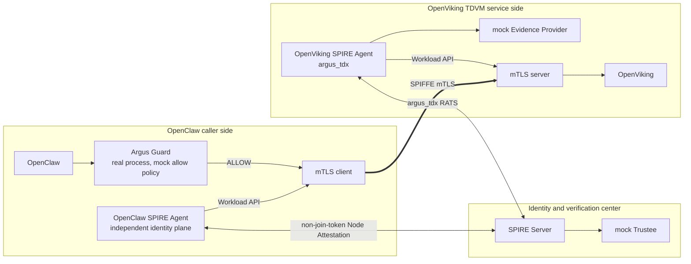

# Argus-SPIFFE v2 执行计划

> **归档状态（2026-08-07）**：早期双Agent与Mock阶段执行基线，不再定义当前计划。
> 当前主方案见
> [Argus-SPIFFE-v2-Threat-Model-Realignment-Plan.md](../../Argus-SPIFFE-v2-Threat-Model-Realignment-Plan.md)。

## 1. 文档目的

本文将 Argus-SPIFFE v2 当前阶段收敛为三个连续步骤：

1. 建立两个真正独立的 SPIRE Agent；
2. 使用正式 v2 配置替换 `join_token`，完成 Node Attestation、SVID 签发和 mTLS；
3. 将当前合并的 mock Evidence Provider 与 mock Trustee 拆成独立进程。

本计划只描述当前 mock 阶段。以下内容暂不纳入本轮实施：

- Envoy 或完整服务网格；
- 真实 Quote/QGS；
- production Evidence Provider；
- 独立 production Trustee；
- M5 正式身份切换验收；
- 周期 re-attestation 和 eviction 收敛。

本文同时作为执行基线。仓库侧实现完成后仍需在远程 TDX 主机运行验收，
不能把静态代码完成等同于运行态通过。

### 1.1 仓库实现状态（2026-08-04）

已完成代码与配置：

- 正式入口移除 Join Token配置和 token生成；
- OpenClaw `x509pop` Agent与 OpenViking `argus_tdx` Agent分离；
- 两套 Agent使用不同 data directory、Workload API和 Docker daemon；
- mock Evidence Provider与 mock Trustee拆为不同命令、镜像和部署位置；
- OpenViking侧 Provider只监听 TDVM loopback；
- Trustee使用独立进程及文件证书 mTLS；
- registration脚本按两个 Agent ID建立不同 parent，并加入不可变镜像 selectors；
- 最小 SPIFFE mTLS client/server实现精确 peer SPIFFE ID校验；
- 真实 Argus Guard增加显式 `GUARD_MODE=mock_allow`，不获取 evidence、
  不伪造 verified claims；
- TDVM增加 1943端口转发；
- 正向链路、SVID隔离及 mTLS负向验收脚本已写入仓库。

尚未完成的不是仓库编码，而是远程运行态验收：

- 在远程 Linux/TDX主机生成 runtime并构建镜像；
- 实际观察两个 Agent完成 attestation；
- 实际签发两个 workload SVID；
- 实际执行 mTLS正向和负向矩阵；
- 根据远程日志修正环境相关问题。

## 2. 角色模型修正

本阶段采用 caller/service 两侧分工，不在 OpenClaw 侧部署 Evidence Provider。

### 2.1 OpenClaw 调用侧

OpenClaw 侧部署：

- OpenClaw 应用；
- Argus Guard；
- 独立 OpenClaw SPIRE Agent；
- OpenClaw mTLS client 验证 workload。

Argus Guard 是调用侧授权点，负责在业务请求发出前返回 `ALLOW` 或 `DENY`。它不是 Evidence Provider，也不承担 SPIRE Node Attestation。

### 2.2 OpenViking 服务侧

OpenViking TDVM 内部署：

- OpenViking 服务；
- Argus Evidence Provider；
- 独立 OpenViking SPIRE Agent；
- OpenViking mTLS server 验证 workload。

Evidence Provider 代表 OpenViking 所在 TDVM 生成服务侧 evidence。当前阶段 evidence 和 Quote 可以是 mock，但必须遵守 v2 请求、绑定和返回结构。

### 2.3 中心侧

中心侧部署：

- SPIRE Server；
- mock Trustee。

mock Trustee 接收 SPIRE Server 侧 `argus_tdx` 插件提交的 evidence，返回经过 mock Quote/TCB 判定的 verified claims。

### 2.4 两条不同的信任链

必须区分 SPIRE Node Attestation 与调用侧 Argus Guard。

OpenViking Node Attestation：

```text
SPIRE Server fresh challenge
  -> OpenViking SPIRE Agent argus_tdx plugin
  -> OpenViking Evidence Provider
  -> mock Quote/evidence
  -> OpenViking Agent plugin
  -> SPIRE Server argus_tdx plugin
  -> mock Trustee
  -> verified AgentAttributes
  -> OpenViking SPIRE Agent SVID
```

OpenClaw 业务授权：

```text
OpenClaw
  -> Argus Guard
  -> ALLOW / DENY
  -> ALLOW 后由 mTLS client 发起请求
```

当前没有 Envoy或应用内强制拦截，因此本轮 Guard只能完成真实进程和接口连通性验证，不能声称已经形成不可绕过的同请求强因果门控。

## 3. 目标拓扑



## 4. 第一步：建立两个独立 SPIRE Agent

### 4.1 目标

先证明两个 Agent 的运行、身份和 Workload API 隔离成立。该步骤可以暂时沿用现有 Phase 1 启动方式完成拓扑检查，但不得将其结果描述为 v2 RATS 验收。

### 4.2 OpenClaw SPIRE Agent

OpenClaw Agent 必须拥有：

- 独立 `data_dir`；
- 独立 Workload API socket；
- 独立 Agent证明材料；
- 独立 PID/cgroup视图；
- 独立 Docker daemon；
- 独立 Agent ID；
- 只属于 OpenClaw 的 registration parent。

建议路径：

```text
/var/lib/spire/openclaw-agent
/run/spire/openclaw/agent.sock
/var/lib/spire/openclaw-agent/identity
```

OpenClaw workload ID：

```text
spiffe://argus.local/agent/openclaw
```

### 4.3 OpenViking SPIRE Agent

OpenViking Agent 必须运行在 OpenViking TDVM 内，并拥有：

- 独立 `data_dir`；
- 独立 Workload API socket；
- 独立 `argus_tdx` 证明密钥；
- TDVM 内 PID/cgroup视图；
- TDVM 内 Docker daemon；
- 独立 Agent ID；
- 只属于 OpenViking 的 registration parent。

建议路径：

```text
/var/lib/spire/openviking-agent
/run/spire/openviking/agent.sock
/var/lib/spire/openviking-agent/argus-tdx/attestation-key
```

OpenViking workload ID：

```text
spiffe://argus.local/service/openviking-cmem
```

### 4.4 Docker 与 socket 隔离

必须满足：

- OpenClaw Agent只读取 OpenClaw Docker daemon；
- OpenViking Agent只读取 TDVM Docker daemon；
- OpenClaw workload不能连接 OpenViking Workload API；
- OpenViking workload不能连接 OpenClaw Workload API；
- OpenClaw sandbox sibling不挂载任一生产 Workload API socket；
- 任一侧不能通过复制 label获得另一侧身份。

### 4.5 Registration entry

禁止继续自动选择“唯一有效 Agent”作为两个 workload的共同 parent。

注册时必须显式输入：

```text
OPENCLAW_PARENT_ID
OPENVIKING_PARENT_ID
```

并满足：

```text
OPENCLAW_PARENT_ID != OPENVIKING_PARENT_ID
```

OpenClaw entry只使用 `OPENCLAW_PARENT_ID`，OpenViking entry只使用 `OPENVIKING_PARENT_ID`。

workload selectors至少包括：

- 明确 role label；
- 不可变 image ID；
- image config digest。

### 4.6 第一步验收

- [ ] SPIRE Server显示两个不同 Agent ID；
- [ ] 两个 Agent使用不同 `data_dir`；
- [ ] 两个 Agent使用不同 Workload API socket；
- [ ] 两个 Agent连接不同 Docker daemon；
- [ ] 两个 workload entry使用不同 parent；
- [ ] OpenClaw workload取得且只能取得 OpenClaw SVID；
- [ ] OpenViking workload取得且只能取得 OpenViking SVID；
- [ ] 错误 parent即使 selectors全部匹配也不能取得 SVID；
- [ ] OpenClaw sandbox不能取得任一生产 SVID。

## 5. 第二步：正式 v2 配置替换 join_token

### 5.1 目标

正式 v2 profile不得再依赖：

- `NodeAttestor "join_token"`；
- `spire-server token generate`；
- Agent启动参数 `-joinToken`；
- 自动选择唯一 Agent作为共同 parent。

### 5.2 OpenViking Agent准入

OpenViking SPIRE Agent使用自定义：

```text
NodeAttestor "argus_tdx"
```

其准入链必须经过：

```text
Server challenge
  -> Agent plugin
  -> OpenViking Evidence Provider
  -> mock Quote/evidence
  -> Server plugin
  -> mock Trustee
  -> verified node claims
```

`argus_tdx` 成功后，SPIRE Server为 OpenViking SPIRE Agent建立 Agent身份。

### 5.3 OpenClaw Agent准入

OpenClaw侧没有 Evidence Provider，Argus Guard也不能替代 NodeAttestor。

因此 OpenClaw Agent必须使用独立、非 `join_token` 的身份平面。当前 mock阶段建议：

```text
SPIRE built-in x509pop NodeAttestor
```

或者消费已经存在、能够输出可审计 `OPENCLAW_PARENT_ID` 的独立身份平面。

当前阶段采用 `x509pop` 时必须明确记录：

- OpenClaw Agent完成的是证书持有证明；
- OpenClaw Agent没有完成 TDX RATS；
- TDX RATS只证明 OpenViking服务侧 TDVM；
- 不得将 OpenClaw Agent描述为 TDX attested。

如果后续要求 OpenClaw节点也进行 TDX RATS，则需要为 OpenClaw建立另一套受保护 evidence路径；这不属于当前“只有 OpenViking侧 Provider”的范围。

### 5.4 v2 配置布局

建议新增：

```text
core/spire/v2/
  server.conf.tmpl
  openclaw-agent.conf.tmpl
  openviking-agent.conf.tmpl
  policy.yaml
  prepare.sh
  start-server.sh
  start-openclaw-agent.sh
  start-openviking-agent.sh
  register-workloads.sh
  verify-svid.sh
  verify-mtls.sh
```

旧的正式 Phase 1 Join Token配置直接移除，不提供 rollback profile、
回滚脚本或双配置切换。`m3/` 和原 M4 failure matrix只保留为自定义
NodeAttestor的历史测试夹具，默认入口不得加载它们。

### 5.5 SVID签发层次

必须区分两类 SVID。

Agent SVID：

```text
OpenClaw SPIRE Agent
  <- x509pop 或独立 identity plane

OpenViking SPIRE Agent
  <- argus_tdx + OpenViking Evidence Provider + mock Trustee
```

Workload SVID：

```text
OpenClaw mTLS client
  <- OpenClaw Agent Workload API
  <- spiffe://argus.local/agent/openclaw

OpenViking mTLS server
  <- OpenViking Agent Workload API
  <- spiffe://argus.local/service/openviking-cmem
```

mTLS使用 workload SVID，不直接使用 SPIRE Agent SVID。

### 5.6 暂不引入 Envoy的 mTLS验证

新增两个最小验证 workload：

```text
OpenClaw mTLS client
OpenViking mTLS server
```

两者只负责：

- 连接各自 Workload API；
- 动态取得 X.509-SVID和 trust bundle；
- 监听或发起 mTLS；
- 精确验证对端 SPIFFE ID；
- 发送最小 health请求；
- 在 SVID不可用或 peer ID错误时 fail closed。

预期链路：

```text
OpenClaw mTLS client
  -> OpenClaw Workload API
  -> OpenClaw workload SVID
  == SPIFFE mTLS ==>
OpenViking mTLS server
  -> OpenViking Workload API
  -> OpenViking workload SVID
```

客户端必须只接受：

```text
spiffe://argus.local/service/openviking-cmem
```

服务端必须只接受：

```text
spiffe://argus.local/agent/openclaw
```

### 5.7 Argus Guard连通性

OpenClaw侧启动真实 Argus Guard进程，但当前阶段允许使用显式 mock策略：

```text
GUARD_MODE=mock_allow
```

必须在日志和验收报告中写明：

```text
Guard process: real
Guard evidence fetch/verifier: bypassed
Decision: explicit mock ALLOW for connectivity only
Strong request gating: not accepted
```

Guard返回 `ALLOW` 后，验证脚本再调用 mTLS client。

在 Envoy或应用内强制拦截完成前，该顺序只能证明组合连通性，不能证明调用者无法绕过 Guard。

### 5.8 第二步验收

- [ ] v2 Server配置中不存在 `join_token`；
- [ ] 两个 Agent启动时均不使用 `-joinToken`；
- [ ] OpenViking Agent通过 `argus_tdx` 成功准入；
- [ ] OpenClaw Agent通过 `x509pop` 或获批独立 identity plane成功准入；
- [ ] SPIRE Server显示两个不同 Agent ID；
- [ ] 两个 workload取得预期且不同的 X.509-SVID；
- [ ] mTLS正向请求成功；
- [ ] 客户端拒绝错误 OpenViking SPIFFE ID；
- [ ] 服务端拒绝错误 OpenClaw SPIFFE ID；
- [ ] 无客户端证书时握手失败；
- [ ] plaintext访问 mTLS端口失败；
- [ ] Guard真实进程返回 mock `ALLOW` 后组合请求成功；
- [ ] 报告没有把 mock Guard策略描述为生产授权。

## 6. 第三步：拆开 mock Evidence Provider和 mock Trustee

### 6.1 目标

删除“一个 `fake-services` 进程同时承担 Provider和 Trustee”的部署形态。

拆分后只保留：

```text
OpenViking TDVM:
  mock Evidence Provider

Center:
  mock Trustee

OpenClaw side:
  real Argus Guard
```

OpenClaw侧不部署 Evidence Provider。

### 6.2 mock Evidence Provider

Provider运行在 OpenViking TDVM内，至少提供：

```text
POST /ra/v1/evidence
GET /healthz
GET /metrics
```

Provider必须：

- 接收 v2 EvidenceRequest；
- 验证请求结构和大小；
- 使用请求和 binding claims计算 v2 `REPORTDATA`；
- 返回结构正确的 mock TDX evidence；
- 返回稳定 `instance_id`；
- 支持 replay、HTTP 503和延迟故障注入；
- 不直接返回 Trustee的 verified claims。

当前阶段允许 mock：

- Quote签名；
- MRTD/RTMR值；
- TCB状态；
- debug状态。

但不得 mock或写死：

- challenge关联；
- EvidenceRequest digest；
- attestation key target；
- `REPORTDATA`绑定。

### 6.3 mock Trustee

Trustee运行在独立进程中，至少提供：

```text
POST /v1/verify/tdx-node
GET /healthz
GET /metrics
```

SPIRE Server `argus_tdx` 插件通过独立网络连接和 mTLS调用 Trustee。

mock Trustee可以固定判定以下项目通过：

- Quote签名有效；
- mock measurement符合 policy；
- mock TCB状态可接受；
- debug状态符合配置。

但必须真实校验：

- protocol version；
- session/challenge有效期；
- EvidenceRequest digest；
- policy ID和 policy digest；
- attestation key digest；
- target URI与 key ID关联；
- `REPORTDATA`；
- `instance_id`；
- Trustee响应与当前请求的关联。

Trustee只能返回由其验证得到的 claims，不能直接透传 Provider自报 claims。

### 6.4 Provider、Trustee和 Guard关系

SPIRE Node Attestation路径：

```text
OpenViking Agent plugin
  -> OpenViking mock Evidence Provider
  -> evidence
  -> SPIRE Server plugin
  -> mock Trustee
  -> verified claims
```

调用侧 Guard路径：

```text
OpenClaw
  -> real Argus Guard
  -> mock verifier/policy ALLOW
  -> mTLS client
```

本轮不要求 Guard直接参与 SPIRE Node Attestation，也不要求 Guard替代 Trustee。

本轮明确不建立 Guard到 OpenViking Provider的连接。Provider只服务于
OpenViking SPIRE Agent的 `argus_tdx` Node Attestation；Guard的
`mock_allow` 模式不获取 evidence，也不伪造 verified claims。将来进入真实
业务远程认证阶段时，应重新定义 Guard到服务侧真实 Evidence Provider的独立
协议和不可绕过门控，不复用本轮的 Node Attestation调用。

### 6.5 第三步验收

- [ ] Provider和 Trustee为两个不同进程；
- [ ] OpenClaw侧没有 Evidence Provider；
- [ ] Provider位于 OpenViking TDVM内；
- [ ] Trustee位于独立中心侧；
- [ ] Agent插件只能连接服务侧 Provider；
- [ ] Server插件只能通过配置的 mTLS接口连接 Trustee；
- [ ] Provider故障与 Trustee故障能够独立注入；
- [ ] Provider HTTP 503导致 Node Attestation fail closed；
- [ ] Trustee HTTP 503导致 Node Attestation fail closed；
- [ ] Trustee timeout导致 Node Attestation fail closed；
- [ ] replay evidence被拒绝；
- [ ] 错误 `REPORTDATA`被拒绝；
- [ ] 错误 attestation key target被拒绝；
- [ ] 错误 `instance_id`被拒绝；
- [ ] metrics能够区分 Provider、Trustee和绑定失败。

## 7. 端到端验收

完成三个步骤后，统一验收流程为：

```text
1. 启动 SPIRE Server和独立 mock Trustee
2. 启动 OpenClaw SPIRE Agent
3. 启动 OpenViking TDVM
4. 在 TDVM内启动 OpenViking mock Evidence Provider
5. 启动 OpenViking SPIRE Agent
6. 确认两个 Agent使用不同 NodeAttestor身份和不同 Agent ID
7. 创建使用不同 parent的两个 workload entries
8. 启动 OpenClaw mTLS client workload
9. 启动 OpenViking mTLS server workload
10. 确认两侧获得预期 workload SVID
11. 启动真实 Argus Guard，加载 mock allow策略
12. Guard返回 ALLOW后执行 mTLS health请求
13. 执行 peer ID、无证书、plaintext、Provider和Trustee故障矩阵
```

最终成功输出必须明确包含：

- OpenClaw Agent ID；
- OpenViking Agent ID；
- OpenClaw Agent使用的 NodeAttestor；
- OpenViking Agent使用 `argus_tdx`；
- OpenViking Provider为 mock；
- Trustee为 mock；
- Guard进程为真实、策略为 mock allow-all；
- OpenClaw workload SPIFFE ID；
- OpenViking workload SPIFFE ID；
- mTLS双向 peer ID验证结果；
- 真实 Quote/QGS状态为 `DEFERRED`；
- Envoy和强业务请求门控状态为 `DEFERRED`。

## 8. 文件改动范围

预计需要修改或新增：

```text
core/spire/conf/
core/spire/scripts/bootstrap-agent.sh
core/spire/scripts/register-workloads.sh
core/spire/plugins/argus-tdx-nodeattestor/cmd/
core/spire/plugins/argus-tdx-nodeattestor/internal/fakeservices/
core/spire/m3/
core/spire/m4/tdvm.sh
core/argus/src/bin/guard.rs
```

建议新增：

```text
core/spire/v2/
core/spire/v2/mtls-smoke/
core/spire/v2/deploy-v2-guest.sh
core/spire/v2/verify-architecture.sh
core/spire/plugins/argus-tdx-nodeattestor/cmd/mock-evidence-provider/
core/spire/plugins/argus-tdx-nodeattestor/cmd/mock-trustee/
```

## 9. 实施提交顺序

实施内容按以下逻辑顺序组织；本轮可以作为一个原子提交交付：

1. `refactor(spire): isolate openclaw and openviking agents`
2. `feat(spire): add non-join-token v2 identity profiles`
3. `test(spire): add workload SVID and direct mTLS validation`
4. `refactor(argus): split mock evidence provider and trustee`
5. `feat(argus): add explicit mock guard connectivity profile`
6. `test(spire): unify v2 mock architecture acceptance`
7. `docs(spire): record v2 mock chain and deferred security claims`

当前本地电脑只做静态审查，不运行构建、容器或 TDVM测试；运行态结论必须由
远程 TDX 主机的实际输出给出。

## 10. 完成定义

当前阶段只有同时满足以下条件，才可以称为“Argus-SPIFFE v2 mock链路完成”：

- 两个独立 SPIRE Agent和 Docker运行域已经建立；
- 两个 Agent不共享 Workload API、data directory或 parent；
- 正式 v2 profile不再使用 `join_token`；
- OpenViking Agent通过 `argus_tdx` 和服务侧 Evidence Provider完成 mock RATS；
- OpenClaw Agent通过明确的非 `join_token` 独立身份平面完成准入；
- Provider和 Trustee已经拆成独立进程；
- OpenClaw和 OpenViking workload获得不同 SVID；
- 两个 workload使用 SVID完成双向 mTLS；
- Guard真实进程的 mock allow模式完成连通性验证；
- 所有 mock和 deferred能力均在输出与文档中明确标记。

完成本计划后，再单独讨论 Envoy如何替换最小 mTLS client/server，以及如何将 Guard变成不可绕过的同请求强制门。

## 11. 参考资料

- [SPIRE - Configuring node attestation](https://spiffe.io/docs/latest/deploying/configuring/)
- [SPIRE Agent configuration reference](https://spiffe.io/docs/latest/deploying/spire_agent/)
- [Argus-SPIFFE Integration](../../Argus-SPIFFE-Integration.md)
- [Argus-SPIFFE v2 Implementation](../../Argus-SPIFFE-v2-Implementation.md)
