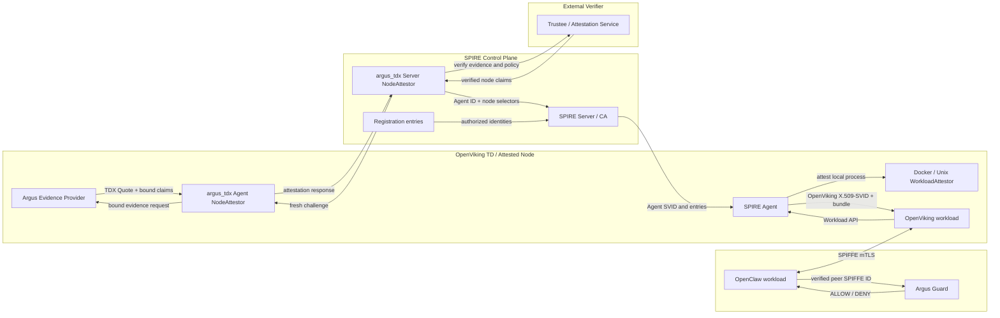

# Argus-SPIFFE Integration：架构决策与信任模型

## 1. 文档定位

本文定义 Argus 与 SPIFFE/SPIRE 集成后的目标架构、身份语义、信任边界和安全声明。它回答以下问题：

- TDX 远程证明在身份链路中的位置是什么；
- SPIRE Node Attestation 与 Workload Attestation 分别证明什么；
- OpenClaw 如何在运行时确认 OpenViking 的 SPIFFE 身份；
- Argus Guard、SPIRE 和 Trustee 各自承担什么信任职责；
- 该方案可以声明哪些安全属性，不能声明哪些安全属性。

实现步骤、插件协议、配置、测试、迁移和回滚统一放在 [Argus-SPIFFE-v2-Implementation.md](Argus-SPIFFE-v2-Implementation.md)。

## 2. 背景、原始设计与基本概念

### 2.1 Agent-CC

[Agent-CC](Agent-CC.pdf) 把机密 Agent 系统的目标能力归纳为三层：

1. **全生命周期数据保护**：保护运行中数据、持久化数据及跨服务传输的数据；
2. **从构建到运行时的完整性**：把构建产物、启动度量、workload binding 和 verifier 决策连接成可执行的信任链；
3. **可信服务组合**：只有身份、运行环境和策略均满足要求的服务才能接收敏感数据。

Argus-SPIFFE 主要承接后两层：用 TDX 为 Node/TD 提供硬件信任根，用本地 Workload Attestation 建立容器身份，再用 SPIFFE mTLS 和 Argus Guard 完成服务准入。它不是 Agent-CC 全部数据保护能力的替代品。

当多个 Docker 容器运行在同一个 TDVM 中时，TDX Quote 只能证明整个 TDVM 的运行环境可信，不能直接证明某个具体容器的身份。SPIRE 还需要根据容器的 cgroup、label 和镜像摘要等信息识别调用 Workload API 的容器。因此，Node Attestation 用于确认“节点可信”，Workload Attestation 用于确认“节点内的具体容器是谁”，两者缺一不可。

### 2.2 Argus 原始设计

[Argus 原始设计](argus-inital.md) 解决的问题是：即使本地 Agent 已运行在 TEE 中，调用方仍可能把提示词、Memory、Token、凭据或中间结果发送给运行状态和身份未验证的对端。Argus 因此把最终信任决定保留在调用方，并划分为三个职责边界：

| 职责 | Argus 组件 | 架构责任 |
| --- | --- | --- |
| 调用方信任门 | Argus Guard | 发起信任检查、消费验证结果、执行本地策略，并给出最终 `ALLOW` 或 `DENY` |
| 服务侧证据生产 | Argus Evidence Provider | 根据请求生成 challenge-bound TEE evidence 和本地 claims，不决定业务调用是否允许 |
| 外部证据验证 | Trustee / Attestation Service | 验证 Quote、TCB、度量值、challenge binding 和参考值策略，返回 verified claims |

这一模型同时适用于 Agent-to-Service（A2S）和 Service-to-Service（S2S）。OpenClaw 调用 OpenViking 是本文采用的 A2S 实例。

原始的直接证明路径在敏感数据发送前完成一次 fresh-evidence 检查：

```text
Argus Guard fresh challenge
  -> Argus Evidence Provider 生成绑定后的 TDX evidence
  -> Trustee / Attestation Service 验证
  -> Argus Guard 本地策略 ALLOW / DENY
  -> ALLOW 后才发送敏感业务数据
```

SPIFFE 集成保留该职责分离和 caller-controlled policy，但将普通请求的 Quote 验证前移到身份准入阶段。需要逐请求新鲜证明的高风险操作仍可在 SPIFFE mTLS 之外追加原始 Argus 路径。

### 2.3 SPIFFE/SPIRE 核心术语

| 术语 | 本文中的含义 |
| --- | --- |
| SPIFFE | 定义 workload 身份、SVID 和 Workload API 的标准，不负责业务授权策略 |
| SPIRE | SPIFFE 的实现，负责 Node/Workload Attestation、registration entries、SVID 签发与轮换 |
| Trust domain | 一套共同身份签发与验证边界；本文为 `argus.local` |
| SPIFFE ID | workload 或 Agent 的 URI 形式身份，例如 `spiffe://argus.local/service/openviking-cmem` |
| SVID | 承载 SPIFFE ID 的可验证身份材料；本文运行时使用 X.509-SVID |
| Trust bundle | 用于验证某个 trust domain 所签 X.509-SVID 的信任锚集合 |
| SPIRE Server | 管理 registration entries 和 CA，完成 Agent 准入并签发 SVID |
| SPIRE Agent | SPIRE 的节点本地身份代理，暴露 Workload API、执行 Workload Attestation 并向匹配的 workload 交付身份；不是 OpenClaw 这类 AI Agent |
| Application / AI Agent | 执行业务任务的 Agent 应用；本文实例是 OpenClaw |
| Node Attestation | SPIRE Server 对 SPIRE Agent 所在 Node/TD 的准入过程 |
| Workload Attestation | SPIRE Agent 根据本地进程、cgroup、容器运行时等事实识别 Workload API 调用者的过程 |
| Selector | NodeAttestor 或 WorkloadAttestor 观察并验证的属性；registration entry 用它匹配身份 |
| Registration entry | 将 parent、selectors 与目标 SPIFFE ID 连接起来的签发规则 |
| Parent ID | workload entry 所属的具体 attested Agent ID 或 node alias；决定哪些 SPIRE Agent 有资格接收该 entry，不是 workload selector |
| Node alias | 由 node selectors 匹配一组 SPIRE Agent 的 node registration entry；workload entry 可把该 alias 用作 Parent ID |
| Workload API | workload 获取和轮换 SVID/bundle 的本地 API；socket 可达性本身不是身份凭据 |

### 2.4 从 Argus 到 SPIFFE 的桥接

集成后存在两个不同的信任判断时刻：

| 路径 | Attester | Verifier | Relying Party / 最终决策点 |
| --- | --- | --- | --- |
| 直接 Argus fresh-evidence | 由 Evidence Provider 代表的目标 TD/服务 | Trustee / Attestation Service | 调用方 Argus Guard |
| SPIRE Node Attestation | 在受保护共置假设下，由 Agent 插件与 Evidence Provider 代表的 SPIRE Agent 所在 TD/Node | Trustee / Attestation Service | Server NodeAttestor 与 SPIRE Server |
| SPIFFE 运行时通信 | 对端 workload 证明其持有 SVID 私钥，不重新执行完整 RATS 证明 | SPIRE Server CA 签发，调用方用 bundle 验证 | OpenClaw 完成身份认证，Argus Guard 执行业务授权 |

SPIFFE/SPIRE 不替代 Argus，而是把一次成功的节点准入转化为可在普通通信中重复使用的短期 workload 身份：

1. Agent 侧 NodeAttestor 通过 Argus Evidence Provider 获取 challenge-bound TDX evidence；
2. Server 侧 NodeAttestor 调用 Trustee 验证，并把 verified claims 转换为 Agent identity 和 node selectors；
3. SPIRE Agent 再依据本地 workload selectors 和 registration entry 为 OpenClaw/OpenViking 匹配目标身份；
4. SPIRE Server CA 签发 X.509-SVID，双方用其建立 mTLS；
5. Argus Guard 基于已验证的 peer SPIFFE ID 和调用方本地策略决定是否发送敏感数据。

这条路径提供的是“先前的节点证明 + 当前的本地 workload 识别”共同建立的短期身份，不是每个业务请求上的新鲜 TDX Quote。

## 3. 核心架构决策

| 编号 | 决策 |
| --- | --- |
| AD-1 | 使用成对的自定义 `argus_tdx` NodeAttestor 插件，将 TDX Quote 验证接入 SPIRE Agent 的 Node Attestation。 |
| AD-2 | 在 Agent 插件、Evidence Provider、证明密钥和本地通道均受 TD 边界保护的部署假设下，TDX Node Attestation 将 SPIRE Agent 准入为该 TD/Node 的代表；workload 身份继续由已鉴别的 parent 与本地 Workload Attestation 共同建立。 |
| AD-3 | OpenClaw 和 OpenViking 使用短期 X.509-SVID 建立 SPIFFE mTLS，不把原始 Quote 或部分验证相关信息写入 X.509-SVID。 |
| AD-4 | Argus Guard 保留在调用方，在敏感数据发送前基于已验证的 peer SPIFFE ID 和本地策略返回 `ALLOW` 或 `DENY`。 |
| AD-5 | Trustee/Attestation Service 负责验证 Quote、TCB、度量值、`report_data` 绑定和参考值策略；SPIRE Server 负责决定是否签发身份。 |
| AD-6 | v2 基线采用 Node-rooted 信任语义。只有增加可验证的 workload binding 后，才能声明 workload-bound 信任。 |
| AD-7 | SVID 轮换、Node re-attestation 和 mTLS 连接生命周期是三个独立控制面，不互相隐式等价。 |
| AD-8 | 首次加入信任域时 fail closed；稳态失效依靠 Agent eviction、SVID 到期、策略传播和连接排空共同收敛。 |
| AD-9 | 生产部署中 OpenClaw 与 OpenViking 使用不重叠的受信 Agent/node parent 和容器控制边界；node alias 只有在不会授权同一个 Agent 时才形成隔离。同一 Docker 管理域下的 label/digest 只能防止误配，不能抵御拥有 Docker 管理权限的 workload 冒充其他容器。 |
| AD-10 | 生产容器必须用不可变镜像引用启动。SPIRE 1.15.1 会根据容器保存的镜像引用解析 `image_config_digest`；以可变 tag 启动会使 attestation 结果受 tag 后续重指影响。 |

### 3.1 目标

- 只有通过 TDX Node Attestation 的节点才能成为受信 SPIRE Agent。
- 只有运行在受信节点上、且匹配 workload selectors 的进程或容器才能获得目标 SPIFFE ID。
- OpenClaw 在发送敏感上下文前能够验证 OpenViking 的 SPIFFE 身份并执行本地策略。
- TDX 证明协议、身份签发和业务请求彼此解耦。
- 身份链路具备明确的审计点、失效边界和回滚边界。

### 3.2 非目标

- 不在每个普通业务请求中重新生成 TDX Quote。
- 不把 trust bundle 描述为 TDX 验证结果的载体。
- 不用自定义 X.509 扩展承载原始 Quote。
- 不把 Node Attestation 描述成对具体容器或进程的直接硬件证明。
- 不在本文展开 SPIFFE Federation、多 TEE 类型或跨 trust domain 的配置。

## 4. 系统架构

> 历史 SVG 未随归档保留；下方 Mermaid 是该架构图的可编辑源。

<details>
<summary>查看可编辑 Mermaid 源图</summary>



</details>

架构分为两条路径：

1. **身份签发路径**：TDX Quote 在 Node Attestation 中被验证，验证结果转化为 Agent SPIFFE ID 和 node selectors。
2. **运行时通信路径**：workload 使用 X.509-SVID 建立 mTLS，Argus Guard 消费已验证的 peer SPIFFE ID，不直接处理 Quote。

TDX Quote 不随普通业务流量传输。运行时对 OpenViking 的信任来自一条传递链，而不是来自证书中的自声明字段。

图中聚焦 OpenViking 侧的自定义 Node Attestation。OpenClaw 取得客户端 SVID 时同样必须先由其独立身份平面完成 TDX Node Attestation，再经过本地 SPIRE Agent 的 Workload Attestation；OpenClaw 的受信 node parent 在生产环境与 OpenViking parent 分离。本文不规定 OpenClaw 身份平面的插件实现，但不允许用未证明的静态 parent 替代该准入要求。

## 5. 信任链与身份模型

### 5.1 信任链

```text
TDX Quote
  -> argus_tdx Node Attestation
  -> SPIRE Agent identity and node selectors
  -> node alias / workload registration entry
  -> local Workload Attestation
  -> OpenViking X.509-SVID
  -> SPIFFE mTLS peer identity
  -> Argus Guard local ALLOW/DENY
```

这条链中每一层只承担自己的证明职责：

- Quote 证明生成证据的 TD 及其被 Quote 覆盖的度量状态。
- NodeAttestor 在上述受保护共置假设下，将持有 Quote-bound 证明密钥且满足节点策略的 SPIRE Agent 准入为该 TD/Node 的代表。
- WorkloadAttestor 依据本地进程、容器和操作系统事实识别 workload。
- X.509-SVID 证明对端持有某个 SPIFFE ID 对应的私钥。
- Argus Guard 判断该 SPIFFE ID 是否允许接收本次敏感数据。

### 5.2 SPIFFE ID

目标 trust domain 为：

```text
argus.local
```

身份命名如下：

| 对象 | SPIFFE ID |
| --- | --- |
| TDX SPIRE Agent | `spiffe://argus.local/spire/agent/argus_tdx/<attestation-key-id>` |
| OpenViking 节点别名 | `spiffe://argus.local/node/openviking-td` |
| OpenClaw 受信 parent | 强制部署输入 `OPENCLAW_PARENT_ID`；由独立、通过获批 TDX node policy 的 OpenClaw 节点身份平面提供，生产中不得复用或覆盖 OpenViking 节点别名 |
| OpenClaw workload | `spiffe://argus.local/agent/openclaw` |
| OpenViking workload | `spiffe://argus.local/service/openviking-cmem` |

`<attestation-key-id>` 必须由通过证明绑定的稳定实例密钥导出，不能直接信任 Agent 自报的主机名、容器名或可修改的 instance label。

节点别名用于把 workload registration entry 与一组满足相同 TDX 策略的 Agent 解耦。它不替代具体 Agent ID，也不改变 NodeAttestor 必须为每个 Agent 返回唯一 ID 的要求。

### 5.3 Node selectors 与 workload selectors

两类 selector 不应混为一层：

| 类型 | 来源 | 描述对象 | 示例 |
| --- | --- | --- | --- |
| Node selector | Server 侧 `argus_tdx` NodeAttestor | TD/Node/Agent 的已验证属性 | `argus_tdx:policy:openviking-prod-v1`、`argus_tdx:debug:false` |
| Workload selector | Agent 侧 Docker/Unix WorkloadAttestor | 调用 Workload API 的本地进程或容器 | `docker:label:argus.workload:openviking-cmem`、`docker:image_id:sha256:...`、`docker:image_config_digest:sha256:...` |

node registration entry 使用 node selectors 建立节点别名；workload registration entry 使用 Parent ID 确定获授权的 SPIRE Agent 集合，并使用 workload selectors 识别本地调用者。一个 registration entry 不同时混用 node selectors 和 workload selectors。

### 5.4 OpenClaw/OpenViking 容器如何被识别

容器不会向 SPIRE 自报“我是 OpenClaw”或“我是 OpenViking”。目标识别链如下：

```text
容器内进程调用本地 Workload API
  -> SPIRE Agent 从 Unix socket 对端取得调用进程 PID
  -> Docker WorkloadAttestor 从 PID/cgroup 定位 container ID
  -> WorkloadAttestor 查询 TD 内本地 Docker daemon
  -> 生成 label、image_id、image_config_digest 等 selectors
  -> SPIRE Server 已根据 Parent ID 将 entry 授权给当前 Agent
  -> Agent 将调用者 selectors 与 entry 的全部 workload selectors 比较
  -> 全部满足后向该调用者交付目标 X.509-SVID
```

Workload API socket 的挂载和 `SPIFFE_ENDPOINT_SOCKET` 只让进程能够发起请求，不是 selector，也不自动授予任何 SPIFFE ID。

本文冻结以下 workload selector 类型和取值来源；摘要是每次构建的输出，不是架构常量。实际摘要值必须在部署前写入 Implementation 文档定义的 deployment inputs，未解析的 `<...>` 只表示模板且不可部署：

| 身份所有者 | 目标 SPIFFE ID | 必需角色 selector | 必需不可变启动与镜像 selectors |
| --- | --- | --- | --- |
| OpenClaw egress gateway / mTLS client 容器 | `spiffe://argus.local/agent/openclaw` | `docker:label:argus.workload:openclaw` | `docker:image_id:sha256:<openclaw-final-config-digest>`<br>`docker:image_config_digest:sha256:<openclaw-final-config-digest>` |
| OpenViking service / mTLS ingress 容器 | `spiffe://argus.local/service/openviking-cmem` | `docker:label:argus.workload:openviking-cmem` | `docker:image_id:sha256:<openviking-final-config-digest>`<br>`docker:image_config_digest:sha256:<openviking-final-config-digest>` |

同一 registration entry 中列出的 workload selectors 按“全部满足”使用；Parent ID 则在 Server 侧决定该 entry 授权给哪些 Agent。角色 label 用于区分用途，`image_id` 要求容器以完整 config digest 启动，`image_config_digest` 再约束 Docker daemon 实际解析出的镜像内容。三者都不能单独替代受信 parent。

以下值不作为生产主身份 selector：

- 容器名：属于编排元数据，可重命名或复用；
- `docker:image_id:<repo>:<tag>`：SPIRE 1.15.1 原样暴露容器保存的镜像引用；当该值是 name/tag 时可变，不能作为生产允许值；
- 环境变量或 workload 自报的 service name：可由启动者修改；
- 上游 OCI manifest digest：它与 Docker image config digest 是不同的摘要类型，不能直接填入 `docker:image_config_digest`。

`image_config_digest` 的内容是不可变的，但 SPIRE 1.15.1 会用容器配置中保存的镜像引用查询 Docker daemon。若容器以 `repo:tag` 启动，而该 tag 后续被重指，查询结果可能不再对应原容器启动时的镜像。因此本文要求用完整 `sha256:<image-config-digest>` 启动，并把同一个值同时登记为 `docker:image_id` 与 `docker:image_config_digest`；以 tag 或仅以 `repo@manifest-digest` 启动均不满足这份基线。

OpenClaw sandbox sibling container 默认不挂载 Workload API socket、不使用 gateway label，也不继承 gateway SVID。若 sandbox 需要网络身份，应创建独立 SPIFFE ID、独立 registration entry 和最小权限 socket，而不是复用 `spiffe://argus.local/agent/openclaw`。

Docker selectors 的安全性依赖 guest kernel、cgroup 视图、Docker daemon 和 SPIRE Agent 均位于受信 TD/Node 内。能控制同一 Docker daemon 的主体可以启动带任意 label 的容器，甚至复用允许的镜像；因此生产环境必须把 OpenViking entry 约束到 OpenViking 的受信 node parent，并限制 OpenClaw 对该 Docker 管理域的控制。单节点、单 Agent 的共同 parent 只适合联调，不能提供抵御 Docker 管理权限攻击者的 workload 隔离声明。

Node-rooted v2 的身份粒度是“符合 selectors 的容器”。如果一个容器中有多个进程且都能访问 Workload API，它们处于同一身份边界；需要进程级区分时，应再采用固定 UID/GID 等 Unix selectors 或拆分容器与 socket。

具体 registration entry、摘要采集、负向测试和迁移步骤见 Implementation 文档的“Registration entries”与“测试计划”。

### 5.5 X.509-SVID 与 trust bundle

X.509-SVID 是短期 workload 身份材料，证书中的 SPIFFE URI SAN 表达 workload 身份。trust bundle 是 `argus.local` 的验证锚，用于验证该 trust domain 签发的 X.509-SVID。

trust bundle：

- 不承载 TDX Quote；
- 不记录某次 Node Attestation 的时间；
- 不代表某个 workload 当前仍满足 TDX 策略；
- 不替代 Argus Guard 的 caller-side 授权。

运行时如果需要判断证明新鲜性，应查询受信的生命周期状态或触发新的证明，而不是从 bundle 或自定义证书字段推断。

## 6. 信任模型

### 6.1 保护资产

- OpenClaw 发送给 OpenViking 的提示词、Memory、Token、凭据和中间结果；
- OpenViking 持有的上下文与长期记忆；
- SPIRE Server CA、Agent SVID 和 workload SVID 私钥；
- Node Attestation challenge、Quote 和参考值策略；
- Agent identity、node selectors、registration entries 和审计记录。

### 6.2 可信组件与职责

| 组件 | 信任职责 |
| --- | --- |
| Intel TDX 硬件与证明基础设施 | 保护 TD 隔离边界并签发可验证的 TDX Quote。 |
| TD 内 guest kernel | 保护本地进程边界、设备访问和 Workload API 调用者身份。 |
| Agent 侧 `argus_tdx` 插件 | 维护实例证明密钥，处理 Server challenge，并从本地 Evidence Provider 获取绑定后的 Quote。 |
| Argus Evidence Provider | 根据收到的 EvidenceRequest 生成 Quote，并把请求与本地 claims 绑定到 `report_data`。 |
| Server 侧 `argus_tdx` 插件 | 维护 challenge 状态，调用 verifier，校验绑定并只输出经过验证的 Agent attributes。 |
| Trustee / Attestation Service | 验证 Quote、TCB、度量值、调试状态、`report_data` 和参考值策略。 |
| SPIRE Server 与 CA | 管理 registration entries、签发 SVID、分发 bundle，并执行 Agent ban/eviction。 |
| SPIRE Agent 与 WorkloadAttestor | 保护 Workload API，识别本地 workload，并只向匹配 entry 的调用者返回身份。 |
| Argus Guard | 在调用方执行最终本地授权，拒绝意外的 peer SPIFFE ID。 |

### 6.3 不可信或部分可信组件

- TD 外的 host、VMM、容器编排层和网络；
- 其他本地 workload；
- 拥有同一 Docker daemon 管理权限、能够创建或修改容器的主体；
- Agent 或 Evidence Provider 提交但未被 Quote 绑定、未被 verifier 验证的 claims；
- workload 自报的 SPIFFE ID、镜像 tag、服务名和环境名；
- 仅由日志、HTTP header 或自定义证书扩展携带的 TDX 状态；
- 已超过生命周期边界但尚未排空的旧连接。

### 6.4 必要假设

Node-rooted 基线依赖以下假设：

- SPIRE Agent 和 Agent 侧 NodeAttestor 运行在被证明的 TD 内，而不是 TD 外的普通 host；
- guest kernel、SPIRE Agent、Evidence Provider、WorkloadAttestor、cgroup 视图和用于 attestation 的 Docker daemon 属于可信计算基；
- Workload API socket 只暴露给对应的身份所有者，不暴露给 OpenClaw sandbox sibling；
- OpenClaw 与 OpenViking 的生产 registration entries 使用不重叠的受信 Agent 集合；若使用 node alias，两个 alias 不能同时授权同一个 Agent，且 Docker 管理权限不能跨越该边界；
- Docker/Unix selectors 采用精确角色 label 与最终镜像 config digest，能在各自 parent 内可靠区分 workload；
- Trustee 的参考值、TCB 策略和验证响应通过受保护的管理链路提供；
- SPIRE Server 的 CA 密钥、datastore 和管理 API 受到独立保护；
- 持久化 Agent 证明密钥存放在受 TD 保护且具备防克隆或克隆检测能力的存储中；否则该密钥只代表逻辑持久身份，不能单独证明唯一物理实例。

如果 SPIRE Agent、Agent 侧 NodeAttestor、Evidence Provider、证明密钥或它们之间的本地通道有任一项不受目标 TD 边界保护，Quote 与该 SPIRE Agent 的绑定链就不成立。此时最多只能声明 verifier 看到了某个有效 TD 的证据，不能声明该 Agent 或 OpenViking workload 由该 TD 代表。

## 7. 证明边界

### 7.1 Node-rooted 基线

v2 基线的安全声明是：

> OpenViking 的 X.509-SVID 由 SPIRE Server CA 基于以受信 Agent 或 node alias 为 parent 的 registration entry 签发，并由该 Agent 在本地 workload selectors 匹配后交付给 OpenViking。

该声明由两个不同机制组合而成：

1. TDX Quote 门控 Node/Agent；
2. WorkloadAttestor 门控 Node 内的具体进程或容器。

因此不能把它缩写成“TDX Quote 直接证明了 OpenViking 容器镜像”。如果 Docker selector 配置过宽，错误 workload 仍可能获得由受信 Agent 管理的身份。

### 7.2 Workload-bound 扩展

若要声明 Quote 直接绑定特定 OpenViking 实例，需要额外满足：

- 使用类型明确的不可变镜像或可执行文件摘要；
- 将该摘要、实例 ID、launch ID、预期 SPIFFE ID 和策略摘要规范化；
- 将规范化结果绑定进 Quote 的 `report_data`；
- 由 Trustee 验证该 binding；
- 将 verifier 结果与 WorkloadAttestor 观察到的本地 selectors 做一致性检查。

这是一项独立扩展，不属于自定义 NodeAttestor 首个可交付版本的默认安全声明。

## 8. 运行时授权模型

OpenClaw 与 OpenViking 完成 mTLS 握手后，OpenClaw 至少获得：

```text
peer_spiffe_id = "spiffe://argus.local/service/openviking-cmem"
peer_trust_domain = "argus.local"
```

Argus Guard 在敏感数据发送前检查：

1. 对端 X.509-SVID 的证书链由预期 bundle 验证；
2. X.509-SVID 在有效期内，且 TLS 握手证明对端持有对应私钥；
3. peer SPIFFE ID 与本次目标服务完全匹配；
4. trust domain 属于本地允许范围；
5. 本地策略允许该调用方、目标和数据类型组合。

任一检查失败，Guard 返回 `DENY`，调用方不得发送敏感请求体。mTLS 完成只代表身份认证成功，不自动代表业务授权成功。

## 9. 新鲜性与失效语义

以下时间边界必须分别管理：

| 边界 | 含义 |
| --- | --- |
| Node Attestation age | 距离最近一次成功 TDX Node Attestation 的时间。 |
| Agent SVID lifetime | SPIRE Agent 身份材料的有效期。 |
| Workload SVID lifetime | OpenClaw/OpenViking X.509-SVID 的有效期。 |
| Connection age | 已建立 mTLS 连接允许存活的时间。 |
| Policy propagation delay | verifier、SPIRE 和 Guard 接收新 deny/reference policy 的延迟。 |

普通 SVID 轮换不等于 Quote 重验。Agent 被 ban 或 evict 后，已经签发且尚未过期的 SVID 也不会在密码学上立即失效；已经建立的 TLS 连接通常还需要应用或代理主动排空。

生产环境需要按实际收敛路径计算最坏陈旧窗口，不能简单对几个 TTL 取最大值。一个保守模型是：

```text
DetectionDelay = MaxNodeAttestationAge
CredentialPathDelay <= WorkloadSVIDTTL + MaxConnectionAge
PolicyPathDelay <= MaxPolicyPropagationDelay + DrainDelay

MaximumTrustedStaleness <=
  DetectionDelay + min(CredentialPathDelay, PolicyPathDelay)
```

该公式假设 credential path 或 policy path 中任一条完成即可阻断旧身份；若部署要求两条都完成，应使用更保守的求和上界。若没有周期性或事件触发的 re-attestation，`MaxNodeAttestationAge` 没有有限上界。此时只能声明“Agent 加入时通过了 TDX 验证”，不能声明“当前 Quote 始终足够新鲜”。

## 10. 失败模型

| 失败 | 预期行为 |
| --- | --- |
| Agent 侧无法生成 Quote | Node Attestation 失败，不签发新的 Agent 身份。 |
| Trustee 不可用 | 首次加入失败；稳态是否进入宽限期由独立生命周期策略决定。 |
| Quote、TCB、度量值或绑定验证失败 | 拒绝 attestation；对已加入 Agent 执行 deny、ban 或 eviction。 |
| Node selectors 不满足 node alias | 该 Agent 不能成为 OpenViking workload 的授权 parent。 |
| Workload selectors 不匹配 | workload 不能获得目标 X.509-SVID。 |
| OpenClaw 所在 SPIRE Agent 尝试为本地 workload 获取 OpenViking 身份 | OpenViking entry 未授权给该 Agent，或 workload selectors 不匹配，不能获得 OpenViking X.509-SVID。 |
| X.509-SVID、bundle 或私钥不可用 | 不能建立新的 SPIFFE mTLS 连接。 |
| peer SPIFFE ID 不匹配 | mTLS 或 Argus Guard 拒绝调用。 |
| Guard 策略拒绝 | 不发送敏感业务数据。 |

首次加入路径保持 fail closed。稳态故障不应被描述成“立刻吊销所有连接”；系统通过 eviction、SVID TTL、数据面 deny policy 和连接排空完成有界收敛。

## 11. 后续扩展

- 为高风险操作增加一次性 nonce-bound fresh evidence，而普通请求继续使用 SVID/mTLS。
- 增加 workload-bound Quote 与 WorkloadAttestor selector 的一致性校验。
- 为 OpenClaw sandbox sibling containers 分配独立身份，而不是继承 gateway 身份。
- 引入跨 trust domain federation。
- 增加周期性与事件触发的 re-attestation controller。
- 将参考值策略版本、证明年龄和 eviction 状态接入可观测性与审计系统。

## 12. 参考资料

- [Agent-CC背景](Agent-CC.pdf)
- [Argus 原始架构](argus-inital.md)
- [Argus-SPIFFE v2 实现计划](Argus-SPIFFE-v2-Implementation.md)
- [SPIRE Concepts](https://spiffe.io/docs/latest/spire-about/spire-concepts/)
- [Registering workloads](https://spiffe.io/docs/latest/deploying/registering/)
- [SPIRE 1.15.1 Docker WorkloadAttestor](https://github.com/spiffe/spire/blob/v1.15.1/doc/plugin_agent_workloadattestor_docker.md)
- [SPIRE 1.15.1 Docker WorkloadAttestor selector implementation](https://github.com/spiffe/spire/blob/v1.15.1/pkg/agent/plugin/workloadattestor/docker/docker.go)
- [SPIRE Agent configuration](https://spiffe.io/docs/latest/deploying/spire_agent/)
- [SPIRE Server configuration](https://spiffe.io/docs/latest/deploying/spire_server/)
- [Extending SPIRE](https://spiffe.io/docs/latest/planning/extending/)
