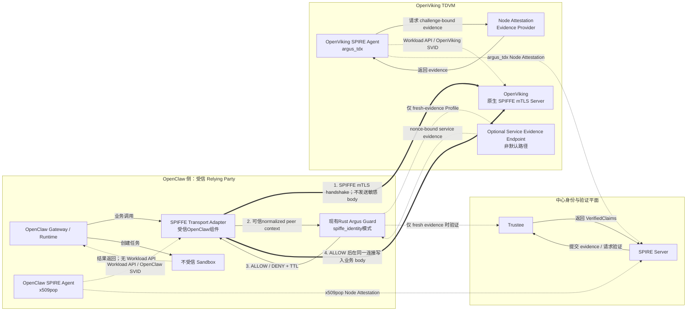

# Argus-SPIFFE v2 威胁模型纠偏与简化执行方案

> **状态：CURRENT PLAN / 方案已生效，代码实施尚未开始**
>
> 本文只重新定义目标架构和执行计划。当前 `69a85af` 运行时仍是
> Guard-gated mTLS Egress/Ingress Proxy链路；本文没有把尚未实现的应用原生
> SPIFFE、`spiffe_identity` Guard或direct E2E描述为当前事实。

## 1. 文档目的

本文针对 `feat/argus-spiffe-v2` 当前实现重新冻结项目目标、信任边界和执行顺序，
纠正 Pre-RA 阶段从“验证目标服务可信性”扩张到“防御受信调用方主动绕过自身
Guard”的威胁模型膨胀。

本方案以当前仓库提交 `69a85af` 为实现起点，不否定已经完成的 NodeAttestor、
SPIFFE 身份、mTLS、Guard 和 sandbox 隔离工作，而是重新划分它们在产品中的层级：

1. **Argus 核心链路**：受信 OpenClaw 在发送敏感数据前验证 OpenViking；
2. **SPIFFE 身份链路**：用 SPIRE 为双方建立短期 workload 身份和 mTLS；
3. **平台安全链路**：限制不受信 sandbox 和 Docker 控制权限；
4. **增强安全 Profile**：请求级不可绕过门控、连接撤销和复杂运维验收；
5. **真实 RA 阶段**：Real Quote/QGS、Production Trustee 和正式 TCB policy。

本文现已取代已归档的
[Argus-SPIFFE-v2-Pre-RA-Hardening-Plan.md](../argus-spiffe-v2/Argus-SPIFFE-v2-Pre-RA-Hardening-Plan.md)
作为后续架构和实施优先级的主方案。旧计划和远程报告继续作为已经实现能力、
历史验证和增强 Profile 的证据，不再作为默认链路的完成定义。

## 2. 当前实现基线

截至 `69a85af`，仓库已具备：

- OpenClaw `x509pop` SPIRE Agent；
- OpenViking `argus_tdx` SPIRE Agent/Server NodeAttestor；
- Ed25519 Attestation Key、JCS/REPORTDATA 绑定和稳定 Agent ID；
- Guest-local Mock Evidence Provider；
- Center-side Mock Trustee；
- 两个独立 Agent parent、data directory 和 Workload API；
- OpenClaw/OpenViking workload registration entries；
- 两端 X.509-SVID 和精确 peer SPIFFE ID mTLS；
- 真实 OpenClaw 插件写入真实 OpenViking 的远程 Mock-RA E2E；
- caller-side Argus Guard、authorization context 和 fail-closed 故障矩阵；
- mTLS Egress/Ingress 代理；
- OpenClaw 专用 egress bridge、source-IP 限制和 Docker Gate；
- Node Attestation replay、Provider 503、Trustee 503 和 timeout 回归。

### 2.1 现有Rust Guard的复用结论

当前Guard无需重写为完整的OpenClaw进程内SDK。仓库已经存在可复用的两层实现：

- [`argus` library](../../../core/argus/src/engine.rs)：`ArgusEngine`、Evidence Fetcher、
  Verifier和`PolicyEvaluatorTrait`抽象；
- [`guard` binary](../../../core/argus/src/bin/guard.rs)：Axum服务、`POST /ra/v1/verify`、
  `POST /ra/v1/verify/batch`、`GET /health`、结构化日志、decision receipt和TTL。

现有实现可直接保留其服务框架、ALLOW/DENY响应、`decision_id`、`expires_at_unix`
和审计字段，但不能把当前binary描述为已经支持SPIFFE身份模式：

- `GuardMode`当前只有`evidence`和`mock_allow`；
- `VerifyRequest`没有来自TLS连接的peer identity context；
- `caller_spiffe_id`和`target_spiffe_id`目前只是Authorization Context输入；
- binary当前实际装配`AllowAllPolicyEvaluator`；
- `evidence`模式仍需显式允许未完成实现才能启动；
- 默认监听`0.0.0.0:8007`并允许任意CORS。

因此默认方案调整为：

> 保留现有Rust Guard独立服务，增加`GUARD_MODE=spiffe_identity`；OpenClaw只增加
> 一个受信的轻量SPIFFE Transport Adapter，不重新实现完整Guard SDK。

### 2.2 当前实现中的威胁模型偏移

其中真正需要纠偏的不是 NodeAttestor 或 SPIFFE 本身，而是以下后来形成的默认假设：

> 即使受信 OpenClaw Runtime 主动跳过 Guard，基础设施也必须阻止所有业务请求。

该假设把项目从 caller-controlled RATS 扩展为 hostile-caller 网络强制执行系统，
并导致 SVID 从真实应用迁移到代理、Guard 决策与每个 HTTP 请求摘要绑定、source
IP 成为应用到代理的二次身份证明，以及 WP1-WP7 同时进入核心完成条件。

## 3. 重新冻结的原始问题

Argus 当前阶段只解决以下问题：

> 在受信 OpenClaw Runtime 将提示词、Memory、凭据、Token 或中间结果发送给
> OpenViking 前，由 OpenClaw 本地 Argus Guard 验证目标服务的可信身份和
> Attestation 状态，并根据 caller-local policy 决定是否继续。

对应 RATS 角色固定为：

| RATS 角色 | 当前组件 | 职责 |
| --- | --- | --- |
| Relying Party | 受信 OpenClaw Runtime + Argus Guard | 请求验证、执行本地 policy、决定是否发送数据 |
| Attester | OpenViking TDVM，由 Evidence Provider 代表 | 生成与挑战绑定的 TDX evidence |
| Verifier | Trustee；SPIRE 模式下还包括 SPIRE Server | 验证 Quote/claims，或把验证结果绑定到 SVID 签发 |

Argus 核心不负责：

- 保护 OpenViking 免受恶意 OpenClaw 调用；
- 在 OpenViking 侧执行 Guard policy；
- 防御已经完全控制受信 OpenClaw Runtime 的攻击者；
- 证明任意第三方进程无法绕过 OpenClaw 自己的业务代码；
- 取代 OpenViking API Key、租户、角色和业务权限；
- 取代 sandbox、Docker、Host firewall 或容器运行时安全；
- 每个业务请求重新生成 TDX Quote；
- 在 Mock 阶段声明真实 TDX Remote Attestation 完成。

## 4. 新威胁模型

### 4.1 受信计算基

默认 Profile 将以下组件纳入 TCB：

- OpenClaw Gateway/Agent Runtime 的受信控制进程；
- OpenClaw 内建立SPIFFE mTLS、提取peer context、调用Guard并发送敏感请求的固定
  SPIFFE Transport Adapter；
- 独立Rust Argus Guard服务及其policy配置；
- OpenClaw与Guard之间的caller-local受限通信通道；
- OpenClaw/OpenViking SPIRE Agent；
- SPIRE Server、CA、registration policy 和 NodeAttestor 插件；
- 经 Attestation和policy验证后接受的OpenViking TDVM内核、Evidence Provider
  和OpenViking服务进程；
- Trustee/Verifier；
- 为上述组件提供隔离的 Host/Guest runtime 配置。

### 4.2 不受信或待验证对象

- OpenClaw 创建的 sandbox 和 sandbox 内模型生成代码；
- OpenClaw/OpenViking 之间的网络；
- 尚未通过 Attestation/SPIFFE 验证的目标服务；
- 目标服务公开返回的自描述、measurement 或身份字段；
- 可被重放、替换或错误路由的 evidence 和业务连接；
- 外部模型、插件、工具和数据源。

若第三方插件被加载到受信 OpenClaw Runtime 进程内，并能直接使用 Workload API、
TLS connection、Transport Adapter或Guard通道，则该插件事实上进入TCB；不能一边允许其进程内执行，
一边仍把它描述为“不受信”。不希望进入 TCB 的插件必须在无 Workload API、无直连
OpenViking 路由的 sandbox 中运行。

### 4.3 明确排除的攻击者能力

默认 Profile 不承诺防御：

- 已完全控制受信 OpenClaw Gateway/Runtime 的攻击者；
- 可替换 OpenClaw 固定 Guard 调用代码和 mTLS 客户端代码的攻击者；
- 可读取 OpenClaw Workload API 并以 OpenClaw 身份任意发起连接的受信进程；
- 同时控制 SPIRE Server/CA、Trustee 或 TDVM TCB 的攻击者；
- Host root、Guest root 或 Docker daemon 全面失陷后的继续可信运行。

若未来需要覆盖这些能力，必须启用独立的 Enhanced Enforcement Profile，不能
在默认 Argus Profile 中静默扩大声明。

## 5. 目标架构

### 5.1 默认无代理业务链路



默认路径没有 OpenClaw mTLS Egress Proxy，也没有 OpenViking mTLS Ingress
Proxy。两个真实应用直接持有自己的 workload SVID：

| Workload | SPIFFE ID | SVID 持有者 |
| --- | --- | --- |
| OpenClaw | `spiffe://argus.local/agent/openclaw` | OpenClaw受信Runtime内的SPIFFE Transport Adapter |
| OpenViking | `spiffe://argus.local/service/openviking-cmem` | 真实 OpenViking 服务进程 |

### 5.2 SPIRE-backed Guard 模式

为复用当前 v2 已实现的 Node Attestation，默认 Guard 使用
`spiffe_identity` 模式：

1. OpenViking Agent 通过 `argus_tdx` 完成 Node Attestation；
2. SPIRE Server 仅在验证通过后为该 Agent 建立身份；
3. OpenViking workload 经本地 Workload Attestation 获得服务 SVID；
4. SPIFFE Transport Adapter建立TLS连接但尚未发送敏感请求体；
5. Adapter使用SPIFFE bundle对实际peer certificate chain做密码学验证，提取
   SPIFFE ID、trust domain、certificate fingerprint和SVID有效期；
6. Adapter把normalized peer context通过受限caller-local通道交给Rust Guard；
7. Guard根据`spiffe_identity` caller-local policy返回`ALLOW`或`DENY`；
8. Adapter把decision绑定在内存中的原TLS connection handle上；
9. 仅在`ALLOW`后向该连接写入敏感请求。

默认Profile复用独立Rust Guard服务。Guard不需要再次取得TLS connection object，
也不声称仅凭调用方提交的fingerprint和有效期字段完成证书链密码学验证。密码学验证
由TCB内的Transport Adapter完成；Guard信任来自该固定Adapter的normalized context，
并负责policy判断。在当前“受信OpenClaw Relying Party”威胁模型下，这是明确且足够
的信任传递，不需要为防御受信Adapter伪造输入重新引入channel binding。

若未来要防御已失陷或恶意Adapter，则必须进入Enhanced Enforcement Profile，增加
TLS exporter/channel binding、Guard侧证书链独立验证或不可绕过PEP；不能把这些
要求静默带回默认Profile。

Guard 的基线输入是Transport Adapter从实际TLS连接提取的可信context，不是
OpenViking自己上报的JSON：

```text
request_id
caller_spiffe_id
peer_spiffe_id
trust_domain
peer_certificate_fingerprint
peer_svid_not_before
peer_svid_not_after
target_service
target_uri
operation
data_class
local_policy_id
```

`spiffe_identity`使用新的mode-specific request DTO，并继续复用
`POST /ra/v1/verify`与现有`VerifyResponse`的decision、reason、decision ID和expiry。
该DTO不应被强行伪装成fresh-evidence请求，也不默认要求旧Authorization Context中的
method、path、body hash和request digest。

现有`VerifiedClaims`和`PolicyEvaluator`以TDX evidence为中心，含必填
`quote_valid`语义。实现SPIFFE模式时不得伪造`quote_valid=true`。可以增加明确的
SPIFFE verifier/identity claims类型，或扩展为mode-tagged policy claims；无论采用
哪种内部表达，响应必须明确`verification_mode=spiffe_identity`，并且不能产生
“本次Guard请求重新验证了TDX Quote”的含义。

字段语义冻结为：

- `target_uri` 是规范化 origin，即 `scheme://authority`，默认不包含 path；
- `target_service` 与预期的精确 peer SPIFFE ID 建立静态映射；
- `operation` 和 `data_class` 必须进入本地 policy 匹配；
- method、path、body hash 仍属于 Enhanced Enforcement；
- 禁止自动跟随 redirect；若确需 redirect，必须对新 origin 建立新 TLS 连接并重新
  执行 Guard。

Guard decision 至少绑定：

```text
同一 TLS 连接
同一 peer certificate
同一 target URI/service
不晚于 peer SVID NotAfter
本地配置的短 decision TTL
```

默认 Profile 不要求把 method、path、body hash 和 decision receipt发送给
OpenViking；这些属于 Enhanced Enforcement Profile。

“绑定同一TLS连接”由受信Transport Adapter在本地内存中执行：Adapter只允许
decision用于产生该context的connection handle，并在连接关闭、peer certificate
变化、redirect、target origin变化或decision过期时丢弃。独立Guard服务只返回
decision，不声称在进程间独立证明同一connection。

### 5.3 Caller-local Guard服务边界

为最大化复用当前TCP Axum server，`argus-initial-direct`首版默认采用独立
`guard-local` internal Docker network：

- 只有受信OpenClaw Runtime和Rust Guard加入；
- 不向Host发布`8007`端口；
- sandbox、普通sibling container和OpenViking不加入；
- 移除任意CORS，非浏览器业务不需要CORS；
- Guard不挂载SPIRE Workload API，也不持有OpenClaw/OpenViking SVID；
- OpenClaw通过服务名访问Guard，并对timeout、非2xx、malformed、DENY全部
  fail-closed。

Guard在容器内仍可监听`0.0.0.0:8007`，但安全边界来自“不发布端口 + 仅两成员的
internal network”，不能继续接入普通业务容器网络。若未来实现Unix Domain Socket，
可作为更严格的等价替代；`127.0.0.1:8007`仅适用于Guard和OpenClaw共享network
namespace的部署，不能被写成分离容器下天然可达。

### 5.4 Attestation 结果如何进入 Guard 决策

默认 Profile 不是每次业务请求都重新生成 Quote。节点可信状态通过 SPIRE 身份链
传播到 Guard：

```text
OpenViking Node evidence
  -> argus_tdx NodeAttestor + Trustee verification
  -> SPIRE Server 接纳特定 OpenViking Agent
  -> 该 Agent 对本地 OpenViking 进程执行 Workload Attestation
  -> SPIRE 为 OpenViking 签发短期服务 SVID
  -> OpenClaw 在真实 TLS peer context 中验证该 SVID
  -> Guard 根据精确 SPIFFE ID、有效期和 caller-local policy 决策
```

因此，默认 `spiffe_identity` Guard 所说的“Attestation 状态”是：

> 该 peer 当前持有一张由本 trust domain 签发、尚在有效期内，且其签发链建立在
> 已通过 Node Attestation 的 OpenViking Agent 之上的 workload SVID。

其新鲜度上界由 Agent admission/重新 attestation 时间、workload SVID TTL 和当前
TLS connection 最大寿命共同决定，而不是每个 HTTP 请求的 Quote 时间。Provider 或
Trustee 在首次 admission 时失败，OpenViking Agent不得就绪；在强制重新 attestation
时失败，不得签发新的有效身份。对于故障发生前已签发且仍有效的 SVID，默认 Profile
不虚构即时撤销：已有身份最多使用到更短的 SVID/connection/Guard validity 上界。

当前 `argus_tdx` 返回 `can_reattest=false`。因此 OpenViking Agent身份到期或 Agent
重启后的恢复依赖重新执行完整 Node Attestation，而不是透明 re-attestation。默认
连接池必须支持 bundle/SVID轮换和 Agent重启：新连接使用最新SVID与bundle；旧连接
最大寿命不得超过 peer SVID剩余有效期和Guard decision TTL中的较小值；无法确认
有效期或轮换失败时停止发送新请求并fail-closed。

### 5.5 直连网络路径

默认Profile可继续使用专用internal bridge隔离受信OpenClaw Runtime与sandbox，
但该bridge不再承担“代理身份”证明。建议把TDVM的Guest `1943`原生mTLS端口通过
QEMU直接转发到bridge Host gateway，例如：

```text
OpenClaw Runtime 172.31.44.2
  -> https://172.31.44.1:1943
  -> QEMU host forward
  -> TDVM OpenViking native mTLS :1943
```

`172.31.44.1:1943`只做端口转发，不终止TLS、不持有SVID、不调用Guard。只有受信
OpenClaw Runtime加入该bridge，sandbox不得加入。若远程QEMU无法安全绑定bridge
gateway，则Phase 1必须选择等价的TDVM专用可达地址，不能回退到普通明文或重新
引入身份代理而不更新Profile。

OpenViking现有User API Key、租户和业务权限继续保留。SPIFFE mTLS解决workload
身份与传输认证，Argus Guard解决caller-local目标信任决策，两者都不替代
OpenViking应用层授权。OpenViking原生mTLS server还必须在所有受保护业务路由上
精确授权客户端 `spiffe://argus.local/agent/openclaw`；仅验证“证书来自同一 trust
domain”不够。健康检查若允许匿名访问，必须使用独立端口或明确列为非业务路由。

### 5.6 Optional fresh-evidence 模式

对极高敏感度操作，可启用原始 Argus fresh-evidence 模式：

1. Guard生成 fresh nonce；
2. Guard调用 OpenViking侧独立、受保护的 service Evidence Provider endpoint；
3. Provider把 nonce、target和必要身份绑定到 Quote；
4. Trustee返回 VerifiedClaims；
5. Guard执行本地 policy；
6. ALLOW后使用同一目标身份建立或继续业务连接。

该模式与 NodeAttestor 使用的 Guest loopback Evidence Provider endpoint 必须分离。
默认阶段不直接对外暴露当前 `127.0.0.1:18080` Node Attestation endpoint。

## 6. Sandbox 和平台安全边界

无代理不等于把身份交给所有 sandbox。必须保持：

- Workload API 只挂载到受信 OpenClaw Gateway/Runtime；
- sandbox 不挂载 OpenClaw Agent socket；
- sandbox 不继承 `spiffe://argus.local/agent/openclaw`；
- sandbox 不能修改 OpenClaw Guard配置、policy或固定客户端代码；
- sandbox 不能直接访问 OpenViking业务端口；
- sandbox 输出返回受信 Runtime，由 Runtime决定是否发送；
- OpenViking Workload API 只挂载到真实 OpenViking进程。

默认网络可达性必须冻结并远程验证为：

| 来源 | Workload API | OpenViking direct mTLS | OpenViking明文业务端口 | Docker Gate |
| --- | --- | --- | --- | --- |
| 受信OpenClaw Runtime | 仅OpenClaw Agent socket | 允许 | 禁止 | 按运行需要最小授权 |
| OpenClaw sandbox namespace | 禁止 | 禁止 | 禁止 | 禁止 |
| 普通sibling container | 禁止 | 禁止 | 禁止 | 禁止 |
| Host | 不作为业务身份入口 | 仅运维诊断时显式放行 | 禁止 | 仅管理员本地边界 |

Docker Gate 保留为平台安全措施，用于限制 OpenClaw Gateway 的 Docker控制范围，
但重新分类为：

> OpenClaw sandbox runtime hardening，不是 Argus target-verification PASS 的前置条件。

Docker Gate 仍应防止 Gateway控制 SPIRE Server、Guard、Trustee、OpenViking和其他
不属于当前 sandbox runtime的容器。它的验证结果单独报告，不与 Guard、RATS或
SPIFFE身份结论混写。

项目状态固定拆成两个结果：

- `Argus Target Verification: PASS/FAIL`：身份、Attestation传播、caller-side
  Guard、原生mTLS和业务E2E；
- `Platform Sandbox Hardening: PASS/FAIL`：Workload API隔离、网络不可达和
  Docker Gate所有权边界。

二者不再在概念上互相替代。若发布形态启用“不受信sandbox执行”，发布验收要求
两项都PASS；若只验收不含sandbox的Argus核心垂直切片，可单独报告第一项PASS，
但不得据此声称完整OpenClaw运行环境已安全。

## 7. 对当前 Pre-RA 工作包的重新分类

| 原工作包 | 新分类 | 处理决定 |
| --- | --- | --- |
| WP1 Guard 同请求强制门控 | Enhanced Enforcement Profile | 不再作为默认核心门槛；保留当前实现和历史证据 |
| WP2 数据面旁路收紧 | 拆分 | Docker Gate保留为平台安全；Egress proxy/source-IP/bridge身份链退出默认路径 |
| WP3 生命周期和拒绝收敛 | 基础项 + 增强项 | 保留SVID轮换、Agent重启、过期fail-closed；复杂ban/entry/长连接强制排空延期 |
| WP4 持久化克隆检测 | Node Attestation强化 | 保留为真实RA前的独立安全工作，不阻塞Mock MVP |
| WP5 多 runtime隔离 | 工程化 | 延期，不阻塞单runtime核心闭环 |
| WP6 结构化审计和指标 | 最小化 | 核心只要求Guard decision、peer ID、Agent ID和业务结果可关联 |
| WP7 canary/切换/回滚 | 运维工程化 | 在默认无代理链路稳定后实施 |
| WP8 真实RA接口 | 真实RA阶段 | 与Real Quote/QGS、Production Trustee一起实施 |

## 8. 需要保留、替换和退出默认链路的实现

### 8.1 直接保留

- `argus_tdx` Agent/Server NodeAttestor；
- Evidence/Trustee client和Mock故障注入；
- Agent ID、Attestation Key、REPORTDATA和binding contract；
- OpenClaw `x509pop`独立Agent；
- 双Agent parent和独立Workload API；
- 精确workload image digest selectors；
- SPIRE Server、CA和workload registration；
- Node Attestation replay/503/timeout回归；
- Docker Gate的container ownership修复；
- Mock/Real/Deferred证据边界。

### 8.2 需要替换

- OpenClaw mTLS Egress持有SVID
  → 真实OpenClaw Runtime持有SVID；
- OpenViking mTLS Ingress持有SVID
  → 真实OpenViking服务持有SVID；
- Egress调用Guard
  → OpenClaw固定客户端或SDK调用Guard；
- `mock_allow`默认Guard
  → 明确的`spiffe_identity` caller-local policy；
- proxy连接生命周期
  → 应用原生TLS连接池和SVID轮换生命周期；
- proxy日志因果链
  → OpenClaw Guard事件、TLS peer事件和业务调用事件的最小关联。

### 8.3 退出默认路径但暂不删除

- `argus-v2-openclaw-mtls`；
- `argus-v2-openviking-mtls`；
- `allow-source-ip`；
- Guard authorization context request digest；
- decision receipt、expiry和Guard-to-forward日志合同；
- 当前Guard-gated fault matrix；
- proxy connection max lifetime/idle timeout。

这些实现先保留为 `enhanced-enforcement` profile和回滚路径。完成默认路径远程验收
前不删除，避免不可恢复切换。

## 9. 实施阶段

### Phase 0：冻结文档和Profile

1. 确认本文继续作为默认架构唯一主文档；
2. 将当前proxy链标记为`enhanced-enforcement`；
3. 冻结默认Profile名称，例如`argus-initial-direct`；
4. 冻结TCB、不受信sandbox和明确排除的攻击者能力；
5. 冻结默认Guard为`spiffe_identity`模式；
6. 冻结默认链路不做per-request fresh Quote；
7. 更新评测计划，不再要求WP1 proxy gate作为所有正式业务样本前置条件。

完成标准：任何读者都能区分Argus核心、平台安全、增强执行和真实RA。

### Phase 1：应用原生SPIFFE可行性垂直切片

1. 确认OpenClaw插件/Runtime可使用Workload API动态获取SVID和bundle；
2. 确认OpenViking可原生终止SPIFFE mTLS并热更新SVID；
3. 确认OpenClaw可在TLS握手后、写入敏感body前调用Guard；
4. 确认进程内Guard SDK可读取并绑定同一TLS connection object；
5. 确认OpenClaw sandbox无法访问Workload API；
6. 确认OpenViking普通明文业务监听不对Host/OpenClaw暴露。

若任一应用无法安全集成动态SPIFFE TLS，本阶段必须明确阻塞原因，不能通过导出
长期证书文件或静默保留代理伪装成“原生”。

完成标准：最小health请求在无代理条件下完成双向SPIFFE mTLS。

### Phase 2：迁移workload身份

1. OpenClaw entry selector改为真实OpenClaw受信容器的label和不可变image digest；
2. OpenViking entry selector改为真实OpenViking容器的label和不可变image digest；
3. Workload API分别只挂载到两个真实应用；
4. 验证两个应用取得预期SVID；
5. 验证cross-role、错误label、错误image和错误parent全部拒绝；
6. 验证sandbox无法取得OpenClaw或OpenViking身份。

完成标准：真实应用直接持有SVID，代理不再是默认身份所有者。

### Phase 3：实现caller-side Guard

1. 增加一个正式`spiffe_identity` Guard合同；
2. Guard以进程内SDK形式读取实际TLS peer context；
3. policy至少校验精确peer SPIFFE ID、trust domain、SVID有效期、target和data class；
4. Guard不可用、超时、非法响应和policy mismatch均fail-closed；
5. OpenClaw只能在Guard ALLOW后向同一TLS连接写入敏感body；
6. 记录`request_id`、peer fingerprint、Guard decision和业务结果；
7. 不要求向OpenViking传递Guard receipt。

完成标准：Guard DENY/error时真实OpenViking无对应敏感marker写入。

### Phase 4：切换默认链路

1. 保持当前proxy profile可回滚；
2. 在新的隔离runtime部署direct profile；direct与proxy使用不同Compose project、
   container name、端口、data directory、Workload API socket和registration entry；
3. 使用真实OpenClaw插件执行session/message/commit/archive；
4. 验证OpenViking只接受预期OpenClaw SPIFFE ID；
5. 验证明文、无客户端SVID、错误server ID和错误caller ID拒绝；
6. 分别验证Provider/Trustee在首次admission、强制重新admission和已有有效SVID
   三种状态下的失败语义；
7. 验证sandbox无SVID、无OpenViking直连；
8. 将OpenClaw插件默认endpoint切到direct mTLS目标；
9. 使用唯一`run_id`和敏感marker连续执行至少100次真实E2E，并观察至少30分钟，
   两者以后满足者为准；保存OpenClaw、Guard、SPIRE和OpenViking关联日志；
10. 观察窗口内无错误身份、未经ALLOW的marker或身份轮换失败后，再停止proxy
    profile。该窗口是首版工程默认值，后续可由实际SVID TTL和流量调整。

完成标准：无代理真实业务E2E远程PASS，且旧profile可恢复。

### Phase 5：简化与文档收口

1. 从默认Compose/脚本删除proxy启动依赖；
2. 将proxy脚本移入`enhanced-enforcement` profile；
3. 更新架构、部署、验证和状态文档；
4. 更新容量计划，把direct profile作为默认基线；
5. 单独记录Docker Gate平台安全状态；
6. 不删除历史远程证据和proxy回滚入口。

完成标准：默认部署只包含解决原始问题所需的组件。

## 10. 默认Profile验收矩阵

### 10.1 身份和Node Attestation

- OpenClaw Agent通过`x509pop`准入；
- OpenViking Agent通过`argus_tdx`准入；
- 无live Join Token Agent；
- 两个Agent parent不同；
- 首次admission遇到Provider 503、Trustee 503、timeout或replay时Agent不就绪；
- 强制重新admission遇到上述故障时不能取得新的Agent身份；
- 已有有效SVID遇到Provider/Trustee后续故障时，不虚构即时撤销，最多使用到已冻结的
  SVID、TLS connection和Guard有效期上界；
- OpenViking未完成Node Attestation时不能取得服务SVID。

### 10.2 Workload身份

- 真实OpenClaw取得`spiffe://argus.local/agent/openclaw`；
- 真实OpenViking取得`spiffe://argus.local/service/openviking-cmem`；
- 两个代理容器不再是默认SVID持有者；
- sandbox、错误label、错误image和cross-role请求不能取得SVID；
- Workload API mount source与当前runtime精确匹配。

### 10.3 Caller-side Guard

- Guard使用实际TLS peer context；
- Guard为进程内SDK，并绑定真实TLS connection object；
- 预期peer ID返回ALLOW；
- 错误peer ID、trust domain、过期SVID或错误target返回DENY；
- Guard SDK内部错误、timeout、malformed decision或policy load失败均fail-closed；
- `target_uri`使用规范化origin，redirect不会复用原decision；
- `operation`和`data_class`不匹配时返回DENY；
- DENY/error时OpenViking没有对应唯一`run_id`敏感marker；
- ALLOW后真实OpenClaw请求完成session/message/commit/archive。

### 10.4 mTLS和网络

- OpenClaw直接与OpenViking完成SPIFFE mTLS；
- 明文、无客户端SVID、错误server ID和错误caller ID被拒绝；
- OpenViking所有受保护业务路由精确授权OpenClaw SPIFFE ID；
- OpenViking业务明文端口只保留Guest loopback或完全关闭；
- sandbox无法直接访问OpenViking业务入口；
- 普通sibling container和Host不能作为未授权业务调用方访问入口；
- Host代理返回的状态不能替代Argus/OpenViking真实响应。

### 10.5 生命周期和证据留存

- SVID和bundle轮换后，新连接使用新材料；
- OpenClaw Agent重启后恢复Workload API和连接池；
- OpenViking `can_reattest=false`身份到期或Agent重启后重新完整admission；
- 旧连接最大寿命不超过peer SVID剩余有效期与Guard decision TTL的较小值；
- 每个负向样本使用唯一`run_id`和marker，并记录marker预期落点；
- 在整个远程测试窗口检查OpenViking业务存储和日志中marker不存在；
- 保留OpenClaw、Guard、SPIRE、OpenViking日志及运行参数，能够按`run_id`关联。

### 10.6 双状态输出

- 单独输出`Argus Target Verification: PASS/FAIL`；
- 单独输出`Platform Sandbox Hardening: PASS/FAIL`；
- 启用sandbox的完整发布Profile只有在两项均PASS时才可通过；
- 任一SKIP、缺失日志或未验证边界不得折算为PASS。

### 10.7 声明边界

默认Profile通过后只允许声明：

> 受信OpenClaw Runtime在发送敏感数据前，通过caller-side Argus Guard验证
> 已建立但尚未发送敏感body的SPIFFE mTLS连接及OpenViking身份和本地policy，
> 并在ALLOW后通过同一连接发送业务数据。

不得声明：

- 恶意或完全失陷的OpenClaw无法绕过Guard；
- 每个业务请求都由基础设施强制绑定Guard receipt；
- Mock Evidence Provider等于Real Quote/QGS；
- Mock Trustee等于Production Trustee；
- 已完成真实TDX Remote Attestation或生产上线验收。

## 11. 评测计划纠偏

默认容量和性能评测应分为：

1. OpenViking `argus_tdx` Node Attestation；
2. OpenClaw `x509pop`身份启动；
3. 应用原生SPIFFE mTLS；
4. caller-side Guard decision；
5. 真实OpenClaw业务请求。

默认业务样本不再要求：

- Egress proxy；
- source-IP gate；
- proxy decision receipt；
- Guard-to-forward proxy耗时；
- proxy max connection lifetime。

仍应记录：

- Agent admission和SVID ready时间；
- Guard decision耗时；
- TLS handshake和连接复用；
- 业务E2E；
- Guard DENY/error数量；
- 未经Guard正常代码路径发送的敏感marker数量，预期为零；
- 明确的Mock/Real/Deferred profile。

Enhanced Enforcement Profile若继续评测，必须使用独立结果集，不能与默认
Argus initial direct结果合并。

## 12. 回滚

迁移期间保留当前proxy实现：

```text
argus-v2-openclaw-mtls
argus-v2-openviking-mtls
Guard-gated egress配置
当前registration entry模板
当前verify-architecture/Guard fault matrix
```

回滚触发条件：

- 任一应用无法可靠轮换SVID或bundle；
- TLS peer context无法在敏感body发送前交给Guard；
- direct profile出现明文或错误身份旁路；
- sandbox获得Workload API或OpenViking直连；
-真实OpenClaw E2E无法恢复；
- 远程运行出现无法在当前阶段修复的应用兼容问题。

回滚操作：

1. 停止接收direct profile新流量，排空并关闭OpenViking原生direct listener；
2. 停止direct profile的OpenClaw/OpenViking应用容器；
3. 禁用或删除direct workload entries，并确认direct应用不能再取得SVID；
4. 重新创建应用容器，移除应用侧Workload API socket mount；
5. 删除direct专用route、端口转发和firewall放行，验证direct endpoint不可达；
6. 恢复原proxy workload entries，确认只有Egress/Ingress proxy持有业务SVID；
7. 恢复OpenClaw插件到原bridge endpoint；
8. 启动并验证原mTLS Egress/Ingress；
9. 重跑历史正向和Guard fault matrix，并新增“direct endpoint不可达”断言；
10. 保留direct profile日志、entry快照和失败证据，不删除唯一`run_id`记录。

## 13. 后续可选增强

只有出现明确业务需求或新的攻击者假设后，才进入：

- Guard签名request capability；
- OpenViking侧轻量capability verifier；
- 不可绕过Egress PEP；
- per-request method/path/body digest；
- fresh-evidence per sensitive operation；
- Agent ban、entry delete和旧连接强制排空；
- clone/rollback detection强化；
- 多runtime并行隔离；
- canary、正式切换和运维观察窗口；
- Envoy/service mesh；
- Real Quote/QGS和Production Trustee。

每个增强必须建立独立Profile、威胁模型、验收矩阵和准确声明，不能重新静默并入
默认Argus核心。

## 14. 推荐执行顺序

1. 冻结本文和`argus-initial-direct` Profile；
2. 确认OpenClaw/OpenViking原生SPIFFE能力；
3. 完成无代理mTLS垂直切片；
4. 迁移两个workload SVID到真实应用；
5. 实现`spiffe_identity` caller-side Guard；
6. 在远程TDVM执行完整正向、负向和真实插件E2E；
7. 切换默认链路并保留proxy回滚窗口；
8. 简化Compose、脚本和文档；
9. 再进入Real Quote/QGS和Production Trustee；
10. 仅在需求明确时评估Enhanced Enforcement Profile。

## 15. 最终完成定义

本方案完成需要同时满足：

- 威胁模型明确把受信OpenClaw Runtime定义为Relying Party；
- sandbox与受信Runtime边界清楚且远程验证通过；
- OpenClaw/OpenViking真实应用直接持有各自SVID；
- 默认业务链不经过mTLS Egress/Ingress代理；
- Guard位于OpenClaw侧，OpenViking侧不运行Guard；
- Evidence Provider仅代表OpenViking生成evidence；
- Guard在敏感body发送前验证实际peer身份并返回ALLOW；
- Guard失败时正常业务路径fail-closed；
- 真实OpenClaw到真实OpenViking无代理E2E通过；
- Docker Gate作为独立平台安全能力报告；
- proxy方案保留为可选增强/回滚Profile；
- 文档不再把恶意受信Caller防护写成Argus核心目标；
- Real Quote/QGS、Production Trustee和生产RA继续标记为DEFERRED。

完成后，项目可准确描述为：

> Argus-SPIFFE v2回归caller-controlled RATS模型：受信OpenClaw Runtime通过本地
> Guard验证已建立SPIFFE mTLS连接中的OpenViking可信身份，并仅在ALLOW后通过
> 同一连接发送业务数据；sandbox和Docker控制隔离作为独立平台安全能力维护。
