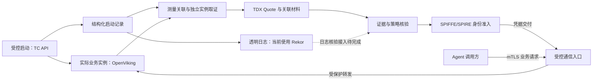

# Argus：AAMAS 2027 EMAS 论文框架

整理日期：2026-09-11。文档性质：供讨论和继续写作的 Markdown 框架，不是论文初稿、完成报告或投稿文件。

文档整理与主线同步：2026-09-17。本文件维护章节、方法 pipeline、候选贡献及图表位置；叙事与中文引言以[当前 Story](./Argus-EMAS-Story与Introduction-2026-09-16.md)为入口，实验统一规则与任务细节分别见[总方案](./框架评估研究-优势对比与实验方案-2026-09-07.md)和[场景实验设计](./Argus-EMAS-Agent场景实验设计与论文借鉴-2026-09-14.md)。历史材料与更新分工见[论文导航](./README.md)。本次同步不新增实验结果。

目标：AAMAS 2027 Main Technical Track / Engineering and Analysis of Multiagent Systems（EMAS）。正式投稿转为英文 LaTeX；本文件保留中文论证说明、英文节标题、图表计划和证据缺口。

## 研究定位与阅读方式

**已确认的研究问题：如何把 TEE 的硬件隔离与远程证明能力，转化为 Agent 和 Agent Service 可以实际使用、复用，并在运行变化后仍具有明确边界的可信交互机制？**

当前 Story 将该问题具体化为：如何以低侵入方式，将可审计的启动证据与执行环境、工作负载的证明结果转化为已有 Agent 系统可用的服务准入能力，使敏感数据交付受接收方身份和运行条件约束，并在相关条件变化后更新准入状态。低侵入与复用是需要由接入和运行评价支持的设计目标。

全文围绕一条因果链展开：

> Agent 将敏感上下文交给外部处理方 → 接收方需要符合获准的执行条件 → 受控启动形成记录，透明日志提供可审计的历史依据 → 结合远程证明与当前实例取证核验准入条件 → 通过 SPIFFE/SPIRE 将准入结果落实到业务身份和通信入口 → 在实例或身份变化时维护交付边界。

Agent-CC 是总体架构来源；Argus 是本文研究和实现的可信证明、身份准入与交互机制。论文聚焦 Agent-CC 的“可信绑定”和“可信服务组合”，并交代它们与使用中数据保护的关系。总文档涉及的三种部署模式、磁盘加密、秘密信息管理、完整供应链治理，不全部列为本篇已经实现并验证的贡献。

2026-09-17 确认：透明日志属于论文架构中形成可审计准入依据的组成部分，Rekor 是当前选用的实现。OpenViking 经 TC API 启动承担批准条件落实、启动记录形成与实例关联的职责。已有日志提交与工作负载证明路径尚未组成日志验证门禁；该联动是需完成并评价的架构要求。

下文使用三个标记：**[拟贡献]** 为需要论证的新结果；**[已有基础]** 为已有设计、代码或历史报告；**[待验证]** 为尚需实现、比较或正式实验的部分。未填的结果位置保持“待实测”，不预设提升比例。

---

## 工作标题、摘要与关键词

**英文工作标题：** Argus: Attestation-Guided Trusted Interactions for Agents and Agent Services on Intel TDX

**中文工作标题：** Argus：基于 Intel TDX 与远程证明的 Agent 可信交互框架

标题保留 TDX 这一已选择的实现平台，不提前声称通用于所有 TEE、具有完整跨域联邦能力或能验证任意 Agent 行为。

### Abstract：先保留五句话的功能位置

1. **背景与任务：** Agent 将上下文、记忆和任务数据交给其他 Agent 或外部服务，处理路径跨越本地执行边界。
2. **缺口：** 受保护的虚拟机、工作负载身份和加密通道分别提供部分保证，需要将它们与实际接收实例关联。
3. **方法：** Argus 将受控启动及透明日志中的可审计记录，与 TDX 证据、当前实例取证、策略评估和 SPIFFE 身份结合，约束实际通信入口的交付。
4. **验证：** 在固定版本的真实 TDX 环境和 Agent 工作流中，对准入反例、实例变化、故障恢复、性能及接入复用进行评价；结果位置待实测。
5. **意义：** 根据最终结果，限定说明该机制为 Agent 系统工程提供了哪些可复用保证和适用条件。

摘要不写“首次”“零泄漏”“无侵入”“可忽略开销”等尚未建立的结论。注册摘要的官方建议长度为 100–300 个英文词；正式摘要按模板填写 [V2]。

**候选关键词：** Multiagent Systems; Confidential Computing; Intel TDX; Remote Attestation; Workload Identity; Trusted Service Interactions。

---

## 1. Introduction

**本节要完成的论证：** 让读者从一次具体的 Agent 委托，理解为什么需要受保护的执行环境、远程证明，以及连接证明与实际数据交付的运行时机制。

### 1.1 用服务化记忆场景引入

以下场景与当前 Story 对齐；它定义论文要研究的交付关系，完整任务效果仍待正式评价。

- **任务：** 企业助手将私有对话、项目约束和任务结果写入独立记忆服务，在后续任务中检索和复用。
- **数据：** 记忆写入内容和检索请求可能包含私有上下文；响应内容还会流向 Agent 及其模型，需分别说明这些接收方的处理边界。
- **调用方：** 代表获授权用户访问记忆服务的 Agent；当前 OpenClaw 接入为实现基础，其证明强度以实际配置和证据为准。
- **接收方：** 运行在 TDX TDVM 中的获准 OpenViking 业务实例，经身份认证入口提供记忆服务；它不被记作第二个自主 Agent。
- **信任关系：** 接受批准的应用、TDVM 内系统与取证、身份和通信组件，希望减少对云宿主机 OS/VMM 的机密性依赖。TDVM 内管理员不被描述为已由 TDX 排除的攻击者。
- **正常结果：** 获准实例接收和处理允许交付的上下文，返回可供任务使用的记忆；任务效果与实际交付分别判定。
- **变化事件：** 业务进程更换后，逻辑服务名可能保持不变，旧代理、凭据或连接可能尚存；需要判断后续记忆读写是否可继续，以及新实例何时完成重新准入。

引入按“任务 → 数据为什么敏感 → 谁将实际接收 → 交付前需要什么依据 → 运行变化为何影响依据”的顺序展开。先讲正常协作与 TDX/证明的作用，再引出实例变化。跨企业研发、银行核验及早期合同审查例子保留为应用素材，不作为已经部署或完成评价的案例；引言正文见 [S9]。

### 1.2 从场景提炼工程缺口

准备三个具体问题，分别对应后文设计：

1. **平台到工作负载：** 如何将透明日志中的启动记录与 TDVM 证明、当前实例对应，判断该实例符合批准镜像与配置，并保留可审计的准入依据？
2. **证明到数据入口：** 证明通过的业务实例、得到身份的主体和终止 TLS 的组件，如何保持可检查的对应关系？
3. **准入到运行变化：** 实例替换、身份移除、凭据失效后，哪些交互必须停止，正常轮换和重新准入又如何恢复可用性？

Agent 的相关性来自跨组件处理敏感上下文、服务化记忆、工具/Agent 委托及多轮交互。一般服务也可能遇到这些问题；论文需要展示对 Agent 系统的工程价值，不把问题宣称为 Agent 独有。

### 1.3 引出 Argus 与三项候选贡献

| 编号 | 拟贡献表述 | 主要论证位置 | 要补充的证据 |
|---|---|---|---|
| C1 | 面向 Agent 交互的可审计工作负载准入方法，将受控启动记录、TDX 证据、实际业务实例和批准条件关联起来 | §2、§3.2–3.3 | 日志与证明、当前实例的关联要求，缺失/重放/错配反例，以及相对已有方案的差异 |
| C2 | 将证明结果落实到工作负载身份与实际通信入口的运行时，维护实例、凭据和连接之间的依赖及失效规则 | §3.4–3.5、§4 | 身份使用者与实际接收方关系、加载/停用机制、适配与生命周期实验 |
| C3 | 在真实 Intel TDX 上开展 Agent 交互的系统性评价，揭示保证、可用性、成本与复用之间的关系 | §5、§7 | 强基线、消融、真实数据交付与任务结果、重复测量 |

上述是待论证的论文贡献。TEE、两层证明、透明日志、SPIFFE 或故障测试本身不被当作首次提出；主要技术差异需要落在 C1/C2 的具体机制及 C3 得到的可推广结论。

三个研究问题组织“准入依据—交付落实—运行维护”的论证；C1–C3 记录候选贡献；§5 的五个评价问题组织检验证据。三者不逐项等同。完成强基线、消融与任务评价后，再形成最终贡献段，不将实验安排本身写成新发现。

**图 1 计划：** Agent → mTLS 通信入口 → TDX TDVM 内 OpenViking。标清调用方、云宿主机、TDVM 边界、证明控制流和记忆读写数据流。模型、embedding 及其他接收上下文的下游路径必须画完整，并注明各自是否在实证保护范围内。

---

## 2. Background, System Model, and Trust Assumptions

**本节要完成的论证：** 定义本文到底保护什么、信任什么，以及“通过证明”能够支持多强的声明。

### 2.1 TEE、Intel TDX 与远程证明

- TEE 为使用中的代码和数据提供受保护执行边界；Intel TDX 是本文采用的 TDVM 实现基础 [T1]。
- 远程证明区分 Evidence、Verifier、appraisal policy、Attestation Results 和依赖这些结果的准入方 [T2]。
- 介绍 Quote、测量值、REPORTDATA 的必要含义，不展开与本文机制无关的处理器实现细节。
- 区分测量事件日志与透明日志：前者解释事件并支持与 RTMR 的重放核验，后者提供记录收录及追加一致性的可验证依据。Rekor 是透明日志实现；其 Merkle 树根与 RTMR 不混用 [T4、T5]。
- TDVM 启动条件、业务镜像/配置和实际运行实例是不同对象。软件采集属性的可信性依赖已声明的 TDVM 内受信取证路径；Quote 对绑定数据的认证不等于硬件理解程序行为。

### 2.2 Agent-CC 总体模型与本文切入点

- 用控制平面、执行平面和外部服务三个部分定位 Argus [S0 §1]。
- Agent Service 包含记忆、检索、推理、工具，以及另一个 Agent 的服务接口；不要求每个服务都具备自主决策能力。
- 三种部署模式仅用于解释隔离与证明粒度。正文实证按最终固定的部署配置展开，不声称实现全部部署模式 [S0 §2、§4]。
- 以可信绑定和 Trust Guard 的服务准入职责衔接到 Argus。Trust Guard 在总文档中是架构职责，当前实现由证明插件、身份系统及通信组件共同承担，并非另加一个必须经过的同名中央 API [S0 §5、S1]。

### 2.3 对象与交付要求

定义最小对象集合：调用方与接收方逻辑身份、实际进程实例、受控启动记录、透明日志证明与检查点、批准基线/策略、证明结果、身份凭据、TLS 使用者、业务资源权限。

**[拟贡献] 可检查要求：**

- **R1 准入关联：** 启动记录通过来源、收录及与本次证明的关联核验，被接受的平台/实例证据对应当前目标和适用策略；不能用另一启动周期、nonce、实例或较弱平行 Entry 获得同一目标身份。
- **R2 交付关联：** 预期业务身份、当前凭据使用者与实际接收入口之间具有明确的受信路径；工作负载身份与用户/租户权限分别验证。
- **R3 有效性与恢复：** 对声明可观测的失效，定义检测、传播及停止使用旧依据的规则；新实例重新准入，正常轮换按独立规则处理。

这些要求不是已经证明的定理。若后续给出形式化保证，需同时给出状态模型、假设及论证；只做执行轨迹检查时，表述为经检验的要求。

### 2.4 威胁模型和保证边界

- TDX 保护边界针对约定范围内的 TD 外攻击；TDVM 内核、Provider、启动/登记链、SPIRE 及所用 Helper/代理/应用 TLS 组件属于受信基础。
- 启动记录的事实依据来自受信启动/取证路径；透明日志验证依赖认可的签名根、检查点与适用的一致性核验。记录已收录不等于记录真实、所有执行均已记录或实例仍有效，相关要求需由覆盖范围、当前取证与失效规则共同落实。
- 区分网络攻击、错误身份和证据重放，与运维触发的配置变化、进程停止和升级故障。不得将超出威胁模型的 guest-root 攻击算作基线失败。
- 同一 TDVM 内的多个容器不因使用 TDX 就拥有相互独立的硬件隔离。
- 获准程序接收数据不等于模型输出正确，也不保证任意后续代码行为；已交付数据不能通过撤销证书被收回。
- 每个继续接收原文的下游服务都形成新的信任边界。一跳 mTLS 不自动建立整个调用链的机密性保证。
- 性能实验不作为重新证明 Intel TDX 硬件安全性的证据。侧信道、可用性及硬件版本边界按最终实验与官方假设描述。

**表 1 计划：** 对象、依据、作出判断的组件与保证边界。

---

## 3. Argus Design: From TDX Evidence to Trusted Interactions

**本节要完成的论证：** 展示 Argus 如何把执行证据转化为业务真正使用的身份和数据入口，解释组件间必须保留的关系。

### 3.1 Architecture Overview

- 分开证明/身份控制流与业务数据流，说明 Trustee 和 SPIRE Server 不位于敏感上下文的业务传输路径。
- 透明日志属于准入证据与审计路径，不转发敏感业务正文。TC API 是当前受控启动入口，TruCon 承担事件组织与测量关联，Rekor 实现透明日志职责；它们与证明、身份组件共同支撑可审计准入 [S11]。
- 两端可采用不同接入方式和不同准入强度；具体保证取决于对应 policy/Entry，不能从“双端都有 SVID”推导“双端都经过 TDX 证明”。
- 保留原生 SDK 与 Helper 的通用设计位置，实际实现及同等验收范围在 §4 单独列出。

**图 2 草图：** 目标架构中的启动证据、身份控制流与业务数据流。日志到准入的虚线表示尚待接通的验证门禁；节点可信根与 Node 准入作为前提，正式绘图时补出 TDVM 边界。

图中展示职责关系，不将日志提交等同于身份准入已经通过。实际业务进程与持有凭据、终止 TLS 的入口分别绘制。

方法 pipeline 按准入、业务交互与运行维护组织，具体机制在后续小节展开：

| 阶段 | 主要处理与输出 | 对应小节 |
|---|---|---|
| 节点准入 | 核验 TDX 平台证据、挑战和持钥关系，形成后续 Workload 准入所依赖的节点身份 | §3.2 |
| 受控启动与日志记录 | TC API 按批准条件启动服务，产生结构化记录；透明日志提供可验证的收录依据 | §3.3 |
| 实例登记与取证 | 登记真实业务实例，独立采集实例、镜像与配置属性，与具体启动记录关联 | §3.3 |
| 证据与策略核验 | 核验启动记录来源、透明日志证明及与本次运行证据的关联，复查当前实例并评估策略；日志门禁待接通 | §3.3 |
| 身份与入口生效 | 通过严格 Entry 准入、签发和交付凭据，确认实际加载，并关联身份使用者与业务入口 | §3.4 |
| Agent 业务交互 | 在有效身份和连接上执行记忆读写与任务，分别检查对端身份、业务权限和实际接收 | §3.4、§4 |
| 可观测失效与重新准入 | 依据事件停止使用失效依据；新实例重新登记和准入，恢复后核对业务结果 | §3.5 |

稳态请求不重复执行完整证明流程。普通 SVID 轮换、订阅重连及实例替换走各自适用的路径；该流程不意味着持续检测所有运行变化，也不意味着恢复连接即可恢复任务。

### 3.2 TDX Node Admission

说明 challenge、nonce、proof public key、Quote 和持钥证明的绑定，以及 Trustee 评估、签名结果验证和节点身份准入 [S2]。

要回答：旧 Quote 为什么不能被直接用于新挑战？获准 Node 身份如何约束后续 Workload Entry？

明确：proof key 与 SVID/CSR key 是不同密钥；当前不能据此声称业务私钥被硬件封存或不可复制。SPIRE Server CA 负责签发 SVID。

### 3.3 Auditable Launch Evidence and Instance Binding

**设计理由：** OpenViking 经 TC API 启动，是为了由受控流程落实批准条件并形成后续可验证的启动依据。镜像/配置、启动标识和结果记录需要与实际业务实例关联；透明日志使这些依据能够被独立核验和追溯，具体实现当前采用 Rekor [S3、S11]。

- **[已有基础]** TC API 形成启动记录，受控登记链定位实际业务进程，区分 container init 与真正的服务进程；TruCon/透明日志承担已有事件提交与测量关联职责。
- **[已有基础]** Provider 独立采集实例、镜像与配置属性，将规范化运行证据、新鲜 nonce 与适用 policy 关联至 Quote 的 REPORTDATA，并校验验证结果；在适用阶段复查目标。
- **[待验证]** 将透明日志核验接入身份准入：验证启动记录来源、收录证明与可信检查点，核对相关事件历史与本次新鲜证明的一致性，再确认对应的是当前启动周期和业务实例。记录查询结果本身不作为授权结论。
- **[待验证]** 在测量链、日志记录引用和 Workload runtime data 之间固定关联合同，分别说明 RTMR 重放与 REPORTDATA 绑定的对象、验证者及时间范围。当前 Quote 不自动证明 Rekor 中任意一条记录与它对应。
- 使用 selectors 与严格 Entry 将核验结论用于身份准入，检查同身份的较弱平行准入路径 [S3]。架构要求在相应实例获准使用服务身份前完成上述检查；当前 `rekor_gate` 仍为 `DEFERRED`。

**与总文档的关系：** 这部分衔接 trusted binding layer 的受控启动、可审计记录与可信服务组合。测量事件日志、透明日志及其实现 Rekor 分别说明；不把日志上传、包含证明或 Quote 单独等同于业务门禁通过。

**算法/协议框 1 计划：** 展示启动记录与日志证明核验、当前实例检查、新鲜证据评估、策略判断及准入输出，失败点与 R1 对应。核验不可完成时不新授予所要求的目标身份；既有身份和连接的有效性按 §3.5 的明确规则处理。

### 3.4 Attestation-Guided Identity and Context Delivery

- 证明结果影响身份准入；SVID 通常不携带完整 Quote 或 policy。调用方依赖获准身份背后的签发规则，而非每个业务请求都自行读取硬件证明。
- 区分业务实例、凭据持有者和 TLS 终止者；说明代理进入业务 network namespace、实际加载确认及受保护后端路径的作用。
- 调用方核对明确的对端 SPIFFE ID；接收方核对允许调用的身份，业务层再执行用户/租户/资源权限。
- 正文何时发送、TLS 入口何时可见、业务后端何时处理分别定义；不得把入口拒绝误写成所有组件都未见过正文。
- Node/Workload 证明成本在适用会话或身份生命周期中复用，普通请求通过已批准的身份与通信规则执行。

### 3.5 Identity and Instance Lifecycle

拟用状态表连接“未准入、可用、停用、重新准入”。条件以真实实现和可观测事件为准。

当前 Workload 证明在 Broker 新订阅时执行；普通 SVID 更新不触发新 Quote。Helper 重启或重连形成新订阅时会进入相应证明流程，独立周期重新证明尚未实现。这里的有效性维护不等于持续重新核验所有运行属性。

| 事件 | 需要描述的机制 | 要观察的业务结果 |
|---|---|---|
| 正常 SVID 轮换 | 发布/加载新代次、处理旧连接 | 获准业务连续性；不计为新 Quote |
| 实例退出或更换 | 旧实例登记与凭据使用停用，新实例重新准入 | 完成检测与停用后，后续正文不再由旧依据放行；此前窗口单独测量 |
| 身份移除/凭据无效 | 更新传播、缓存清理及连接关闭 | 最后一次实际数据交付及恢复时间 |
| Helper/Broker/网络故障 | 检测与有效性规则 | 停止窗口、误拒绝、恢复损失 |

不承诺瞬时撤销。区分检测前窗口、新请求、旧连接上的新请求、在途请求与流式响应。中断写入可能已经执行；恢复连接不等于回滚业务或自动完成任务重试。

---

## 4. Implementation and Agent Integration

**本节要完成的论证：** 交代机制如何落实、哪些是复用组件、哪些是 Argus 的新增实现，以及其他 Agent 如何接入。

- 给出正式实验固定的代码提交、Intel TDX/Guest 配置、SPIRE、Trustee、Helper、Agent 与服务版本。
- 说明 Argus 新增的 Node/Workload Attestor、Evidence Provider、实例登记、凭据交付与通信适配；将上游 SPIRE 的身份签发、插件机制等归还上游。
- 说明 TC API/TruCon 的受控启动、事件与测量关联如何复用，Rekor 如何实现透明日志接口，以及日志核验到身份准入的新增接入。该门禁未完成时单列实现缺口，不能把已有日志提交记作门禁验收。
- 用 OpenClaw → OpenViking 展示 Agent→Service 的实际适配入口。OpenViking 是记忆/上下文服务，不将它记成第二个自主 Agent。
- 分别说明 τ²-bench 记忆 adapter、LoCoMo/OpenClaw Gateway 插件和 Server 发压客户端如何使用目标身份及实际服务入口 [S10]；任务脚本、验证进程与 Agent 发出的请求分别标识。其他 Agent→Agent 场景保留为扩展候选。
- 原生 Go/Java SDK 路径若尚未达到同等证明要求，只作为设计扩展。普通 `Attest` 与 `AttestReference` 的实现差异必须核对。
- 若保留“可复用框架”贡献，用第二调用程序和第二服务验证，不用目录数量或语言库存在证明通用性。

**表 2 计划：** 组件、上游复用/Argus 改动、受信角色、代码与验证范围。部署命令和完整配置放补充材料。

---

## 5. Evaluation

**本节要完成的论证：** 用真实 TDX、实际数据交付与 Agent 任务检验 C1/C2，同时量化可用性、成本和复用价值。下面是实验框架，不是结果。

### 5.1 Research Questions and Experimental Setup

| RQ | 研究问题 | 实验与既有方案映射 | 主要指标 |
|---|---|---|---|
| RQ1 | 可审计启动依据、TDX/实例证据与身份准入能否约束实际接收者？ | E1：正常准入，启动记录缺失/错配，错误身份、nonce/配置/实例错配及实际交付 | 拒绝位置、实际接收、错误放行/拒绝 |
| RQ2 | 运行变化时，停止与恢复是否符合声明规则？ | E4：两端适用的实例、凭据与基础设施故障 | 交付窗口、停止与恢复分布、任务状态 |
| RQ3 | 日志核验、额外证明、实例关联与失效联动分别起什么作用？ | E1/E2/E4：B3b/B5 强比较及适用机制消融 | 保证差异、反例、额外成本、停止与恢复变化 |
| RQ4 | 框架如何影响 Agent 任务与服务性能？ | E2/E3/E5/E7：启动、请求、准入竞争与完整任务 | 任务效果、首次可信任务、尾延迟、资源、Goodput |
| RQ5 | 更换调用方或服务后，哪些能力能够复用？ | E6：不同调用程序与服务的接入矩阵 | 同等要求下的业务完成、适配改动、核心复用及部署步骤 |

引用已有[整系统评估方案](./框架评估研究-优势对比与实验方案-2026-09-07.md)展开脚本与参数；本节在正文保留任务、基线、指标、关键结果和解释。

五个评价问题与当前 Introduction 一致，分别提供实际交付、运行维护、机制必要性、任务与性能、接入复用方面的证据。当前任务与性能评价选取 OpenViking 的 τ²-bench 适配、LoCoMo/OpenClaw 和 Server 混合负载；入口、计时与任务判定以[场景实验设计](./Argus-EMAS-Agent场景实验设计与论文借鉴-2026-09-14.md)为准，状态为 `proposed_not_run`。两个调用端访问同一服务，只能支持调用侧复用；跨服务主张还需第二类服务的实际接入。

固定硬件、平台接受条件、policy、证据年龄、信任边界、模型、数据、连接复用与资源配置。完整模型/embedding 路径在实验图中标出，外部模型服务的结果不被描述为完全位于 TDX 内。

### 5.2 Baselines and Ablations

| 组别 | 定位 | 使用原则 |
|---|---|---|
| 普通 VM / TDX VM 的匹配业务配置 | 分解平台成本 | 保留同版本应用；不当作同等安全方案 |
| TDX + 相同 TLS/代理/业务授权 | 分解通信及准入成本 | 明确凭据来源及未具备的证明保证 |
| B3a：TDX Node + 最强适用原生 Workload 检查 | 现有机制组合基线 | 不故意弱化原生检查 |
| B3b：B3a + 同等日志核验、独立属性取证、策略与失效联动，但无第二份 Workload Quote | 检验额外证明及关联机制的必要性 | 属性经认证通道取得，固定证据年龄；保证差异单列 |
| 完整 Argus 与机制消融 | 解释新增机制的作用 | 分别消融日志门禁、实例引用、前后复核、实际加载或失效联动；说明依赖关系 |

若 B3b 在同等假设下提供相同保证，不声称第二份 Quote 有独有安全价值；据实分析成本、部署或可复用性上的差异。组合基线、第三方系统复现和消融分别命名。

按包含透明日志核验的目标架构运行 B3b/B5 时，两者保留同等日志确认、来源/包含核验、证据新鲜度和实例关联条件，仅改变额外 Workload Quote。日志价值另设同等受信启动/实例检查下的对照；启动日志不可得、提交延迟和旧记录重放分别测量。当前缺少日志门禁的原型可作阶段参照，不标作已完成目标架构的 B5。

### 5.3 Evidence, Admission, and Actual Delivery

- 正向控制：批准平台、实例和调用者能取得身份并完成业务。
- 负向检查：启动记录缺失、来源不符、收录证明不符、另一节点或历史实例记录，及错误身份、旧证据、跨 nonce 配对、配置摘要不符、实例错配。
- 在实际能力范围内设计代理与后端更换反例，注明是错误部署/更新场景还是攻击；相同逻辑身份的合法副本作为对照。
- 同时观测证据评估、身份签发、TLS 入口与业务后端。程序返回错误、文件删除、HTTP 状态不能独立替代数据接收结果。

### 5.4 Lifecycle, Recovery, and Agent Outcomes

- 观察 Helper 退出/冻结、Broker 断连/冻结、Entry 删除、实例更换和正常轮换。
- 记录触发、检测、最后发送/接收、确认停止与恢复时间；服务端和客户端分别报告。
- 记录任务成功、失败、重复、丢失或结果未知。传输恢复与任务恢复分开。
- 观测最大值不写成无条件时间上界；停止窗口未结束的样本保留相应删失信息。

### 5.5 Performance and Reuse

- 分解 TDX 平台、日志确认与核验、Node/Workload Quote、Trustee 验证、身份取得、TLS 与应用处理成本。
- 在匹配开放到达率和连接策略下报告 P50/P95/P99、失败率、CPU/内存及 Goodput。
- Goodput 采用“结果正确、满足信任/权限条件且在给定 SLO 内完成的任务或请求”，不只报告成功样本延迟。
- 使用相同任务、模型与 token/重试预算配对运行；正式参数由预实验确定，不在框架中虚构样本量或显著性。
- 接入复用至少区分业务适配、通信适配和核心机制修改；原生/Helper 组合只有通过同等要求时才能并列比较。

**结果图表计划：** 准入/交付结果表；故障到停止/恢复的分布图；首次可信任务与稳态成本分解；接入与实际任务结果表。按 8 页容量合并排版，避免展开全部 E1–E7 子表。

---

## 6. Related Work

按“解决哪个问题、复用了什么、本文还要证明什么差异”组织，不按组件百科罗列。

1. **可信 Agent 与机密计算平台：** 以 Omega 等为直接近邻，比较保护边界、多主体信任、工具/Agent 交互与运行时机制 [N1]。
2. **平台/工作负载远程证明：** 以 Full Trust Alchemist 等比较运行证据、策略、实例与取证路径；继续核对已有 TDX/SPIRE 集成工作 [N2、S6]。
3. **标准工作负载身份与安全通道：** 明确 SPIFFE/SPIRE 已有能力，定位 Argus 的证明准入、实例与实际入口关联增量 [T3、S1–S3]。
4. **MAS 工程、运行监测与验证：** 从已核实的 AAMAS 论文说明本文的工程评价对象；形式化监测方法与硬件远程证明不是相同保证，不将“verification”一词视为等价 [P1–P3]。

准备一张作者内部比较表：信任边界、证据粒度、身份准入、代理/实例关系、失效语义、业务验证和复现材料。未知项填“待核对”，不能从摘要没有提到某功能推导该功能不存在。

该比较的文献事实维护在 [Related Work 汇总表](./Argus-Related-Work-汇总表-2026-09-15.md)，候选贡献的重叠与论证要求维护在[重叠审查](./Argus-EMAS-相关工作与贡献重叠审查-2026-09-11.md)；正文据此选择与最终机制最接近的比较对象。

---

## 7. Discussion and Limitations

- **范围：** Intel TDX 是实证平台；其他 TEE 的适配、跨域政策互认、任意副本、动态工具自动准入不被默认涵盖。
- **证据语义：** 身份认证与业务授权分开；平台/实例证明与模型结果正确性分开；节点重认证与普通 SVID 轮换分开。
- **运维与时间：** 证明时点、检测传播窗口、网络在途数据、不可用与业务重试均有边界。
- **通用性：** 单个 OpenViking 实例不能覆盖所有 Agent 框架、原生 SDK 或多 worker 部署；复用主张随实际接入实验收缩。
- **现实限制：** 将 TCB 接受条件、客户端证明强度及应用链路失败作为明确实验条件，不用 PoC 标签掩盖其含义。

本节还应讨论失败案例教会了哪些工程取舍，避免仅列“不支持的功能”。

## 8. Conclusion

用一个短段落回到已确认的研究问题：总结已被实验支持的证明到交互机制、最重要的系统发现及适用条件。所有结果数字与价值判断来自 §5；未完成能力不写入结论。

## References

正式版本使用官方模板的编号参考文献与 BibTeX。下面是作者写作资料索引，尚不是最终参考文献表。

---

# 作者写作资料：不属于论文正文

## A. AAMAS 2027 格式与篇幅依据

已于 2026-09-11 核对官方投稿说明和模板源文件 [V1–V3]。

- 英文、双盲、PDF 提交；必须使用 LaTeX。正文最多 8 页，参考文献可另加页，不能修改样式挤压版面。
- 官方模板类为 `aamas`，匿名入口为 `\documentclass[sigconf,anonymous]{aamas}`，包含 submission ID、abstract、keywords 和编号参考文献。
- 补充材料为单个不超过 25 MB 的 ZIP；审稿人不必阅读，核心机制、假设与主要证据留在正文。
- 如采用 AI 辅助形成的假设或方法，按官方政策保留工具/版本与相关 prompt，后续在论文或补充材料作适用披露。该事项属于写作记录，不替代作者对结果和引用的核验。

以下是**建议篇幅**，不是官方指定章节；图表占用计入各节。

| 部分 | 建议页数 |
|---|---:|
| 标题、摘要与关键词 | 0.35 |
| 1 Introduction | 0.90 |
| 2 Background / Model / Assumptions | 0.85 |
| 3 Argus Design | 2.10 |
| 4 Implementation | 0.60 |
| 5 Evaluation | 2.10 |
| 6 Related Work | 0.60 |
| 7 Discussion and Limitations | 0.35 |
| 8 Conclusion | 0.15 |
| **合计** | **8.00** |

## B. 正式录用论文的结构借鉴

以下三篇均核对了实际正文。仅借鉴论证组织，不据个别样例推断录用概率，也不将 Demo、Extended Abstract 或 Workshop 当作 full research paper。

| 样例 | 已核实类别与章节组织 | 对 Argus 的具体用途 |
|---|---|---|
| **[P1] Design Patterns for Explainable Agents (XAg)，2024，pp. 1621–1629** | Full Research Paper；Introduction → Background → TriQPAN 设计模式 → Explaining Agent Behaviour → Experimental Evaluation → Conclusion。Intro 列出可复用模式、平台实现、两个案例三项贡献 | 主要结构参照：先定义可迁移方法，再解释具体实现，用不同 Agent 交互验证同一机制。其案例评价不能替代 Argus 所需的安全与性能比较 |
| **[P2] A Behaviour-Driven Approach for Testing Requirements via User and System Stories in Agent Systems，2023，pp. 1182–1190** | Main Track Full Paper；页脚标明 Session 3F: Engineering Multiagent Systems。Introduction → Background and Related Work → 扩展需求故事 → Testing Framework → Conclusion；评价在 §4.4 Mutation Testing 内，没有独立实验章 | 将 Intro 的交付要求转成可执行检查，再用反例暴露缺失条件。场景应贯穿要求、实现和验证；应用推理与底层组件故障分开解释 |
| **[P3] Learning Robust Markov Models for Safe Runtime Monitoring，2026** | Research Paper Track；正式录用记录与 PDF 类别已核对，详细实验组织结合作者全文核对。Introduction → Problem Statement → Monitors → Learning → Experimental Evaluation → Related Work → Conclusion | 借鉴实验拆分：整体方法比较、机制选择与消融分别回答问题；限制和较弱结果保留。其 iHMM 理论保证不被迁移为 Argus 的证明保证 |

P1 的关键词包含 EMAS，但本轮未核实其专题分配；P3 也不被直接归类为 EMAS。P2 有明确工程专题标签。选择这些文章是因为方法、实现与评价的组织适合参考，而非它们具有与 Argus 相同的安全问题。

对本框架的具体取舍：采用 P1 的“方法—实现—案例”骨架，吸收 P2 的“需求—可执行判断—反例”，用 P3 的分组实验方式组织 §5；保留 Argus 自身必要的威胁模型和远程证明语义。

## C. Agent-CC 总文档到本文的映射

源文档为 Agent-CC v0.8（2026-06-28 修订；PDF 页眉 2026-06-30），已核对原 PDF 与中文转写 [S0]。

| 总文档内容 | 本篇采用方式 | 需要保持的边界 |
|---|---|---|
| §1 控制/执行平面与外部服务 | §1–2 的 Agent 系统背景 | 不把所有外部服务叫作自主 Agent |
| §2 三种 TDX 部署模式 | §2 解释隔离及证明粒度 | 实证只覆盖最终实现配置 |
| §3 数据生命周期保护 | 引出敏感上下文与使用中数据保护 | 不把静态加密、密钥释放等全部列为已验证贡献 |
| §4 构建到执行、可信绑定层 | C1 与 §3.2–3.3 的主要来源 | 总体原则不等于当前完整供应链证明 |
| §5 可信服务组合、Trust Guard、低侵入接入 | C2、§3.4–3.5、§4 的主要来源 | 业务链路与原生/代理模式需各自验收 |
| §6 总体价值判断 | §7–8 的讨论背景 | “显著降低风险”等表述必须由本篇数据支持 |

## D. 当前证据与正文主张的距离

本表保留 2026-09-11 整理的设计与 2026-09-09 公司报告所支持的结论。2026-09-16 仅同步文档定位；后续实现按[当前代码总览](../Argus-SPIFFE-Current-Code-Architecture-CN.md)、[Workload 验证记录](../../core/spire/workload/VALIDATION.md)及[客户端验证记录](../../adapters/OpenClaw/spiffe_client/VALIDATION.md)逐轮核对，不把软件测试自动升级为同版本真实硬件验收。本次未复验远端，也未新增实验。

| 项目 | 已有依据 | 本文能如何使用 | 尚不能据此宣称 |
|---|---|---|---|
| 透明日志与 TC API 启动 | 已有结构化启动记录、事件/测量关联与日志提交 [S11]；工作负载路径日志门禁标记为 DEFERRED [S3] | 支撑可审计启动依据的架构与接入起点 | 已完成日志验证驱动的 SVID 准入，或所有工作负载启动均完整记录 |
| TDX Node / Workload 链 | 服务端真实 Quote、Trustee、目标 SVID 与业务 mTLS 的 PoC 报告 [S4] | 支撑可运行实现与正式实验起点 | 严格 UpToDate TCB 验收通过；PoC 采用独立 TCB 例外策略 |
| OpenClaw 客户端 | x509pop 加入、严格进程/镜像 selectors、mTLS 与真实写入读回 [S5] | Agent→Service 集成基础 | 客户端已完成远程 TDX 证明或双端同级证明 |
| 轮换与故障恢复 | 9 月 9 日客户端侧有实际通过记录 [S5] | 设计 RQ2 与复现实验的依据 | 客户端结果自动覆盖服务端冻结/退出或任意网络栈 |
| 长期记忆业务 | 写入读回及部分归档完成，新会话长期记忆召回失败 [S5] | 作为真实应用缺口及待修复项 | 完整长期记忆任务端到端 PASS |
| Go/Java 原生接入 | 通用设计存在，普通 `Attest` 仍未输出所需证明 selectors [S1] | 设计扩展与复用实验候选 | 原生 SDK 已有同等 TDX 准入验收 |
| 早期采购/合同审查场景 | 9 月 11 日讨论提出的引入与实验候选 | 历史应用素材；当前主场景已调整为服务化记忆 | 已部署客户案例、真实采购收益或审查效果 |
| 正式性能与比较 | E1–E7 方案及 Review [S7、S8] | 组织 RQ 与基线 | 已得到配对性能收益或统计显著性 |

## E. 下一轮写作前要收敛的四件事

1. 固定 C1/C2 的核心反例与最强比较对象，确认超出已有组件组合的机制或实证结果。
2. 冻结已选 τ²-bench 适配、LoCoMo/OpenClaw 和 Server 混合负载的版本、数据、任务标识与接入范围；跨企业等说明性例子保留明确用途。
3. 固定硬件与策略接受条件、两端实际证明强度、实现范围，并处理当前应用链路缺口。
4. 在正式测量后替换摘要和 §5 的结果位置，再决定保留多强的通用性、性能与安全主张。

## F. 资料索引

### 会议与模板

- **[V1]** [AAMAS 2027 Main Track CFP / EMAS 范围](https://warwick.ac.uk/fac/sci/dcs/aamas2027/calls/call-for-main-track/)。
- **[V2]** [AAMAS 2027 Submission Instructions](https://warwick.ac.uk/fac/sci/dcs/aamas2027/calls/instructions/)。
- **[V3]** [AAMAS 2027 官方模板 ZIP](https://warwick.ac.uk/fac/sci/dcs/aamas2027/aamas_2027_template.zip)，本轮实际读取 `AAMAS_2027_sample.tex`；模板规定格式，不规定本文章节顺序。

### 项目资料

- **[S0]** [Agent-CC v0.8 原 PDF](../archive/pre-asymmetric-architecture/Agent-CC.pdf)；[中文转写](../../../../output/pdf/Agent-CC.zh-CN.md)。重点：§1、§4–5；原 PDF 第 15–19 页核对绑定层、Trust Guard 与 SPIRE 图示。它是背景架构资料，不是当前验收报告。
- **[S1]** [通用 Agent 与 Agent Service 可信通信](../Argus-Agent-Agent-Service-Trusted-Communication-CN.md)。
- **[S2]** [TDX Node Attestation](../Argus-TDX-Node-Attestation-CN.md)。
- **[S3]** [OpenViking Workload Attestation](../Argus-OpenViking-NGINX-SPIFFE-Helper-Workload-Attestation-Workflow-CN.md)。
- **[S4]** [2026-09-09 Workload 公司报告](../../../../documents_ly/argus-openviking-workload-attestation-status-20260909.md)。
- **[S5]** [2026-09-09 OpenClaw 客户端报告](../../../../documents_ly/argus-openclaw-ip1-tdvm-client-acceptance-20260909.md)。
- **[S6]** [框架价值与核心贡献研究](./框架价值与核心贡献研究-2026-09-06.md)。其中候选方向和近邻结论需继续核对，旧验证状态以 S4/S5 为后续证据。
- **[S7]** [整系统评估方案](./框架评估研究-优势对比与实验方案-2026-09-07.md)。
- **[S8]** [评估方案 Review](./评估方案Review-CCF-AB-2026-09-07.md)。
- **[S9]** [当前 Story 与中文 Introduction](./Argus-EMAS-Story与Introduction-2026-09-16.md)。
- **[S10]** [Agent 场景实验设计与论文借鉴](./Argus-EMAS-Agent场景实验设计与论文借鉴-2026-09-14.md)。
- **[S11]** [TC API / TruCon 架构](../../core/tc_api/docs/architecture.md)：受控启动、结构化事件、统一度量链及透明日志实现。当前身份门禁状态同时核对 [Workload 工具](../../core/spire/workload/scripts/workload.py)。

### AAMAS 正式论文样例

- **[P1]** [Design Patterns for Explainable Agents (XAg)，AAMAS 2024 正式 PDF](https://www.ifaamas.org/Proceedings/aamas2024/pdfs/p1621.pdf)；[官方镜像](https://aamas.csc.liv.ac.uk/Proceedings/aamas2024/pdfs/p1621.pdf)。重点读取引言贡献、§3–4 方法与实现、§5 两个 Agent 案例。
- **[P2]** [A Behaviour-Driven Approach for Testing Requirements via User and System Stories in Agent Systems，AAMAS 2023 正式 PDF](https://www.ifaamas.org/Proceedings/aamas2023/pdfs/p1182.pdf)；[会议镜像](https://www.southampton.ac.uk/~eg/AAMAS2023/pdfs/p1182.pdf)；[官方作者/类别目录](https://www.ifaamas.org/Proceedings/aamas2023/forms/authors3.htm)。重点读取贯穿场景及 §4 测试框架和变异测试。
- **[P3]** [Learning Robust Markov Models for Safe Runtime Monitoring，AAMAS 2026 正式 PDF](https://www.ifaamas.org/Proceedings/aamas2026/pdfs/JAKK2294.pdf)；[作者全文](https://arxiv.org/html/2602.14987v1)；[官方录用目录](https://www.ifaamas.org/Proceedings/aamas2026/forms/contents.htm)。重点读取问题定义、§5.2–5.4 对照/消融和 §5.5 限制。作者扩展版的附录不是 AAMAS 正文可额外扩页的依据。

### 技术与近邻资料

- **[T1]** [Intel TDX Security Guidance](https://www.intel.com/content/www/us/en/developer/articles/technical/software-security-guidance/best-practices/trusted-domain-security-guidance-for-developers.html)。
- **[T2]** [RFC 9334: RATS Architecture](https://www.rfc-editor.org/rfc/rfc9334.html)。
- **[T3]** [SPIFFE Workload API](https://github.com/spiffe/spiffe/blob/main/standards/SPIFFE_Workload_API.md)。
- **[T4]** [透明日志与 Rekor](https://docs.sigstore.dev/logging/overview/)。
- **[T5]** [Intel TDX 事件日志接口](https://docs.trustauthority.intel.com/main/articles/articles/ita/integrate-tdx-adapter-api.html)。
- **[N1]** [Trusted AI Agents in the Cloud / Omega](https://arxiv.org/abs/2512.05951)，作为相关工作比较，不当作 AAMAS 录用样例。
- **[N2]** [Full Trust Alchemist: Reforging Attestation for Cloud-based Confidential Workloads](https://www.comsys.rwth-aachen.de/publication/2025/2025_galanou_trust-alchemist/)，Middleware 2025；作为运行证明近邻，不当作 AAMAS 录用样例。

正式参考文献还需核对作者、版本、venue、页码与 DOI；本文未生成未经核实的 BibTeX。
