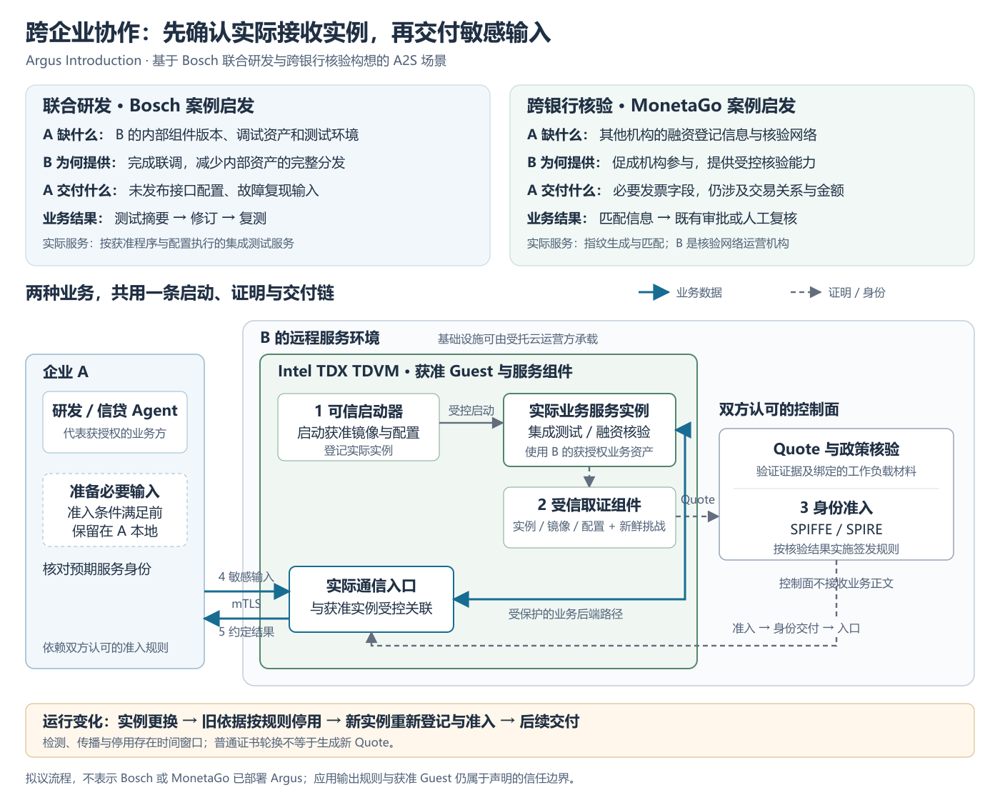

# Argus Intro：跨企业可信服务协作

日期：2026-09-12。本文保留当时的引言讨论稿与场景配图，沿用[原论文框架](./Argus-AAMAS2027-EMAS-论文框架.md)的研究问题和三项候选贡献。Bosch 与 MonetaGo 提供业务依据；下文的 Agent、TDX 服务部署及 Argus 接入是拟议场景，不代表这些企业已部署 Argus。

2026-09-14 补充：在正文中明确 Agent 多轮委托与实际服务实例准入之间的关系，并连接到独立的 Agent 场景实验设计。

文档定位（2026-09-16 整理）：应用场景素材与历史引言。当前正文从服务化记忆展开，见[Story 与中英文 Introduction](./Argus-EMAS-Story与Introduction-2026-09-16.md)；本文件保留案例依据、场景推导及配图，不作为并行主稿。分工见[论文导航](./README.md)。

## 1. 引言的叙事安排

用两个短场景回答同样的三个问题，再合并为一个工程问题。研发案例展开一次“复现—测试—修订后复测”；银行案例说明，相同的准入需求也出现在依赖跨机构数据的普通服务调用中。两例均先采用 A2S；B 只有在承担独立任务规划与协商时才需要另设 Agent。

| 引言必须回答的问题 | Bosch 式联合研发 | 跨银行融资核验 |
|---|---|---|
| A 缺少什么不可替代资源？ | B 尚未发布的组件版本、调试资产和专用测试环境；A 已有交付二进制也未必拥有这些资源 | 其他参与机构登记的融资状态，以及连接这些信息的核验网络；A 的本地记录无法覆盖 |
| B 为什么愿意以可信服务提供？ | 履行联合验证需求、缩短联调周期，同时减少对内部版本和调试资产的完整分发 | 提供跨机构核验能力，让参与机构在限制信息暴露的条件下贡献记录、使用网络 |
| A 为什么在敏感交付前验证实际实例？ | 复现输入会暴露未发布接口、产品参数和故障行为；A 只同意交给获准测试程序处理 | 必要发票字段仍可能揭示交易关系与金额；A 只同意交给获准核验程序处理 |

这里的外部依赖来自资源归属和合作条件。云是双方选择的实际承载方式；不把“公有云在技术上不可替代”作为论证前提。B 可以委托基础设施运营方，但必须配合管理真实业务服务的启动、取证和准入。

## 2. 场景一：供应商保留内部资产，提供受控联调服务

汽车制造商 A 正在排查自研中间件与供应商 B 通信组件之间的兼容问题。A 已有正式交付的组件二进制，但修复验证需要 B 尚未发布的内部版本、调试符号和专用测试环境。A 的研发 Agent 可以整理故障并构造复现输入，却不能靠本地重写测试程序获得这些资产。

B 有动力提供测试服务：联调是双方合作的一部分，自动执行可以减少人工交接；把能力作为服务开放，也可以避免向 A 完整分发内部调试资产。在这个拟议场景中，双方认可测试服务镜像、配置、可用组件范围和报告输出规则。B 或其受托运营方在约定的 Intel TDX TDVM 内，通过可信启动器部署实际测试服务。

正常协作过程如下：

1. **准备任务。** A 的研发 Agent 从本地故障记录中生成必要的输入序列、未发布接口配置和复现样本；这些材料先留在 A。
2. **启动与取证。** B 通过可信启动器启动获准服务，登记实际实例；受信取证组件观察实例、镜像与配置，将相关材料和新鲜挑战绑定到 TDX Quote。节点执行环境也须满足对应准入条件。
3. **准入与入口关联。** 验证方核验 Quote、绑定材料和批准政策，身份系统据此实施准入。B 的实际接收入口与这个实例建立受控关联。A 核对预期服务身份并依赖双方认可的准入规则；证书有效这一事实本身不替代这些规则。
4. **交付与返回。** 条件满足后，A 才通过该入口提交复现输入。获准服务结合 B 的内部组件执行测试，按应用规则返回失败位置、接口差异和测试摘要。
5. **继续协作。** A 的 Agent 根据报告修订输入或适配方案，再请求复测。如果 B 更换了测试服务实例，旧实例依据应按失效规则停用，新实例重新登记与准入后才承接后续敏感输入。

B 的内部版本、调试资产及具体故障是本场景的设计假设。公开的 Bosch 材料支持跨企业 CI、受保护的软件资产协作和 Azure TDX 部署，但没有公开上述具体客户流程。[Bosch 官方发布](https://www.presseportal.de/en/pm/181533/6167044)

## 3. 场景二：银行使用本地不可见的跨机构融资信息

银行 A 收到一张融资发票，其业务 Agent 需要整理核验材料，并在交给既有审批流程前检查重复融资风险。A 能核对自己的历史记录，却无法知道其他银行或保理平台是否已经为同一交易融资。这里的 B 是跨机构核验网络运营机构，不必设成一家向 A 开放客户数据库的银行。

B 提供实际登记与核验服务，连接参与机构贡献的记录。其服务价值取决于机构愿意加入并持续提供有效记录，因此 B 有理由提供可验证的处理条件，并减少对参与方业务信息的暴露。双方预先约定允许提交的字段、用途和返回内容；Argus 负责把认可的执行条件落实到服务准入和接收入口。

正常协作过程如下：

1. **准备最小输入。** A 的 Agent 根据现有业务规则整理发票编号、日期、交易方标识及必要金额等字段；不提交整个授信档案、完整合同或无关客户材料。
2. **核验真实接收方。** B 的实际指纹生成／匹配服务通过可信启动器在约定 TDVM 中启动，完成实例登记、Quote 与政策核验，再取得对应服务身份和入口。不能只给一个转发到普通 SaaS 的外壳做证明。
3. **提交并核验。** A 确认目标身份及其准入条件后交付必要字段；获准服务执行指纹生成和登记匹配。输入处理中的原始字段及其中间状态应在声明的保护边界内；登记库若独立部署，需另行说明它接收的表示、访问权限和完整性依据。
4. **回到原业务。** 服务返回约定的重复或可疑匹配信息。A 的 Agent 将该信息加入申请材料，交给原审批／人工复核流程；不把“未发现重复”解释为可自动放款，也不把一次查询扩展为完整金融风控。

MonetaGo 公开材料说明，银行提交选定单据信息，经哈希形成指纹后用于匹配；部分匹配可以进一步返回风险分类。这支持有限字段与核验服务这一业务设定，不支持把所有输入都预设为在银行本地完成哈希，也不证明其具体部署采用了 Argus 的实例绑定机制。[MonetaGo 官方方案说明](https://www.businesswire.com/news/home/20220615005146/en/MonetaGo-Selected-by-the-Association-of-Banks-in-Singapore-to-Deliver-Trade-Finance-Registry)、[服务 API](https://docs.securefinancing.com/)

## 4. 可直接继续打磨的 Introduction 正文

Agent 正在参与跨企业的软件开发、数据核验与业务协作。在这类任务中，外部调用的必要性常常来自另一组织独有的软件资产、业务记录或服务权限。调用方即使能够自行编写处理逻辑，也未必有权获得完成任务所需的全部资源。已有企业协作实践提供了这一需求的现实依据：Bosch 的跨企业协作平台将持续集成流水线放入基于 Intel TDX 的受保护环境；MonetaGo 的贸易融资核验服务则连接不同金融机构的登记信息，用于发现单一银行难以识别的重复融资。[Bosch 官方发布](https://www.presseportal.de/en/pm/181533/6167044)、[MonetaGo 官方方案说明](https://www.businesswire.com/news/home/20220615005146/en/MonetaGo-Selected-by-the-Association-of-Banks-in-Singapore-to-Deliver-Trade-Finance-Registry)

Agent 在推进任务时，会反复把私有上下文和中间产物委托给外部服务处理，并根据返回结果决定后续查询、修订或复测。工具选择解决了使用什么能力的问题，运行时还需要确保这些内容进入符合批准条件的实际服务实例。这里的 Agent Service 可以是记忆、诊断或核验程序；它通过处理任务上下文参与 Agent 的执行过程，不必自身也是一个自主 Agent。Argus 将 Intel TDX 远程证明用于服务准入，并把准入结果落实到身份、通信入口及其运行变化中，使多轮任务中的后续交付具有可检查的执行依据。

基于这些实践，考虑一个跨企业研发任务：汽车制造商 A 的研发 Agent 需要复现本方中间件与供应商 B 组件之间的兼容故障。A 缺少 B 尚未发布的内部版本、调试资产和测试环境；B 愿意开放测试能力，以完成联合验证，同时保留对内部资产的控制。然而，A 提交的输入序列、接口配置与复现样本也包含未公开的产品信息。双方因而需要一个可共同认可的测试服务：B 在约定的机密执行环境中，通过可信启动器运行批准的程序和配置，完成远程证明与准入后，A 才向这个实际服务实例交付敏感输入。服务返回约定的测试摘要，A 再据此修订并复测。

跨银行核验具有相同的交付结构。银行 A 的 Agent 可以整理融资申请，却无法从自己的记录中判断某张发票是否已在其他机构融资；核验网络 B 因掌握跨机构登记信息而提供不可替代的服务能力。B 有动力以可验证的处理条件吸引机构参与，而 A 需要限制必要发票字段在外部处理过程中的暴露。即使只传输经过业务筛选的字段，交易关系、金额或查询意图仍可能敏感。因此，A 对 B 的组织身份、业务权限和执行条件需要分别建立依据，并将获准条件关联到真正接收这些字段的服务实例。

这些场景提出了一个共同的工程问题。在要求将明文处理限定于获准执行条件的协作中，加密连接能够保护传输，身份凭据能够支持对通信主体的认证，可信执行环境（TEE）和远程证明能够为执行条件提供依据；Agent 运行时仍需要使这些依据在实际数据交付时相互对应。可信启动器启动的程序是否就是被取证的业务实例？经过 Quote 和政策核验的实例，是否对应当前身份及其通信入口？当测试或核验服务更新后，即使逻辑名称、代理或已有连接仍然存在，后续输入又能否继续沿用旧实例的准入依据？单次准入与多轮交互中的有效性，需要通过明确的实例、身份和入口关系连接起来。

本文围绕以下问题展开：如何把 TEE 的硬件隔离与远程证明能力，转化为 Agent 和 Agent Service 可以实际使用、复用，并在运行变化后仍具有明确边界的可信交互机制？我们提出 Argus，在 Intel TDX 上连接受控启动与实际工作负载取证、Quote 及政策核验、SPIFFE/SPIRE 身份准入和业务通信入口。其目标是让批准条件成为敏感交付的可用依据，并对可观测的实例与身份失效实施停用和重新准入。B 侧服务必须实际参与这条部署与验证链；调用方可以依赖已建立的准入结果进行正常交互，而无需在每次请求时重新生成 Quote。

围绕这一目标，本文研究分层远程证明与实例准入、证明结果到身份和实际通信入口的运行时关联，以及真实 Intel TDX 上的系统性评价。评价将检验获准与错配交互、实例变化、接入复用和相应成本。具体创新表述与结果强度依据后续比较和实测确定。

这些交付问题也会出现在其他分布式程序中，其对 Agent 系统的价值需要通过任务实验建立。评价将固定 Agent、模型、任务、数据与执行预算，比较不同准入机制下的业务完成情况、敏感内容实际接收事件以及停止和恢复成本；再通过不同 Agent 运行时与服务类型检验接入复用。实验同时检查正常任务和交互中的实例变化，分别报告业务结果与交付条件，避免把全部拒绝当成任务成功。具体方案见[Agent 场景实验设计与论文借鉴](./Argus-EMAS-Agent场景实验设计与论文借鉴-2026-09-14.md)。

上述贡献与评价段落用于当前框架阶段的衔接。正式投稿时接原框架 C1–C3 的定稿表述，并用真实结果替换评价计划；现在不补写任何性能收益或完成率。

## 5. 图 1：两种业务动机，共用一条准入与交付流程

[可缩放 SVG 原图](./figures/argus-intro-cross-enterprise.svg)

**建议图注：** 基于跨企业联合研发和跨银行核验构想的 Agent→Service 交互。A 依赖 B 持有的资源，同时需要交付自身敏感输入。B 在约定的 Intel TDX TDVM 中通过可信启动器启动实际服务；受信取证、Quote 与政策核验支持身份准入，准入结果再关联到实际接收入口。A 核对预期身份并依赖认可的准入规则后交付输入。虚线表示证明与身份控制流，实线表示业务数据流；Verifier 不处理业务正文。实例变化后的停用存在检测与传播窗口，需在评价中测量。

图中 B 的业务资产可来自获授权的数据源或组件库；图示不宣称其上游和全部下游都已被 Argus 证明。若接口后面还有继续接收原始敏感输入的组件，正式架构图必须补全相应保护边界。

## 6. 与原主线和实现范围的衔接

- 9 月 12 日修订只替换 Intro 的业务动机与说明流程，当时未覆写[论文框架](./Argus-AAMAS2027-EMAS-论文框架.md)。9 月 16 日整理后，框架与当前 Story 对齐；本稿继续保留案例材料，C1–C3 仍为候选贡献记录。
- “证明状态参与 Agent 后续执行抉择”继续保留在[候选想法](./Argus-EMAS-论文整体思路与候选想法-2026-09-12.md)中。引言只需说明实例变化影响后续交付，不把智能恢复变成文章主问题。
- 可信启动与 Quote 核验不是可选的故事装饰。当前服务路线需要 B 配合部署启动／登记、取证、身份及实际接收组件；受控的跨企业实验可以采用双方认可的信任体系，不声称已有任意跨域自动互认。
- TDX 保护与 Quote 绑定不意味着硬件直接理解业务代码。实例属性依赖受信 Guest 的观察；批准 Guest、启动器、取证与通信组件仍在信任边界内。实例准入不单独证明测试结果正确、原始融资记录真实或应用输出不会泄漏。

技术对应材料：[通用通信设计](../Argus-Agent-Agent-Service-Trusted-Communication-CN.md)、[Workload 启动、证明与入口工作流](../Argus-OpenViking-NGINX-SPIFFE-Helper-Workload-Attestation-Workflow-CN.md)。
