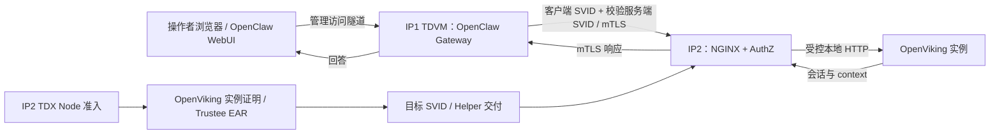

# Argus：可信通信与会话读写 E2E 演示

编制日期：2026-09-09。依据远程分支 `feat/argus-spiffe-v2-val` 的报告提交 `7696a7c` 及当前实现。本文是演示执行手册，尚未在公司主机执行，也没有新增真实截图。

## 1. 本次展示什么

演示主线：**OpenViking 所在节点和工作负载完成 TDX 准入后，OpenClaw 用独立 SPIFFE 身份通过 mTLS 调用它；用户在真实 WebUI 发出的消息进入 OpenViking，并可从对应 session/context 读回。**

| 环节 | 已有报告结论 | 演示口径 |
| --- | --- | --- |
| IP2 Node | TDX Node 认证 PASS | 沿用已有截图，保留证明时间、Agent ID 和策略 |
| IP2 OpenViking workload | PoC 策略的 Quote / EAR / 目标 SVID PASS | 展示具体运行实例与认证结果的关联 |
| IP1 OpenClaw | TDVM 内运行；x509pop Node 准入及 unix/docker workload selectors PASS | OpenClaw 的 TDX 远程证明为 NOT_RUN |
| 双端身份 | 两个精确 SPIFFE ID、mTLS 正向访问、错误身份 403 PASS | 身份双向认证；不是双方均已通过 TDX 证明 |
| 会话写入、已有 context 读取 | 真实 Gateway 链路 PASS | WebUI 发消息后补采同一 session 的写入和读回证据 |
| 归档 | 至少一次 completed，另一次 timeout | 作为已有证据；不把所有归档任务说成成功 |
| 新会话长期记忆召回 | FAIL：`memories_extracted={}`，正向回答 UNKNOWN | 不作为本次演示的成功条件，保留原联合验收 FAIL 结论 |
| WebUI 操作和截图 | 新报告未提供 | 本次待补验 |

`tcb_status=OutOfDate` 是公开展示的环境条件。IP2 Workload 使用 `argus-workload-openviking-v1-poc-ignore-tcb`；严格要求 `UpToDate` 的策略仍为 BLOCKED。PoC 策略并未取消 Quote 验证及运行实例绑定。



浏览器到 Gateway 是管理连接。SPIFFE mTLS 发生在 OpenClaw 插件到 IP2 NGINX；NGINX 使用与受验证 OpenViking 实例绑定的目标 SVID。Python 服务本身不是这里的 TLS 终点。

## 2. Workload 认证如何在日志里体现

不要只截 `workload EAR accepted`。建议同屏展示以下四类**真实日志**和实例摘要。下面是源码字段模板，不是已采集的运行输出；占位符不能用于验收截图。

```text
workload subscription launch_id=<L> container_id=<C> pid=<P> policy=<POLICY>
fresh workload TDX Quote generated ... launch_id=<L> pid=<P> nonce=<N>
workload EAR accepted launch_id=<L> nonce=<N> policy=<POLICY> ear_sha256=<HASH>
target SVID published serial=<DECIMAL_SERIAL> expires=<TIME>; certificate update is not a new Quote
```

| 日志及位置 | 能证明什么 | 如何关联 |
| --- | --- | --- |
| `workload subscription`，`argus-helper` | Helper 为受保护登记的具体 workload PID 发起 Broker 订阅 | `launch_id`、容器 ID、PID、policy 对齐当前登记 |
| `fresh workload TDX Quote generated`，`argus-tdx-provider` | Provider 为此次请求生成 Quote，生成前后目标检查一致 | `launch_id`、PID、nonce |
| `workload EAR accepted`，`argus-workload-agent` 的插件日志 | 已校验 Trustee 签名、有效期、issuer/profile、策略、affirming 和 REPORTDATA/runtime-data 绑定 | 同一 `launch_id`、nonce、policy；保留 EAR SHA-256 |
| `target SVID published`，`argus-helper` | 订阅得到的目标 SVID 已发布到业务凭据位置 | 对齐业务请求的 `server_serial` |

EAR 日志出现在插件返回 selectors 之前；插件之后还会再次检查目标实例。所以 **EAR accepted + 实例检查 + 目标 SVID 实际发布/使用** 才构成完整的准入证据。只看到 Quote 生成或一条 EAR 日志不够。

只展示 Entry 中的 `verified:true` 也不够：Entry 是匹配规则，不能代替该实例实际获得 selectors 和目标 SVID 的证据。镜像及配置 digest 从受保护登记和批准基线读取，不从展示脚本自行写成固定“通过”值。

日志关联需要注意两点：

- Helper 的 `serial` 为十进制，Node.js transport 的 `server_serial` 为十六进制。比较前统一进制，例如 `int(helper_serial, 10) == int(transport_serial, 16)`。
- 认证、轮换和聊天发生在不同时间。选择该实例的实际准入日志，再展示同一存活实例当前订阅中的 SVID 发布及请求；不能声称每发一条消息都会重新生成 Quote。日志中的 `certificate update is not a new Quote` 应保留。

## 3. IP2 的取证窗口

以下是 Linux 主机操作命令，需在 IP2 执行。先只读取已有状态与日志。报告中的 PID、序列号和有效期都是历史快照，不作为当前值硬编码。

```bash
# 输出的是实例登记检查，不会启动或重新登记容器。
sudo /opt/argus-workload/bin/argus-workload -action check

sudo systemctl is-active argus-authz argus-helper argus-nginx \
  argus-tdx-provider argus-workload-agent

# 查看本次基线建立后的认证和证书发布日志，保留 UTC 时间。
sudo journalctl --utc --no-pager -o short-iso-precise \
  --since '2026-09-07 00:00:00 UTC' \
  -u argus-tdx-provider -u argus-workload-agent -u argus-helper \
  | rg 'workload subscription|fresh workload TDX Quote generated|workload EAR accepted|target SVID published'

# 仅查看公开证书；不要读取 key.pem。
sudo openssl x509 -in /run/argus-credentials/current/svid.pem \
  -noout -serial -dates -ext subjectAltName
```

若没有 `rg`，可使用 `grep -E` 过滤同样的固定日志标记。合并 journal 的显示先后可能受插件日志转发影响，以 nonce/launch_id 和同一订阅周期关联，不仅凭相邻行。

截图时选取**一个完整的准入周期**，而非大量轮换行。若证书已轮换，另取业务请求附近那次 SVID 发布；若读取“当前证书”时又轮换，以请求实际 `server_serial` 和历史发布记录关联，不判成认证失败。

如果 journal 已轮转，先找报告证据中的 `ip2-verify-helper-75509ed.txt` 及 `/var/log/argus-workload/last-verify-journal.log`。后者是既有 `workload.py verify` 的输出位置，可能不存在；找不到就标记证据缺失，不补造日志。

不要为了截图直接执行 `start`、`register`、Helper 重启或 OpenViking 重启。新 Broker 订阅可以触发 fresh workload appraisal，但这是单独的重认证演练，可能中断凭据交付。当前演示可使用真实历史准入记录加当前实例/请求的连续证据，并明确标注时间。

现有 `workload.py verify` 会使用配置中的旧探针客户端证书。该临时客户端在后续 OpenClaw 验收中已被替代，不能直接照旧执行；本次使用真实 Guest 内的 OpenClaw SVID 发业务请求。

## 4. WebUI 接入与演示动作

### 4.1 先补浏览器可达性

OpenClaw 官方 Control UI 由 Gateway 提供，默认端口为 `18789`，同端口承载 WebSocket。公司实例是 OpenClaw `2026.7.1`，实际端口、认证和页面行为应以这个已安装版本为准。[官方 Control UI 文档](https://docs.openclaw.ai/web/control-ui)

当前部署模板指定 `--bind loopback`，Compose 没有发布端口。如果实际实例沿用此配置，Gateway 监听的是**容器内部** loopback；只把 SSH 隧道指向 Guest 的 `127.0.0.1:18789` 不会自动接入这个容器。

由 IP1 操作者先检查实际容器端口映射和网络命名空间中的监听，不输出完整环境变量、Gateway token 或 API key。优先复用已有 WebUI 通道；缺少通道时，准备经 SSH 访问的 Guest 本地转发，正确到达容器内 Gateway，尽量保留当前 Gateway 进程。转发方案要按现场网络配置确定，不能把普通宿主机转发命令套用到容器 loopback。

保留 Gateway 的现有认证和所需设备配对。如果确需更改监听并重建 Gateway，应作为演示前的一次受控配置调整，重新检查实际 Gateway PID、严格登记和凭据就绪后再验收。不要把 Gateway 的配置调整与 IP2 TDX 基线变更混在一起。

已知 Guest SSH 入口是 **IP1 的 `127.0.0.1:2224`**。完成转发后交付实际浏览器 URL、隧道命令、必要的本地认证步骤；截图中隐藏 token 和私钥信息。

### 4.2 一次演示只用一个新标记

在准备机器生成一个随机演示标记，例如 `ARGUS_DEMO_<随机十六进制>`。在 WebUI 新开一个会话，输入：

> 本次演示编号为 `<本次随机标记>`，主题是可信知识助手。请用一句话确认收到这条消息。

此时必须是浏览器点击发送，保留真实页面及回答。随后从 **Gateway 容器日志** 找到这次会话的 transport 回执；不要用另一个 CLI 发送的消息充当 WebUI 写入。

待实际插件写入后，通过 Guest 内相同插件的 native mTLS transport 读取 OpenViking session/context，确认返回正文确实包含完整随机标记，并保存真实 OpenViking session ID。不能只拿模型回复或 HTTP 200 判定内容已入库。

如果演示“已有 context 读取”，让右侧终端展示该 session/context 的返回；如果希望由模型在 WebUI 内解释 OpenViking 的已有内容，则还需确认当前插件确实读取并注入对应内容，并保留 Gateway 的读取/注入证据。不要向提示词直接提供预期答案，也不要用同一聊天历史里的答案代替 OpenViking 读取证明。叶级长期记忆注入尚未通过，不把这一步写成必然成功。

### 4.3 业务回执需要哪些字段

当前 native transport 已向 stderr 输出以下真实字段，无需新增“成功”日志：

```text
component=argus-openclaw-spiffe
request_id, method, path, client_spiffe_id, server_spiffe_id,
client_serial, server_serial, generation, http_status, checked_at
```

预期身份必须精确匹配：

```text
client_spiffe_id = spiffe://argus.local/agent/openclaw
server_spiffe_id = spiffe://argus.local/service/openviking-cmem
```

写入使用 `POST /api/v1/sessions/<实际 session ID>/messages` 的 Gateway 回执；读回使用同一 session 的 `/context` 请求及正文。写入和读取有各自的 request ID，通过 session ID、演示标记和时间窗关联，不要求两个请求的 request ID 相同。

在 Guest 上可复用已有的写入审计工具：

```bash
# DEMO_SINCE 为浏览器发送前记录的 UTC 时间；OV_SESSION 来自标记读回结果。
# OPENCLAW_CONTAINER 为现场实际容器名；EVIDENCE_DIR 为本次专用证据目录。
umask 077
mkdir -p "$EVIDENCE_DIR"
KIT=/root/argus-stage2-84a735da/agent-cc
sudo docker logs --since "$DEMO_SINCE" "$OPENCLAW_CONTAINER" \
  > "$EVIDENCE_DIR/gateway-write.log" 2>&1
python3 "$KIT/adapters/OpenClaw/spiffe_client/verify_audit.py" "$OV_SESSION" \
  < "$EVIDENCE_DIR/gateway-write.log" > "$EVIDENCE_DIR/write-mtls.json"
```

取证前应确认变量均已赋值、目录独立且访问权限受限，API key 通过现有受保护配置加载，不在屏幕打印。工具只验证日志匹配；随机标记在正文中的读回仍需单独核验。

只读 native transport 入口是插件安装目录下的 `dist/argus-spiffe/cli.mjs request <GET_PATH>`。可复用 `scripts/openclaw_spiffe_common.sh` 的 `oc` 与 `resolve_spiffe_plugin` 定位已安装插件，并使用既有非 root OpenViking 用户凭据。不要临时换成 root key，也不要执行完整 E2E 验收脚本来替代手动 WebUI 发送；完整脚本还包含 commit 与长期召回测试。

NGINX 当前模板的 access log 是普通格式，没有记录 request ID 和双方 SPIFFE ID，AuthZ 也没有逐请求身份日志。因此不能要求“现成的 NGINX 日志”展示不存在的字段。第一轮截图用 Gateway 的结构化回执、目标 SVID 和真实读回即可。若以后需要服务端按 request ID 对照，可另加 JSON access log，记录收到的 request ID、客户端证书验证结果/serial、URI、状态码和时间；不记录 token、请求正文，也不虚构 NGINX 的 SPIFFE SAN 变量。

## 5. 建议的截图和讲述顺序

| 截图 | 画面内容 | 讲述重点 |
| --- | --- | --- |
| 01-node.png | 用户已有 Node 认证截图，注明原时间、IP2 Agent ID、策略 | 先准入节点；客户端 OpenClaw 的 x509pop 另行标注 |
| 02-workload.png | 目标实例摘要 + 同一 launch/nonce 的 Quote/EAR + SVID 发布 | 进一步认证具体 OpenViking 实例；标明 OutOfDate PoC |
| 03-webui-write.png | 左侧真实 WebUI 消息及回答；右侧对应 Gateway POST 回执 | 浏览器触发真实写入；双端精确身份、HTTP 成功 |
| 04-context-readback.png | 同一 OpenViking session/context 返回标记；旁边 GET 回执 | 同一条消息已进入 OpenViking，能够经 mTLS 读取 |
| 05-denied.png（可选） | 已验收的有效错误身份请求及 HTTP 403 | 同一 CA 签发并不等于被允许访问 |

每张图附一句简短说明，含实际时间和证据文件名。截图 03/04 不要求安装一个额外的 OpenViking 管理 UI；真实 OpenClaw 页面加可读的 JSON/终端回执足以呈现链路。若缺乏有效错误身份凭据，05 使用已保存证据并注明时间，不把过期证书的 TLS 失败写成 AuthZ 403。

先用约两分钟解释 Node/Workload 准入，然后现场用两分钟完成一次 WebUI 写入和 context 读回，最后展示身份拒绝证据。归档和 360 秒轮换用报告附图补充，不放在现场关键路径。

## 6. 可直接交给两台主机的 Prompt

### IP1：WebUI、真实消息、客户端回执

```text
准备 Argus 的“可信通信与会话读写 E2E”演示。先读取远程 feat/argus-spiffe-v2-val 的 7696a7c 报告 documents_ly/argus-openclaw-ip1-tdvm-client-acceptance-20260909.md 和本演示手册。检查工作区后 fetch，保持现场已验收部署；IP1 实际运行版本为本地未推送 84a735da，不能用远程 b57f521 覆盖它。

沿用现有独立 TDVM argus-openclaw-stage2-b57f5210（报告 SSH 为 IP1 127.0.0.1:2224），实际状态重新读取。OpenClaw 暂不执行 TDX 远程证明，保留 x509pop、严格 unix/docker selectors、Broker/lease 和现有两端 mTLS。IP2 的 OpenViking 实例保持稳定。

先检查当前 Gateway 的真实 PID、配置、容器网络命名空间监听和端口映射。交付可访问真实 OpenClaw Control UI 的本地 URL 和准确隧道命令；注意容器内部 loopback 不能通过指向 Guest loopback 的普通转发自动到达。保留认证/设备配对，不输出 token/API key。尽量保留当前 Gateway 进程；若必须重建，完成实际 PID 的严格重新登记和身份恢复后再继续。

在实际浏览器上新建会话，发送一个新生成的随机 ARGUS_DEMO 标记，截取用户消息与回答。操作环境没有浏览器时，先完成访问准备，把 URL/操作步骤交给我；将 WebUI 截图标为 NOT_RUN，不用 CLI 发送代替浏览器发送。

从真实 Gateway 日志提取这个 session 的 POST /messages native mTLS 回执，再经已安装插件的相同 native transport 读取 OpenViking session/context，确认正文包含同一随机标记。保留 session ID、写/读各自 request ID、双端 SPIFFE ID、双端 serial、generation、HTTP 状态、UTC 时间和正文匹配结果。可复用 verify_audit.py 校验 Gateway 写回执；API key 使用现有非 root 用户凭据。不要把一次 HTTP 200 或模型确认当作已入库证据。

输出 03-webui-write.png、04-context-readback.png（真实可采集时）、原始日志/读回 JSON、SHA256SUMS、分项 PASS/FAIL/BLOCKED/NOT_RUN 报告，并把用于关联的非敏感摘要交给 IP2 操作者。已有 context 读取与新会话长期记忆召回分开报告，后者现有 FAIL 不变。本轮不执行完整长期记忆验收、批量 commit 或故障注入。
```

### IP2：Workload 日志、服务端证书关联

```text
为 Argus E2E 演示采集 IP2 的 Workload 认证证据。先读取 documents_ly/argus-openviking-workload-attestation-status-20260909.md、argus-openclaw-ip1-tdvm-client-acceptance-20260909.md 和本演示手册。

本轮先只读检查现有 OpenViking、argus-tdx-provider、argus-workload-agent、argus-helper、argus-nginx、argus-authz。保持现有容器、TC API/TruCon 测量基线、策略、Entry 和进程稳定，不为截图重新 launch、登记或重启。读取实际受保护 target 登记，不把报告中的 PID、serial 当成当前值。

从 journal 和既有证据中定位同一实例的 workload subscription、fresh workload TDX Quote generated、workload EAR accepted、target SVID published。用 launch_id、PID、nonce、policy 关联，记录容器 ID、image/config digest 和 EAR SHA-256。PoC policy 为 argus-workload-openviking-v1-poc-ignore-tcb；明确标注 tcb_status=OutOfDate、严格策略 BLOCKED。

接收 IP1 的实际 mTLS 请求摘要，将其 server_serial 与该实例对应的 SVID 发布记录关联：Helper serial 是十进制，客户端日志 serial 是十六进制，先统一进制；如发生轮换，按请求时间和实际 serial 找对应发布，不能仅比较事后当前证书。保留 URI SAN spiffe://argus.local/service/openviking-cmem。

制作 02-workload.png：实例摘要、Quote/EAR 关联、目标 SVID 发布和业务 serial 对应关系。所有展示值来自原始输出，保留证据时间；历史准入证据必须注明历史时间，并附当前同一实例检查。找不到对应日志时报告证据缺失，不自行打印“认证成功”或触发新的重认证冒充连续证据。

NGINX 当前默认 access log 未记录 request ID/SPIFFE ID，不能假定存在这些字段。保留现有访问日志作辅助，主要与 IP1 native transport 回执及 SVID 发布关联。不会因为一次普通证书轮换而宣称获得新 Quote。无需重用旧的临时探针客户端证书，也不做 helper-crash/target-exit。

输出原始日志片段、当前实例检查、公开证书摘要、02-workload.png（具备截图能力时）、SHA256SUMS、分项 PASS/FAIL/BLOCKED/NOT_RUN 报告及证据路径。对外展示使用的内容只保留演示数据，不包含私钥、API key、Gateway token 或无关对话。
```

## 7. 版本与证据索引

- 新报告：[OpenClaw IP1 TDVM 验收](argus-openclaw-ip1-tdvm-client-acceptance-20260909.md)。公司运行代码为 `84a735da834f5c2396e34e5efc452635c90283b2`，报告注明尚未推送；其 GET 瞬时断连重试修复不能假定已包含在远程报告提交里。
- 服务端基线：[OpenViking Workload 验收](argus-openviking-workload-attestation-status-20260909.md)。Node policy 的报告有效窗口止于 `2026-09-10T07:00:00Z`；若演示包含新的 Node 证明，应先核查现场策略有效期，历史截图注明原时间。
- IP1 新证据根：`/root/argus-ip1-openclaw/20260909T144253+0800-ip1-openclaw-client/`。
- IP1 原 Workload 证据根：`/root/.copilot/session-state/ada7d94c-d335-4314-8cbf-0bf403447a00/files/20260907T125754+0800-ip1-workload-attestation/`。
- 已完成归档 session：`7e3b3bfe-ce2a-46f0-9f2b-b341ea588668`；task：`163b22d8-dc1b-4789-b0ab-ec4bb4501b2b`。只作已有 context 读取的候选；本次 WebUI 写入使用新标记并读取实际新 session。
- 日志实现：[Quote 生成](../cczoo/agent-cc/core/argus/src/bin/tdx_evidence_provider.rs)、[EAR 校验](../cczoo/agent-cc/core/spire/plugins/argus-tdx-workloadattestor/internal/trustee/client.go)、[Helper 订阅与 SVID 发布](../cczoo/agent-cc/core/spire/helpers/spiffe-helper/pkg/broker/run.go)、[Gateway mTLS 回执](../cczoo/agent-cc/adapters/OpenClaw/spiffe_client/lib/transport.mjs)。
- 现有交叉检查：[Workload verify](../cczoo/agent-cc/core/spire/workload/scripts/workload.py)、[Gateway 写入回执校验](../cczoo/agent-cc/adapters/OpenClaw/spiffe_client/verify_audit.py)。

本地本次交付仅增加演示手册，未更改运行代码或公司服务。真实 WebUI 截图、现场日志取证和本次演示验收仍待主机执行。
