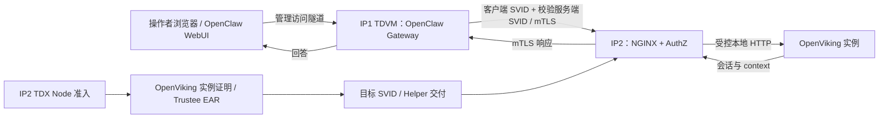

# Argus：E2E 演示环境准备与用户操作手册

编制日期：2026-09-09。依据远程分支 `feat/argus-spiffe-v2-val` 的报告提交 `7696a7c` 及当前实现。公司主机上的 Agent 负责准备可使用的环境、验证基础连接并交付操作说明；用户随后自行通过 WebUI 操作。本文尚未在公司主机执行。

**本轮交付目标：用户拿到明确的访问地址、连接命令和日志查看方法，即可自己打开 WebUI、发送消息、观察 OpenViking 联通情况。Agent 不代用户发演示消息，不自动截图，不要求用户先完成演示才算环境准备完成。**

## 1. 本次展示什么

演示主线：**OpenViking 所在节点和工作负载完成 TDX 准入后，OpenClaw 用独立 SPIFFE 身份通过 mTLS 调用它；用户在真实 WebUI 发出的消息进入 OpenViking，并可从对应 session/context 读回。**

| 环节 | 已有报告结论 | 演示口径 |
| --- | --- | --- |
| IP2 Node | TDX Node 认证 PASS | 沿用已有截图，保留证明时间、Agent ID 和策略 |
| IP2 OpenViking workload | PoC 策略的 Quote / EAR / 目标 SVID PASS | 展示具体运行实例与认证结果的关联 |
| IP1 OpenClaw | TDVM 内运行；x509pop Node 准入及 unix/docker workload selectors PASS | OpenClaw 的 TDX 远程证明为 NOT_RUN |
| 双端身份 | 两个精确 SPIFFE ID、mTLS 正向访问、错误身份 403 PASS | 身份双向认证；不是双方均已通过 TDX 证明 |
| 会话写入、已有 context 读取 | 真实 Gateway 链路 PASS | 准备好日志与查询入口，供用户发消息后自行查看 |
| 归档 | 至少一次 completed，另一次 timeout | 作为已有证据；不把所有归档任务说成成功 |
| 新会话长期记忆召回 | FAIL：`memories_extracted={}`，正向回答 UNKNOWN | 不作为本次演示的成功条件，保留原联合验收 FAIL 结论 |
| WebUI 接入 | 新报告未提供 | 本次准备并验证访问通道；实际聊天由用户操作 |

`tcb_status=OutOfDate` 是公开展示的环境条件。IP2 Workload 使用 `argus-workload-openviking-v1-poc-ignore-tcb`；严格要求 `UpToDate` 的策略仍为 BLOCKED。PoC 策略并未取消 Quote 验证及运行实例绑定。



浏览器到 Gateway 是管理连接。SPIFFE mTLS 发生在 OpenClaw 插件到 IP2 NGINX；NGINX 使用与受验证 OpenViking 实例绑定的目标 SVID。Python 服务本身不是这里的 TLS 终点。

## 2. Workload 认证如何在日志里体现

准备可以查看以下四类**真实日志**和实例摘要的终端入口。用户据此理解 Workload 认证，是否截图由用户决定。下面是源码字段模板，不是已采集的运行输出。

```text
workload subscription launch_id=<L> container_id=<C> pid=<P> policy=<POLICY>
fresh workload TDX Quote generated ... launch_id=<L> pid=<P> nonce=<N>
workload EAR accepted launch_id=<L> nonce=<N> policy=<POLICY> ear_sha256=<HASH>
target SVID published serial=<DECIMAL_SERIAL> expires=<TIME>; certificate update is not a new Quote
```

| 日志及位置 | 能证明什么 | 如何关联 |
| --- | --- | --- |
| `workload subscription`，`argus-helper` | Helper 为受保护登记的具体 workload PID 发起 Broker 订阅 | `launch_id`、容器 ID、PID、policy 对齐当前登记 |
| `fresh workload TDX Quote generated`，`argus-tdx-provider` | Provider 为此次请求生成 Quote，生成前后目标检查一致 | `launch_id`、PID、nonce |
| `workload EAR accepted`，`argus-workload-agent` 的插件日志 | 已校验 Trustee 签名、有效期、issuer/profile、策略、affirming 和 REPORTDATA/runtime-data 绑定 | 同一 `launch_id`、nonce、policy；保留 EAR SHA-256 |
| `target SVID published`，`argus-helper` | 订阅得到的目标 SVID 已发布到业务凭据位置 | 对齐业务请求的 `server_serial` |

EAR 日志出现在插件返回 selectors 之前；插件之后还会再次检查目标实例。所以 **EAR accepted + 实例检查 + 目标 SVID 实际发布/使用** 才构成完整的准入证据。只看到 Quote 生成或一条 EAR 日志不够。

只展示 Entry 中的 `verified:true` 也不够：Entry 是匹配规则，不能代替该实例实际获得 selectors 和目标 SVID 的证据。镜像及配置 digest 从受保护登记和批准基线读取，不从展示脚本自行写成固定“通过”值。

日志关联需要注意两点：

- Helper 的 `serial` 为十进制，Node.js transport 的 `server_serial` 为十六进制。比较前统一进制，例如 `int(helper_serial, 10) == int(transport_serial, 16)`。
- 认证、轮换和聊天发生在不同时间。选择该实例的实际准入日志，再展示同一存活实例当前订阅中的 SVID 发布及请求；不能声称每发一条消息都会重新生成 Quote。日志中的 `certificate update is not a new Quote` 应保留。

## 3. IP2 的运行状态与日志查看入口

已补充终端入口 `cczoo/agent-cc/core/spire/workload/scripts/watch-attestation.py`。在 IP2 的更新后仓库根目录运行：

```bash
sudo python3 cczoo/agent-cc/core/spire/workload/scripts/watch-attestation.py \
  --since '2026-09-07 00:00:00 UTC'
```

它将真实事件打印为 `[INSTANCE]`、`[QUOTE]`、`[EAR]`、`[SVID]` 和错误标签，保留原始时间、unit 和消息字段；先显示已有记录，再持续跟随新记录。按 `Ctrl+C` 退出，追加 `--no-follow` 则打印后退出。已安装此脚本时也可使用 `/opt/argus-workload/scripts/watch-attestation.py`；现有部署可直接从仓库运行，无需重跑安装。该命令只读日志，不触发认证，也不替用户发消息。

以下是 Linux 主机操作命令，需在 IP2 执行。先只读取已有状态与日志。报告中的 PID、序列号和有效期都是历史快照，不作为当前值硬编码。

```bash
# 输出的是实例登记检查，不会启动或重新登记容器。
sudo /opt/argus-workload/bin/argus-workload -action check

sudo systemctl is-active argus-authz argus-helper argus-nginx \
  argus-tdx-provider argus-workload-agent

# 查看本次基线建立后的认证和证书发布日志，保留 UTC 时间。
sudo journalctl --utc --no-pager -o short-iso-precise \
  --since '2026-09-07 00:00:00 UTC' \
  -u argus-tdx-provider -u argus-workload-agent -u argus-helper \
  | rg 'workload subscription|fresh workload TDX Quote generated|workload EAR accepted|target SVID published'

# 仅查看公开证书；不要读取 key.pem。
sudo openssl x509 -in /run/argus-credentials/current/svid.pem \
  -noout -serial -dates -ext subjectAltName
```

若没有 `rg`，可使用 `grep -E` 过滤同样的固定日志标记。合并 journal 的显示先后可能受插件日志转发影响，以 nonce/launch_id 和同一订阅周期关联，不仅凭相邻行。

准备阶段定位并保留**一个完整的准入周期**，供用户随时查看。若证书已轮换，查看业务请求附近那次 SVID 发布；若读取“当前证书”时又轮换，以请求实际 `server_serial` 和历史发布记录关联，不判成认证失败。

如果 journal 已轮转，先找报告证据中的 `ip2-verify-helper-75509ed.txt` 及 `/var/log/argus-workload/last-verify-journal.log`。后者是既有 `workload.py verify` 的输出位置，可能不存在；找不到就标记证据缺失，不补造日志。

准备日志入口时不需要执行 `start`、`register`、Helper 重启或 OpenViking 重启。新 Broker 订阅可以触发 fresh workload appraisal，但这是单独的重认证演练，可能中断凭据交付。可使用真实历史准入记录加当前实例/请求的连续证据，并明确标注时间。

现有 `workload.py verify` 会使用配置中的旧探针客户端证书。该临时客户端在后续 OpenClaw 验收中已被替代，不能直接照旧执行；本次使用真实 Guest 内的 OpenClaw SVID 发业务请求。

## 4. WebUI 接入准备与用户手动操作

### 4.1 先补浏览器可达性

OpenClaw 官方 Control UI 由 Gateway 提供，默认端口为 `18789`，同端口承载 WebSocket。公司实例是 OpenClaw `2026.7.1`，实际端口、认证和页面行为应以这个已安装版本为准。[官方 Control UI 文档](https://docs.openclaw.ai/web/control-ui)

当前部署模板指定 `--bind loopback`，Compose 没有发布端口。如果实际实例沿用此配置，Gateway 监听的是**容器内部** loopback；只把 SSH 隧道指向 Guest 的 `127.0.0.1:18789` 不会自动接入这个容器。

由 IP1 操作者先检查实际容器端口映射和网络命名空间中的监听，不输出完整环境变量、Gateway token 或 API key。优先复用已有 WebUI 通道；缺少通道时，准备经 SSH 访问的 Guest 本地转发，正确到达容器内 Gateway，尽量保留当前 Gateway 进程。转发方案要按现场网络配置确定，不能把普通宿主机转发命令套用到容器 loopback。

保留 Gateway 的现有认证和所需设备配对。如果确需更改监听并重建 Gateway，应作为演示前的一次受控配置调整，重新检查实际 Gateway PID、严格登记和凭据就绪后再验收。不要把 Gateway 的配置调整与 IP2 TDX 基线变更混在一起。

已知 Guest SSH 入口是 **IP1 的 `127.0.0.1:2224`**。完成转发后交付实际浏览器 URL、用户本机执行的准确隧道命令、必要的本地认证步骤，以及断开后如何恢复。认证材料通过现有受保护位置获取，不把 token 写入公开操作说明。

准备阶段可检查静态页面与资源是否可达、Gateway 是否健康、插件配置与凭据是否就绪，并通过 native mTLS transport 读取一个已有 session/context。若无法从用户电脑验证访问，明确区分已验证的主机侧通道与等待用户验证的最后一跳，不据此代用户操作聊天。

### 4.2 用户接手后自行操作

以下步骤由用户在环境准备完成后执行，不是交给主机 Agent 的自动演示任务。

用户先按交付说明打开 WebUI 和日志窗口，再自由选择会话与消息。若希望容易在日志和 context 中定位，可以自行加入一个本次唯一的标记，例如 `ARGUS_DEMO_<随机十六进制>`。可选的示例消息是：

> 本次演示编号为 `<本次随机标记>`，主题是可信知识助手。请用一句话确认收到这条消息。

用户在浏览器点击发送后，观察页面回答及 **Gateway 容器日志** 中的 transport 回执。准备阶段只需提供可直接运行的实时日志命令，不预先代发这条消息。

待实际插件写入后，用户按交付的查询方法，通过 Guest 内相同插件的 native mTLS transport 读取对应 OpenViking session/context。查看返回正文中是否存在自己刚发的内容，使用标记时检查完整标记。不能只拿模型回复或 HTTP 200 判定内容已入库。

如果演示“已有 context 读取”，让右侧终端展示该 session/context 的返回；如果希望由模型在 WebUI 内解释 OpenViking 的已有内容，则还需确认当前插件确实读取并注入对应内容，并保留 Gateway 的读取/注入证据。不要向提示词直接提供预期答案，也不要用同一聊天历史里的答案代替 OpenViking 读取证明。叶级长期记忆注入尚未通过，不把这一步写成必然成功。

### 4.3 业务回执需要哪些字段

当前 native transport 已向 stderr 输出以下真实字段，无需新增“成功”日志：

```text
component=argus-openclaw-spiffe
request_id, method, path, client_spiffe_id, server_spiffe_id,
client_serial, server_serial, generation, http_status, checked_at
```

预期身份必须精确匹配：

```text
client_spiffe_id = spiffe://argus.local/agent/openclaw
server_spiffe_id = spiffe://argus.local/service/openviking-cmem
```

写入使用 `POST /api/v1/sessions/<实际 session ID>/messages` 的 Gateway 回执；读回使用同一 session 的 `/context` 请求及正文。写入和读取有各自的 request ID，通过 session ID、演示标记和时间窗关联，不要求两个请求的 request ID 相同。

用户需要核对某次写入时，可在 Guest 上复用已有的写入审计工具。以下操作发生在用户手动发送之后，不是环境准备的完成条件：

```bash
# DEMO_SINCE 为浏览器发送前记录的 UTC 时间；OV_SESSION 来自标记读回结果。
# OPENCLAW_CONTAINER 为现场实际容器名；EVIDENCE_DIR 为本次专用证据目录。
umask 077
mkdir -p "$EVIDENCE_DIR"
KIT=/root/argus-stage2-84a735da/agent-cc
sudo docker logs --since "$DEMO_SINCE" "$OPENCLAW_CONTAINER" \
  > "$EVIDENCE_DIR/gateway-write.log" 2>&1
python3 "$KIT/adapters/OpenClaw/spiffe_client/verify_audit.py" "$OV_SESSION" \
  < "$EVIDENCE_DIR/gateway-write.log" > "$EVIDENCE_DIR/write-mtls.json"
```

取证前应确认变量均已赋值、目录独立且访问权限受限，API key 通过现有受保护配置加载，不在屏幕打印。工具只验证日志匹配；随机标记在正文中的读回仍需单独核验。

只读 native transport 入口是插件安装目录下的 `dist/argus-spiffe/cli.mjs request <GET_PATH>`。可复用 `scripts/openclaw_spiffe_common.sh` 的 `oc` 与 `resolve_spiffe_plugin` 定位已安装插件，并使用既有非 root OpenViking 用户凭据。不要临时换成 root key，也不要执行完整 E2E 验收脚本来替代手动 WebUI 发送；完整脚本还包含 commit 与长期召回测试。

NGINX 当前模板的 access log 是普通格式，没有记录 request ID 和双方 SPIFFE ID，AuthZ 也没有逐请求身份日志。因此不能要求“现成的 NGINX 日志”展示不存在的字段。当前先提供 Gateway 的结构化回执、目标 SVID 和真实读回的查看入口。若以后需要服务端按 request ID 对照，可另加 JSON access log，记录收到的 request ID、客户端证书验证结果/serial、URI、状态码和时间；不记录 token、请求正文，也不虚构 NGINX 的 SPIFFE SAN 变量。

## 5. 环境准备完成后交给用户什么

| 交付项 | 应交付的具体内容 | 准备完成标准 |
| --- | --- | --- |
| WebUI 入口 | 用户本机连接命令、完整浏览器 URL、登录/配对步骤、关闭与恢复方法 | 主机侧页面和 Gateway 通道已检查；用户电脑最后一跳若未验证则单列 |
| Workload 查看入口 | 查看已有关联认证日志的命令或文件，以及查看当前状态和 SVID 的命令 | 能定位实例、Quote/EAR、目标证书，并解释关联字段 |
| 实时请求日志 | 按现场容器名配置好的命令，说明在哪台机器执行及如何退出 | 用户启动后可看到后续 Gateway mTLS 回执；不要求预先生成演示消息 |
| OpenViking 查询入口 | 查询 session 列表、读取指定 session/context 的准确命令 | 用一个已有 session 完成只读检查；身份仍来自 Guest 内实际 SVID |
| 简短使用说明 | 按“连接 → 打开页面 → 查看日志 → 发消息 → 查询 context”排列 | 用户无需再自行推断端口、容器名、插件路径或如何加载凭据 |

操作说明中的地址、容器名和路径由现场检查填写。session ID 属于每次操作产生的值，可以作为明确命名的参数，并说明如何从请求日志或 session 列表找到；不要要求用户重新排查整个部署。

用户接手后的顺序：

1. 在自己的电脑启动访问隧道，打开 WebUI，按说明登录。
2. 打开准备好的 Workload 状态窗口和 Gateway 实时请求日志窗口。
3. 自己在 WebUI 中发消息，观察模型回答和 POST/GET 回执。
4. 使用查询入口查看对应的 OpenViking session/context，核对刚发送的内容。
5. 如需演示留图，自行选择页面和日志画面截图。

本轮基础就绪不以用户聊天、截图或新的长期记忆召回成功为前提。用户可按自己的节奏开始、暂停或重复操作。

## 6. 可直接交给两台主机的 Prompt

### IP1：准备 WebUI 访问与用户操作入口

```text
为我准备 Argus 的手动 E2E 演示环境：你负责把基础配置好、验证基础连接并告诉我准确操作方法；我随后自己在 WebUI 发消息和操作。不要代我发送演示消息，不要自动截图，也不要等待我完成聊天才结束环境准备任务。

先读取远程 feat/argus-spiffe-v2-val 的报告 documents_ly/argus-openclaw-ip1-tdvm-client-acceptance-20260909.md 和本演示手册。检查工作区后 fetch，保持现场已验收部署；报告中 IP1 实际运行版本为本地未推送 84a735da，先核查当前状态，不能用远程旧代码覆盖它。

沿用现有独立 TDVM argus-openclaw-stage2-b57f5210（报告 SSH 为 IP1 127.0.0.1:2224），实际状态重新读取。OpenClaw 暂不执行 TDX 远程证明，保留 x509pop、严格 unix/docker selectors、Broker/lease 和现有两端 mTLS。IP2 的 OpenViking 实例保持稳定。

先检查当前 Gateway 的真实 PID、配置、容器网络命名空间监听和端口映射。交付可访问真实 OpenClaw Control UI 的本地 URL 和准确隧道命令；注意容器内部 loopback 不能通过指向 Guest loopback 的普通转发自动到达。保留认证/设备配对，不输出 token/API key。尽量保留当前 Gateway 进程；若必须重建，完成实际 PID 的严格重新登记和身份恢复后再继续。

完成 WebUI 通道后，检查页面和静态资源可达、Gateway 健康、插件配置和身份凭据就绪。使用 Guest 内已安装插件的 native mTLS transport 做健康检查，并读取一个已有 OpenViking session/context；API key 使用现有非 root 用户凭据。此处只读验证已有链路，不新建演示会话、不发送聊天消息、不触发 commit/长期记忆提取。用户电脑到主机的最后一跳若无法代为验证，明确列出待我执行的连接检查。

准备一条可以直接运行的 Gateway 实时请求日志命令，使用实际容器名，说明执行位置和退出方法。让我之后发消息时能看见 method、path、request_id、双端 SPIFFE ID、双端 serial、generation、HTTP 状态和时间。再准备查询 OpenViking session 列表、读取指定 session/context 的命令或轻量脚本，自动复用现场插件路径和受保护凭据；说明如何找到我刚使用的 session ID。不要要求我自己排查容器网络、插件目录或身份配置。

最后交付一份简短的“用户操作说明”，依次写清：我在自己电脑运行什么连接命令、打开哪个完整 URL、如何登录/配对、在哪打开日志、在 WebUI 如何开始会话、发消息后如何查看对应 OpenViking context、断开后如何恢复。填写已经核实的地址、端口、路径和容器名，只有每次变化的 session ID 等保留为明确参数。

报告 WebUI 通道、Gateway 状态、凭据、mTLS、已有 context 只读检查和日志入口各项 PASS/FAIL/BLOCKED/NOT_RUN，并给出配置或脚本路径及待我操作的步骤。基础准备完成后即可交付，不自动执行我后续的 WebUI 操作或截图。已有 context 读取与长期记忆提取区分，后者原有 FAIL 不变。本轮不执行完整长期记忆验收、批量 commit 或故障注入。
```

### IP2：准备 Workload 状态与日志查看入口

```text
为我准备 Argus 手动 E2E 演示需要的 IP2 基础和日志查看入口。你负责确认服务可用、整理真实认证日志并告诉我如何查看；我随后自己通过 OpenClaw WebUI 操作。不要自动截图或触发演示业务，不需要等我发消息才交付。

先读取 documents_ly/argus-openviking-workload-attestation-status-20260909.md、argus-openclaw-ip1-tdvm-client-acceptance-20260909.md 和本演示手册。

本轮先只读检查现有 OpenViking、argus-tdx-provider、argus-workload-agent、argus-helper、argus-nginx、argus-authz。保持现有容器、TC API/TruCon 测量基线、策略、Entry 和进程稳定，不为生成展示日志重新 launch、登记或重启。读取实际受保护 target 登记，不把报告中的 PID、serial 当成当前值。

从 journal 和既有证据中定位同一实例的 workload subscription、fresh workload TDX Quote generated、workload EAR accepted、target SVID published。用 launch_id、PID、nonce、policy 关联，记录容器 ID、image/config digest 和 EAR SHA-256。PoC policy 为 argus-workload-openviking-v1-poc-ignore-tcb；明确标注 tcb_status=OutOfDate、严格策略 BLOCKED。

提供可重复运行的当前状态、已有认证日志和实时证书发布日志查看命令，说明每条命令在哪里运行、主要看哪些字段、怎样退出。优先使用仓库 core/spire/workload/scripts/watch-attestation.py 这一只读终端入口，确认现场路径后给我准确命令；不必为安装它重新部署认证栈。将已有认证日志定位到一个完整周期并保留原时间，附当前同一实例检查。找不到对应日志时报告缺失，不自行打印“认证成功”或触发新的重认证冒充连续证据。

在操作说明中写清如何把我之后看到的 IP1 mTLS 请求 server_serial 与 SVID 发布记录关联：Helper serial 是十进制，客户端日志 serial 是十六进制，先统一进制；如发生轮换，按请求时间和实际 serial 找对应发布，不能仅比较事后当前证书。保留 URI SAN spiffe://argus.local/service/openviking-cmem。若 IP1 的基础只读检查已有回执，可用它验证关联方法；不要等待我之后的 WebUI 消息，也不要把历史请求当成我的新操作。

NGINX 当前默认 access log 未记录 request ID/SPIFFE ID，不能假定存在这些字段。保留现有访问日志作辅助，主要与 IP1 native transport 回执及 SVID 发布关联。不会因为一次普通证书轮换而宣称获得新 Quote。无需重用旧的临时探针客户端证书，也不做 helper-crash/target-exit。

输出简短的“IP2 用户操作说明”：可直接复制的状态/历史认证/实时日志命令、必要的已验证脚本或日志文件路径、字段解释，以及各项基础检查 PASS/FAIL/BLOCKED/NOT_RUN。准备完成后交付给我，由我自行打开这些窗口、操作 WebUI 和决定是否截图。对外显示内容不包含私钥、API key、Gateway token 或无关对话。
```

## 7. 版本与证据索引

- 新报告：[OpenClaw IP1 TDVM 验收](argus-openclaw-ip1-tdvm-client-acceptance-20260909.md)。公司运行代码为 `84a735da834f5c2396e34e5efc452635c90283b2`，报告注明尚未推送；其 GET 瞬时断连重试修复不能假定已包含在远程报告提交里。
- 服务端基线：[OpenViking Workload 验收](argus-openviking-workload-attestation-status-20260909.md)。Node policy 的报告有效窗口止于 `2026-09-10T07:00:00Z`；若演示包含新的 Node 证明，应先核查现场策略有效期，历史截图注明原时间。
- IP1 新证据根：`/root/argus-ip1-openclaw/20260909T144253+0800-ip1-openclaw-client/`。
- IP1 原 Workload 证据根：`/root/.copilot/session-state/ada7d94c-d335-4314-8cbf-0bf403447a00/files/20260907T125754+0800-ip1-workload-attestation/`。
- 已完成归档 session：`7e3b3bfe-ce2a-46f0-9f2b-b341ea588668`；task：`163b22d8-dc1b-4789-b0ab-ec4bb4501b2b`。只作已有 context 读取的候选；本次 WebUI 写入使用新标记并读取实际新 session。
- 日志实现：[Quote 生成](../cczoo/agent-cc/core/argus/src/bin/spire_evidence_provider.rs)、[EAR 校验](../cczoo/agent-cc/core/spire/plugins/argus-tdx-workloadattestor/internal/trustee/client.go)、[Helper 订阅与 SVID 发布](../cczoo/agent-cc/core/spire/helpers/spiffe-helper/pkg/broker/run.go)、[Gateway mTLS 回执](../cczoo/agent-cc/adapters/OpenClaw/spiffe_client/lib/transport.mjs)。
- 现有交叉检查：[Workload verify](../cczoo/agent-cc/core/spire/workload/scripts/workload.py)、[Gateway 写入回执校验](../cczoo/agent-cc/adapters/OpenClaw/spiffe_client/verify_audit.py)。

本地本次交付为环境准备与用户操作手册，尚未执行公司主机配置。主机 Agent 完成基础准备并给出现场准确操作说明后，用户自行操作 WebUI；用户聊天和截图不属于主机 Agent 的自动执行任务。
