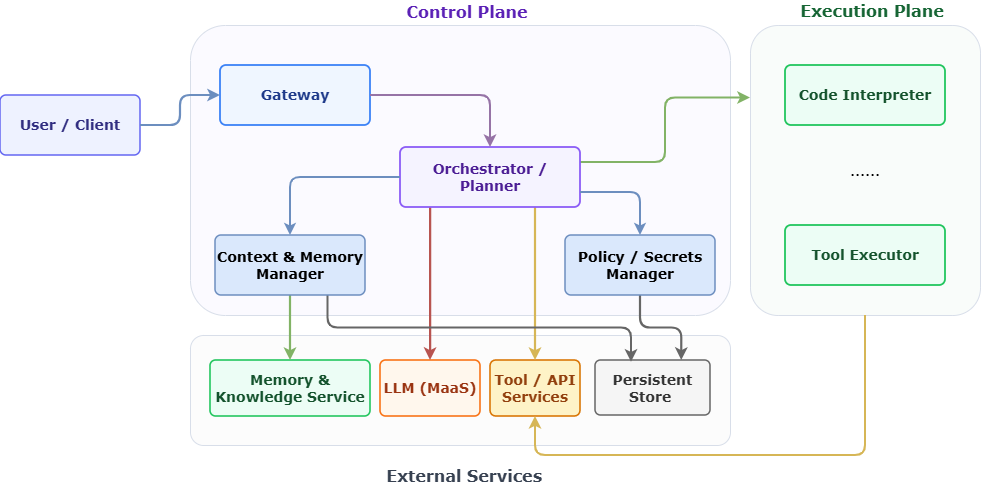
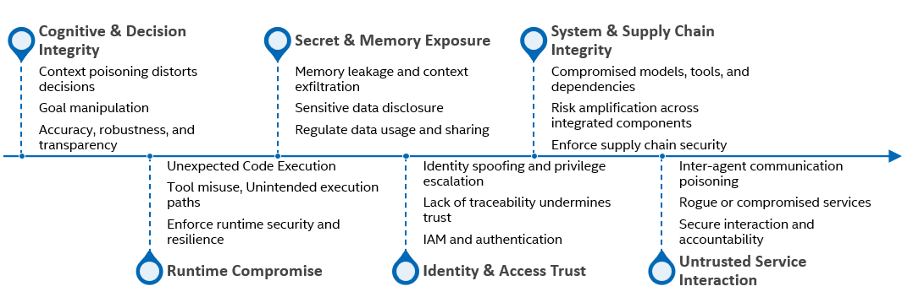
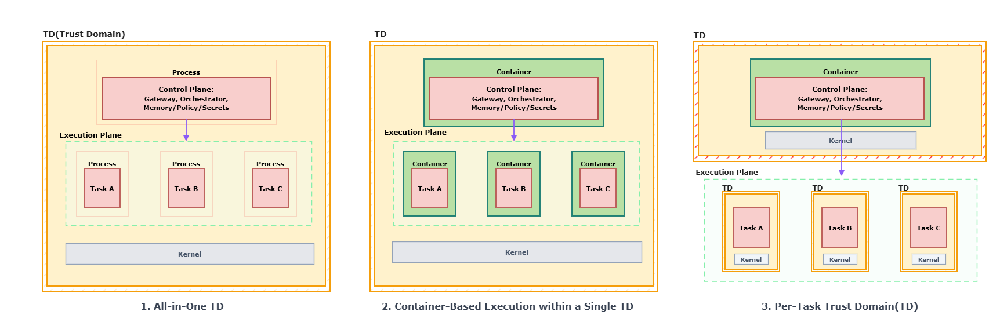
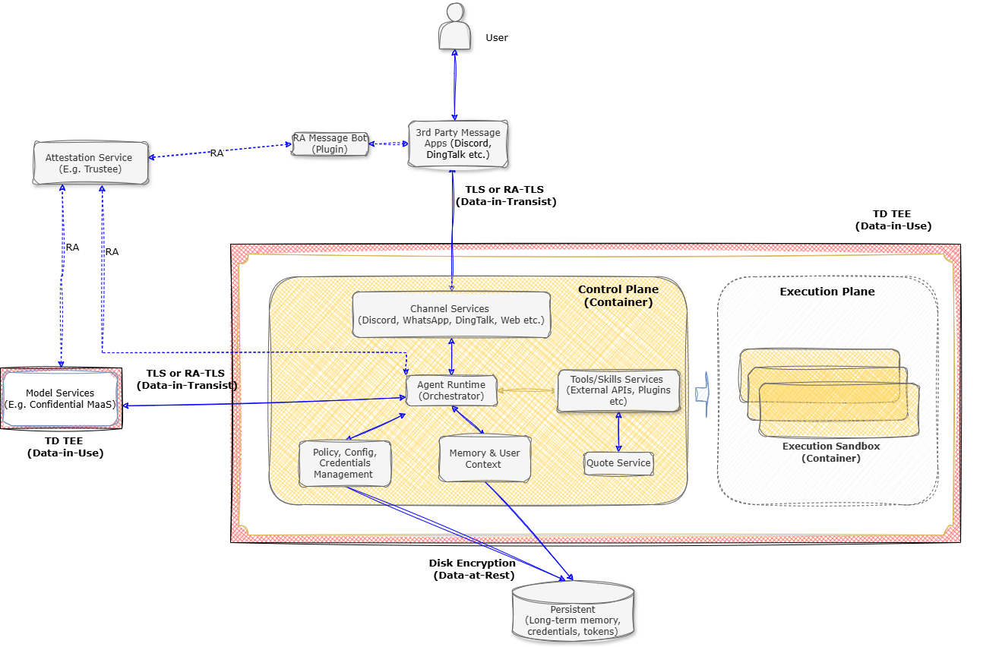
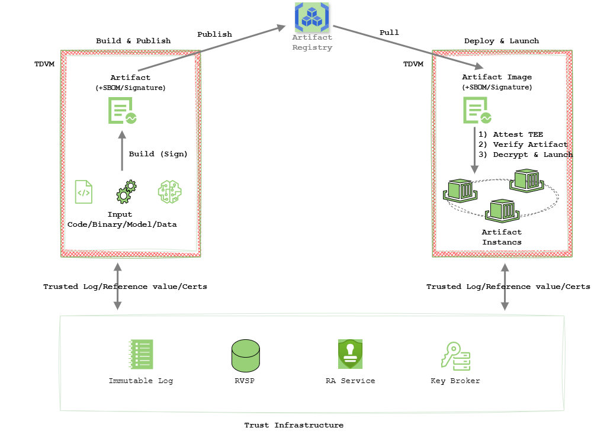
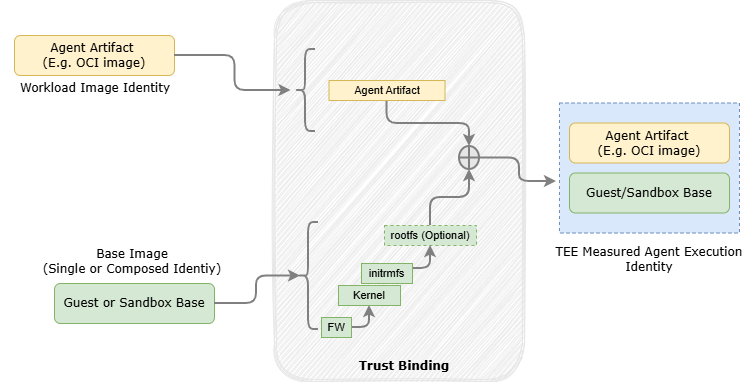
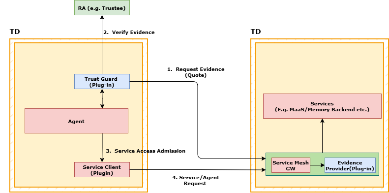
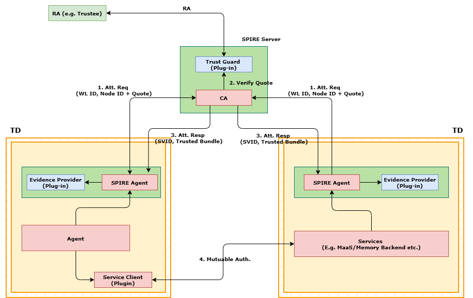

# 机密计算中的智能体 AI 系统（Agent-CC）

**版本：** 0.8  
**作者：** Song, Edmund（edmund.song@intel.com）

> 转换说明：本文依据 [Agent-CC.pdf](../../cczoo/agent-cc/documents_ly/archive/pre-asymmetric-architecture/Agent-CC.pdf) 全文翻译，保留原文章节编号、表格和 8 幅插图；移除了重复页眉、页脚，并合并跨页段落和表格。原图中的英文保持原样，图注及图中文字对照采用中文。原文章节编号由 2.2 跳至 2.4，本文沿用。本文反映原文版本的内容，未根据当前项目实现更新或核验其技术主张。

| 版本 | 日期 | 修订摘要 |
| --- | --- | --- |
| 0.6 | 2026-05-19 | 初始工作草稿。 |
| 0.7 | 2026-06-10 | 针对 Agent-CC 1.0 发布进行更新。 |
| 0.8 | 2026-06-28 | 更新 Trust Guard。 |

本文以 Intel TDX 为参考，探讨如何利用机密计算部署智能体 AI 系统。核心关注点不仅是智能体运行在哪里，还包括这种部署模型如何为智能体工作负载提供更强的隔离、可度量的执行以及可验证的信任。在此背景下，Agent-CC 被定义为面向机密 AI 智能体工作负载、基于 Intel TDX 的部署架构和参考实现：其设计不依赖特定智能体框架或服务，并将运行时隔离、可信执行控制和服务间信任验证整合为一个连贯的系统。本文重点讨论这些架构原则如何应用于智能体工作负载部署，后续章节将详细展开相关机制和设计权衡。

本文并不假定机密计算本身能够解决所有 AI 安全问题。相反，机密计算部署被视为一种基础支撑层：当它与策略、隔离、验证和安全的服务交互结合时，可以帮助缓解 AI 智能体部署中的主要风险。

本文分为两部分。第 1、2 章描述智能体部署架构与模式，概述其安全挑战，并解释机密计算部署带来的额外安全价值。第 3 至第 5 章从数据全生命周期保护、从构建到运行时的完整性以及可信服务组合三个维度，介绍采用 Intel TDX 的 Agent-CC 如何缓解这些挑战。

在机密计算中，可信执行环境（Trusted Execution Environment，TEE）是一种由硬件保护的核心运行时机制，用于将使用中的代码和数据与系统其他部分隔离，包括权限更高的软件层。本文使用 TEE 表示这一通用概念，使用 TD（Trusted Domain，可信域）表示该概念在 Intel TDX 中的具体实现，通常体现为由 TDX 支持的虚拟机（TDVM）。

## 1. 智能体架构

### 1.1 部署架构

为更好地分析智能体部署过程中出现的安全问题，本文将其部署架构划分为三个域：编排域（或控制平面）、执行平面以及服务依赖。在基于 TEE 的系统中，这种划分很有用，因为每项功能的部署位置决定了隔离边界、远程证明范围和运维模型。

- **控制平面（Control Plane）：** 负责准入、规划、策略和秘密信息管理的治理与编排组件，包括网关、编排器／规划器、上下文与记忆管理器，以及策略与秘密信息管理器。
- **执行平面（Execution Plane）：** 运行任务逻辑和工具调用的工作负载执行组件，通常受到更强的运行时隔离保护，包括代码解释器和工具执行器。
- **外部服务（External Services）：** 位于本地可信边界之外的远程能力提供方，包括 LLM／MaaS、记忆后端与知识检索服务，以及持久化存储。

在实际部署中，控制平面通常是范围更小、可信程度更高的一侧。执行平面则是高风险区域，因为它天然承载不可信代码、第三方工具和动态工作负载，因此通常需要额外的沙箱或更强的隔离边界。外部服务仍位于本地可信边界之外，通过受控接口访问。

智能体系统具有开放性且发展迅速，其执行环境和连接的外部服务都可能随时间动态变化。这带来了同一个信任问题：新的代码、工具、策略或服务连接，不应在未经准入、度量和验证的情况下进入运行中的系统。

*图 1：智能体部署架构。*

图中文字对照：User / Client 为用户／客户端；Gateway 为网关；Orchestrator / Planner 为编排器／规划器；Context & Memory Manager 为上下文与记忆管理器；Policy / Secrets Manager 为策略／秘密信息管理器；Code Interpreter 为代码解释器；Tool Executor 为工具执行器；Memory & Knowledge Service 为记忆与知识服务；LLM (MaaS) 为大语言模型（模型即服务）；Tool / API Services 为工具／API 服务；Persistent Store 为持久化存储。

### 1.2 安全威胁概述

OWASP（Open Worldwide Application Security Project，开放全球应用安全项目）近期发布了两份与智能体安全有关的重要白皮书：[《智能体 AI：威胁与缓解措施》](https://genai.owasp.org/resource/agentic-ai-threats-and-mitigations/)和 [《2026 年智能体应用十大风险》](https://genai.owasp.org/resource/owasp-top-10-for-agentic-applications-for-2026/)。这两份参考资料分别通过 17 类主要威胁和 10 项影响最大的风险，描述 AI 与智能体的安全风险面。同时，根据 [《欧盟法律下的 AI 智能体：面向 AI 提供方的合规架构》](https://arxiv.org/pdf/2604.04604AI)，欧盟法律对 AI 与智能体部署提出了明确的合规期望，包括问责、可追溯性、风险管理、透明度、访问控制和安全运行。

> 译注：上一段 arXiv 链接沿用 PDF 内嵌地址，其末尾包含 `AI`，可能存在原文链接排版错误。

从技术角度看，这些攻击风险、威胁模式和监管要求可以映射为六类运行层面的问题：

1. **认知与决策完整性：** 保持决策的正确性和稳健性，抵御上下文投毒、目标操纵和不透明的推理行为。
2. **运行时失陷：** 通过加固运行时控制，防止非预期代码执行、工具滥用和非预期执行路径。
3. **秘密信息与内存暴露：** 减少内存泄露和上下文外泄，并对敏感数据的使用与共享执行严格策略。
4. **身份与访问信任：** 通过强身份认证、身份与访问管理（IAM）以及可审计的身份绑定，防止身份伪造和权限提升。
5. **系统与供应链完整性：** 检测并遏制模型、工具、依赖以及从构建到运行时的软件链路中的失陷。
6. **不可信服务交互：** 保护智能体之间及智能体与服务之间的通信，抵御被投毒的通道、恶意服务以及薄弱的责任边界。

在这六类问题中，第一类主要是源于模型、提示词、推理和决策行为的 AI 原生安全问题。相比之下，第 2 至第 6 类与部署架构和运行时信任更直接相关，涉及数据安全、代码与运行时完整性、身份、软件供应链以及外部服务交互。这一区分对后文讨论十分重要：从部署角度看，机密计算能够提供具体的安全能力，在后五类面向部署的问题中加强影响范围控制、机密性、远程证明、完整性和可信交互。后续章节主要聚焦第 2 至第 6 类问题。

*图 2：智能体威胁分类。*

图中文字对照：认知与决策完整性涉及上下文投毒导致决策失真、目标操纵，以及准确性、稳健性和透明度；运行时失陷涉及非预期代码执行、工具滥用与非预期执行路径，以及运行时安全和韧性；秘密信息与内存暴露涉及内存泄露与上下文外泄、敏感数据披露，以及数据使用和共享管控；身份与访问信任涉及身份伪造与权限提升、可追溯性不足削弱信任，以及 IAM 与身份认证；系统与供应链完整性涉及被攻陷的模型、工具和依赖、集成组件间的风险放大，以及供应链安全；不可信服务交互涉及智能体间通信投毒、恶意或被攻陷的服务，以及安全交互和问责。

## 2. 部署模型

同一智能体架构可以采用不同方式部署，具体取决于所需的信任边界、隔离强度、远程证明粒度和运维模型。在基于 TDX 的智能体部署中，最适合的评估方式，是考察控制平面与执行平面如何分布在不同可信域中，以及任务隔离的细化程度。可以从四个维度进行比较：

- **隔离强度：** 部署对控制平面、任务工作负载及其周围运行环境的分离程度，例如进程隔离、容器隔离、虚拟机隔离或基于 TEE 的隔离。
- **远程证明粒度：** 系统能够以多高的精度，对已启动的内容和实际运行的内容生成可验证声明。
- **运维复杂度：** 部署模型引入了多少运行时、编排和镜像管理开销。
- **生命周期独立性：** 控制平面、任务工作负载及其镜像能够在多大程度上独立部署、升级和管理。

本文讨论三种具有代表性的部署模式：

1. 单体式可信域（All-in-One TD）。
2. 单一可信域内的容器化执行。
3. 每任务独立可信域（Per-Task TD）。

*图 3：智能体部署模式。*

图中文字对照：三种模式从左到右分别是单体式 TD、单一 TD 内的容器化执行、每任务独立 TD。Process 为进程；Container 为容器；Kernel 为内核；Task A／B／C 为任务 A／B／C；控制平面包含网关、编排器以及记忆／策略／秘密信息管理功能。

### 2.1 部署模式

#### 模式 1：单体式 TD

在这种部署模型中，整个智能体软件栈以原生进程的形式运行在单个可信域（TDVM）中。TDVM 边界是系统唯一的强隔离边界，也是智能体执行的主要信任边界。

在 TDVM 内，控制平面组件（如网关和编排器）与执行平面的任务工作负载位于同一个可信域，共享同一内核、进程命名空间和运行环境。

这种架构具有最低的运维复杂度和最小的系统开销，也提供了直接的远程证明模型，因为整个智能体软件栈可以被视为一个经过度量、可验证的单元。

然而，由于缺少内部隔离，编排逻辑与任务执行共享一个统一的可信域，组件之间没有额外的影响范围约束。因此，任何一组组件被攻陷都可能影响整个智能体软件栈。这种紧耦合的运行时模型也使执行环境中的依赖难以动态升级或更新，通常需要对整个软件栈进行协调变更。

这种模型最适合单租户或单用户智能体系统、受到严格控制的执行环境，或者可以将整个 TDVM 视为一个信任域和故障域的场景。

#### 模式 2：单一 TD 内的容器化执行

在这种模型中，控制平面组件与执行平面的任务工作负载都被打包为容器镜像，通常作为容器部署在单个可信域内。

容器级隔离通过 Linux 命名空间和 cgroups 实施，在组件之间提供进程级分离、资源治理和生命周期独立性。在实践中，这也在容器边界为执行工作负载提供了轻量级沙箱效果。但是，所有容器仍共享同一个客户机内核，该内核构成系统基础性的信任与安全边界。

与单体式部署相比，这种模式在控制平面服务与任务执行工作负载之间建立了更清晰的运维和生命周期分离。它支持标准化的 OCI 打包、独立镜像管理，并提高了各组件部署的可扩展性。

这种模型适用于企业级内部平台、标准化云原生工作流，以及重视运维成熟度（OCI 工具、CI/CD、镜像生命周期管理），但不要求每个任务都具备硬件强制的机密性或强虚拟机级沙箱隔离的团队。

#### 模式 3：每任务独立可信域（TD）

与模式 2 相比，模式 3 的关键区别在于：执行平面的任务工作负载运行在独立的机密计算沙箱中，而不是与其他组件共享一个执行边界。

在这种隔离最强的模型中，每个任务都在自己的机密计算沙箱（CC sandbox）内执行。CC 沙箱是面向任务工作负载的隔离且可证明的执行单元，由硬件保护其运行时状态和内存。

这种模型的设计目标包括：

- 高隔离密度：每台宿主机能够承载大量独立隔离的任务沙箱。
- 快速启动：适合短生命周期或突发性的任务执行。
- 在保留硬件隔离的同时，相比每个组件都部署一个完整虚拟机，降低运行时开销。

控制平面可以采用两种实际布局：

- **由 TDVM 承载的控制平面：** 控制平面组件运行在一个标准 TDVM 中，使用 OCI 容器进行打包、部署和验证；任务工作负载交由专用 CC 沙箱执行。
- **沙箱化的控制平面：** 控制平面组件与任务工作负载一样，也运行在 CC 沙箱中，使每个组件都能够独立隔离并接受远程证明。

示例实现包括 Kata Confidential Containers，以及其他符合机密计算要求的沙箱运行时。根据运行时设计，CC 沙箱可以通过不同的机密沙箱机制实现。这些部署布局和运行时实现具有以下共同特征：

- 每个任务都在独立隔离的沙箱边界中运行。
- 在硬件边界（例如可信域）上强制实施隔离。
- 沙箱能够进行密码学度量和远程证明。

这种模型能够有效限制不可信代码、第三方工具和多租户执行的影响范围，同时支持逐任务的细粒度远程证明。它最适合零信任执行、敏感智能体工作负载、高密度和大规模部署环境，以及要求严格隔离和可验证执行的场景。

### 2.2 部署模式比较

可以从两组维度比较这三种部署模式。第一组关注隔离结构：组件在哪里运行、由什么边界分隔，以及依赖怎样的运行时模型。第二组关注运维和信任管理属性：镜像如何打包与更新、运行时能够以多高的精度接受远程证明，以及每种模式引入了多少运维灵活性和复杂度。

#### 2.2.1 隔离强度与运行时结构

下表从组件部署位置、隔离边界和运行时结构的角度比较三种部署模式。

| 特性 | 单体式 TD | 单一 TD 内的容器化执行 | 每任务独立 TD |
| --- | --- | --- | --- |
| 控制平面部署位置 | 控制平面组件作为原生进程运行 | 控制平面组件作为 OCI 容器运行 | 控制平面组件作为 OCI 容器运行在主 TDVM 中，或运行在各自的 CC 沙箱中 |
| 执行平面部署位置 | 执行平面的任务工作负载作为原生进程运行 | 执行平面的任务工作负载作为 OCI 容器运行 | 执行平面的任务工作负载运行在独立 CC 沙箱中 |
| 主要隔离边界 | 仅有 TDVM 边界 | 单个 TDVM 内部的容器边界 | 每个任务的 CC 沙箱边界 |
| 内核共享模型 | 共享客户机操作系统和内核 | 所有容器共享客户机内核 | 每个沙箱化任务拥有独立客户机内核 |
| 运行时引擎 | 原生进程／systemd | Docker／containerd | Kata Confidential Containers 或其他 CC 沙箱运行时 |
| 任务扩缩容粒度 | 单个虚拟机内的进程级 | 单个虚拟机内的容器级 | 每任务 CC 沙箱级 |

#### 2.2.2 远程证明与运维属性

隔离始终是重点，但仅有隔离还不够：它本身无法证明运行时可信，无法解决源自镜像自身的恶意问题，也无法防止运维升级过程中的失陷风险。为了系统性地解决智能体安全问题，生产系统还必须明确镜像如何打包、更新如何推出、运行时能以何种粒度接受远程证明，以及部署模型保留了多少运维灵活性。下表关注这些运维和信任管理维度。

| 维度 | 单体式 TD | 单一 TD 内的容器化执行 | 每任务独立 TD |
| --- | --- | --- | --- |
| 镜像管理 | 单个 TDVM 镜像；整个环境作为一个镜像和一个运维单元管理 | 控制平面组件和执行平面任务工作负载采用 OCI 镜像；镜像可独立更新 | 多种选项：控制平面采用 OCI 容器，任务采用各自的 CC 沙箱镜像；或每个组件均使用自己的 CC 沙箱镜像 |
| 远程证明粒度 | 对整个 TDVM 进行一次整体度量 | TDVM 度量加上容器的镜像级身份；在运维层面可区分控制平面组件与执行平面任务工作负载镜像 | 对每个任务的 CC 沙箱进行度量；能够证明哪个任务镜像运行在哪个机密沙箱中 |
| 灵活性 | 最低；任何重大变更通常都需要重建或重新部署整个 TDVM 镜像 | 中等；保持同一个 TDVM 的同时，控制平面组件和执行平面任务工作负载镜像可独立滚动更新 | 最高；控制平面与任务沙箱能够更独立地演进，尤其是在每任务 CC 沙箱模式下 |
| 安全性 | 单一 TEE 边界；TDVM 内部的失陷会影响整个运行时范围 | 打包管理更加规范，但共享内核风险仍然存在 | 最强的隔离，以及任务之间最强的信任域分离 |

总结：

- 单体式 TD 侧重简单性和单一的度量信任单元。
- 单一 TD 内的容器化执行改善了运维灵活性和镜像生命周期管理，但仍然依赖共享的客户机内核。
- 每任务独立 TD 提供最强的逐任务隔离和最细粒度的远程证明模型，代价是更高的运维复杂度。

单体式 TD 的保护模型已在 Agent-CC 的前身 OpenClaw-CC 中进行分析，见 [confidential-computing-zoo/openclaw-cc](https://github.com/intel/confidential-computing-zoo/tree/main/cczoo/openclaw-cc)。本文主要关注模式 2 和模式 3，不过这里讨论的大多数机制同样适用于模式 1。

### 2.4 智能体部署的安全分析

在这三种部署模式中，关键问题是控制平面与执行平面的部署位置如何影响失陷后的影响范围、运行时状态保护，以及跨镜像和跨服务的信任。

本节关注第 1.2 节介绍的与部署和运行有关的问题。以下小节从两个角度分析这些问题：首先是进程、容器和虚拟机等传统隔离机制提供的保护；其次是基于 TD 的执行引入的额外安全属性。

#### 2.4.1 传统隔离：能力与局限

在讨论基于 TD 的执行之前，有必要明确传统隔离的价值和局限。进程、容器和虚拟机确实依次提供了更强的影响范围约束，但这种增强仍然建立在软件强制的边界之上。因此，仍存在三个系统性缺口：高权限层仍可观察或干扰使用中的状态；运行时信任难以跨信任边界证明；所形成的边界仍不足以充当 AI 智能体系统可靠的安全防火墙。

| 机制 | 擅长隔离的内容 | 主要安全局限 | 对信任的影响 |
| --- | --- | --- | --- |
| 进程 | 在单个操作系统进程边界内提供有限的影响范围约束 | 高权限宿主机或客户机操作系统仍可检查内存或干扰执行 | 运行时证明非常弱；信任主要依赖软件身份和访问控制 |
| 容器 | 通过命名空间和 cgroups 更好地分离工作负载，但仍受共享内核约束 | 容器仍共享同一内核，内核失陷或容器逃逸可能破坏隔离 | 能力有限；镜像身份更清晰，但运行环境仍难以得到强验证 |
| 虚拟机 | 通过独立客户机内核和虚拟机边界提供更强的影响范围约束 | 在普通虚拟机中，虚拟机监控器或高权限宿主机仍是主要信任依赖 | 中等；可支持度量启动和虚拟机身份，但运行时证明仍相对粗粒度且依赖宿主机 |

总的来说，传统隔离能够缩小影响范围并改善工作负载分离，但无法消除对高权限软件层的依赖，也不能将运行时变成具有强可验证性的可信域。对于 AI 智能体，这个缺口十分重要，因为同一个系统必须限制不可信执行的影响、保护活动内存与秘密信息，并在与外部服务交互时建立信任。基于 TD 的执行正是在这一点上改变了模型，而不只是继续增强原有模型。

#### 2.4.2 基于 TD 的隔离带来的收益

基于 TD 的执行不应被简单视为传统隔离的演进；它改变了信任模型。它不再主要依赖软件边界，而是将机密性和度量锚定在由硬件支持的执行环境中。对智能体系统而言，这一点非常重要，因为失陷、泄露、虚假信任声明、供应链问题以及不安全的服务交互往往会相互强化。缺少可验证的信任基础，是当今智能体安全复杂性以及许多实际落地工作中安全缺口的重要成因。

下表总结了 TD 能直接解决什么、仍需结合哪些补充控制，以及还存在哪些局限。

| 安全问题 | TD 能直接提供的帮助 | 应结合的补充机制 | 仍然存在的局限 |
| --- | --- | --- | --- |
| 运行时失陷 | 减少来自宿主机一侧的暴露，并加强控制与任务执行的隔离 | 任务沙箱、最小权限、策略执行、系统调用过滤 | 无法阻止可信边界内部的恶意逻辑 |
| 秘密信息与内存暴露 | 保护使用中的内存，防止宿主机、虚拟机监控器和运维人员检查 | 秘密信息作用域限制、短期凭据、输出过滤、数据最小化 | 应用逻辑仍可能泄露或滥用秘密信息 |
| 身份与访问信任 | 提供硬件支持的运行时身份依据，以及更强的基于远程证明的信任建立 | 强身份认证、IAM 策略、身份绑定、验证方基础设施、密钥释放策略 | 远程证明和身份证明不能保证行为安全或授权逻辑正确 |
| 系统与供应链完整性 | 将信任从已签名制品延伸至经过度量的启动与加载过程 | 镜像签名、软件物料清单（SBOM）、依赖治理、可复现构建、CI/CD 准入 | 经过度量的软件仍可能包含漏洞 |
| 不可信服务交互 | 支持能够验证对端身份和运行时状态的经证明通道 | TLS、服务授权、信任策略、安全会话建立、密钥管理 | 如果没有策略执行，可信运行时仍可能连接恶意对端 |

当系统同时需要使用中数据保护和可验证的运行时信任时，TD 的价值最大。在这种模型中，TD 通过提供以硬件为信任根的内存保护，以及可跨信任边界度量的运行时身份，充当信任基础。

需要明确的是，基于 TDX 的部署并非万能方案，但它可以通过结构化、可验证的控制，使智能体安全挑战更容易处理。它提供的是信任基础，而不是智能体系统完整的安全架构。应当将其与沙箱、策略执行、签名镜像、静态数据加密和 TLS 结合，以系统性地降低面向部署的威胁。

## 3. 保护智能体数据的全生命周期

智能体场景放大了 AI 数据安全风险，因为处理过程超出了单次请求。智能体持续接收提示词、获取外部上下文、生成中间状态、保留用户记忆，并可能持久化结果。因此，敏感数据在推理、执行和持久化过程中流经端到端处理链路，使使用中数据的保护至关重要。如果这一链路的任何阶段暴露了使用中的数据，智能体 AI 系统就会直接面临数据安全风险。因此，运行时失陷以及秘密信息或内存暴露，是智能体 AI 系统的核心风险。

### 3.1 为什么数据全生命周期保护很重要

在 OpenClaw 这样的典型智能体工作流中，数据会经过多个阶段：用户提示词和上下文通过网关进入；编排与规划组件获取外部知识；执行运行时使用凭据调用工具和 API；记忆服务持久化对话历史和检索产物。在这一流程的每个环节，敏感数据都面临不同威胁，其中影响最大的风险发生在数据使用期间和数据存储期间。

最关键的阶段是数据使用期间。在当今云环境中，静态数据和传输中数据的保护已经相对成熟。相比之下，使用中数据的保护通常仍是最薄弱的一层。当运行时上下文、中间推理状态、权限令牌和工具输出同时存在于活动内存中时，运行时失陷、高权限基础设施的观察或内存泄露，都可能一次性直接暴露完整的工作上下文和活动凭据。攻击者可在这一阶段造成最大损害。因此，保护使用中的数据必须成为智能体安全设计的首要任务。

对于智能体，对话历史、检索产物、长期记忆和审计轨迹会持续积累并被反复使用，使静态数据成为持久且高价值的攻击面。

数据入口与交换过程还会增加暴露风险：被投毒的提示词、薄弱的身份检查和权限过大的凭据，可能从处理链路的边缘破坏整个流程。因此，保护全生命周期是一项核心设计要求，因为任何阶段的失效都会向下游传播。

### 3.2 基于 Intel TDX 的保护机制

TD 在这里充当信任基础：它提供以硬件为信任根的内存保护和可度量的运行时身份，本章的数据保护机制都依赖于此。智能体进程运行在硬件隔离边界内，内存始终加密，受到保护而不被宿主机、虚拟机监控器及其他高权限软件层访问。运行时身份和启动度量通过远程证明验证，秘密信息仅释放给已通过证明的环境。加密存储只在经过 TD 验证的运行时内部解密，从而将相同的隔离和信任从使用中数据延伸到静态数据。

这一部署模型通过不同的 TDX 支撑机制，保护三个关键数据面：

**运行时上下文与内存（使用中数据）：** 执行期间，运行时上下文、中间推理状态和工具输出共存于活动内存中。如果没有保护，这些数据可能因高权限基础设施观察或内存泄露而暴露。TDX 通过确保核心进程和服务运行在基于 TDX 的可信执行环境中、使内存始终加密，来缓解这种风险。结合运行时完整性验证和动态远程证明，可以防止未授权的内存检查，并持续保证执行中的工作负载仍然可信。

**秘密信息与权限（使用中数据）：** API 密钥、OAuth 令牌和访问凭据是高影响资产，一旦泄露，可能导致权限滥用和跨服务入侵。TDX 将凭据使用严格限制在 TEE 边界内。凭据不会暴露给宿主机或不可信层；远程证明控制秘密信息的释放，确保密钥只被提供给经过验证的可信环境。这将威胁模型从“凭据释放后暴露”，转变为“只有完成信任验证后才释放凭据”。

**长期记忆与持久化数据（静态数据）：** 对话历史、检索产物、长期记忆和审计轨迹会随时间积累高价值敏感数据。存储与传输会带来暴露窗口。基于 TDX 的设计通过对静态数据和传输中数据加密、并仅在 TEE 内解密来应对这一问题。敏感数据访问进一步通过远程证明管理：存储的数据仅释放给经过批准且通过远程证明检查的运行时，从而跨越持久化边界，形成统一的加密与访问控制模型。

这种集成方式将使用中数据保护与静态数据防护结合起来。TDX 保护活动内存，并通过远程证明控制秘密信息释放；加密和基于远程证明的访问控制保护持久化状态。最终形成一条连贯的保护路径：敏感数据默认加密，只在经过验证的 TEE 边界内解密，并且仅在远程证明成功后才释放给外部服务。

*图 4：数据全生命周期保护，以 OpenClaw 为例。*

图中文字对照：User 为用户；3rd Party Message Apps 为第三方消息应用（如 Discord、钉钉）；RA Message Bot (Plugin) 为远程证明消息机器人插件；Attestation Service 为远程证明服务（如 Trustee）；Model Services 为模型服务（如机密 MaaS）；Channel Services 为渠道服务（如 Discord、WhatsApp、钉钉、Web）；Agent Runtime (Orchestrator) 为智能体运行时（编排器）；Policy, Config, Credentials Management 为策略、配置和凭据管理；Memory & User Context 为记忆与用户上下文；Tools/Skills Services 为工具／技能服务（外部 API、插件等）；Quote Service 为 Quote 服务；Execution Sandbox (Container) 为执行沙箱（容器）；Disk Encryption 为磁盘加密；Persistent 为持久化存储（长期记忆、凭据、令牌）；Data-in-Use、Data-in-Transit、Data-at-Rest 分别为使用中数据、传输中数据和静态数据；RA 表示远程证明。

在智能体 AI 中，记忆是一个正在发展的领域，也是支持持续性、个性化和长期决策质量的核心信任组件。目前，大多数记忆机制仍以智能体本地状态的形式实现。下一项重大创新则是服务化记忆，使记忆能够跨智能体、跨域共享和演进。随着记忆向这一方向发展，本章讨论的同一套数据保护模型仍适用于记忆服务：对使用中的上下文进行机密执行、基于远程证明的身份与准入、由策略控制的秘密信息和密钥释放，以及加密且受策略控制的持久化与交换。

## 4. 从构建制品到经过远程证明的执行

本章直接回应前文提出的安全问题，重点讨论这些问题背后的要求。它们带来了一项实际需求：证明实际运行的内容、检测运行时是否偏离已批准的软件和策略，并向其他系统组件、验证方或对端服务提供可验证的执行声明。在智能体系统中，仅知道构建了哪些软件或原本打算采用什么部署策略是不够的。为了在实践中落实这些安全目标，系统必须能够证明，运行中的智能体确实在预期的信任边界内执行，并具有预期的度量值、软件身份和策略状态。

这就是为什么必须建立构建制品与经过远程证明的执行之间的关联。如果缺少这种关联，签名镜像、已批准配置和部署策略仍然只是构建时的意图，而运行时可能与平台认为已启动的内容不同。在智能体部署场景中，实际问题因此变成：已部署的智能体工作负载如何成为可信的运行时？

*图 5：从构建制品到经过远程证明的运行时。*

图中文字对照：Build & Publish 为构建与发布；Input Code/Binary/Model/Data 为输入代码／二进制／模型／数据；Build (Sign) 为构建（签名）；Artifact (+SBOM/Signature) 为制品（附带 SBOM／签名）；Artifact Registry 为制品仓库；Publish、Pull 分别为发布、拉取；Deploy & Launch 为部署与启动；部署侧步骤依次为证明 TEE、验证制品、解密并启动；Artifact Instances 为制品实例；Trusted Log/Reference value/Certs 为可信日志／参考值／证书；Trust Infrastructure 为信任基础设施，包含不可变日志、RVSP、远程证明服务和密钥代理（Key Broker）。原图未展开 RVSP 的含义。

### 4.1 打包、度量与启动边界

三种部署模式的区别不仅在于隔离强度，还在于打包的是什么、启动时度量的是什么，以及验证方最终需要信任什么。同时，它们又具有一个共同结构：每种模式中，都存在系统交付的可部署制品、TEE 在启动时实际度量的对象，以及要求验证方信任的最终运行时单元。

| 模式 | 主要打包单元 | 主要度量单元 | 最终信任单元 | 远程证明粒度 |
| --- | --- | --- | --- | --- |
| 单体式 TD | 一个可启动的 TDVM 镜像 | 内核、initrd、rootfs、启动配置 | 一个包含控制平面和任务的 TDVM | 整个系统 |
| 单一 TD 内的容器化执行 | 一个 TDVM 镜像加 OCI 镜像 | TDVM 启动制品，可选地加上运行时度量的 OCI 状态 | 一个经过度量的 TDVM | 客户机／TDVM 级 |
| 每任务独立 TD | 控制平面镜像，加上每个任务各自的沙箱镜像或载荷 | 控制域启动制品，加上每个任务沙箱的启动制品 | 每个任务的沙箱 | 任务／沙箱级 |

这一区别对三种模式都具有基础性意义。根据工作负载的交付方式，打包单元可以是可启动的 TDVM 镜像、OCI 镜像或沙箱载荷。然而，被度量的对象是进入 TEE 信任链的启动路径：通常包括内核、initrd、载荷或根文件系统，以及启动配置。在最简单的情况下，这些层彼此接近：交付一个可启动镜像，启动一个客户机，最终产生一个经过度量的信任单元。在更模块化的情况下，它们开始分离：平台可能交付 OCI 镜像或逐任务的沙箱载荷，而验证方仍需要关于实际启动的具体受度量运行时的证据。在基于 OCI 的情况下，运行时度量随后可以将 OCI 摘要、策略状态或启动决策记录到 RTMR 等可在远程证明中看到的状态中，从而扩展信任链。但这并不改变基本事实：打包身份与度量身份相互关联，却并不相同。

启动路径决定了每种模式下远程证明声明的自然含义。

- **单体式 TD** 是最直接的情况：交付一个 TDVM 镜像，启动一个客户机系统，产生一个经过度量的信任单元。得到的声明很简单：一个机密虚拟机使用预期的系统镜像和配置完成了启动。
- **单一 TD 内的容器化执行** 保留了相同的主要硬件信任锚，因为仍然先启动并度量一个 TDVM。区别在于，交付的工作负载现在包含该客户机内部的 OCI 镜像。这在打包身份和经过度量的启动身份之间增加了一层：验证方直接信任经过度量的 TDVM，而 OCI 身份必须在这一可信客户机内部得到强制落实或记录。
- **每任务独立 TD** 使信任边界更接近工作负载，但它仍然不是孤立地只度量工作负载本身。控制平面仍可运行在 TDVM 或容器中，而每个任务都启动到自己的机密沙箱中，拥有自己的启动制品，例如客户机内核、initrd、根文件系统或基础载荷；然后通常通过基于 OCI 的路径，将任务特定的工作负载绑定到该沙箱。与前两种模式相比，关键差异并非不再需要客户机式启动基础，而是最终信任单元缩小为单个任务沙箱，不再是范围更广的共享客户机环境。

主要的架构影响很直接：虚拟机式启动往往产生范围更广、以客户机为中心的信任声明，而 MicroVM 或沙箱式启动更容易产生针对特定工作负载的信任声明。换言之，经过度量的启动边界越接近工作负载本身，最终的信任声明就可以越精确。

### 4.2 远程证明与信任声明

远程证明是将经过度量的启动证据转化为信任决策的步骤。在全部三种模式中，验证方都将运行时证据与预期的构建身份和启动策略进行比较。变化的是最终声明的粒度。

- 在模式 1 中，验证方将预期的 TDVM 度量值与一份远程证明报告进行核对。
- 在模式 2 中，验证方首先建立对受度量 TDVM 的信任，再评估 OCI 镜像身份是否在这一可信客户机内部得到正确落实或记录。
- 在模式 3 中，验证方可以分别评估控制平面和每个任务沙箱。任务侧的声明以受度量沙箱为基础，并包含将预期工作负载身份与该沙箱关联起来的绑定证据。

这也决定了何时应该释放秘密信息。只有在三项条件一致满足后，才应释放秘密信息：经过度量的启动符合策略、预期工作负载身份已知，并且系统能够证明该工作负载身份已正确绑定到这一经过度量的启动实例。

核心观点是：采用机密计算部署智能体，不只是启动一个 TEE，而是将运行时证据转化为可信的声明。三种模式之间变化的是声明粒度：从整个系统的信任，到带有客户机内部工作负载身份的客户机级信任，再到具备更紧密工作负载绑定的逐沙箱信任。

### 4.3 将智能体工作负载绑定到经过度量的运行时

模式 1 将整个客户机视为一个信任单元：系统镜像作为单一对象进行构建、度量和远程证明。模式 2 和模式 3 改变了这一模型。在这两种情况下，经过度量的 TEE 启动基础与交付的工作负载不再是同一份制品。运行时至少由两层构成：经过度量的客户机或沙箱基础，以及单独交付的智能体工作负载，后者通常打包为 OCI 镜像。

这种分离带来了本章的核心问题。仅证明机密客户机或沙箱基础已正确启动，不再足够。系统还必须证明，预期的智能体工作负载就是实际绑定到该受度量运行时的工作负载。本文将这条证明路径称为**可信绑定层（trusted binding layer）**。从这个意义上说，模式 2 和模式 3 面临同一个基本问题：都必须将工作负载身份与经过度量的 TEE 运行时关联起来。主要区别是这一绑定层位于哪里，以及如何实现。

#### 可信绑定层

可信绑定层是将工作负载身份与 TEE 度量的执行身份连接起来的最小可信软件路径。在许多实际系统中，工作负载身份由 OCI 镜像承载，但关键问题并不限于 OCI。其目的不仅是启动工作负载，还要在请求了什么、度量了什么以及允许什么接收秘密信息之间，保留一种验证方可以使用的关系。

这一层至少应完成五件事：

1. **检查镜像：** 验证实际使用的是预期 OCI 镜像。
2. **将镜像绑定到运行时：** 确保实际加载到机密环境中的正是该镜像。
3. **使其对远程证明可见：** 确保工作负载身份能够在远程证明证据中体现。
4. **应用策略：** 强制执行所要求的镜像、配置和启动规则。
5. **控制秘密信息释放：** 只有运行时和工作负载身份均通过验证后，才释放秘密信息。

在模式 2 中，这一可信绑定层通常可以由受度量 TDVM 内部、客户机侧的工作负载运行时路径实现。在模式 3 中，它通常由面向 TEE 的可信 shim 或可信代理实现，为独立度量的任务沙箱执行相同的绑定功能。

*图 6：可信绑定层。*

图中文字对照：Agent Artifact (E.g. OCI image) 为智能体制品（如 OCI 镜像）；Workload Image Identity 为工作负载镜像身份；Base Image (Single or Composed Identity) 为基础镜像（单一或组合身份）；Guest or Sandbox Base 为客户机或沙箱基础；FW 为固件；Kernel 为内核；initramfs 为初始内存文件系统；rootfs (Optional) 为根文件系统（可选）；Trust Binding 为可信绑定；TEE Measured Agent Execution Identity 为经 TEE 度量的智能体执行身份。

#### 绑定方式与验证

将 OCI 身份与机密执行绑定主要有两种方式。无论采用哪种方式，验证方都需要证据，证明所请求的工作负载身份已经正确关联到经过度量的机密运行时。在模式 2 中，这种证明通常在受度量 TDVM 内部生成。在模式 3 中，它通常在独立度量的任务沙箱边界处生成，即使编排路径起始于沙箱可信计算基（TCB）之外也是如此。

##### 启动前绑定

在第一种方式中，OCI 镜像在启动之前被转换为沙箱根文件系统或载荷。工作负载身份因此被纳入启动时度量的制品。

这种方式在应用身份与启动度量之间建立了最直接、最强的关联，因为验证方可以围绕一个整合后的受度量载荷进行判断。代价是运维灵活性：更新工作负载可能需要重建或重新生成沙箱载荷。

##### 启动后的运行时绑定

在第二种方式中，先启动沙箱基础，再通过运行时度量记录 OCI 相关身份，例如将镜像摘要、配置或策略状态扩展写入 RTMR。

TDX 动态度量在这种启动后运行时绑定中尤其有用。它允许系统在启动后，以硬件为信任根追加运行时证据，使验证方能够在同一远程证明流程中评估经过度量的启动基础和后续绑定证据。

这种方式使 OCI 风格的工作流更加灵活，但也对验证方逻辑提出了更高要求。验证方现在必须同时分析初始沙箱度量，以及后来用于将工作负载身份绑定到该沙箱的运行时度量。

在实践中，许多机密容器系统采用第二种模型的混合形式：containerd 继续管理 OCI 生命周期，而位于面向 TCB 一侧的可信 shim 将 OCI 意图转化为经过度量的沙箱启动，并记录远程证明所需的绑定证据。

无论采用何种实现方式，验证方都不应仅凭客户机或沙箱的启动完整性就接受信任声明。对于通过 OCI 交付的机密工作负载，必须完成三项检查：

1. **受度量基础的完整性：** TDVM 或沙箱启动制品符合预期策略。
2. **预期 OCI 身份：** 所请求的镜像摘要和相关配置符合部署意图。
3. **可信绑定证据：** 系统能够证明，该 OCI 身份确实对应实际关联到受度量机密运行时的工作负载。

只有这三项检查全部成功后，依赖方才应将该工作负载视为有资格进行可信执行、服务准入或接收秘密信息。因为针对特定工作负载的可信声明，依赖于将智能体工作负载身份显式绑定到经过度量的 TEE 运行时。

## 5. 可信服务组合

本章关注跨服务边界的信任连续性。在智能体系统中，安全不仅取决于本地运行时如何受到保护，还取决于平台如何决定哪些外部服务可以接收敏感请求。即使智能体运行在可信运行时中，它仍可能通过对模型服务、检索系统、记忆后端等下游调用引入泄露风险。因此，这里的核心问题不仅是通道安全，而是基于运行时信任证据的服务准入：平台必须判断一个远程服务在什么条件下足够可信，可以参与同一条敏感数据处理路径。

### 5.1 外部服务交互

在实践中，智能体安全必须从可信的本地执行延伸到由策略治理的可信服务访问。如果检索服务或记忆后端运行在不可信环境中，即使发起调用的智能体运行在 TEE 中，数据仍可能被暴露、修改或不当处理。因此，实际要求高于单纯的传输加密。仅知道智能体正在连接哪个服务身份还不够；系统还应知道，该服务是否运行在预期且可验证的执行环境中。

基于 TEE 的部署通过跨服务边界扩展机密执行和远程证明，帮助解决这一问题。处理敏感智能体数据的外部服务本身也应运行在 TEE 隔离环境中，使数据不仅在智能体运行时内部得到保护，也在下游处理过程中持续得到保护。结合经远程证明的通道，智能体侧或依赖平台可以在发送敏感请求前，同时验证服务身份和服务运行时状态。在这种模型中，安全声明不仅是智能体可信，还包括从智能体到外部服务的完整处理路径始终处于经过度量、由策略批准的执行边界内。

### 5.2 由信任治理的服务访问

其架构含义是：服务准入应以可信证明为条件，就像秘密信息释放以远程证明为条件一样。本文将这种由验证方介导的准入功能称为 **Trust Guard（信任守卫）**：它是控制平面的执行层，负责验证远程证明证据，将证据与服务身份及策略绑定，并且只有在这些检查成功后才允许访问。这些检查共同构建了一条从智能体运行时、经过通信通道、延伸到外部服务运行时的端到端信任链。在智能体向外部服务发送敏感提示词、记忆上下文或凭据之前，平台至少应验证三件事：服务身份确实是预期身份；服务运行时正在预期的 TEE 环境内执行；经过远程证明的软件与配置状态符合策略。这使平台能够将服务访问视为由验证方控制的信任决策，而不只是一次网络连接。

当这一机制与加密传输结合时，就形成了更完整的智能体数据保护路径。TEE 隔离保护数据在智能体和外部服务内部处理期间的安全。TLS 或类似安全通道保护两者之间传输中的数据。远程证明进一步将两个端点与可验证的运行时状态绑定，使机密性和完整性不再仅依赖网络身份。这就是智能体场景中端到端保护的实际含义：敏感数据从离开智能体运行时的那一刻起，直到在经过远程证明的外部服务运行时内部被处理，都持续受到保护。

### 5.3 无侵入或低侵入集成

在传统服务部署中，直接向每个智能体和服务加入远程证明，通常会带来很大的集成阻力。团队必须在众多组件中加入 Quote 生成与验证逻辑、nonce／挑战处理、策略同步、身份绑定和失败路径处理。这会增加实现成本、拖慢发布周期，并使多服务运维更加复杂。

为了保留直接迁移部署（lift-and-shift）的运作模式，Agent-CC 采用低侵入集成原则：不要求对智能体或服务的业务逻辑进行结构性修改，也不强制重新设计已有服务的 API。相应地，远程证明和信任决策被移到部署控制平面，而连接与准入本就由这一层治理。

在实践中，这种控制平面集成可以通过服务网格和网关层实现，例如基于 Envoy 或 Nginx 的 sidecar／网关路径；也可以通过身份系统实现，例如基于 SPIRE／SPIFFE 的工作负载身份路径。这些层验证 TDX 证据，将度量映射到工作负载身份和策略，并在服务间通信或凭据签发之前执行允许／拒绝决策。

Envoy、Nginx 和 SPIRE／SPIFFE 在本文中是具有代表性的示例，并非强制的实现选择。任何能够执行感知远程证明的策略决策、并将身份与已验证运行时证据绑定的等效网关、sidecar 或工作负载身份框架，都可以使用。

*图 7：服务网格中的 Trust Guard 架构。*

图中文字对照：智能体与服务分别运行在各自的 TD 中；智能体侧包含 Trust Guard 插件和服务客户端插件；服务侧包含服务网格网关、证据提供方插件，以及 MaaS／记忆后端等服务。流程为：1. 请求证据（Quote）；2. 通过远程证明服务（如 Trustee）验证证据；3. 执行服务访问准入；4. 发送服务／智能体请求。

这种方式在保持部署复杂度可控的同时，将信任延伸到智能体与服务的交互路径。更广泛地说，TDX 和机密计算应被视为基础支撑层：它们不会替代模型层、策略层或应用层防御，但能够提供可验证的信任基础，并进一步扩展以应对运行时失陷、数据暴露、身份滥用、供应链偏离以及不可信服务交互等更普遍的智能体安全威胁。通过这种方式，所提出的 Agent-CC 架构不仅使用 TDX 保护单个智能体运行时，还建立了一个实用的机密服务体系，使智能体及其依赖的外部服务都能够被验证为可信参与方。

*图 8：基于 SPIRE 模型的 Trust Guard 架构。*

图中文字对照：SPIRE Server 内包含 CA 和 Trust Guard 插件，并与远程证明服务（如 Trustee）交互；两侧 TD 内分别部署 SPIRE Agent 和证据提供方插件，服务于智能体及 MaaS／记忆后端等服务。流程为：1. 发送远程证明请求（工作负载 ID、节点 ID 和 Quote）；2. 验证 Quote；3. 返回远程证明响应（SVID 和信任包）；4. 执行双向身份认证。原图第 4 步写作 `Mutuable Auth.`，此处按双向身份认证翻译。

## 6. 结论

综合来看，本文提出了一种实用的、基于 TDX 的智能体机密计算参考架构，通过统一的信任模型应对与部署相关的主要威胁类别。第 3 至第 5 章从三个层面描述了这一模型：数据全生命周期保护、从构建到运行时的完整性，以及可信服务交互。

由此形成的架构提供三项系统级能力：

1. **数据全生命周期保护：** 保护机密运行时内部使用中的数据，通过静态数据加密保障持久化状态，并以远程证明和策略控制访问。
2. **从构建到运行时的完整性：** 将构建意图、启动度量、工作负载绑定证据和验证方决策连接为一条可强制执行的信任链。
3. **可信服务组合：** 执行基于身份和证据的准入，使数据只流向已批准的服务。

这五类威胁并非被绝对消除，但基于 TDX 构建的 Agent-CC 设计可以显著降低或更好地控制它们。

| 威胁类别 | 基于 TDX 的 Agent-CC 如何帮助降低威胁 |
| --- | --- |
| 运行时失陷 | 将智能体运行时移入经过度量且隔离的执行边界，减少来自宿主机一侧的攻击暴露，并加强影响范围约束。 |
| 秘密信息与内存暴露 | 通过硬件隔离保护活动内存，以远程证明控制秘密信息释放，并可结合加密持久化存储保护长期状态。 |
| 身份与访问信任 | 加强有远程证明支撑的身份建立与信任决策，使访问控制能够依赖可验证的运行时身份，而不只依赖软件身份。 |
| 系统与供应链完整性 | 将已批准的构建制品与经过度量的启动状态及工作负载绑定策略关联，使未授权的运行时偏离更容易被检测。 |
| 不可信服务交互 | 通过基于 TEE 的服务部署、经远程证明的通道，以及在交换敏感数据之前验证服务运行时状态的网格或身份层，将信任从智能体运行时延伸至外部服务。 |

关键结论是，TDX 支持建立一种 Agent-CC 安全基线，使机密性、完整性和信任能够依据运行时证据进行评估，而不是根据基础设施所处的位置加以假定。这一基础不会自动使智能体逻辑安全，也不会替代现有安全策略和控制。它改变的是安全基线：TDX 和机密计算为智能体 AI 部署提供基础支撑层和信任基础；只有具备这一基础，才能进一步组合互补技术，构建真正可信、安全、可扩展且易于扩充的智能体 AI 系统。

## 7. 参考代码仓库

作为本文的配套资源，Agent-CC 的 GitHub 仓库 [confidential-computing-zoo/agent-cc](https://github.com/intel/confidential-computing-zoo/tree/main/cczoo/agent-cc) 是这一部署架构的实践工作区。它汇集设计材料、参考部署和原型实现组件，帮助将这些概念转化为可在 Intel TDX 上部署的机密计算模式。本文描述的部分定义和实现要素，计划在该仓库的后续版本中发布。
